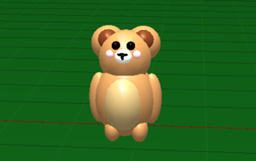
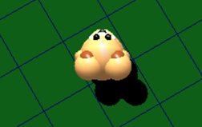
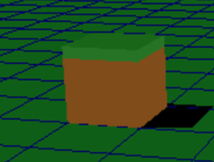
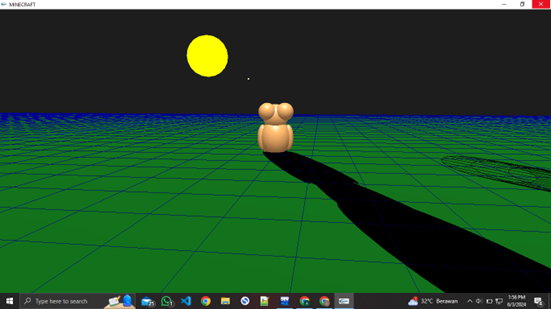
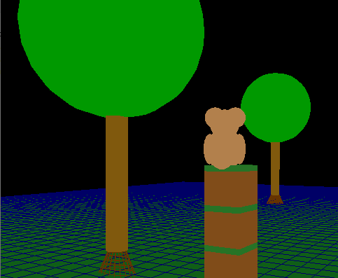
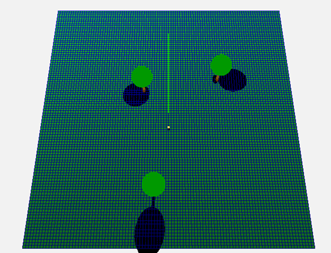

# 🐻 Mini Minecraft Clone with Interactive 3D Bear Character
> *A stunning 3D sandbox world where creativity meets advanced graphics programming*

<p align="center">
  
  
  
  
  
  
</p>

---

## 📖 Project Overview

**Mini Minecraft Clone** is a sophisticated 3D sandbox game implementation that demonstrates advanced computer graphics techniques and game development principles. Built from scratch using C++ and OpenGL, this project showcases a fully interactive 3D world featuring a charming bear character, dynamic lighting systems, realistic shadows, and comprehensive block manipulation mechanics.

**Why This Project Matters:**
- **Technical Excellence**: Demonstrates mastery of 3D graphics programming, collision detection, and real-time rendering
- **Creative Innovation**: Combines classic Minecraft gameplay with unique character design and advanced visual effects
- **Educational Value**: Perfect showcase of OpenGL capabilities and modern C++ programming practices
- **Portfolio Impact**: Highlights skills in game development, computer graphics, and software architecture

---

## ✨ Key Features

<h3>🎮 Advanced Player Control System</h3>
<ul>
<li>Smooth WASD movement with arrow key camera rotation</li>
<li>Realistic jump mechanics with gravity simulation</li>
<li>Intuitive block placement and destruction controls</li>
</ul>

<h3>👤 Interactive 3D Bear Character</h3>
<ul>
<li>Detailed bear model with anatomically correct proportions</li>
<li>Dynamic limb animations and walking cycles</li>
<li>Realistic jump animations with physics-based movement</li>
</ul>

<h3>🌍 Immersive 3D Environment</h3>
<ul>
<li>Procedurally arranged grid-based world system</li>
<li>Detailed 3D trees with roots, trunks, and foliage</li>
<li>Minecraft-style textured blocks with grass and dirt materials</li>
</ul>

<h3>🌞 Dynamic Lighting & Weather System</h3>
<ul>
<li>Real-time sun movement simulation with day/night cycles</li>
<li>Advanced lens flare effects for atmospheric lighting</li>
<li>Multiple light sources for realistic illumination</li>
</ul>

<h3>🎨 Cutting-Edge Graphics Features</h3>
<ul>
<li>Real-time shadow projection and rendering</li>
<li>Advanced collision detection and physics</li>
<li>Smooth camera following system with adjustable angles</li>
<li>Material-based lighting with reflective surfaces</li>
</ul>

---

## 🛠️ Technology Stack & Tools

<table>
<tr>
<td align="center"><strong>Category</strong></td>
<td align="center"><strong>Technology</strong></td>
<td align="center"><strong>Purpose</strong></td>
</tr>
<tr>
<td></td>
<td><strong>C++17</strong></td>
<td>Core programming language</td>
</tr>
<tr>
<td></td>
<td><strong>OpenGL + GLUT</strong></td>
<td>3D graphics rendering & window management</td>
</tr>
<tr>
<td></td>
<td><strong>Dev-C++</strong></td>
<td>Recommended development environment</td>
</tr>
<tr>
<td></td>
<td><strong>Windows OS</strong></td>
<td>Primary target platform</td>
</tr>
</table>

**Core Dependencies:**
```cpp
#include <GL/glut.h>      // OpenGL Utility Toolkit
#include <vector>         // STL containers
#include <math.h>         // Mathematical functions  
#include <algorithm>      // STL algorithms
#include <stdlib.h>       // Standard library
#include <stdio.h>        // Input/output operations
```

---

## 🚀 Installation & Setup

<h3>Prerequisites</h3>
<ul>
<li><strong>Windows OS</strong> (7/8/10/11)</li>
<li><strong>Dev-C++</strong> IDE or compatible C++ compiler</li>
<li><strong>OpenGL + GLUT</strong> libraries installed</li>
</ul>

<h3>Quick Start Guide</h3>

```bash
# 1. Clone the repository
git clone https://github.com/bers31/bernardo.github.io.git
cd bernardo.github.io

# 2. Open in Dev-C++
# Launch Dev-C++ and open the main .cpp file

# 3. Configure Project Settings
# Project → Project Options → Parameters
# Add to Linker: -lopengl32 -lglu32 -lfreeglut

# 4. Build and Run
# Press F9 or Execute → Compile & Run
```

<h3>Alternative Compilation (Command Line)</h3>

```bash
# Using MinGW compiler
g++ -o minecraft_clone main.cpp -lopengl32 -lglu32 -lfreeglut

# Run the executable
./minecraft_clone.exe
```

---

## 🎥 Demo

<div align="center">

<h3>🎮 Gameplay Preview</h3>


<p><em>Interactive 3D bear character navigating the sandbox world</em></p>

<h3>🌅 Dynamic Lighting System</h3>


<p><em>Real-time sun movement with dynamic shadows and lens flare effects</em></p>

<h3>🏗️ Block Building Mechanics</h3>


<p><em>Intuitive block placement and destruction system</em></p>

</div>

<p align="center">
<strong>🎬 <a href="https://bers31.github.io/bernardo.github.io/3D_Minecraft_Development/">Live Demo</a></strong> | 
</p>

---

## 🎮 Controls & Gameplay

<table>
<tr>
<th><strong>Action</strong></th>
<th><strong>Key</strong></th>
<th><strong>Description</strong></th>
</tr>
<tr>
<td>Move Forward</td>
<td><code>W</code></td>
<td>Move bear character forward</td>
</tr>
<tr>
<td>Move Left</td>
<td><code>A</code></td>
<td>Strafe left</td>
</tr>
<tr>
<td>Move Backward</td>
<td><code>S</code></td>
<td>Move backward</td>
</tr>
<tr>
<td>Move Right</td>
<td><code>D</code></td>
<td>Strafe right</td>
</tr>
<tr>
<td>Jump</td>
<td><code>SPACE</code></td>
<td>Jump with realistic physics</td>
</tr>
<tr>
<td>Rotate Camera</td>
<td><code>Arrow Keys</code></td>
<td>Horizontal & vertical camera rotation</td>
</tr>
<tr>
<td>Place Block</td>
<td><code>Q</code></td>
<td>Place block in front of player</td>
</tr>
<tr>
<td>Remove Block</td>
<td><code>E</code></td>
<td>Destroy block in front of player</td>
</tr>
<tr>
<td>Clear All</td>
<td><code>C</code></td>
<td>Remove all placed blocks</td>
</tr>
</table>

---

## 🏗️ Project Architecture

<h3>Core System Components</h3>

```cpp
🎨 Rendering Pipeline
├── display()           // Main rendering function
├── player()           // Bear character rendering
├── drawTrees()        // 3D tree generation
└── glShadowProjection() // Dynamic shadow system

🎮 Game Logic
├── update()           // Animation & movement logic  
├── placeBlock()       // Block placement system
├── collision()        // Physics & collision detection
└── camera()           // Camera following system

🌟 Visual Effects
├── lighting()         // Multi-source lighting setup
├── drawSun()          // Sun rendering & lens flare
├── updateSunPosition() // Day/night cycle simulation  
└── materials()        // Surface material properties
```

---

## 🗓️ Development Roadmap

<table>
<tr>
<th>Milestone</th>
<th>Features</th>
<th>Status</th>
<th>Target Date</th>
</tr>
<tr>
<td><strong>Phase 1: Core Engine</strong></td>
<td>Basic 3D rendering, bear character model</td>
<td>✅ <strong>Completed</strong></td>
<td>Q1 2024</td>
</tr>
<tr>
<td><strong>Phase 2: Interactivity</strong></td>
<td>Movement controls, block manipulation</td>
<td>✅ <strong>Completed</strong></td>
<td>Q2 2024</td>
</tr>
<tr>
<td><strong>Phase 3: Visual Polish</strong></td>
<td>Lighting system, shadows, animations</td>
<td>✅ <strong>Completed</strong></td>
<td>Q3 2024</td>
</tr>
<tr>
<td><strong>Phase 4: Advanced Features</strong></td>
<td>Texture mapping, particle effects</td>
<td>🔄 <strong>In Progress</strong></td>
<td>Q4 2025</td>
</tr>
<tr>
<td><strong>Phase 5: Optimization</strong></td>
<td>Performance improvements, cross-platform</td>
<td>📋 <strong>Planned</strong></td>
<td>Q1 2026</td>
</tr>
</table>

---

## 🤝 Contributing

We welcome contributions from developers of all skill levels! Here's how you can get involved:

<h3>🔧 Areas for Contribution</h3>
<ul>
<li><strong>🎨 Graphics Enhancement</strong>: Improved textures, visual effects, shaders</li>
<li><strong>🎮 Gameplay Features</strong>: New mechanics, game modes, challenges</li>
<li><strong>⚡ Performance Optimization</strong>: Code efficiency, memory management</li>
<li><strong>🐛 Bug Fixes</strong>: Issue resolution and stability improvements</li>
<li><strong>📚 Documentation</strong>: Code comments, tutorials, guides</li>
</ul>

<h3>📝 Contribution Process</h3>
<ol>
<li><strong>Fork</strong> the repository</li>
<li><strong>Create</strong> a feature branch: <code>git checkout -b feature/amazing-feature</code></li>
<li><strong>Commit</strong> your changes: <code>git commit -m 'Add amazing feature'</code></li>
<li><strong>Push</strong> to the branch: <code>git push origin feature/amazing-feature</code></li>
<li><strong>Open</strong> a Pull Request with detailed description</li>
</ol>

<h3>💡 Contribution Guidelines</h3>
<ul>
<li>Follow existing code style and conventions</li>
<li>Include comprehensive comments for new features</li>
<li>Test thoroughly before submitting</li>
<li>Update documentation as needed</li>
</ul>

---

## 📄 **License**

This project is licensed under the **MIT License** - see the [LICENSE](LICENSE) file for details.

```
MIT License

Copyright (c) 2024 Bernardo - Universitas Diponegoro

Permission is hereby granted, free of charge, to any person obtaining a copy
of this software and associated documentation files (the "Software"), to deal
in the Software without restriction, including without limitation the rights
to use, copy, modify, merge, publish, distribute, sublicense, and/or sell
copies of the Software, subject to the following conditions:

The above copyright notice and this permission notice shall be included in all
copies or substantial portions of the Software.
```

## 📫 Contact & Connect

<p align="center">
<strong>👨‍💻 Bernardo - Computer Science Student</strong><br/>
Universitas Diponegoro 🎓
</p>

<p align="center">
<a href="https://linkedin.com/in/bernardo-sunia/">

</a>
<a href="https://mail.google.com/mail/?view=cm&fs=1&to=suniabernardo@gmail.com">

</a>
<a href="https://github.com/bers31">

</a>
<a href="https://bit.ly/bernardo-my_portfolio">

</a>
</p>

<p align="center">
⭐ <strong>If you found this project helpful, please give it a star!</strong> ⭐
</p>

<p align="center">
<em>Made with ❤️ by <a href="https://github.com/bers31">Bernardo</a> at Universitas Diponegoro</em><br/>

</p>

---

### Full Screenshots
 <br>
 <br>
 <br>
 <br>
 <br>


## Conclusion
This project demonstrates the creation of an engaging 3D game using C++ and OpenGL, showcasing advanced graphics techniques and interactive gameplay elements.
