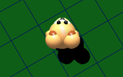
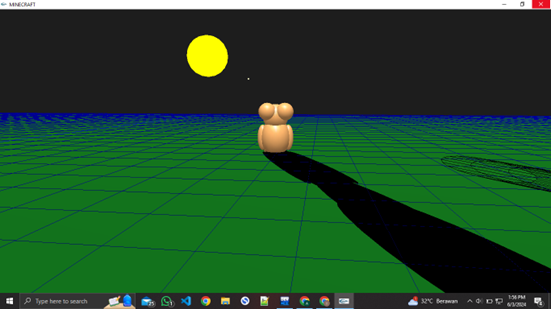
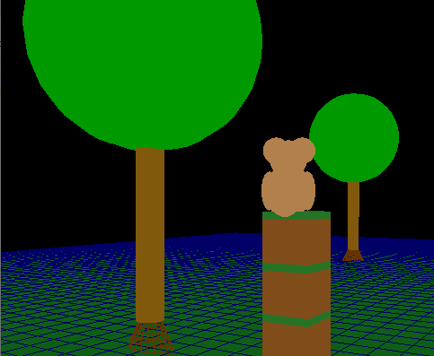
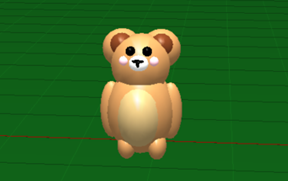
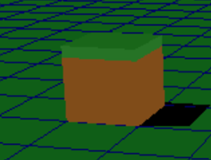
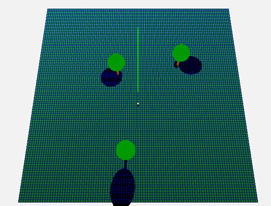

<div class="hero">

<h1>🐻 Mini Minecraft Clone with Interactive 3D Bear Character</h1>

<p>C++ & OpenGL 3D Game Project</p>

<p>
  
  
  
  
  
</p>

<p>
A 3D sandbox game developed with C++ and OpenGL, featuring a playable bear character,
an interactive block-based world, object interaction, and real-time graphics rendering.
</p>

</div>

---

## 📖 Project Overview

**Mini Minecraft Clone** is a 3D game project developed as part of a **Computer Graphics project at Diponegoro University**.

The project explores fundamental and practical concepts in 3D graphics programming using **C++ and OpenGL**, with a focus on interactive gameplay, environment rendering, camera control, object interaction, and performance optimization.

The player controls a **3D bear character** that can move through a Minecraft-inspired environment, jump, interact with objects, and manipulate blocks within the world.

> **Portfolio focus:** This project demonstrates practical experience with C++, OpenGL, 3D rendering, interactive systems, performance optimization, and software documentation.

---

## ✨ Key Features

### 🎮 Player Movement & Control

* WASD-based player movement.
* Jump functionality for the bear character.
* Arrow-key camera rotation.
* Responsive controls designed for interactive gameplay.
* Camera behavior designed to provide a clear view of the 3D environment.

### 🐻 Interactive 3D Bear Character

* Custom 3D bear character used as the main player avatar.
* Walking and jumping interactions within the environment.
* Character movement integrated with the game's world and object interactions.
* Designed to provide a distinctive gameplay identity compared with a conventional Minecraft-style player model.

### 🌍 Interactive 3D World

* Minecraft-inspired block-based environment.
* Interactive environmental objects including **trees, rocks, and customizable blocks**.
* 3D environment designed to support exploration and interaction.
* World elements rendered through OpenGL-based graphics programming.

### 🧱 Block Interaction System

* Interactive block manipulation mechanics.
* Block placement and removal.
* Customizable world elements that allow the player to modify parts of the environment.
* Designed around the sandbox-style interaction concept of Minecraft.

### ⚙️ Rendering & Performance Optimization

* Real-time 3D rendering with OpenGL.
* Matrix manipulation for object transformations and camera operations.
* Vector-based calculations for movement and spatial operations.
* Performance testing and frame-rate optimization.
* Optimization efforts focused on maintaining responsive gameplay, including on lower-specification hardware.

### 🧩 Maintainability & Documentation

* Code documented to make the project easier to understand and extend.
* Project structure designed with future enhancements in mind.
* Development decisions documented to support potential collaborative work.
* Explored possible scalability toward future multiplayer functionality without claiming multiplayer as an implemented feature.

---

## 🛠️ Technology Stack

| Category                | Technology                          | Purpose                                                   |
| ----------------------- | ----------------------------------- | --------------------------------------------------------- |
| Programming Language    | **C++**                             | Core game and application logic                           |
| Graphics API            | **OpenGL**                          | Real-time 3D rendering                                    |
| Utility Toolkit         | **GLUT / FreeGLUT**                 | Windowing, input handling, and OpenGL application support |
| Development Environment | **Dev-C++**                         | Primary development environment                           |
| Compiler                | **MinGW / compatible C++ compiler** | Building the application                                  |
| Target Platform         | **Windows**                         | Primary development and execution platform                |

### Core Technologies

```text
C++
 ├── Game logic
 ├── Player movement
 ├── Object interaction
 ├── Collision / spatial calculations
 └── Performance optimization

OpenGL
 ├── 3D object rendering
 ├── Transformations
 ├── Camera rendering
 └── Environment visualization

GLUT / FreeGLUT
 ├── Window management
 ├── Keyboard input
 └── Application loop
```

---

## 🚀 Installation & Setup

### Prerequisites

* Windows 7, 8, 10, or 11
* Dev-C++ or another compatible C++ development environment
* OpenGL support
* GLUT / FreeGLUT libraries
* MinGW or another compatible C++ compiler

### Clone the Repository

```bash
git clone https://github.com/bers31/bernardo.github.io.git
cd bernardo.github.io
```

### Build Using Dev-C++

1. Open the C++ project/source files in Dev-C++.
2. Make sure the OpenGL and GLUT / FreeGLUT libraries are correctly configured.
3. Configure the linker parameters as required by the project.
4. Compile the project.
5. Run the generated executable.

For a MinGW-based setup, the commonly required OpenGL-related linker parameters are:

```bash
-lopengl32 -lglu32 -lfreeglut
```

### Command-Line Compilation

The exact source filename depends on the project structure. A typical MinGW command is:

```bash
g++ -o minecraft_clone <source-file>.cpp -lopengl32 -lglu32 -lfreeglut
```

Then run:

```bash
minecraft_clone.exe
```

---

## 🎮 Controls & Gameplay

| Action        | Key          | Description                          |
| ------------- | ------------ | ------------------------------------ |
| Move Forward  | `W`          | Move the bear forward                |
| Move Left     | `A`          | Move the bear to the left            |
| Move Backward | `S`          | Move the bear backward               |
| Move Right    | `D`          | Move the bear to the right           |
| Jump          | `SPACE`      | Make the bear jump                   |
| Rotate Camera | `ARROW KEYS` | Adjust the camera direction          |
| Place Block   | `Q`          | Place a block in front of the player |
| Remove Block  | `E`          | Remove a block                       |
| Clear Blocks  | `C`          | Clear placed blocks                  |

> Controls may depend on the final configuration of the executable and source code.

---

## 🏗️ Project Architecture

### Rendering System

Responsible for drawing the player, environment, objects, and other 3D elements.

Typical responsibilities include:

```text
Rendering
├── Player / Bear rendering
├── Environment rendering
├── Tree rendering
├── Block rendering
└── OpenGL transformations
```

### Player & Camera System

Responsible for movement, jumping, player orientation, and camera behavior.

```text
Player System
├── Movement
├── Jump
├── Direction
├── Camera rotation
└── Spatial calculations
```

### World Interaction System

Responsible for interaction between the player and the environment.

```text
World Interaction
├── Block placement
├── Block removal
├── Object interaction
├── Environment updates
└── Spatial / collision calculations
```

### Optimization Layer

Performance was considered during development through:

* Matrix manipulation and transformation efficiency.
* Vector calculation optimization.
* Frame-rate testing.
* Reducing unnecessary rendering workload.
* Testing on lower-specification hardware.

---

## 📊 Project Scope

The project was developed as a **self-contained academic computer graphics project** while also functioning as a portfolio demonstration of C++ and OpenGL development.

| Area                   | Scope                                          | Status                  |
| ---------------------- | ---------------------------------------------- | ----------------------- |
| 🐻 Bear Character      | 3D player character with movement and jumping  | ✅ Implemented           |
| 🎮 Player Control      | WASD movement and camera controls              | ✅ Implemented           |
| 🌍 3D Environment      | Interactive Minecraft-inspired world           | ✅ Implemented           |
| 🌳 Environment Objects | Trees, rocks, and other interactive objects    | ✅ Implemented           |
| 🧱 Block Interaction   | Placement, removal, and customization          | ✅ Implemented           |
| 🖥️ OpenGL Rendering   | Real-time 3D graphics rendering                | ✅ Implemented           |
| ⚡ Optimization         | Performance and frame-rate optimization        | ✅ Implemented           |
| 🤝 User Feedback       | Gameplay adjustments based on feedback         | ✅ Applied               |
| 🌐 Multiplayer         | Scalability exploration for future development | 🔭 Future consideration |

---

## 🔬 Technical Highlights

### Matrix Manipulation

Matrix operations are used as part of the 3D rendering pipeline for transformations such as position, rotation, and camera-related operations.

This enables objects to be rendered consistently within the 3D coordinate system.

### Vector Optimization

Vector-based calculations support spatial operations such as movement, positioning, and directional calculations.

Optimization of these calculations contributes to responsive interaction and efficient real-time rendering.

### Performance Testing

The project included performance testing and frame-rate optimization with the goal of maintaining smooth gameplay across different hardware capabilities.

Particular attention was given to lower-specification systems to improve accessibility.

### User-Centered Iteration

Gameplay mechanics were adjusted based on user feedback to improve the overall interaction experience.

This reflects an iterative development approach rather than treating the first implementation as the final design.

---

## 🎥 Demo & Screenshots

### 🎮 Gameplay Preview



*The bear character exploring the interactive 3D environment.*

### 🌅 3D Environment



*Example of the rendered 3D world and environmental elements.*

### 🧱 Block Interaction



*Example of the interactive block-based environment.*

### 🌲 Additional Views







---

<div align="center">

<strong>🎮 <a href="https://bers31.github.io/bernardo.github.io/3D_Minecraft_Development/">View Project Demo</a></strong>

</div>

---

## 💼 Portfolio & LinkedIn Alignment

This project represents several competencies highlighted in the project's professional description:

| LinkedIn Project Description                           | Project Evidence                                                     |
| ------------------------------------------------------ | -------------------------------------------------------------------- |
| Designed and developed a 3D game inspired by Minecraft | Minecraft-inspired sandbox environment built with C++ and OpenGL     |
| Playable bear character                                | Bear-based player character with movement and jumping                |
| Interactive objects                                    | Trees, rocks, blocks, and other environment elements                 |
| Matrix manipulation and vector optimization            | Used for transformations, movement, and spatial calculations         |
| Intuitive control system                               | WASD movement, jumping, and camera controls                          |
| Performance testing                                    | Frame-rate and lower-spec hardware optimization                      |
| Code documentation                                     | Documentation intended to support maintenance and future development |
| User feedback                                          | Gameplay mechanics refined through feedback                          |
| Multiplayer scalability                                | Multiplayer explored as a potential future direction                 |

> **Important:** Multiplayer functionality was explored as a scalability concept and is **not presented as an implemented feature** in this project.

---

## 🧠 What This Project Demonstrates

This project is particularly relevant for demonstrating:

```text
C++ Programming
        ↓
3D Graphics Programming
        ↓
OpenGL Rendering
        ↓
Interactive Game Systems
        ↓
Spatial / Vector Calculations
        ↓
Performance Optimization
        ↓
User Feedback & Iteration
        ↓
Software Documentation
```

It demonstrates not only the ability to produce a visual result, but also the ability to combine programming, mathematics, graphics rendering, optimization, and iterative development into a single software project.

---

## 🔭 Future Development

Several directions can be considered for future versions:

* Multiplayer functionality.
* More advanced world-generation systems.
* Additional interactive objects.
* More sophisticated animation systems.
* Improved graphics and rendering effects.
* Additional gameplay mechanics.
* Broader platform support.
* Further optimization and code modularization.

These are **future development possibilities**, not features claimed as part of the current implementation.

---

## 🤝 Contributing

Contributions are welcome for improvements to the project, documentation, graphics, gameplay, and performance.

### Contribution Process

1. Fork the repository.
2. Create a feature branch.

```bash
git checkout -b feature/my-feature
```

3. Commit your changes.

```bash
git commit -m "Add my feature"
```

4. Push the branch.

```bash
git push origin feature/my-feature
```

5. Open a Pull Request with a clear description of the changes.

### Contribution Guidelines

* Keep changes focused and understandable.
* Follow the existing coding conventions.
* Document significant implementation changes.
* Test changes before submitting a Pull Request.
* Update the README when project behavior or setup requirements change.

---

## 📄 License

This project is licensed under the **MIT License**.

The full license text is available in the [`LICENSE`](LICENSE) file.

> **License note:** If this project contains third-party assets, textures, models, fonts, libraries, or other materials with separate licenses, their respective licenses still apply.

---

<div class="contact-hero">

<p><strong>Interested in the project?</strong></p>

<p>
👨‍💻 <strong>Bernardo Nandaniar Sunia</strong><br/>
Computer Science — Diponegoro University
</p>

<p>
<a href="https://linkedin.com/in/bernardo-sunia/">

</a>
<a href="https://mail.google.com/mail/?view=cm&fs=1&to=suniabernardo@gmail.com">

</a>
<a href="https://github.com/bers31">

</a>
<a href="https://bit.ly/bernardo-my_portfolio">

</a>
</p>

<p>
<em>3D graphics, interactive systems, and performance-oriented C++ development.</em>
</p>

</div>