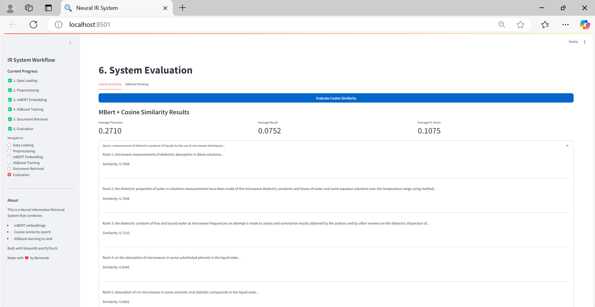
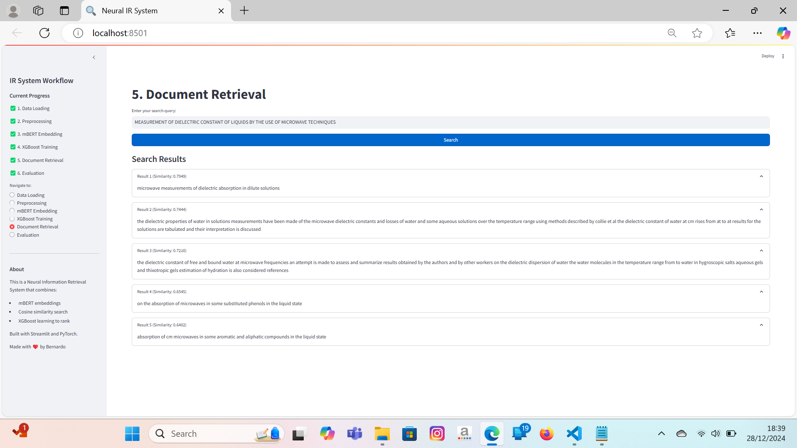
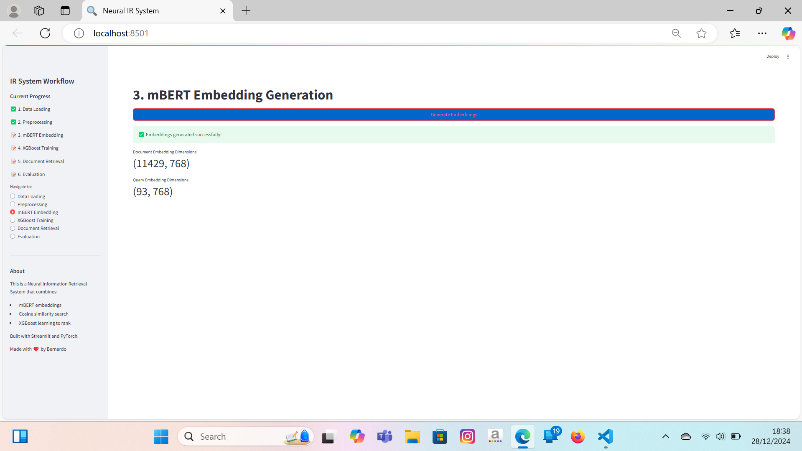
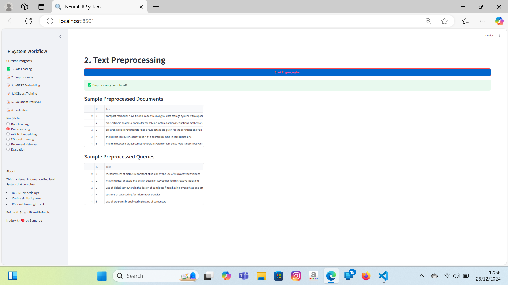
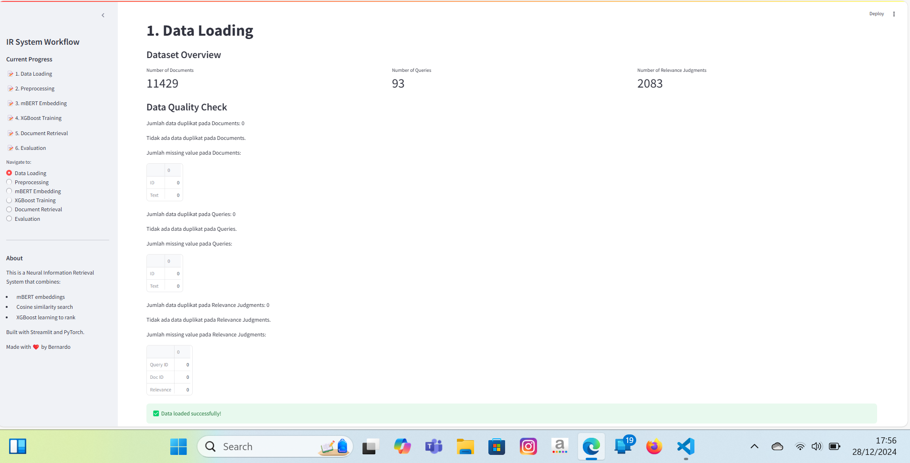

# Advanced Information Retrieval System Using Machine Learning and Deep Learning Techniques

This project showcases the development of an advanced Information Retrieval (IR) system that leverages cutting-edge machine learning algorithms to enhance document search quality based on user queries.

## Project Description
The IR system is designed to find relevant documents based on user queries by utilizing various machine learning approaches. The project involves comprehensive data preprocessing and the implementation of multiple ranking algorithms to improve search accuracy and relevance.

### Key Features
- **XGBoost Learning to Rank (LTR)**: Utilizes XGBoost with ranking objectives to order documents based on their relevance to the query. Features include cosine similarity, document length, and term overlap.
- **RankNet**: Implements a neural network using PyTorch with RankNet architecture, employing Sentence-BERT embeddings to represent queries and documents as vectors for ranking.
- **LambdaMART**: Uses LightGBM to implement LambdaMART, optimizing directly for ranking metrics such as NDCG.
- **Baseline Similarity**: Includes a simple cosine similarity approach using Sentence-BERT embeddings for comparison.

### Technologies Used
- **Python**: Core programming language for developing the IR system.
- **Streamlit**: Framework for creating an interactive and user-friendly interface.
- **XGBoost, PyTorch, LightGBM**: Machine learning libraries for implementing ranking algorithms.
- **Sentence-BERT**: Pretrained model for generating text embeddings.

### Project Steps
1. **Data Preprocessing**: Cleaned and prepared three main datasets (queries, documents, qrels) by performing text cleaning, case folding, and removal of non-alphanumeric characters.
2. **Algorithm Implementation**: Developed and integrated XGBoost LTR, RankNet, and LambdaMART algorithms to rank documents based on relevance.
3. **Evaluation**: Assessed the performance of each approach using standard IR metrics such as Precision, Recall, and F1-Score.
4. **Multilingual Support**: Leveraged a multilingual BERT model to support diverse languages, making the system versatile for various applications.

### How to Run the Project
1. **Clone Repository**: `git clone <repo-url>`
2. **Install Dependencies**: `pip install -r requirements.txt`
3. **Run Application**: `streamlit run app.py`

### Screenshots

### Conclusion
This project demonstrates the implementation of a modern Information Retrieval system that combines deep learning and machine learning techniques to deliver more accurate and relevant search results compared to traditional keyword-based approaches.
