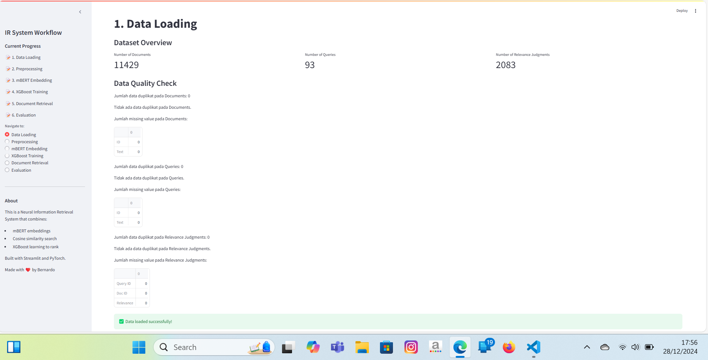
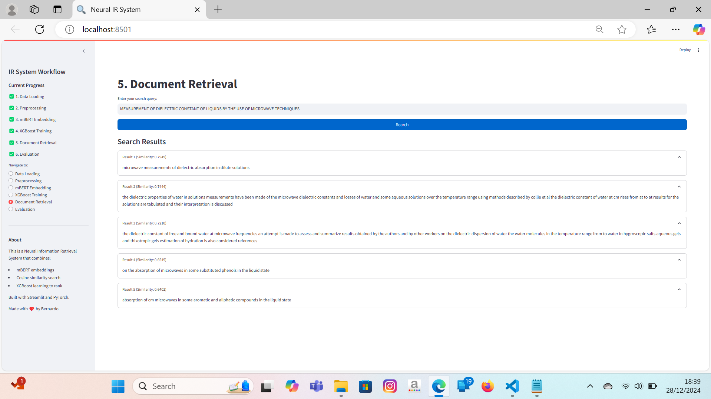
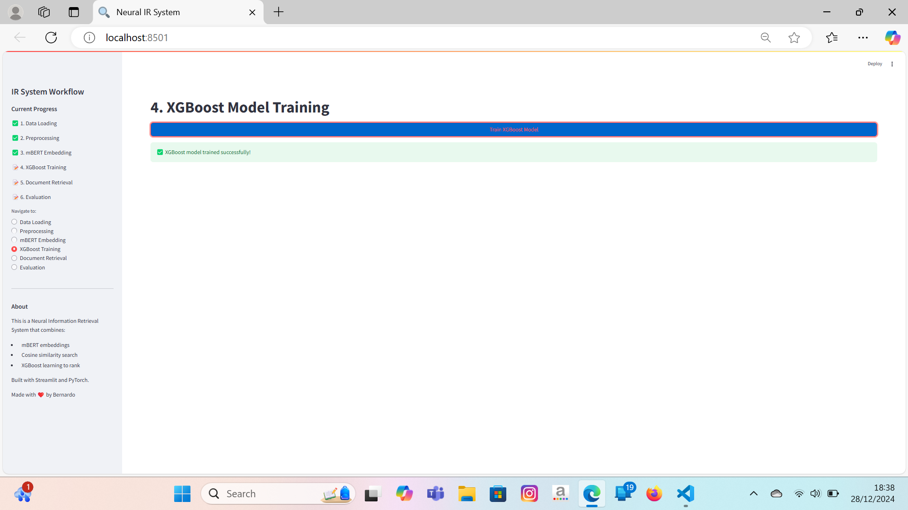
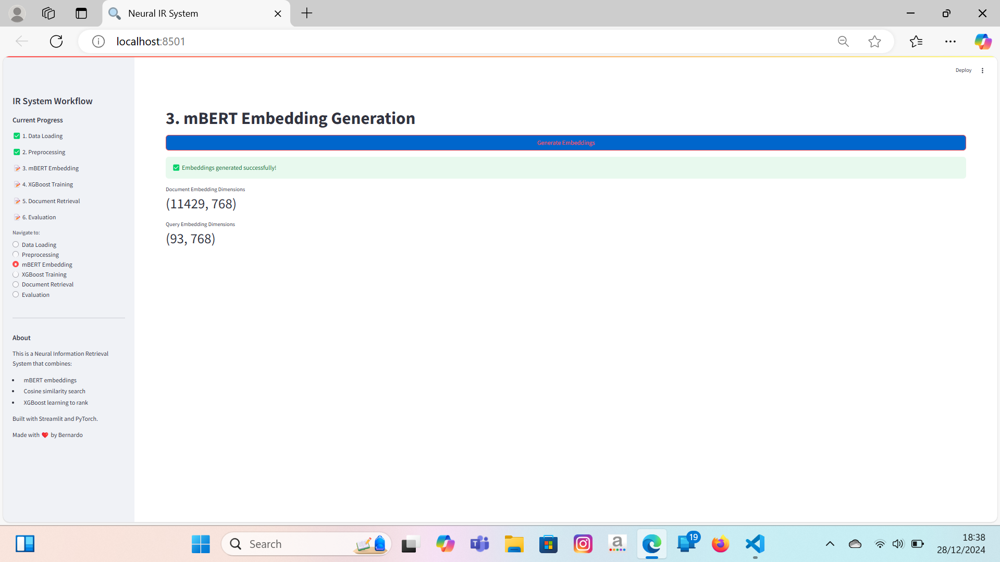
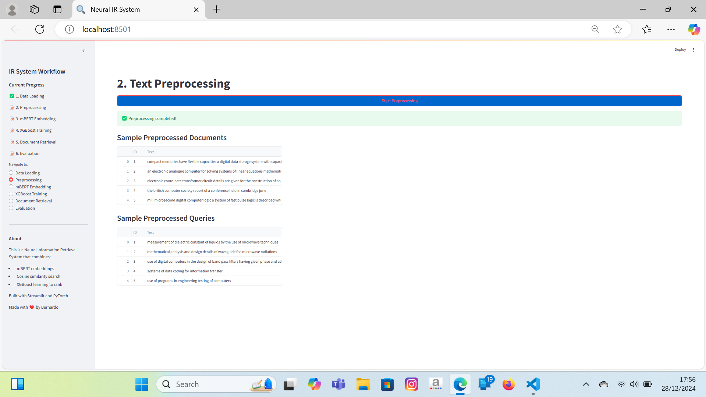

<div class="hero">

<h1>🤖 Neural Information Retrieval Based on mBERT</h1>

<p>Multilingual Semantic Search & Neural Ranking System</p>

<p>
  
  
  
  
  
  
</p>

<p>
A multilingual neural information retrieval system that combines transformer-based
semantic embeddings, vector similarity search, information retrieval evaluation,
and an interactive Streamlit interface.
</p>

</div>

---

## 📖 Project Overview

**Neural Information Retrieval (IR)** is a research-oriented search system designed to retrieve relevant documents based on **semantic similarity**, rather than relying exclusively on exact keyword matching.

The project uses **mBERT (Multilingual BERT)** through the Hugging Face Transformers ecosystem to encode queries and documents into dense contextual representations. These representations are then indexed and searched using **FAISS** for efficient similarity retrieval.

The system was designed to support **Indonesian and English documents**, providing a practical demonstration of multilingual semantic search and modern neural information retrieval techniques.

> **Portfolio focus:** This project demonstrates practical experience in NLP, transformer-based representation learning, information retrieval, vector search, model evaluation, data processing, visualization, and deployment-oriented application development.

---

## 🎯 Research Objective

The main objective is to investigate how a neural retrieval pipeline can improve semantic document retrieval compared with traditional lexical approaches such as **BM25**.

The project focuses on four major questions:

1. Can contextual transformer embeddings improve semantic matching between queries and documents?
2. Can multilingual representations support retrieval across Indonesian and English content?
3. Can FAISS provide efficient similarity search over dense document embeddings?
4. How does the neural retrieval approach perform under standard information retrieval metrics?

---

## ✨ Key Features

### 🌍 Multilingual Semantic Search

* Supports semantic retrieval for **Indonesian and English documents**.
* Uses mBERT contextual representations rather than relying only on exact keyword overlap.
* Allows queries and documents to be compared in a shared multilingual representation space.
* Designed to capture semantic relationships that may not be expressed through identical words.

### 🤖 Transformer-Based Document Encoding

* Uses **Hugging Face Transformers** for mBERT-based representation learning.
* Encodes queries and documents into dense vector representations.
* Contextual embeddings provide richer semantic information than conventional bag-of-words representations.
* PyTorch is used as the underlying deep learning framework.

### ⚡ FAISS Vector Search

* Uses **FAISS** for efficient similarity search over dense embeddings.
* Supports fast retrieval from large embedding collections.
* Designed to provide low-latency query processing.
* Reduces the computational cost of repeatedly comparing queries against every document.

### 🔎 Neural Information Retrieval Pipeline

The system connects multiple stages into one retrieval workflow:

```text
Query
  ↓
Text Processing
  ↓
mBERT Encoding
  ↓
Dense Query Embedding
  ↓
FAISS Similarity Search
  ↓
Candidate Documents
  ↓
Ranking / Evaluation
  ↓
Top-K Results
```

### 📊 Evaluation & Benchmarking

The retrieval system is evaluated using established information retrieval metrics, including:

* **Mean Reciprocal Rank (MRR)**
* **Precision@K**
* **Recall@K**

The project also compares the neural approach against a **traditional BM25 baseline** to assess retrieval improvement.

### 📈 Embedding & Similarity Visualization

Interactive and analytical visualizations are used to understand model behavior, including:

* Embedding cluster visualization.
* Query-document similarity patterns.
* Similarity heatmaps.
* Retrieval result analysis.

Visualization is implemented using **Matplotlib** and **Plotly**.

### 🖥️ Interactive Streamlit Application

The retrieval engine is integrated into a Streamlit interface that allows users to:

* Submit search queries.
* Retrieve top-ranked documents.
* Experiment with semantic search.
* Inspect retrieval behavior.
* Visualize search and model-related information.

### 🐳 Reproducible Development Environment

The project incorporates:

* Git/GitHub for version control.
* Docker for reproducible environments.
* Documentation for setup and development.
* Modular components for experimentation and future extension.

---

## 🛠️ Technology Stack

| Category               | Technology                    | Role                                            |
| ---------------------- | ----------------------------- | ----------------------------------------------- |
| 🐍 Programming         | **Python**                    | Main development language                       |
| 🤗 NLP / Transformer   | **Hugging Face Transformers** | mBERT model integration and text representation |
| 🧠 Deep Learning       | **PyTorch**                   | Model training and inference                    |
| ⚡ Vector Search        | **FAISS**                     | Dense embedding similarity search               |
| 📊 Data Processing     | **Pandas**                    | Data loading, cleaning, and transformation      |
| 🔢 Numerical Computing | **NumPy**                     | Numerical and vectorized operations             |
| 📓 Research            | **Jupyter Notebook**          | Experimentation and exploratory analysis        |
| 🖥️ Application        | **Streamlit**                 | Interactive retrieval interface                 |
| 📈 Visualization       | **Matplotlib**                | Analytical plots and visualizations             |
| 📊 Visualization       | **Plotly**                    | Interactive charts and model analysis           |
| 🐳 Reproducibility     | **Docker**                    | Containerized development and execution         |
| 🔧 Version Control     | **Git / GitHub**              | Source control and collaboration                |

---

## 🧩 System Architecture

The system can be viewed as a series of interconnected processing layers.

### 📥 Data & Corpus Layer

The system begins with a collection of queries, documents, and relevance information used for training and evaluation.

Typical data components include:

| Component             | Purpose                                                      |
| --------------------- | ------------------------------------------------------------ |
| Query Collection      | User or benchmark search queries                             |
| Document Corpus       | Collection of searchable documents                           |
| Relevance Information | Ground-truth information for evaluation                      |
| Custom Corpus         | Multilingual documents used by the neural retrieval pipeline |

---

### 🔄 Text Processing Layer

The preprocessing stage prepares the raw data for both model training and inference.

Typical operations include:

```text
Raw Text
   ↓
Cleaning
   ↓
Normalization
   ↓
Tokenization
   ↓
Model Input
```

Python, Pandas, and NumPy are used to build a scalable preprocessing workflow.

The goal is to maintain consistent text representation throughout the pipeline.

---

### 🤖 Transformer Encoding Layer

Queries and documents are transformed into contextual representations using mBERT.

```text
Query ──────┐
            ├──> mBERT ──> Dense Embedding
Document ───┘
```

The resulting vectors represent contextual semantic information that can be used for similarity-based retrieval.

Where applicable, the model can be fine-tuned using project-specific data to adapt the representation to the retrieval task.

---

### ⚡ Vector Retrieval Layer

Dense document embeddings are indexed with **FAISS**.

At inference time:

```text
New Query
    ↓
mBERT Encoder
    ↓
Query Embedding
    ↓
FAISS Index
    ↓
Nearest Neighbors
    ↓
Top-K Documents
```

This architecture is intended to maintain efficient search performance as the embedding collection grows.

---

### 📈 Evaluation Layer

Retrieval performance is evaluated using:

| Metric              | Purpose                                                             |
| ------------------- | ------------------------------------------------------------------- |
| **MRR**             | Measures how highly the first relevant result is ranked             |
| **Precision@K**     | Measures the proportion of relevant results within the top-K        |
| **Recall@K**        | Measures how many relevant documents are retrieved within the top-K |
| **BM25 Comparison** | Provides a traditional lexical baseline                             |

> **Evaluation principle:** The neural retrieval approach is assessed against a conventional BM25 baseline to measure whether contextual semantic representations provide a measurable retrieval advantage.

---

## 🔬 Technical Highlights

### Multilingual Representation Learning

mBERT provides contextual representations across multiple languages, making it suitable for a multilingual retrieval setting.

Rather than treating Indonesian and English terms purely as independent keywords, the system uses transformer representations to capture contextual information within each query and document.

### Dense Vector Retrieval

Instead of scoring documents only through lexical term matching, documents are represented as dense vectors.

Conceptually:

```text
Document
   ↓
Transformer Encoder
   ↓
Dense Vector
   ↓
FAISS Index
```

Queries follow the same representation process before similarity search.

### Semantic Similarity Search

Given a query vector `q` and document vectors `d`, the retrieval system searches for documents that are closest to the query in the embedding space.

A conceptual similarity function can be represented as:

```text
similarity(q, d) = q · d
```

or through a normalized similarity measure such as cosine similarity, depending on the retrieval configuration.

### BM25 Baseline Comparison

Traditional BM25 provides a valuable lexical baseline because it establishes how much improvement is obtained from the neural representation approach.

The comparison can be summarized as:

```text
BM25
Keyword / lexical matching
        ↓
Baseline retrieval

mBERT + FAISS
Contextual embeddings
        ↓
Semantic retrieval
```

### Low-Latency Vector Search

FAISS is used to make dense-vector retrieval practical for larger embedding collections.

This is particularly important because a neural retrieval system would otherwise need to compare every query embedding against every document embedding at inference time.

---

## 🖥️ Interactive Application

The neural retrieval engine is exposed through a **Streamlit application**.

The interface is intended to provide a practical way to test the model outside of a notebook environment.

Users can experiment with:

* Real-time search queries.
* Top-ranked document retrieval.
* Semantic matching behavior.
* Retrieval result inspection.
* Similarity and embedding visualizations.

### Live Demo

<div align="center">

<p>
<strong>🌐 Neural Information Retrieval Application</strong>
</p>

<p>
<a href="https://bers31.github.io/bernardo.github.io/Advance_Information_Retrieval_System/">
<strong>► Launch Project Demo</strong>
</a>
</p>


</div>

---

## 🎥 Demo & Screenshots

### 🌐 Application Dashboard



*Interactive interface for querying and exploring the retrieval system.*

### 🔎 Search Results



*Example of retrieved and ranked documents produced by the system.*

### 📊 Performance Visualization


*Visualization of retrieval and model-related results.*

### 📈 Additional Application Views







---

## 📊 Project Workflow

The complete workflow can be summarized as:

```text
                  ┌─────────────────────┐
                  │  Multilingual Data  │
                  └──────────┬──────────┘
                             ↓
                  ┌─────────────────────┐
                  │ Text Preprocessing  │
                  │ Pandas + NumPy      │
                  └──────────┬──────────┘
                             ↓
                  ┌─────────────────────┐
                  │ mBERT Fine-Tuning   │
                  │ Hugging Face +      │
                  │ PyTorch             │
                  └──────────┬──────────┘
                             ↓
                  ┌─────────────────────┐
                  │ Dense Embeddings    │
                  └──────────┬──────────┘
                             ↓
                  ┌─────────────────────┐
                  │ FAISS Vector Index  │
                  └──────────┬──────────┘
                             ↓
                  ┌─────────────────────┐
                  │ Similarity Search   │
                  └──────────┬──────────┘
                             ↓
                  ┌─────────────────────┐
                  │ Top-K Retrieval     │
                  └──────────┬──────────┘
                             ↓
                  ┌─────────────────────┐
                  │ Evaluation          │
                  │ MRR / P@K / R@K    │
                  └──────────┬──────────┘
                             ↓
                  ┌─────────────────────┐
                  │ Streamlit Interface │
                  └─────────────────────┘
```

---

## 🗺️ Project Scope

This project was developed as an **academic Advanced Information Retrieval project at Diponegoro University** and simultaneously serves as a portfolio demonstration of NLP and machine learning engineering.

| Module                   | Description                                        | Status        |
| ------------------------ | -------------------------------------------------- | ------------- |
| 🔄 **Text Processing**   | Cleaning, normalization, and tokenization pipeline | ✅ Implemented |
| 🤖 **mBERT Encoding**    | Transformer-based contextual representation        | ✅ Implemented |
| 🧠 **Model Fine-Tuning** | Adaptation of mBERT for the retrieval task         | ✅ Implemented |
| ⚡ **FAISS Retrieval**    | Dense-vector similarity search                     | ✅ Implemented |
| 🔎 **Semantic Search**   | Multilingual query-document matching               | ✅ Implemented |
| 📏 **BM25 Baseline**     | Traditional retrieval benchmark                    | ✅ Evaluated   |
| 📈 **IR Evaluation**     | MRR, Precision@K, and Recall@K                     | ✅ Implemented |
| 📊 **Visualization**     | Embedding and similarity visualization             | ✅ Implemented |
| 🖥️ **Streamlit App**    | Interactive search interface                       | ✅ Implemented |
| 🐳 **Dockerization**     | Reproducible execution environment                 | ✅ Implemented |
| 🔧 **Git/GitHub**        | Version control and collaboration                  | ✅ Implemented |

---

## 📌 Portfolio Alignment

The project directly reflects the following technical competencies represented in its professional project description:

| Professional Experience                   | Project Implementation                                  |
| ----------------------------------------- | ------------------------------------------------------- |
| Multilingual neural information retrieval | Semantic search across Indonesian and English documents |
| Fine-tuning mBERT                         | Hugging Face Transformers + PyTorch workflow            |
| Python text-processing pipeline           | Pandas and NumPy-based data processing                  |
| Dense semantic embeddings                 | Transformer-generated query/document representations    |
| FAISS similarity search                   | Efficient retrieval from dense embedding collections    |
| Retrieval evaluation                      | MRR, Precision@K, and Recall@K                          |
| BM25 comparison                           | Traditional baseline for evaluating neural retrieval    |
| Streamlit application                     | Interactive search and result exploration               |
| Matplotlib & Plotly                       | Embedding and similarity visualization                  |
| Docker                                    | Reproducible environment                                |
| Git/GitHub                                | Version control and collaboration                       |
| Project documentation                     | Setup, architecture, and implementation documentation   |

> **Portfolio positioning:** This project demonstrates an end-to-end workflow covering data preparation, NLP model integration, semantic representation, vector retrieval, evaluation, visualization, and application delivery.

---

## 📈 Evaluation Strategy

The evaluation process is designed around standard Information Retrieval methodology.

### Mean Reciprocal Rank

MRR evaluates the position of the first relevant result.

```text
MRR = average(1 / rank_of_first_relevant_result)
```

A higher MRR indicates that relevant documents tend to appear earlier in the ranked results.

### Precision@K

Precision@K measures how many of the top-K retrieved documents are relevant.

```text
Precision@K =
relevant documents retrieved in top-K
-------------------------------------
              K
```

### Recall@K

Recall@K measures how many relevant documents were successfully retrieved within the top-K results.

```text
Recall@K =
relevant documents retrieved in top-K
-------------------------------------
      total relevant documents
```

### Baseline Evaluation

The neural retrieval system is compared with BM25 to determine whether contextual embeddings provide improved retrieval quality over conventional keyword-based retrieval.

> Exact evaluation values should be treated as experiment-dependent and should be regenerated when the dataset, corpus, model checkpoint, preprocessing pipeline, or evaluation configuration changes.

---

## 💡 Research & Engineering Contributions

The project combines several areas that are often treated separately:

```text
NLP
 ↓
Transformer Models
 ↓
Dense Representation Learning
 ↓
Vector Databases / Similarity Search
 ↓
Information Retrieval
 ↓
Model Evaluation
 ↓
Data Visualization
 ↓
Interactive Application
 ↓
Reproducible Deployment
```

This makes the project representative of a complete **machine learning / NLP application pipeline**, rather than only a standalone model experiment.

---

## 🔭 Future Development

Potential future improvements include:

* More extensive multilingual corpora.
* Larger-scale document indexing.
* More advanced approximate nearest-neighbor configurations.
* Hybrid BM25 + neural retrieval.
* Neural reranking after candidate retrieval.
* Additional Information Retrieval metrics such as NDCG and MAP.
* More extensive model fine-tuning.
* Query expansion and document enrichment.
* Improved experiment tracking and reproducibility.
* Production-oriented deployment and monitoring.

These items represent **future directions**, rather than features claimed as currently implemented.

---

## 🤝 Contributing

Contributions are welcome for research extensions, bug fixes, optimization, documentation, and additional retrieval experiments.

### Contribution Process

1. Fork the repository.
2. Create a feature branch.

```bash
git checkout -b feature/my-feature
```

3. Commit the changes.

```bash
git commit -m "Add my feature"
```

4. Push the branch.

```bash
git push origin feature/my-feature
```

5. Open a Pull Request describing the implementation and evaluation results.

### Development Guidelines

* Follow standard Python coding conventions.
* Keep preprocessing and retrieval components modular.
* Document significant model or pipeline changes.
* Provide reproducible experiment configurations where practical.
* Validate changes against the existing evaluation methodology.
* Update documentation when setup or system behavior changes.

---

## 📄 License

This project is licensed under the **MIT License**.

The full license text is available in the [`LICENSE`](LICENSE) file.

```text
MIT License

Copyright (c) 2024 Bernardo Nandaniar Sunia

Permission is hereby granted, free of charge, to any person obtaining a copy
of this software and associated documentation files (the "Software"), to deal
in the Software without restriction, including without limitation the rights
to use, copy, modify, merge, publish, distribute, sublicense, and/or sell
copies of the Software, and to permit persons to whom the Software is
furnished to do so, subject to the following conditions:

The above copyright notice and this permission notice shall be included in all
copies or substantial portions of the Software.

THE SOFTWARE IS PROVIDED "AS IS", WITHOUT WARRANTY OF ANY KIND, EXPRESS OR
IMPLIED, INCLUDING BUT NOT LIMITED TO THE WARRANTIES OF MERCHANTABILITY,
FITNESS FOR A PARTICULAR PURPOSE AND NONINFRINGEMENT. IN NO EVENT SHALL THE
AUTHORS OR COPYRIGHT HOLDERS BE LIABLE FOR ANY CLAIM, DAMAGES OR OTHER
LIABILITY, WHETHER IN AN ACTION OF CONTRACT, TORT OR OTHERWISE, ARISING FROM,
OUT OF OR IN CONNECTION WITH THE SOFTWARE OR THE USE OR OTHER DEALINGS IN THE
SOFTWARE.
```

> **Third-party components:** mBERT, Hugging Face Transformers, PyTorch, FAISS, Streamlit, and other external libraries remain subject to their respective licenses and terms. Dataset-specific licensing and usage restrictions should also be respected.

---

<div class="contact-hero">

<p><strong>Interested in the project?</strong></p>

<p>
👨‍💻 <strong>Bernardo Nandaniar Sunia</strong><br/>
Computer Science — Diponegoro University
</p>

<p>
<a href="https://linkedin.com/in/bernardo-sunia/">

</a>
<a href="https://mail.google.com/mail/?view=cm&fs=1&to=suniabernardo@gmail.com">

</a>
<a href="https://github.com/bers31">

</a>
<a href="https://bit.ly/bernardo-my_portfolio">

</a>
</p>

<p>
<em>Multilingual NLP, semantic search, vector retrieval, and machine learning engineering.</em>
</p>

</div>

---

## 📸 Full Screenshots


---

## Conclusion

This project demonstrates the development of a **multilingual neural information retrieval system** that combines transformer-based language representations, dense vector search, information retrieval evaluation, data visualization, and an interactive application.

By combining **mBERT, PyTorch, FAISS, Python, and Streamlit**, the project moves beyond traditional keyword matching toward semantic retrieval while maintaining a practical workflow for experimentation, evaluation, and deployment.