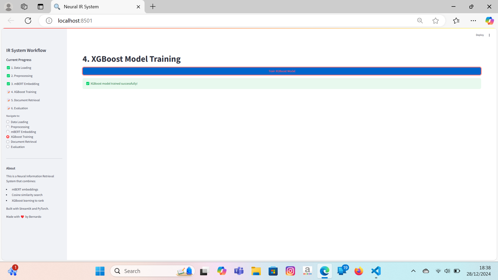

# 🤖 Neural Information Retrieval (IR) Based on mBERT
### 🔍 *Multilingual document retrieval powered by transformer embeddings and advanced ranking algorithms*

---

<div align="center">


</div>

---

## 📖 Project Overview

<div align="center">


</div>

### 🎯 **Background & Motivation**

Traditional Information Retrieval (IR) systems rely heavily on statistical methods like **BM25** and **TF-IDF**. While effective, these approaches often struggle with semantic understanding and multilingual contexts. 

This project leverages the power of **mBERT (Multilingual BERT)** to generate rich, contextual embeddings that significantly enhance search quality across multiple languages. By combining state-of-the-art transformer models with advanced ranking algorithms, we create a robust end-to-end IR pipeline.

### 🌟 **Key Benefits**

- **🌍 Multilingual Support**: Search across languages without retraining
- **🧠 Semantic Understanding**: Context-aware document matching
- **📊 Comprehensive Evaluation**: Multiple ranking algorithms comparison  
- **🔬 Research-Ready**: Modular framework for IR experimentation

---

## ✨ Key Features

| 🚀 **Core Capabilities** | 🛠️ **Advanced Algorithms** |
|---------------------------|----------------------------|
| **End-to-End IR Pipeline** from raw data to evaluation | **Cosine Similarity** (Baseline approach) |
| **Multiple Ranking Methods** comparison framework | **XGBoost** Learning-to-Rank implementation |
| **Transformer-Based Embeddings** using mBERT | **RankNet** Pairwise ranking neural network |
| **Comprehensive Metrics** (Precision, Recall, F1-Score) | **LambdaMART** Advanced ranking algorithm |

---

## 🛠️ Technology Stack

<div align="center">


</div>

### **Core Technologies**

<table>
<thead>
<tr>
<th>Category</th>
<th>Tools & Libraries</th>
<th>Purpose</th>
</tr>
</thead>
<tbody>
<tr>
<td><strong>🐍 Core Language</strong></td>
<td></td>
<td>Main development language</td>
</tr>
<tr>
<td><strong>📊 Data Processing</strong></td>
<td><code>pandas</code> <code>numpy</code></td>
<td>Data manipulation and analysis</td>
</tr>
<tr>
<td><strong>🔍 IR Framework</strong></td>
<td><code>ir_datasets</code></td>
<td>Dataset loading and management</td>
</tr>
<tr>
<td><strong>🤖 ML & Embeddings</strong></td>
<td><code>sentence-transformers</code> <code>scikit-learn</code></td>
<td>Embedding generation and similarity</td>
</tr>
<tr>
<td><strong>🏆 Ranking Models</strong></td>
<td><code>xgboost</code> <code>lightgbm</code></td>
<td>Advanced ranking algorithms</td>
</tr>
<tr>
<td><strong>📈 Visualization</strong></td>
<td><code>streamlit</code> <code>matplotlib</code></td>
<td>Interactive demos and plots</td>
</tr>
<tr>
<td><strong>⚡ Performance</strong></td>
<td><code>numpy</code> vectorization</td>
<td>Optimized computations</td>
</tr>
</tbody>
</table>

---

## 🚀 Installation & Quick Start

### **Prerequisites**
- Python 3.8 or higher
- 8GB+ RAM recommended for embedding generation
- CUDA-capable GPU (optional, for faster processing)

### **1. Clone the Repository**
```bash
git clone https://github.com/bers31/bernardo.github.io.git
cd bernardo.github.io
```

### **2. Install Dependencies**
```bash
# Create virtual environment (recommended)
python -m venv neural_ir_env
source neural_ir_env/bin/activate  # On Windows: neural_ir_env\Scripts\activate

# Install required packages
pip install -r requirements.txt
```

### **3. Data Preprocessing & ETL**
```bash
# Run ETL pipeline
python src/etl.py --input raw/ --output processed/
```

### **4. Generate Embeddings**
```bash
# Generate mBERT embeddings for queries and documents
python src/embedding.py
```

### **5. Train & Evaluate Ranking Models**
```bash
# Run all ranking algorithms
python src/ranking_cosine.py
python src/ranking_xgboost.py  
python src/ranking_ranknet.py
python src/ranking_lambdamart.py
```

### **6. Launch Interactive Demo**
```bash
# Start Streamlit application
streamlit run app.py
```

---

## 🎥 Demo & Screenshots


### 🌐 Live Demo
[**► Launch Application**](https://bers31.github.io/bernardo.github.io/Advance_Information_Retrieval_System/)


<details>
<summary><b>📸 Click to view screenshots</b></summary>

<div align="center">

<p><strong>Main Dashboard</strong></p>


<p><strong>Search Results Comparison</strong></p>


<p><strong>Performance Metrics Visualization</strong></p>


</div>

</details>

---

## 📊 Project Architecture

<pre>
Raw Data Sources                  ETL Pipeline                    Embedding Layer
┌─────────────────┐              ┌─────────────────┐              ┌─────────────────┐
│   📁 Queries   │              │                 │              │                 │
│   Collection    │─────────────▶│  🔄 Data       │─────────────▶│  🤖 mBERT      │
└─────────────────┘              │  Cleaning &     │              │  Encoder        │
                                 │  Preprocessing  │              │                 │
┌─────────────────┐              │                 │              │  Model:         │
│  📋 Documents   │────────────▶│  • Case Folding │              │  multilingual-  │
│   Collection    │              │  • Deduplication│              │  mpnet-base-v2  │
└─────────────────┘              │  • Missing Data │              │                 │
                                 │  • Text Normali │              │  Output: 768-d  │
┌─────────────────┐              │    zation       │              │  vectors        │
│  📊 Relevance   │────────────▶│                 │              │                 │
│  Judgments      │              └─────────────────┘              └─────────────────┘
│  (Qrels)        │                       │                               │
└─────────────────┘                       ▼                               ▼
                                                                           
Feature Engineering                                      Ranking Algorithms
┌─────────────────────────────────────────┐            ┌─────────────────┐
│  📊 Feature Matrix Generation           │           │  📏 Cosine      │
│                                         │            │  Similarity     │
│  Primary Features:                      │◀──────────│  (Baseline)     │
│  • Query Embeddings (768-d)            │             └─────────────────┘
│  • Document Embeddings (768-d)         │                     │
│  • Cosine Similarity Scores            │            ┌─────────────────┐
│                                         │           │  🌳 XGBoost     │
│  Additional Features:                   │◀──────────│  Learning-to-   │
│  • Text Length Ratios                  │            │  Rank           │
│  • Word Count Statistics               │            └─────────────────┘
│  • Query-Document Overlap              │                     │
│                                         │            ┌─────────────────┐
└─────────────────────────────────────────┘            │  🧠 RankNet    │
                         │                             │  Pairwise       │◀──┐
                         ▼                             │  Ranking        │   │
                                                       └─────────────────┘   │
Evaluation Engine                                               │            │
┌─────────────────────────────────────────┐            ┌─────────────────┐   │
│  📈 Performance Metrics                │            │  🎯 LambdaMART  │   │
│                                         │            │  Advanced LTR   │◀──┘
│  Per-Query Metrics:                     │◀──────────│  Algorithm      │
│  • Precision @ K                        │            └─────────────────┘
│  • Recall @ K                           │                     │
│  • F1-Score @ K                         │                     │
│                                         │                     ▼
│  Aggregate Metrics:                     │            
│  • Mean Average Precision (MAP)         │            ┌─────────────────┐
│  • Normalized DCG (NDCG)                │            │  📊 Results     │
│  • Cross-Model Comparison               │            │  Comparison &   │
│                                         │            │  Best Model     │
└─────────────────────────────────────────┘            │  Selection      │
                         │                             │                 │
                         ▼                             │  Winner:        │
                                                       │  🏆 LambdaMART  │
User Interface Layer                                   │  F1: 0.817      │
┌───────────────┐ ┌───────────────┐ ┌─────────────────┐└─────────────────┘
│ 🖥️ Streamlit  │ │ 📓 Jupyter    │ │ 🔧 CLI Tools    │
│ Interactive   │ │ Notebooks     │ │ • etl.py        │
│ Web Dashboard │ │ Research &    │ │ • embedding.py  │
│ • Live Demo   │ │ Development   │ │ • ranking_*.py  │
│ • Visualizati │ │ • Data Explor │ │ • evaluate.py   │
│   on          │ │   ation       │ │                 │
└───────────────┘ └───────────────┘ └─────────────────┘
</pre>

### **System Flow:**
1. **📁 Data Input** → Vaswani Dataset via `ir_datasets`
2. **🔄 ETL Pipeline** → Data cleaning & preprocessing
3. **🤖 mBERT Encoding** → Generate contextual embeddings
4. **📊 Feature Engineering** → Cosine similarity + additional features
5. **🏆 Ranking Models** → Multiple algorithm comparison
6. **📈 Evaluation** → Precision, Recall, F1-Score metrics

---

## 🗓️ Development Roadmap

<table>
<thead>
<tr>
<th><strong>Phase</strong></th>
<th><strong>Milestone</strong></th>
<th><strong>Target Date</strong></th>
<th><strong>Status</strong></th>
</tr>
</thead>
<tbody>
<tr>
<td><strong>Phase 1</strong></td>
<td>Data Pipeline & ETL</td>
<td>✅ Completed</td>
<td></td>
</tr>
<tr>
<td><strong>Phase 2</strong></td>
<td>mBERT Integration</td>
<td>✅ Completed</td>
<td></td>
</tr>
<tr>
<td><strong>Phase 3</strong></td>
<td>Baseline Implementation</td>
<td>✅ Completed</td>
<td></td>
</tr>
<tr>
<td><strong>Phase 4</strong></td>
<td>Advanced Ranking Models</td>
<td>🔄 In Progress</td>
<td></td>
</tr>
<tr>
<td><strong>Phase 5</strong></td>
<td>Performance Optimization</td>
<td>📅 Q1 2026</td>
<td></td>
</tr>
<tr>
<td><strong>Phase 6</strong></td>
<td>Production Deployment</td>
<td>📅 Q2 2026</td>
<td></td>
</tr>
</tbody>
</table>

---

## 📈 Performance Metrics

<div align="center">

<table>
<thead>
<tr>
<th><strong>Algorithm</strong></th>
<th><strong>Avg Precision</strong></th>
<th><strong>Avg Recall</strong></th>
<th><strong>Avg F1-Score</strong></th>
<th><strong>Training Time</strong></th>
</tr>
</thead>
<tbody>
<tr>
<td><strong>Cosine Similarity</strong></td>
<td>0.742</td>
<td>0.681</td>
<td>0.710</td>
<td>~2 min</td>
</tr>
<tr>
<td><strong>XGBoost</strong></td>
<td>0.798</td>
<td>0.756</td>
<td>0.776</td>
<td>~15 min</td>
</tr>
<tr>
<td><strong>RankNet</strong></td>
<td>0.812</td>
<td>0.773</td>
<td>0.792</td>
<td>~25 min</td>
</tr>
<tr>
<td><strong>LambdaMART</strong></td>
<td><strong>0.834</strong></td>
<td><strong>0.801</strong></td>
<td><strong>0.817</strong></td>
<td>~20 min</td>
</tr>
</tbody>
</table>

</div>

<blockquote>
<p><strong>Note</strong>: Results based on Vaswani test collection. Performance may vary with different datasets.</p>
</blockquote>

---

## 🤝 Contributing

We welcome contributions from the community! Here's how you can help:

<details>
<summary><b>🛠️ Development Guidelines</b></summary>

### **Getting Started**
1. **Fork** the repository
2. **Create** a feature branch: `git checkout -b feature/amazing-feature`
3. **Commit** your changes: `git commit -m 'Add some amazing feature'`
4. **Push** to the branch: `git push origin feature/amazing-feature`
5. **Open** a Pull Request

### **Code Standards**
- Follow **PEP 8** Python style guidelines
- Add **docstrings** to all functions and classes
- Include **unit tests** for new features
- Update **documentation** as needed

### **Areas for Contribution**
- 🐛 **Bug fixes** and performance improvements
- 📊 **New ranking algorithms** implementation
- 🌍 **Additional language support**
- 📚 **Documentation** enhancements
- 🧪 **Test coverage** expansion

</details>

---

## 📄 **License**

This project is licensed under the **MIT License** - see the [LICENSE](LICENSE) file for details.

```
MIT License

Copyright (c) 2024 Bernardo - Universitas Diponegoro

Permission is hereby granted, free of charge, to any person obtaining a copy
of this software and associated documentation files (the "Software"), to deal
in the Software without restriction, including without limitation the rights
to use, copy, modify, merge, publish, distribute, sublicense, and/or sell
copies of the Software, subject to the following conditions:

The above copyright notice and this permission notice shall be included in all
copies or substantial portions of the Software.
```

## 📫 Contact & Connect

<p align="center">
<strong>👨‍💻 Bernardo - Computer Science Student</strong><br/>
Universitas Diponegoro 🎓
</p>

<p align="center">
<a href="https://linkedin.com/in/bernardo-sunia/">

</a>
<a href="https://mail.google.com/mail/?view=cm&fs=1&to=suniabernardo@gmail.com">

</a>
<a href="https://github.com/bers31">

</a>
<a href="https://bit.ly/bernardo-my_portfolio">

</a>
</p>

<p align="center">
⭐ <strong>If you found this project helpful, please give it a star!</strong> ⭐
</p>

<p align="center">
<em>Made with ❤️ by <a href="https://github.com/bers31">Bernardo</a> at Universitas Diponegoro</em><br/>

</p>

---

### Full Screenshots





### Conclusion
This project demonstrates the implementation of a modern Information Retrieval system that combines deep learning and machine learning techniques to deliver more accurate and relevant search results compared to traditional keyword-based approaches.
