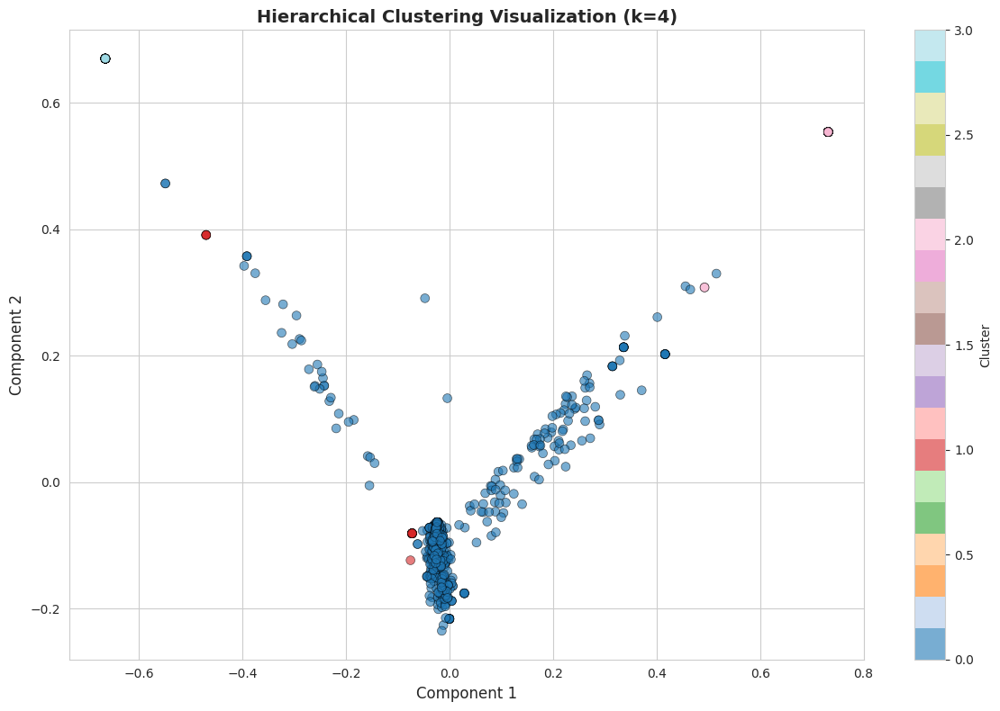
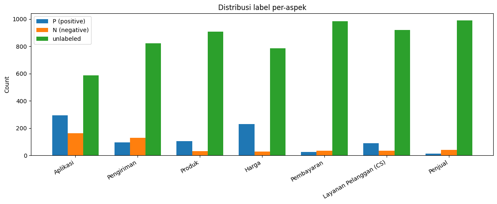
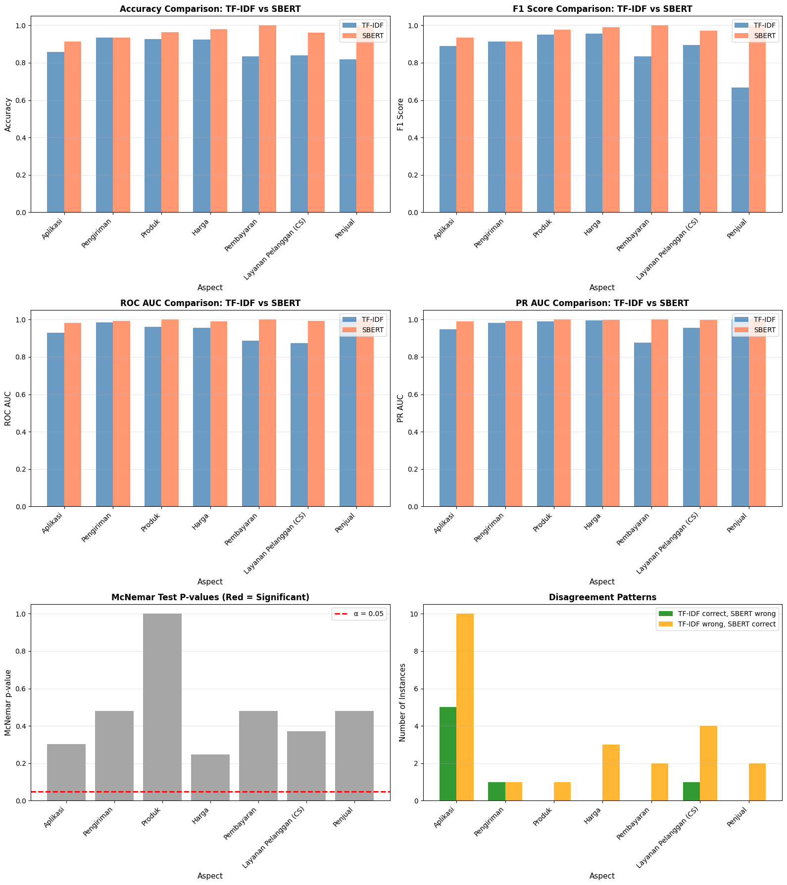
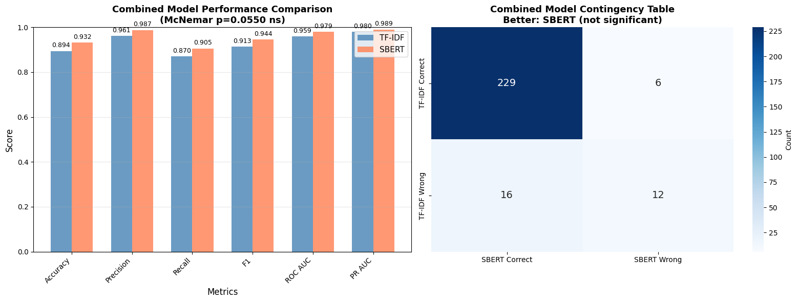
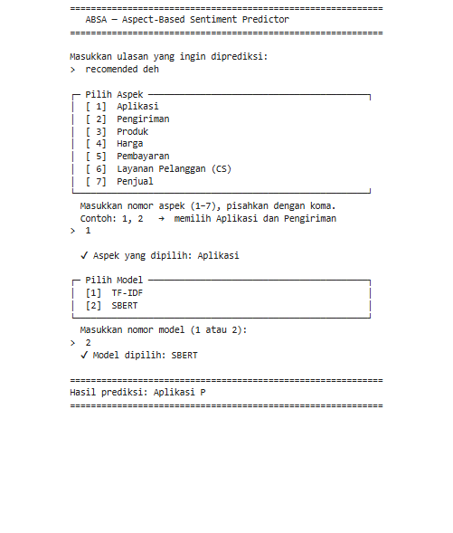
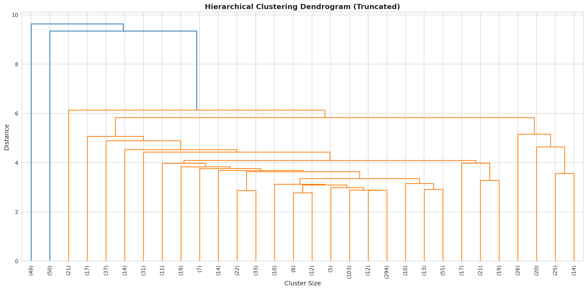

<div align="center">
  <h1>🛍️ TF-IDF vs SBERT — Aspect Sentiment Classification on Indonesian E-Commerce Reviews (Shopee Case Study)</h1>
  <h3>Comparative NLP Research · Aspect-Based Sentiment Analysis · Text Representation Paradigms</h3>
</div>

<div align="center">

[](https://python.org)
[](https://scikit-learn.org)
[](https://huggingface.co/sentence-transformers)
[](https://jupyter.org)
[](LICENSE)
[](https://undip.ac.id)
[]()
[]()

</div>

---


## 📖 Project Overview

This repository contains the full implementation of my - Research project at **Universitas Diponegoro**, which investigates how different text representation paradigms affect the performance of Aspect Sentiment Classification (ASC) — a core subtask of Aspect-Based Sentiment Analysis (ABSA) — on real-world Indonesian e-commerce reviews from **Shopee**.

The study systematically compares two foundational yet contrasting approaches to text representation:

- **TF-IDF** (Term Frequency–Inverse Document Frequency) — a *sparse*, frequency-based representation that encodes statistical word importance across a corpus.
- **SBERT** (Sentence-BERT) — a *dense*, transformer-based contextual embedding model that captures deep semantic meaning at the sentence level.

Both representations are paired with **Logistic Regression** as the unified classifier, allowing for a clean, controlled comparison of text representation quality in isolation. The study covers the full NLP pipeline: data acquisition, aspect discovery, human annotation, model training, and rigorous statistical evaluation via **McNemar's Test**.

> **Key Finding:** SBERT consistently and significantly outperforms TF-IDF across all evaluation settings, with a combined test-set F1-Score of **0.9444 vs. 0.9130**, confirming that Indonesian e-commerce reviews are predominantly context-driven and benefit greatly from semantic embedding.

---

## 🎯 Research Objectives

1. Build a labeled ABSA dataset for Shopee reviews in Indonesian, covering seven distinct service aspects.
2. Compare TF-IDF and SBERT under two hyperparameter scenarios: **best-per-aspect** and **universal** settings.
3. Evaluate both models using accuracy, precision, recall, F1-score, ROC-AUC, PR-AUC, and McNemar's statistical significance test.
4. Provide actionable insights for practitioners building sentiment analysis systems for Indonesian e-commerce platforms.

---

## 🏗️ Research Pipeline

| 📥 Data Acquisition | 🔍 Aspect Discovery | ⚙️ Modeling & Evaluation |
|---------------------|---------------------|--------------------------|
| Web scraping (1,000 raw reviews) | TF-IDF feature extraction | TF-IDF + Logistic Regression |
| Targeted scraping (≥100/aspect) | Truncated SVD & PCA | SBERT + Logistic Regression |
| | Hierarchical Clustering (Ward Linkage) | Grid Search (Stratified 5-Fold CV) |
| | Keyword extraction per cluster | Per-aspect & universal hyperparams |
| | Manual review & aspect labeling | Accuracy / Precision / Recall / F1 / AUC |
| | | McNemar's Test |
 
> **Annotation layer:** 3 independent annotators · Fleiss' Kappa > 0.9 · Majority-vote adjudication

---

## 📊 Dataset & Aspects

Reviews were collected from the **Shopee Play Store** page using web scraping. After exploratory collection (1,000 reviews), **aspect discovery** was performed via hierarchical clustering to identify the seven dominant service aspects. Targeted scraping then ensured a minimum of **100 annotated reviews per aspect**.

| # | Aspect | Description |
|---|--------|-------------|
| 1 | 📱 **Aplikasi** | App performance, bugs, UI/UX |
| 2 | 🚚 **Pengiriman** | Delivery speed, courier quality |
| 3 | 📦 **Produk** | Product quality and accuracy |
| 4 | 💰 **Harga** | Pricing, discounts, vouchers |
| 5 | 💳 **Pembayaran** | Payment methods, transaction issues |
| 6 | 🎧 **Layanan Pelanggan** | CS responsiveness and resolution |
| 7 | 🏪 **Penjual** | Seller responsiveness and reliability |

**Annotation Quality:**

| Metric | Score | Interpretation |
|--------|-------|----------------|
| Fleiss' Kappa (all 3 annotators) | **> 0.90** | Almost Perfect Agreement |
| Cohen's Kappa (pairwise) | **> 0.90** | Almost Perfect Agreement |

---

## 🧠 Models & Methodology

### Text Representation

**TF-IDF (Sparse)**
- Vectorizes review text based on term frequency weighted against inverse document frequency.
- Produces high-dimensional, interpretable sparse vectors.
- Preprocessing: text cleaning → slang normalization (Aho-Corasick automaton) → stopword removal → stemming.

**SBERT (Dense)**
- Utilizes Sentence-BERT to generate fixed-size 768-dimensional contextual embeddings.
- Captures semantic similarity, paraphrasing, and syntactic context that TF-IDF cannot represent.
- Model: `paraphrase-multilingual-mpnet-base-v2` (multilingual, optimized for semantic similarity).

### Classifier: Logistic Regression

Logistic Regression was chosen as the shared classifier to isolate the contribution of text representation quality without introducing confounding variation from the classifier architecture.

### Evaluation Scenarios

| Scenario | Description |
|----------|-------------|
| **Best-Per-Aspect Hyperparameters** | Separate optimal hyperparameter configurations per aspect, found via Grid Search + Stratified 5-Fold CV |
| **Universal Hyperparameters** | A single optimal configuration applied across all aspects |
| **Combined Dataset** | Training on all aspects combined to evaluate cross-aspect generalization |

---

<h2>🎥 Demo </h2>
<div align="center">
  <p><strong>🖥️ Live Demo</strong></p>
  <p><a href="https://bers31.github.io/bernardo.github.io/Aspect_Sentiment_Classification_of_E-Commerce_Reviews_Using_TF-IDF_and_SBERT_Representations/">🔗 Visit Live Application</a></p>
</div>

<table>
  <tr>
    <td width="33%">
      
      <p align="center"><strong>Dataset Statistical Distribution</strong></p>
    </td>
    <td width="33%">
      
      <p align="center"><strong>Model Training Results</strong></p>
    </td>
    <td width="33%">
      
      <p align="center"><strong>Software Results</strong></p>
    </td>
  </tr>
</table>
---

## 🛠️ Tech Stack
 
| Layer | Technology |
|-------|------------|
| **Language** | Python 3.10+ |
| **ML Framework** | scikit-learn, NumPy, SciPy |
| **NLP / Embeddings** | sentence-transformers (HuggingFace), NLTK, Sastrawi |
| **Text Representation** | TF-IDF (sklearn), SBERT (paraphrase-multilingual-mpnet-base-v2) |
| **Clustering** | scipy.cluster.hierarchy (Ward Linkage), sklearn TruncatedSVD, PCA |
| **Annotation** | Manual (3 annotators) + Fleiss' Kappa via statsmodels |
| **Evaluation** | sklearn metrics, McNemar's Test (statsmodels) |
| **Visualization** | Matplotlib, Seaborn |
| **Data Handling** | Pandas, openpyxl |
| **Notebook** | Jupyter Notebook |
 
---

## 🚀 Getting Started

### Prerequisites

- Python 3.10 or higher
- pip or conda package manager
- ~4 GB disk space (for SBERT model download)

### Installation

```bash
# 1. Clone the repository
git clone https://github.com/bers31/shopee-absa-tfidf-sbert.git
cd shopee-absa-tfidf-sbert

# 2. Create and activate a virtual environment
python -m venv venv
source venv/bin/activate        # macOS / Linux
venv\Scripts\activate           # Windows

# 3. Install dependencies
pip install -r requirements.txt
```

### Core Dependencies

```txt
scikit-learn>=1.3.0
sentence-transformers>=2.2.2
pandas>=2.0.0
numpy>=1.24.0
scipy>=1.11.0
matplotlib>=3.7.0
seaborn>=0.12.0
sastrawi>=1.0.1
nltk>=3.8.1
statsmodels>=0.14.0
openpyxl>=3.1.0
jupyter>=1.0.0
```

### Running the Pipeline

```bash
# Step 1 – Exploratory data collection & aspect discovery
jupyter notebook notebooks/01_aspect_discovery.ipynb

# Step 2 – Annotation quality analysis (Fleiss' Kappa)
jupyter notebook notebooks/02_annotation_quality.ipynb

# Step 3 – Preprocessing & dataset preparation
jupyter notebook notebooks/03_preprocessing.ipynb

# Step 4 – TF-IDF model training & evaluation
jupyter notebook notebooks/04_tfidf_model.ipynb

# Step 5 – SBERT model training & evaluation
jupyter notebook notebooks/05_sbert_model.ipynb

# Step 6 – Comparative analysis (McNemar's Test)
jupyter notebook notebooks/06_comparison_mcnemar.ipynb
```

---

## 📁 Project Structure

```
shopee-absa-tfidf-sbert/
│
├── 📂 data/
│   ├── raw/                    # Raw scraped reviews
│   ├── exploratory/            # Initial 1,000-review sample
│   ├── targeted/               # Aspect-targeted scraping results
│   └── final/                  # Annotated & cleaned final datasets per aspect
│
├── 📂 notebooks/
│   ├── 01_aspect_discovery.ipynb
│   ├── 02_annotation_quality.ipynb
│   ├── 03_preprocessing.ipynb
│   ├── 04_tfidf_model.ipynb
│   ├── 05_sbert_model.ipynb
│   └── 06_comparison_mcnemar.ipynb
│
├── 📂 src/
│   ├── preprocessing.py        # Text cleaning, normalization, stemming
│   ├── clustering.py           # Hierarchical clustering for aspect discovery
│   ├── annotation.py           # Kappa computation utilities
│   ├── tfidf_pipeline.py       # TF-IDF vectorization + LR training
│   ├── sbert_pipeline.py       # SBERT embedding + LR training
│   ├── evaluation.py           # Metrics: accuracy, F1, AUC, McNemar
│   └── utils.py                # Shared helpers
│
├── 📂 results/
│   ├── figures/                # Dendrogram, cluster plots, ROC/PR curves
│   ├── per_aspect/             # Per-aspect hyperparameter results
│   ├── universal/              # Universal hyperparameter results
│   └── combined/               # Combined dataset results
│
├── 📂 assets/
│   └── slang_dict.csv          # Indonesian slang normalization dictionary
│
├── requirements.txt
├── LICENSE
└── README.md
```

---

## 🔬 Research Contributions

1. **Curated ABSA dataset** for Shopee reviews in Indonesian with high-quality annotations (Fleiss' Kappa > 0.9) covering 7 aspects.
2. **Rigorous empirical comparison** of sparse vs. dense text representation under controlled conditions using a shared classifier.
3. **Statistical validation** via McNemar's Test confirming that SBERT's advantage over TF-IDF is not due to random variation.
4. **Practical recommendation** for NLP practitioners: for context-heavy, informal Indonesian e-commerce text, contextual embeddings (SBERT) are the clearly superior choice over frequency-based representations.

---

## 📄 **License**

This project is licensed under the **MIT License** - see the [LICENSE](LICENSE) file for details.

```
MIT License

Copyright (c) 2024 Bernardo - Universitas Diponegoro

Permission is hereby granted, free of charge, to any person obtaining a copy
of this software and associated documentation files (the "Software"), to deal
in the Software without restriction, including without limitation the rights
to use, copy, modify, merge, publish, distribute, sublicense, and/or sell
copies of the Software, subject to the following conditions:

The above copyright notice and this permission notice shall be included in all
copies or substantial portions of the Software.
```

## 📫 Contact & Connect

<p align="center">
<strong>👨‍💻 Bernardo - Computer Science Student</strong><br/>
Universitas Diponegoro 🎓
</p>

<p align="center">
<a href="https://linkedin.com/in/bernardo-sunia/">

</a>
<a href="https://mail.google.com/mail/?view=cm&fs=1&to=suniabernardo@gmail.com">

</a>
<a href="https://github.com/bers31">

</a>
<a href="https://bit.ly/bernardo-my_portfolio">

</a>
</p>

<p align="center">
⭐ <strong>If you found this project helpful, please give it a star!</strong> ⭐
</p>

<p align="center">
<em>Made with ❤️ by <a href="https://github.com/bers31">Bernardo</a> at Universitas Diponegoro</em><br/>

</p>

---

### Full Screenshots







### Conclusion

| Model | Accuracy | Precision | Recall | F1-Score | ROC-AUC | PR-AUC |
|-------|----------|-----------|--------|----------|---------|--------|
| TF-IDF + LR | 0.8935 | 0.9608 | 0.8698 | 0.9130 | 0.9595 | 0.9796 |
| SBERT + LR | 0.9316 | 0.9871 | 0.9053 | 0.9444 | 0.9787 | 0.9895 |
 
McNemar's Test on the combined test set yields **p-value = 0.0550** — marginally above the conventional α = 0.05 threshold, meaning the difference is formally **not statistically significant**. However, the disagreement ratio of 16 (TF-IDF wrong, SBERT correct) vs. 6 (SBERT wrong, TF-IDF correct) represents a strong directional trend. With a larger sample size, this difference would very likely cross the significance threshold. Per-aspect McNemar results similarly show no aspect reaching significance, primarily due to small per-aspect test set sizes (as few as 11–12 samples) rather than an absence of true performance differences.
