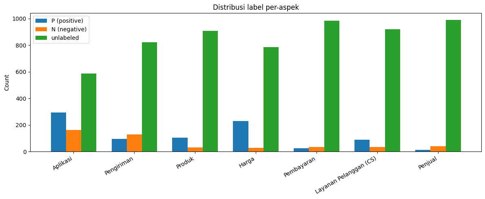
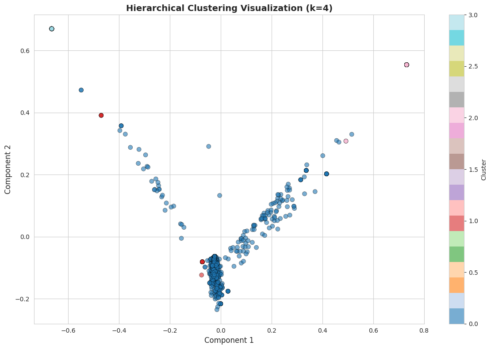
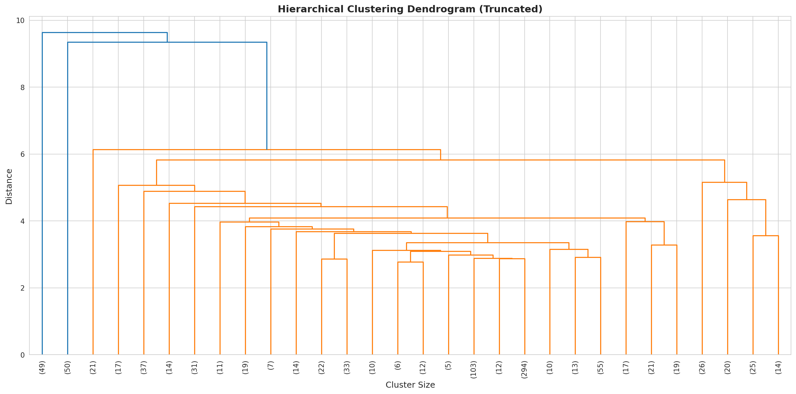

<div class="hero">

<h1>🛍️ TF-IDF vs SBERT — Aspect Sentiment Classification</h1>

<p>Indonesian E-Commerce Reviews · Shopee Case Study · Comparative NLP Research</p>

<p>
  
  
  
  
  
  
</p>

<p>
A comparative NLP study examining how sparse TF-IDF and dense SBERT representations
affect Aspect Sentiment Classification performance on informal Indonesian e-commerce reviews.
</p>

</div>

---

## 📖 Project Overview

This repository contains the implementation of a comparative **Aspect-Based Sentiment Analysis (ABSA)** research project conducted at **Diponegoro University**.

The study investigates how different text representation paradigms affect **Aspect Sentiment Classification (ASC)** on real-world Indonesian e-commerce reviews collected from **Shopee**.

Two fundamentally different representation approaches are evaluated under controlled experimental conditions:

* **TF-IDF** — a sparse, frequency-based representation that captures statistical word importance across the corpus.
* **SBERT** — a dense, transformer-based representation that captures contextual and semantic relationships between text.

Both representations are paired with the same **Logistic Regression classifier** so that the experiment focuses on the contribution of the representation itself rather than introducing differences in classifier architecture.

The research covers the complete workflow from:

```text
Data Collection
      ↓
Aspect Discovery
      ↓
Text Preprocessing
      ↓
Human Annotation
      ↓
TF-IDF / SBERT Representation
      ↓
Logistic Regression
      ↓
Hyperparameter Optimization
      ↓
Statistical Evaluation
      ↓
Comparative Analysis
```

> **Key finding:** SBERT produced a higher combined test-set **F1-score of 0.9444 compared with 0.9130 for TF-IDF**, indicating a strong performance advantage for contextual sentence representations in this experimental setting.

---

## 🎯 Research Objectives

### 🧪 Research Questions

The project is designed around several objectives:

1. Build a labeled ABSA dataset from Indonesian Shopee reviews.
2. Identify the dominant service-related aspects present in the review corpus.
3. Compare sparse and dense text representations under a shared classifier.
4. Determine whether optimal hyperparameters differ across service aspects.
5. Evaluate model performance using multiple classification metrics.
6. Test whether the observed difference between TF-IDF and SBERT is statistically meaningful.
7. Produce a reproducible benchmark and practical recommendation for Indonesian e-commerce NLP applications.

---

## 🏗️ Research Pipeline

### 📥 Data Acquisition

More than **1,000 Shopee reviews** were collected through a multi-stage scraping process.

The initial exploratory collection was used to understand the review corpus and discover dominant service aspects.

### 🔍 Aspect Discovery

The project identified **seven dominant service aspects** using dimensionality reduction and hierarchical clustering.

The discovery workflow combined:

* TF-IDF feature extraction.
* Truncated SVD.
* PCA.
* Hierarchical clustering using Ward linkage.
* Cluster-level keyword analysis.
* Manual interpretation and validation.

### 🏷️ Human Annotation

The discovered aspects were converted into a labeled dataset through a structured manual annotation process involving **three independent annotators**.

Agreement was measured using **Fleiss' Kappa**, with the project achieving:

> **Fleiss' Kappa > 0.90**, indicating near-perfect inter-annotator agreement.

Majority voting was used as the final adjudication mechanism.

### ⚙️ Modeling

Each representation was paired with the same Logistic Regression classifier:

```text
TF-IDF ───────────────┐
                      ├──> Logistic Regression
SBERT ────────────────┘
```

This controlled design isolates the effect of the underlying text representation.

### 📈 Statistical Evaluation

The comparative analysis includes:

* Accuracy
* Precision
* Recall
* F1-score
* ROC-AUC
* PR-AUC
* McNemar's Test

---

## 📊 Dataset & Aspect Taxonomy

The final dataset covers seven major service aspects identified from Indonesian Shopee reviews.

| # | Aspect                   | Scope                                                        |
| - | ------------------------ | ------------------------------------------------------------ |
| 1 | 📱 **Aplikasi**          | Application performance, bugs, interface, and UX             |
| 2 | 🚚 **Pengiriman**        | Delivery speed, courier experience, and shipment issues      |
| 3 | 📦 **Produk**            | Product quality, condition, and correspondence with listings |
| 4 | 💰 **Harga**             | Pricing, discounts, promotions, and vouchers                 |
| 5 | 💳 **Pembayaran**        | Payment methods and transaction-related issues               |
| 6 | 🎧 **Layanan Pelanggan** | Customer service responsiveness and issue resolution         |
| 7 | 🏪 **Penjual**           | Seller responsiveness, reliability, and service              |

### Annotation Quality

| Metric            |            Result | Interpretation                |
| ----------------- | ----------------: | ----------------------------- |
| **Fleiss' Kappa** |        **> 0.90** | Near-perfect agreement        |
| Annotators        |             **3** | Independent manual annotation |
| Adjudication      | **Majority Vote** | Final label determination     |

> High inter-annotator agreement supports the consistency of the annotation protocol used to construct the benchmark dataset.

---

## 🧠 Methodology

### Text Preprocessing

Indonesian review text often contains slang, informal spelling, abbreviations, and noisy linguistic patterns.

The preprocessing pipeline therefore includes:

```text
Raw Review
   ↓
Text Cleaning
   ↓
Slang Normalization
   ↓
Stopword Removal
   ↓
Stemming
   ↓
Model-Ready Text
```

Aho-Corasick-based matching is used as part of the slang normalization stage to efficiently map informal expressions to normalized forms.

### TF-IDF Representation

TF-IDF represents each review as a sparse numerical vector based on term frequency and inverse document frequency.

Advantages include:

* High interpretability.
* Efficient feature representation.
* Strong lexical baseline.
* Easy inspection of influential terms.

Conceptually:

```text
Review
  ↓
Tokenization
  ↓
TF-IDF Vectorization
  ↓
Sparse Feature Matrix
  ↓
Logistic Regression
```

### SBERT Representation

SBERT converts each review into a dense contextual embedding.

The project uses:

```text
paraphrase-multilingual-mpnet-base-v2
```

The multilingual model is suitable for Indonesian text and provides dense sentence-level representations that can capture contextual and semantic relationships.

Conceptually:

```text
Review
  ↓
SBERT Encoder
  ↓
Dense Embedding
  ↓
Logistic Regression
```

### Why Use the Same Classifier?

Logistic Regression is intentionally shared between TF-IDF and SBERT.

This produces a cleaner experimental comparison:

```text
                   Same Classifier
                         │
          ┌──────────────┴──────────────┐
          ↓                             ↓
      TF-IDF                          SBERT
    Sparse vectors                 Dense vectors
          │                             │
          └────────── Performance ──────┘
```

The objective is to measure how much the representation itself contributes to classification quality.

---

## 🔧 Hyperparameter Optimization

Both approaches are optimized using **Grid Search with Stratified 5-Fold Cross-Validation**.

Two experimental strategies are evaluated.

### Best-Per-Aspect Configuration

Each aspect receives its own optimal hyperparameter configuration.

This captures the possibility that different service categories have different linguistic characteristics.

### Universal Configuration

A single hyperparameter configuration is applied across all aspects.

This provides a more deployment-oriented scenario where one model configuration must work consistently across multiple service categories.

### Combined Dataset

All aspects are also evaluated together to examine overall model behavior and cross-aspect generalization.

---

## 📐 Experimental Design

| Scenario                      | Purpose                                                               |
| ----------------------------- | --------------------------------------------------------------------- |
| **Best-Per-Aspect**           | Finds the optimal configuration independently for each service aspect |
| **Universal Hyperparameters** | Evaluates one configuration across all aspects                        |
| **Combined Dataset**          | Measures aggregate behavior when all aspects are modeled together     |
| **Shared Classifier**         | Controls classifier architecture between TF-IDF and SBERT             |

This design allows the study to distinguish between representation quality and hyperparameter-specific effects.

---

## 📈 Evaluation Metrics

### Accuracy

Measures the proportion of correctly classified instances over the total test set.

### Precision

Measures how many predictions assigned to a sentiment class are actually correct.

### Recall

Measures how many relevant instances of a sentiment class are successfully identified.

### F1-Score

Provides a harmonic mean of precision and recall.

```text
F1 = 2 × (Precision × Recall)
     ---------------------------
       Precision + Recall
```

### ROC-AUC

Measures the model's ability to distinguish between classes across classification thresholds.

### PR-AUC

Measures the area under the precision-recall curve and is particularly informative when class distributions are not perfectly balanced.

### McNemar's Test

McNemar's Test is applied to paired classification outcomes from the same test samples.

It evaluates whether the disagreement pattern between two classifiers is statistically significant.

---

## 📊 Comparative Results

The combined test-set results reported in the experiment are:

| Model                            |   Accuracy |  Precision |     Recall |   F1-Score |    ROC-AUC |     PR-AUC |
| -------------------------------- | ---------: | ---------: | ---------: | ---------: | ---------: | ---------: |
| **TF-IDF + Logistic Regression** |     0.8935 |     0.9608 |     0.8698 |     0.9130 |     0.9595 |     0.9796 |
| **SBERT + Logistic Regression**  | **0.9316** | **0.9871** | **0.9053** | **0.9444** | **0.9787** | **0.9895** |

### Performance Summary

SBERT demonstrates stronger performance across the reported metrics:

| Metric    | TF-IDF |      SBERT | Difference |
| --------- | -----: | ---------: | ---------: |
| Accuracy  | 0.8935 | **0.9316** |    +0.0381 |
| Precision | 0.9608 | **0.9871** |    +0.0263 |
| Recall    | 0.8698 | **0.9053** |    +0.0355 |
| F1-Score  | 0.9130 | **0.9444** |    +0.0314 |
| ROC-AUC   | 0.9595 | **0.9787** |    +0.0192 |
| PR-AUC    | 0.9796 | **0.9895** |    +0.0099 |

> **Result:** SBERT outperforms TF-IDF on every reported aggregate metric in the combined test set.

---

## 🧪 Statistical Significance

McNemar's Test was used to compare the paired predictions of TF-IDF and SBERT on the same combined test set.

The reported result is:

```text
p-value = 0.0550
```

Using the conventional significance threshold:

```text
α = 0.05
```

the result is **marginally above the threshold** and therefore does **not formally establish statistical significance** at α = 0.05.

The disagreement pattern was:

```text
TF-IDF incorrect → SBERT correct : 16
SBERT incorrect  → TF-IDF correct : 6
```

This indicates a clear directional advantage toward SBERT in the observed test set, although the formal McNemar significance threshold was not crossed.

Per-aspect McNemar analyses similarly did not produce statistically significant results, with small per-aspect test sets limiting statistical power.

> **Research interpretation:** The experimental evidence strongly favors SBERT in predictive performance, but the statistical evidence should be reported accurately: the combined McNemar test is directional but **not significant at α = 0.05**.

---

## 🔬 Research Findings

### 🥇 SBERT Provides Stronger Classification Performance

SBERT achieves a higher score than TF-IDF across the reported evaluation metrics.

The largest aggregate improvement among the principal classification measures is observed in F1-score:

```text
TF-IDF + LR : 0.9130
SBERT + LR  : 0.9444
```

### 🧠 Context Matters in Informal Indonesian Reviews

Indonesian e-commerce reviews frequently contain:

* Informal language.
* Slang.
* Context-dependent expressions.
* Variations in word usage.
* Semantically similar phrases with different lexical forms.

Dense contextual embeddings can represent these relationships more effectively than frequency-only representations.

### ⚖️ Controlled Comparison Strengthens the Benchmark

Using the same classifier architecture for both representations reduces an important source of experimental confounding.

The comparison therefore centers primarily on:

```text
Representation Quality
        ↓
Classification Behavior
        ↓
Evaluation Results
```

### 📚 Statistical Validation Improves Research Rigor

Performance differences are not evaluated solely through aggregate metrics.

McNemar's Test provides a paired statistical perspective on model disagreement, making the benchmark more rigorous than a simple accuracy comparison.

---

## 🎥 Demo

### 🖥️ Live Application

<div align="center">

<p>
<strong>🔗 Aspect Sentiment Classification Application</strong>
</p>

<p>
<a href="https://bers31.github.io/bernardo.github.io/Aspect_Sentiment_Classification_of_E-Commerce_Reviews_Using_TF-IDF_and_SBERT_Representations/">
<strong>► Visit Live Application</strong>
</a>
</p>

</div>

### 📸 Application Preview



*Dataset and statistical distribution visualization.*


*Comparative model training and evaluation results.*


*Application interface and classification results.*

---

## 🛠️ Technology Stack

| Layer                   | Technology                | Purpose                                                    |
| ----------------------- | ------------------------- | ---------------------------------------------------------- |
| 🐍 Programming          | **Python 3.10+**          | Core implementation                                        |
| 🤖 Machine Learning     | **scikit-learn**          | TF-IDF, Logistic Regression, Grid Search, cross-validation |
| 🧠 Embeddings           | **Sentence-Transformers** | SBERT representation                                       |
| 📊 Data Processing      | **Pandas**                | Dataset management and analysis                            |
| 🔢 Numerical Computing  | **NumPy**                 | Numerical processing                                       |
| 🧮 Scientific Computing | **SciPy**                 | Clustering and scientific utilities                        |
| 🇮🇩 Indonesian NLP     | **Sastrawi**              | Stemming                                                   |
| 🔤 NLP Processing       | **NLTK**                  | Text processing utilities                                  |
| 📐 Statistical Analysis | **Statsmodels**           | Fleiss' Kappa and McNemar's Test                           |
| 📈 Visualization        | **Matplotlib**            | Statistical and analytical plots                           |
| 📊 Visualization        | **Seaborn**               | Statistical visualization                                  |
| 📓 Research             | **Jupyter Notebook**      | Experimentation and reproducible analysis                  |
| 📑 Data I/O             | **openpyxl**              | Spreadsheet-based data handling                            |

---

## 🚀 Getting Started

### Prerequisites

* Python 3.10 or higher.
* `pip` or Conda.
* Approximately 4 GB of disk space for model and dependency storage.
* Internet access during the first SBERT model download.

### Installation

```bash
git clone https://github.com/bers31/shopee-absa-tfidf-sbert.git
cd shopee-absa-tfidf-sbert
```

Create a virtual environment:

```bash
python -m venv venv
```

Activate it on macOS / Linux:

```bash
source venv/bin/activate
```

Activate it on Windows:

```bash
venv\Scripts\activate
```

Install dependencies:

```bash
pip install -r requirements.txt
```

---

## 📦 Core Dependencies

```txt
scikit-learn>=1.3.0
sentence-transformers>=2.2.2
pandas>=2.0.0
numpy>=1.24.0
scipy>=1.11.0
matplotlib>=3.7.0
seaborn>=0.12.0
sastrawi>=1.0.1
nltk>=3.8.1
statsmodels>=0.14.0
openpyxl>=3.1.0
jupyter>=1.0.0
```

---

## ▶️ Running the Research Pipeline

### Step 1 — Aspect Discovery

```bash
jupyter notebook notebooks/01_aspect_discovery.ipynb
```

Performs exploratory analysis and hierarchical clustering to identify the dominant service aspects.

### Step 2 — Annotation Quality

```bash
jupyter notebook notebooks/02_annotation_quality.ipynb
```

Calculates inter-annotator agreement, including Fleiss' Kappa.

### Step 3 — Preprocessing

```bash
jupyter notebook notebooks/03_preprocessing.ipynb
```

Performs cleaning, slang normalization, stopword removal, and stemming.

### Step 4 — TF-IDF Model

```bash
jupyter notebook notebooks/04_tfidf_model.ipynb
```

Trains and evaluates the TF-IDF + Logistic Regression pipeline.

### Step 5 — SBERT Model

```bash
jupyter notebook notebooks/05_sbert_model.ipynb
```

Generates SBERT embeddings and evaluates the SBERT + Logistic Regression pipeline.

### Step 6 — Comparative Statistical Analysis

```bash
jupyter notebook notebooks/06_comparison_mcnemar.ipynb
```

Performs model comparison and McNemar's statistical analysis.

---

## 📁 Project Structure

```text
shopee-absa-tfidf-sbert/
│
├── 📂 data/
│   ├── raw/                    # Raw scraped reviews
│   ├── exploratory/            # Initial exploratory sample
│   ├── targeted/               # Aspect-targeted collection
│   └── final/                  # Final annotated datasets
│
├── 📂 notebooks/
│   ├── 01_aspect_discovery.ipynb
│   ├── 02_annotation_quality.ipynb
│   ├── 03_preprocessing.ipynb
│   ├── 04_tfidf_model.ipynb
│   ├── 05_sbert_model.ipynb
│   └── 06_comparison_mcnemar.ipynb
│
├── 📂 src/
│   ├── preprocessing.py        # Text cleaning and normalization
│   ├── clustering.py           # Aspect discovery
│   ├── annotation.py           # Annotation utilities
│   ├── tfidf_pipeline.py       # TF-IDF + LR pipeline
│   ├── sbert_pipeline.py       # SBERT + LR pipeline
│   ├── evaluation.py           # Evaluation and statistical tests
│   └── utils.py                # Shared utilities
│
├── 📂 results/
│   ├── figures/                # Research figures
│   ├── per_aspect/             # Aspect-specific results
│   ├── universal/              # Universal hyperparameter results
│   └── combined/               # Combined test-set results
│
├── 📂 assets/
│   └── slang_dict.csv          # Indonesian slang normalization dictionary
│
├── requirements.txt
├── LICENSE
└── README.md
```

---

## 🔬 Research Contributions

### 🗂️ 1. Curated Indonesian ABSA Dataset

The project constructs a labeled dataset from **1,000+ Indonesian Shopee reviews**, covering seven dominant service aspects.

### 🔍 2. Data-Driven Aspect Discovery

Hierarchical clustering combined with Truncated SVD and PCA is used to discover recurring service categories rather than relying entirely on predefined categories.

### 🏷️ 3. High-Quality Human Annotation

Three independent annotators were involved in the labeling process, with:

> **Fleiss' Kappa > 0.90**

demonstrating near-perfect inter-annotator agreement.

### ⚖️ 4. Controlled Representation Comparison

TF-IDF and SBERT are evaluated with the same Logistic Regression classifier, reducing architectural confounding.

### 🔧 5. Systematic Hyperparameter Optimization

Both representations undergo Grid Search with Stratified 5-Fold Cross-Validation under:

* Best-per-aspect configurations.
* Universal configurations.
* Combined-data evaluation.

### 📊 6. Statistical Validation

McNemar's Test is used to assess whether model disagreements indicate a statistically significant difference.

### 💡 7. Practical NLP Recommendation

The experimental results support the use of **contextual SBERT representations** for informal and context-heavy Indonesian e-commerce reviews, while the statistical interpretation is kept separate from predictive performance claims.

---

## 🧭 Portfolio Alignment

The implementation directly reflects the competencies represented in the project description:

| Professional Project Description               | Evidence in This Repository                                      |
| ---------------------------------------------- | ---------------------------------------------------------------- |
| Build labeled ABSA dataset from 1,000+ reviews | Multi-stage Shopee review collection and annotation pipeline     |
| Indonesian text preprocessing                  | Cleaning, slang normalization, stopword removal, stemming        |
| Seven dominant aspects                         | Hierarchical clustering + manual interpretation                  |
| Three-annotator protocol                       | Structured manual annotation                                     |
| Fleiss' Kappa > 0.90                           | Formal annotation agreement analysis                             |
| TF-IDF + Logistic Regression                   | Sparse representation benchmark                                  |
| SBERT + Logistic Regression                    | Dense contextual representation benchmark                        |
| Grid Search                                    | Hyperparameter optimization                                      |
| Stratified 5-Fold CV                           | Controlled model validation                                      |
| Best-per-aspect scenario                       | Aspect-specific optimization                                     |
| Universal scenario                             | Shared hyperparameter configuration                              |
| McNemar's Test                                 | Statistical model comparison                                     |
| Reproducible benchmark                         | Notebooks, source modules, requirements, and documented workflow |

> **Portfolio positioning:** This project demonstrates the complete progression from raw Indonesian text to a validated ABSA benchmark, combining NLP preprocessing, unsupervised aspect discovery, supervised learning, transformer embeddings, statistical evaluation, and reproducible experimentation.

---

## 🔭 Future Research Directions

Potential extensions include:

* Larger and more diverse Indonesian e-commerce datasets.
* Additional e-commerce platforms for cross-domain evaluation.
* Multilabel or multi-aspect classification.
* Aspect extraction combined with sentiment classification.
* Transformer fine-tuning for direct downstream classification.
* Hybrid TF-IDF + contextual feature representations.
* Class-imbalance mitigation techniques.
* More extensive statistical testing across datasets.
* Cross-domain and cross-platform generalization experiments.

These are proposed research directions and are not presented as existing implementations.

---

## 🤝 Reproducibility & Contribution

The repository is structured to support reproducible research through:

* Version-controlled source code.
* Jupyter-based experimental workflows.
* Explicit dependency management.
* Separated preprocessing, modeling, and evaluation components.
* Documented experimental scenarios.
* Saved research outputs and figures.

### Contribution Workflow

```bash
git checkout -b feature/my-improvement
git add .
git commit -m "Improve ABSA experiment"
git push origin feature/my-improvement
```

Then open a Pull Request describing the motivation, implementation, and experimental impact of the proposed change.

---

## 📄 License

This project is licensed under the **MIT License**.

See the [`LICENSE`](LICENSE) file for the complete license text.

> **Third-party software and models:** Libraries such as scikit-learn, Sentence-Transformers, Sastrawi, NLTK, Statsmodels, Matplotlib, Seaborn, and Jupyter have their own licenses and terms. The SBERT model used by this research is also subject to the licensing terms of its underlying model and distribution.

---

<div class="contact-hero">

<p><strong>Interested in the research?</strong></p>

<p>
👨‍💻 <strong>Bernardo Nandaniar Sunia</strong><br/>
Computer Science — Diponegoro University
</p>

<p>
<a href="https://linkedin.com/in/bernardo-sunia/">

</a>
<a href="https://mail.google.com/mail/?view=cm&fs=1&to=suniabernardo@gmail.com">

</a>
<a href="https://github.com/bers31">

</a>
<a href="https://bit.ly/bernardo-my_portfolio">

</a>
</p>

<p>
<em>Indonesian NLP, ABSA, contextual embeddings, and empirical model comparison.</em>
</p>

</div>

---

## 📸 Full Screenshots






---

## 📌 Conclusion

This project provides a controlled empirical comparison between **TF-IDF** and **SBERT** for Aspect Sentiment Classification on Indonesian e-commerce reviews.

The benchmark shows that **SBERT + Logistic Regression achieves stronger predictive performance than TF-IDF + Logistic Regression across the reported aggregate metrics**, with a combined F1-score of **0.9444 versus 0.9130**.

At the same time, the McNemar result (`p = 0.0550`) demonstrates why model evaluation should distinguish between **observed performance improvement** and **formal statistical significance**.

Overall, the project provides a reproducible research framework for investigating text representation choices in **Indonesian ABSA and e-commerce NLP**.
