<div class="hero">

<h1>🧠 Aspect Sentiment Quad Extraction for Maribaya & Glamping</h1>

<p>Aspect-Level Sentiment Understanding · Indonesian Review Intelligence · Customer Experience Analytics</p>

<p>
  
  
  
  
  
  
</p>

<p>
A domain-specific Indonesian ABSA system designed to move beyond overall ratings
and identify what visitors discuss, what they think about it, the relevant service
category, and the sentiment associated with each aspect.
</p>

</div>

---

## 📖 Project Overview

Conventional star ratings provide a useful summary of customer satisfaction, but they compress a complex experience into a single number.

A guest may rate a property three stars while simultaneously praising the atmosphere, criticizing the parking area, and describing the room as comfortable. An aggregate rating cannot reliably identify which part of the experience generated each positive or negative reaction.

This project addresses that limitation through **Aspect Sentiment Quad Extraction (ASQE)** for **Maribaya and Glamping visitor reviews**.

Instead of analyzing a review as one overall sentiment label, the system decomposes the text into four structured components:

```text id="87zv2r"
Review
  ↓
Aspect Term
  ↓
Opinion Term
  ↓
Aspect Category
  ↓
Sentiment Polarity
```

This creates a finer-grained representation of visitor feedback that can support operational and customer-experience analysis.

> **Core idea:** move from **“How satisfied is the guest?”** toward **“What specifically is the guest discussing, what do they think about it, and how does that sentiment relate to the service category?”**

---

## 🎯 Business Problem

### ⭐ Why Overall Ratings Are Not Enough

| Limitation                        | Example                                                                                |
| --------------------------------- | -------------------------------------------------------------------------------------- |
| **Sub-experience aggregation**    | A guest gives 3 stars because parking is poor despite praising the pool                |
| **Subjective rating calibration** | A rating of 3 may represent “acceptable” for one guest and “disappointing” for another |
| **Unmentioned dimensions**        | A guest may discuss an aspect in text without assigning it a separate numerical rating |
| **Mixed sentiment**               | One review can contain positive and negative opinions about different aspects          |
| **Aspect ambiguity**              | A sentiment may be clear while the actual service dimension is implicit                |
| **Context loss**                  | Ratings do not preserve the linguistic context explaining why the score was given      |

This makes textual review analysis substantially more informative for identifying concrete experience drivers.

---

## 🧩 What ASQE Extracts

The ASQE pipeline decomposes reviews into four related outputs.

### 🔎 1. Aspect Term Extraction

Identifies the specific entity, attribute, or experience being discussed.

Examples:

```text id="u94u5y"
tempat
parkir
kolam
kamar
pelayanan
makanan
```

### 💬 2. Opinion Term Extraction

Identifies the expression associated with the aspect.

Examples:

```text id="z14ps3"
bagus
sempit
nyaman
lambat
ramah
mengecewakan
```

### 🗂️ 3. Aspect Category Detection

Maps a specific aspect term to a broader business-relevant category.

For example:

```text id="m8q8bv"
tempat  → tempat
parkir  → fasilitas
kamar   → fasilitas
pelayanan → layanan
```

### ❤️ 4. Sentiment Polarity

Assigns the sentiment associated with the extracted opinion:

```text id="k2zsgs"
positive
negative
neutral
```

Each extracted component can be associated with a model confidence score where applicable.

---

## 🧪 Example Extraction

Consider the review:

> *“Tempatnya bagus, tapi parkirannya sempit.”*

The expected structured interpretation is:

| Component     | Result                 |
| ------------- | ---------------------- |
| **Aspect**    | `tempat`, `parkir`     |
| **Opinion**   | `bagus`, `sempit`      |
| **Category**  | `tempat`, `fasilitas`  |
| **Sentiment** | `positive`, `negative` |

The resulting semantic structure can be represented as:

```text
(tempat, bagus, tempat, positive)
(parkir, sempit, fasilitas, negative)
```

This representation preserves information that would be lost by assigning the review a single overall sentiment.

---

## 📊 Domain Dataset

### 🗃️ Maribaya-Specific Dataset

A dedicated dataset containing **5,000+ Maribaya reviews** was developed to support domain-specific model fine-tuning.

The dataset was designed around the linguistic characteristics of Indonesian visitor reviews and the vocabulary used in the Maribaya and Glamping domain.

> **Why domain-specific data matters:** General-purpose ABSA resources may not adequately represent property-specific terminology, informal Indonesian expressions, local usage, or the service categories that matter to hospitality operations.

### 📚 Public Dataset Reference

A public hotel-review resource such as **Airyroom** can serve as an auxiliary research resource for aspect-sentiment modeling and dataset development.

The domain-specific Maribaya dataset remains the primary focus because it captures the target environment and vocabulary more closely.

---

## 🧠 Dataset Design Challenges

The custom dataset intentionally targets difficult real-world Indonesian review patterns.

### 🗣️ Informal Indonesian

* Slang.
* Abbreviations.
* Typos.
* Informal spelling.
* Internet culture expressions such as `wkwkwk`.

### 🧩 Linguistic Complexity

* Sarcasm.
* Complex negation.
* Ambiguous expressions.
* Implicit aspect-sentiment relationships.
* Conditional statements.
* Comparative expressions.
* Temporal expressions.

### 🔀 Multi-Aspect Reviews

A single review may contain several aspects with different opinions:

```text id="j0ok8v"
Fasilitas bagus,
tetapi parkir sempit,
pelayanannya ramah,
dan makanan agak mahal.
```

This requires the system to separate multiple aspect-opinion-sentiment relationships instead of assigning one label to the complete sentence.

### 🌐 Code-Mixing

Reviews may combine Indonesian with English expressions, creating additional variability for tokenization, normalization, and semantic interpretation.

### 😀 Emoji & Repetition

Sentiment can also be expressed through:

* Emoji.
* Repeated characters.
* Word elongation.

Examples:

```text id="1xvr6c"
jelekkk bangettt
bagusss 😍
```

These patterns are particularly relevant when analyzing informal user-generated content.

### ⚖️ Mixed Sentiment

The same review may contain both positive and negative opinions about different aspects, or even conflicting opinions about the same broad category.

This makes fine-grained extraction more informative than document-level sentiment classification alone.

---

## 🏗️ Processing Architecture

The project can be conceptualized as a multi-stage pipeline.

### 📥 Stage 1 — Review Acquisition

```text id="0g7hri"
Visitor Reviews
      ↓
Data Collection
      ↓
Raw Review Corpus
```

The dataset development process focuses on acquiring domain-relevant Indonesian visitor reviews at sufficient scale for model development.

### 🧹 Stage 2 — Text Preparation

```text id="c1vjq4"
Raw Reviews
      ↓
Cleaning
      ↓
Normalization
      ↓
Language / Pattern Handling
      ↓
Model-Ready Text
```

The preprocessing layer is designed to preserve sentiment-bearing information while reducing irrelevant textual noise.

### 🧠 Stage 3 — Aspect Sentiment Quad Extraction

```text id="k8r8o5"
Review
   ↓
Aspect Extraction
   +
Opinion Extraction
   +
Category Detection
   +
Sentiment Classification
   ↓
Structured Quadruples
```

The final representation connects:

```text id="jyp2v9"
Aspect
  +
Opinion
  +
Category
  +
Sentiment
```

into a structured analytical output.

### 📊 Stage 4 — Customer Experience Analysis

Structured outputs can then be aggregated by:

* Aspect.
* Category.
* Sentiment.
* Time period.
* Review volume.
* Business relevance.

This creates a bridge between NLP outputs and downstream customer-experience analytics.

---

## 💼 From Sentiment Analysis to Customer Experience Intelligence

The primary value of ASQE is not simply classifying reviews as positive or negative.

Its value comes from separating **what is being discussed** from **how it is being evaluated**.

```text id="gk2wiy"
Raw Review
     ↓
Structured Feedback
     ↓
Aspect-Level Sentiment
     ↓
Category-Level Aggregation
     ↓
Customer Experience Insights
     ↓
Operational Decision Support
```

For example:

| Review Insight                                             | Potential Business Interpretation                |
| ---------------------------------------------------------- | ------------------------------------------------ |
| High negative sentiment on parking                         | Potential infrastructure / capacity issue        |
| High positive sentiment on staff                           | Customer-service strength                        |
| Increasing complaints about facilities                     | Possible emerging operational problem            |
| Positive room sentiment but negative cleanliness sentiment | Broad “room” rating may conceal a specific issue |

This turns unstructured review text into information that can be aggregated and monitored systematically.

---

## 🔬 Professional Project Context

This project was developed during my tenure as a **Data Analyst at PT Wiraky Nusa Telekomunikasi**, focusing on Maribaya and Glamping properties.

The project represents an application of:

```text id="7f6xgt"
Natural Language Processing
          ↓
Aspect-Based Sentiment Analysis
          ↓
Fine-Grained Information Extraction
          ↓
Customer Experience Analytics
```

It was designed to address an actual analytical limitation in conventional review and rating data: the inability to distinguish precisely which service dimensions drive positive or negative visitor experiences.

> **Professional impact:** The project establishes a foundation for turning large-scale qualitative customer feedback into structured, aspect-level signals for operational monitoring and customer-experience analysis.

---

## 📈 Analytical Opportunities

The structured ASQE output creates several opportunities for downstream analytics.

### 📅 Timeline-Based Aspect Monitoring

Track which aspects are discussed most frequently over time.

```text id="v0z1h3"
Time
 ↓
Aspect Volume
 ↓
Sentiment Distribution
 ↓
Trend Detection
```

This can help identify changing guest priorities.

### 🚨 Emerging Issue Detection

Monitor increases in negative discussion around a specific aspect.

For example:

```text id="c8s8i4"
Week 1   ███
Week 2   ████
Week 3   ███████
Week 4   ███████████
```

A sudden increase can serve as an early signal of an emerging operational issue.

### 🗂️ Aspect Category Clustering

Known service categories can be combined with unsupervised approaches such as **BERTopic** to identify previously unseen themes.

Potential workflow:

```text id="kl8yz0"
Known Categories
      ↓
Similarity Matching
      ↓
Matched Topics

Unmatched Reviews
      ↓
BERTopic
      ↓
Emerging Topics
```

### 📊 Business-Outcome Weighting

Not every frequently mentioned issue has equal business importance.

A future analytical layer can weight aspect clusters according to their relationship with:

* Overall ratings.
* Repeat booking behavior.
* Cancellation rate.
* Other business outcomes.

This allows the analysis to prioritize **business-critical issues**, rather than simply ranking topics by frequency.

### ⚡ Positive / Negative Aspect Scanning

A lightweight dashboard can provide a rapid summary of aspects dominated by positive or negative sentiment.

This can support quick review triage and operational monitoring.

---

## 🧭 Roadmap

| Direction                         | Purpose                                                  | Status     |
| --------------------------------- | -------------------------------------------------------- | ---------- |
| 📅 **Timeline Aspect Monitoring** | Track changes in aspect discussion over time             | 🔭 Planned |
| 🚨 **Emerging Issue Detection**   | Detect spikes in aspect-related complaints               | 🔭 Planned |
| 🗂️ **Aspect Clustering**         | Discover new or evolving categories                      | 🔭 Planned |
| 🤖 **BERTopic Extension**         | Cluster unmatched / emerging review topics               | 🔭 Planned |
| 📊 **Business-Outcome Weighting** | Prioritize aspects according to business impact          | 🔭 Planned |
| ⚡ **Aspect Sentiment Scan**       | Quickly identify predominantly positive/negative aspects | 🔭 Planned |

> These are analytical extensions built on top of the current foundation and should not be interpreted as already deployed production features.

---

## 🛠️ Technology & Methodology

| Layer                        | Technology / Method                    | Purpose                                  |
| ---------------------------- | -------------------------------------- | ---------------------------------------- |
| 🐍 **Programming**           | Python                                 | Core implementation                      |
| 🧠 **NLP**                   | Aspect-Based Sentiment Analysis        | Fine-grained sentiment understanding     |
| 🧩 **Extraction**            | Aspect Sentiment Quad Extraction       | Structured four-component representation |
| 🤖 **Representation**        | Transformer-based embeddings           | Semantic representation                  |
| 🗂️ **Dataset Engineering**  | Domain-specific Indonesian review data | Maribaya-specific model development      |
| 🔤 **Indonesian NLP**        | Informal language / slang handling     | Robustness to user-generated text        |
| 🔭 **Future Topic Modeling** | BERTopic                               | Emerging aspect discovery                |

---

## 🧪 Research & Engineering Challenges

### Domain Adaptation

Hospitality reviews contain vocabulary and concepts that differ from generic sentiment datasets.

A domain-specific corpus therefore provides a foundation for adapting NLP models to the language of the target business environment.

### Fine-Grained Information Extraction

The system is not limited to one sentiment label per review.

Instead, it attempts to preserve relationships between:

```text id="l9pz7b"
Aspect → Opinion → Category → Sentiment
```

This makes the output suitable for downstream aggregation and analytical workflows.

### Indonesian User-Generated Text

Real-world Indonesian review text is highly variable.

Models must account for linguistic phenomena that are often underrepresented in clean benchmark datasets, including slang, abbreviations, spelling variations, code-mixing, emojis, and informal intensification.

---

## 📊 Why the Dataset Is the Core Asset

The **5,000+ Maribaya review dataset** is not merely a collection of training examples.

It is designed as a domain-specific representation of how visitors actually describe their experiences.

Its value comes from capturing:

```text id="qkl24r"
Real Visitor Language
        +
Domain Vocabulary
        +
Aspect Diversity
        +
Informal Expressions
        +
Complex Sentiment
        ↓
Domain-Specific NLP Signal
```

This dataset can therefore serve as the foundation for future model fine-tuning, evaluation, and customer-experience analytics.

---

## 🔐 Data & Project Ownership

This repository documents the project as a **professional portfolio case study**.

The underlying project was developed for **PT Wiraky Nusa Telekomunikasi / Maribaya** during my tenure as a Data Analyst.

### Proprietary Materials

The following materials are considered proprietary or confidential and are **not intended to be redistributed through this public portfolio repository**:

* Raw customer review data.
* Full proprietary annotated datasets.
* Production model artifacts.
* Internal business data.
* Operational analytics derived from confidential sources.
* Any company-specific confidential implementation details.

The public repository is intended to communicate the **methodology, technical direction, analytical framework, and portfolio-level implementation**, without exposing confidential company assets.

> **Data ownership:** The underlying dataset and production model remain the property of **PT Wiraky Nusa Telekomunikasi / Maribaya**.

---

## 🖥️ Portfolio Presentation

This repository is presented as a technical and professional case study rather than as a release of the underlying proprietary customer-data system.

The emphasis is on:

| Portfolio Dimension                  | Demonstrated Capability                   |
| ------------------------------------ | ----------------------------------------- |
| NLP                                  | Indonesian review understanding           |
| ABSA                                 | Aspect-level sentiment analysis           |
| Information Extraction               | ASQE structured extraction                |
| Dataset Engineering                  | Domain-specific labeled corpus            |
| Machine Learning                     | Model fine-tuning foundation              |
| Feature / Representation Engineering | Semantic text representation              |
| Business Analytics                   | Customer experience intelligence          |
| Problem Solving                      | Converting ratings into granular feedback |
| Research                             | Domain-specific NLP experimentation       |
| Future Analytics                     | Monitoring and emerging-issue detection   |

---

## 📸 Project Screenshots

### 🖥️ System / Analysis Overview

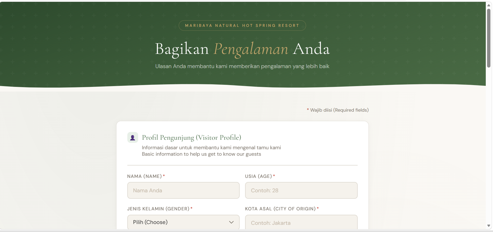

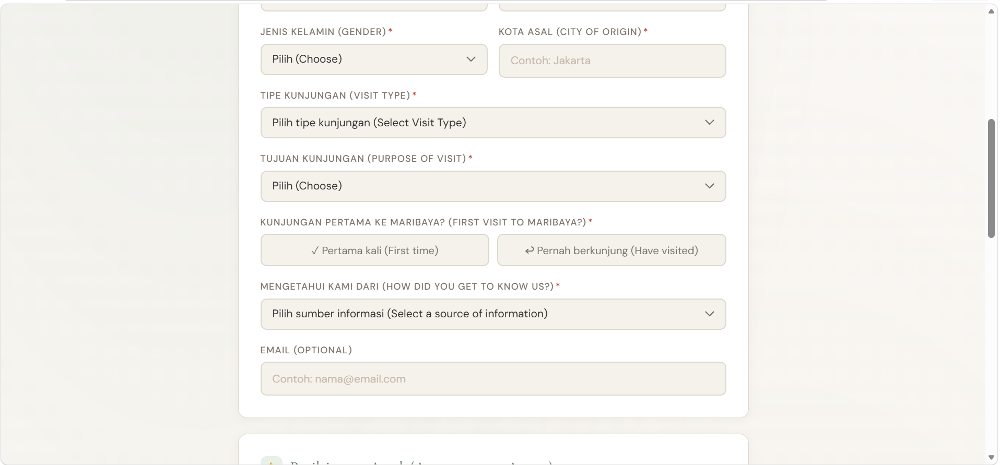

### 📊 Data & Analytical Views

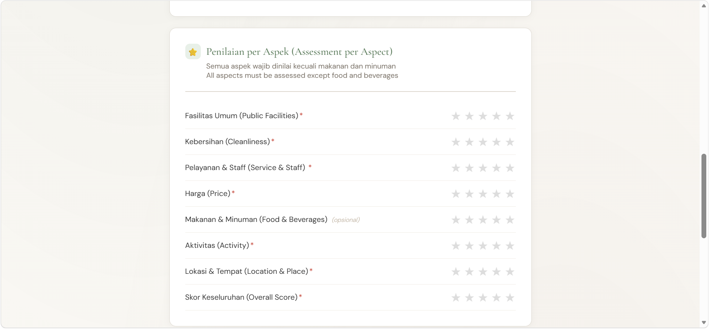

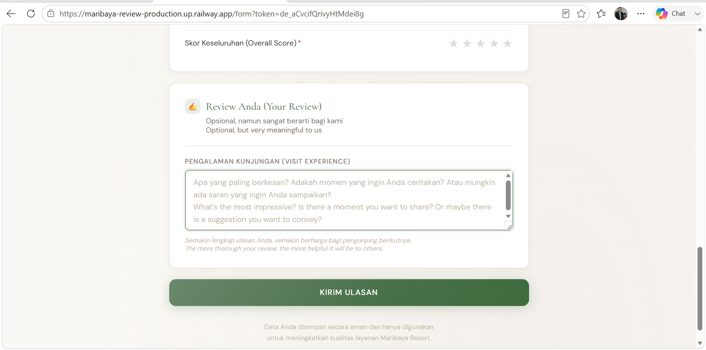

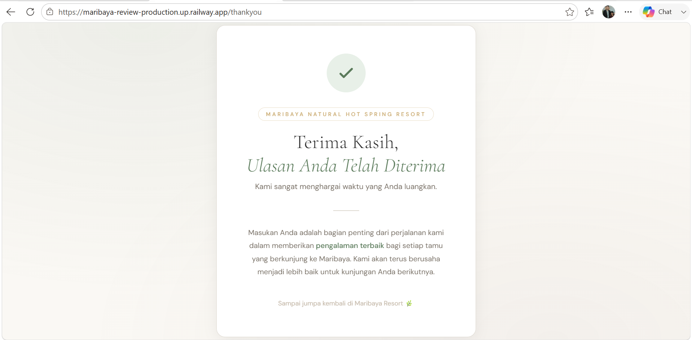

### 🧠 NLP / Aspect-Level Analysis

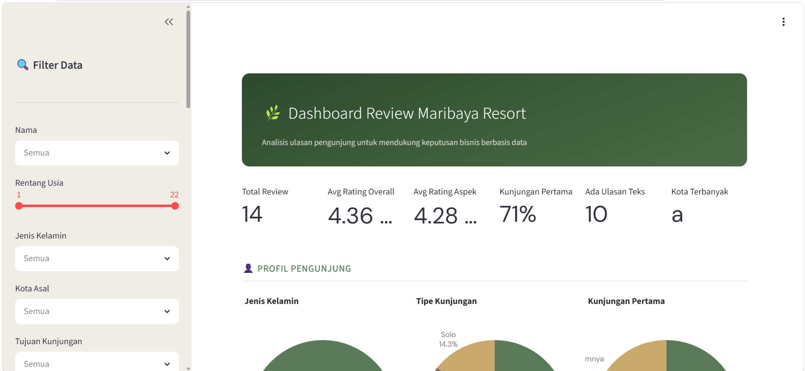

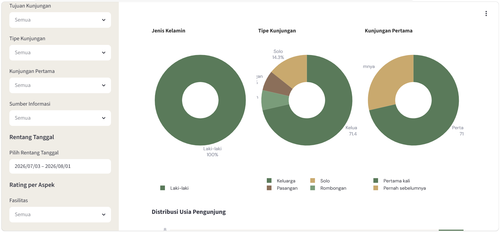

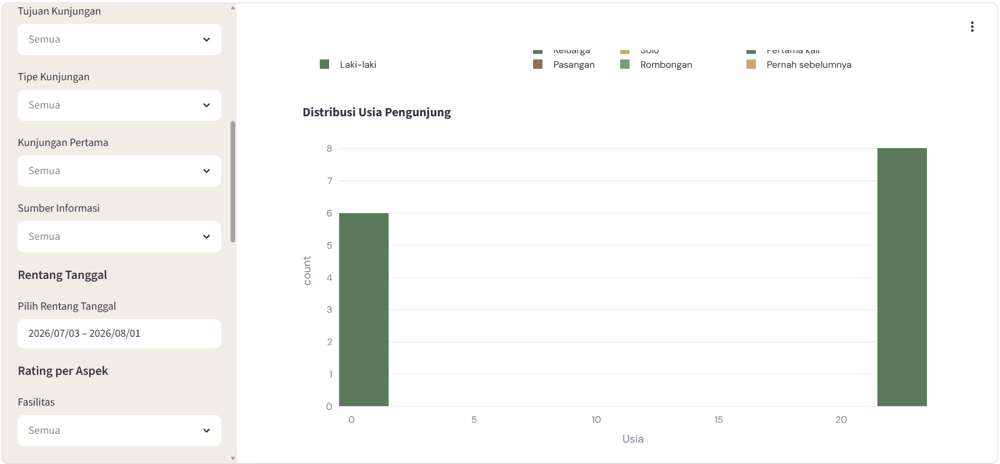

### 📈 Additional Project Views

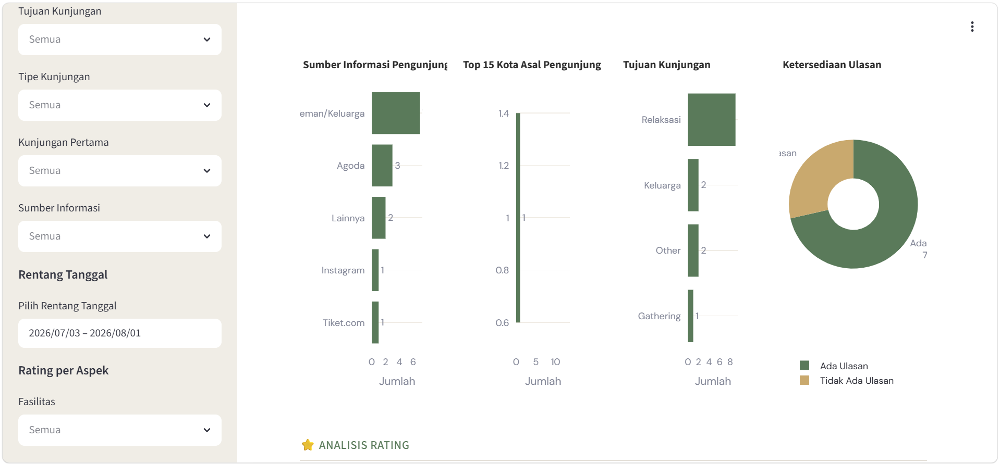

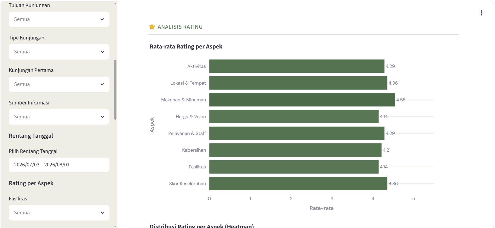

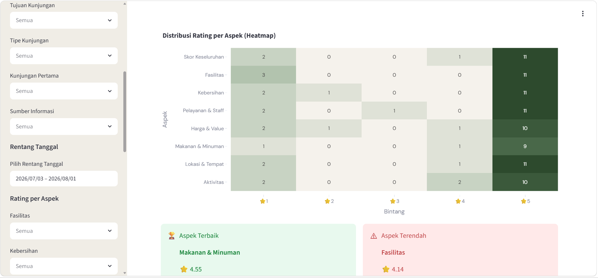

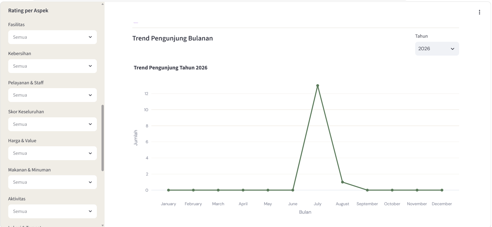

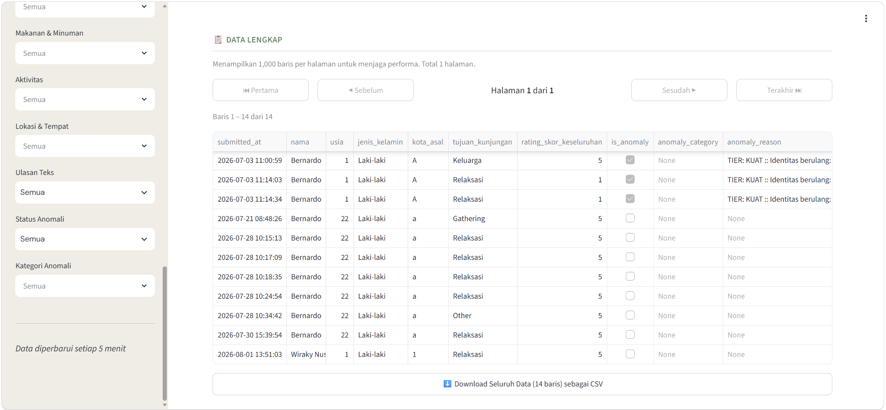

---

## 🔭 Future Development

The current foundation can be expanded into a broader **Customer Experience Intelligence platform**.

Potential directions include:

```text id="p6k4y7"
ASQE Extraction
      ↓
Aspect Aggregation
      ↓
Sentiment Trend Analysis
      ↓
Emerging Issue Detection
      ↓
Business-Outcome Correlation
      ↓
Customer Experience Dashboard
```

Further development could incorporate temporal analysis, topic discovery, business-impact modeling, and automated monitoring.

---

## 📄 License

This project is licensed under the **MIT License**. See the [`LICENSE`](LICENSE) file for the complete license text.

Third-party libraries, services, datasets, and external components remain subject to their respective licenses and terms.

---

<div class="contact-hero">

<p><strong>Interested in the project?</strong></p>

<p>
👨‍💻 <strong>Bernardo Nandaniar Sunia</strong><br/>
Bachelor of Computer Science — Diponegoro University<br/>
Former Data Analyst — PT Wiraky Nusa Telekomunikasi
</p>

<p>
<a href="https://linkedin.com/in/bernardo-sunia/">

</a>
<a href="https://mail.google.com/mail/?view=cm&fs=1&to=suniabernardo@gmail.com">

</a>
<a href="https://github.com/bers31">

</a>
<a href="https://bit.ly/bernardo-my_portfolio">

</a>
</p>

<p>
<em>Indonesian NLP · Aspect-Based Sentiment Analysis · Customer Experience Intelligence</em>
</p>

</div>