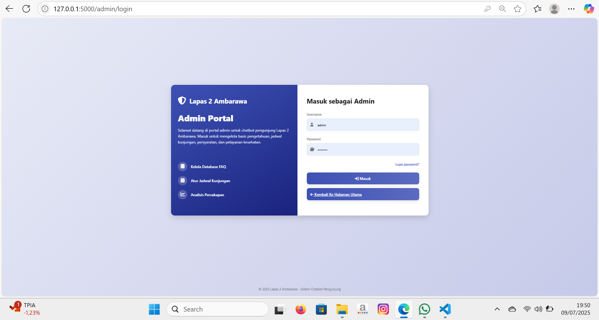
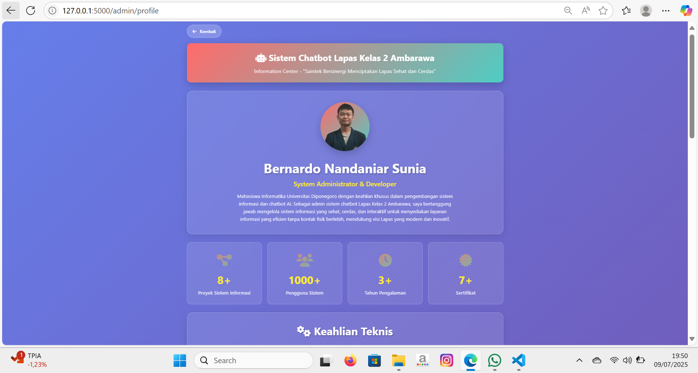
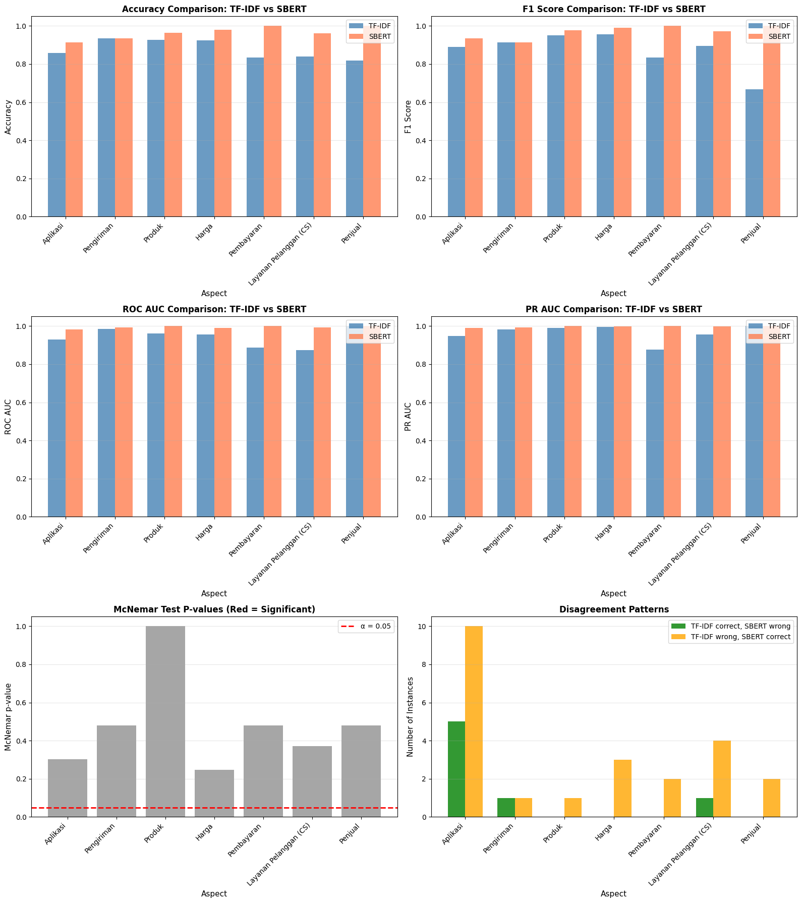
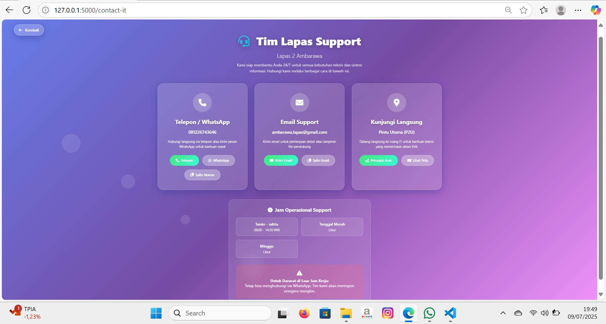
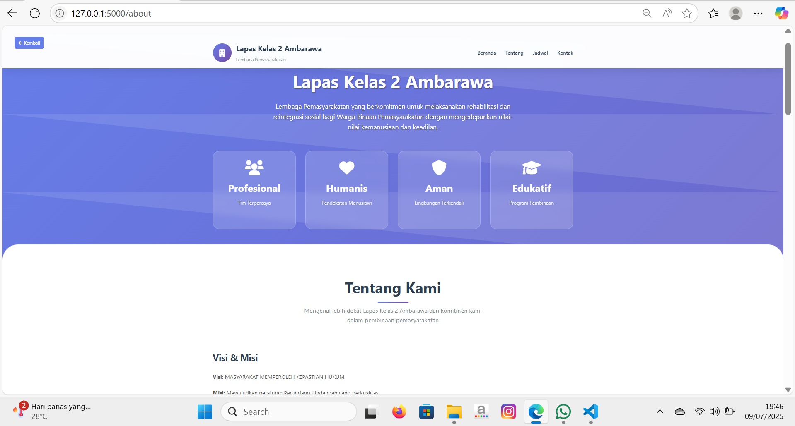
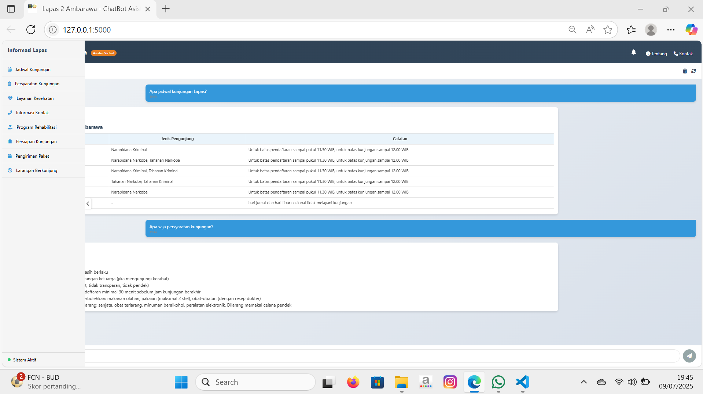

# Automated Information System Chatbot (Backend)

This repository encapsulates a production‑ready backend for an AI‑powered chatbot, designed to deliver accurate, context‑aware information through secure, scalable APIs.

## Project Description  
The backend orchestrates data ingestion, dialogue management, and notification workflows to serve as the “brain” of an intelligent information system. It harmonizes custom intent detection, OpenAI’s GPT‑3.5 engine, and structured FAQs into a seamless conversational experience.

### Key Features  
- **RESTful API Core**  
  - High‑throughput Flask endpoints for chat sessions, admin actions, and health checks  
  - Built‑in rate‑limiting (200/day, 50/hour) and CORS protection  

- **Unified Data Layer**  
  - Modular SQLite schema covering FAQs, schedules, services, users, and chat logs  
  - Automated migrations and seed data scripts for rapid environment setup  

- **AI‑Driven Dialogue Engine**  
  - Custom intent classifier with regex patterns and confidence thresholds  
  - Contextual prompt assembly for GPT‑3.5-turbo, with fallback flows for fallback FAQs  

- **Security & Governance**  
  - SHA-256 token generation/validation for admin and API access  
  - Role‑based access controls and activity logging for audit readiness  

- **Notification Subsystem**  
  - Email workflows via Flask‑Mail (password resets, alerts)  
  - Push notifications with pywebpush/VAPID and robust subscription management  

- **Analytics‑Ready Logging**  
  - Detailed chat history capture (timestamps, IPs, session IDs, quality scores)  
  - Hooks for real‑time monitoring and batch analytics  

---

## 🛠 Technologies Used  
| Layer               | Tools & Libraries                        |
|---------------------|------------------------------------------|
| Backend Framework   | Python, Flask, flask_limiter, Flask-Mail |
| Database            | SQLite, SQLAlchemy (or raw SQL)         |
| AI & NLP            | OpenAI GPT‑3.5‑turbo, regex, custom intent logic |
| Authentication      | SHA‑256 tokens, role‑based access control |
| Notifications       | pywebpush/VAPID, Flask‑Mail             |
| Logging & Monitoring| Python logging, structured JSON outputs  |

---

## 🔧 Installation & Setup  
1. **Clone the repository**  
   ```bash
   git clone https://github.com/yourusername/automated-chatbot-backend.git
   cd automated-chatbot-backend
2. **Create & activate virtual environment**:
   ```bash
   python3 -m venv venv
   source venv/bin/activate
3. **Install dependencies**:
   ```bash
   pip install -r requirements.txt
4. **Configure environmentl**:
   ```bash
   cp .env.example .env
5. **Initialize database**:
   ```bash
   python src/db_setup.py

## ▶️ Usage 
1. **Start the API server**  
   ```bash
   flask run --host=0.0.0.0 --port=5000
2. **Interact with chatbot**:
   ```bash
   POST /api/v1/chat/session with JSON payload { "message": "Your question here" }
   Use admin endpoints under /api/v1/admin/ to manage FAQs, schedules, and users
3. **Send notifications**:
   ```bash
   python src/notifications/send_push.py
   
### Screenshots







### Conclusion
This project delivers a full-spectrum AI‑driven chatbot solution, seamlessly blending intuitive front‑end interactions with a robust, scalable backend. From advanced NLP‑powered dialogue management and secure data handling to dynamic notification workflows and analytics‑ready logging, it empowers organizations to automate information delivery, elevate user engagement, and extract actionable insights. Ready for production deployment, this end‑to‑end chatbot architecture transforms how users access and interact with essential services and knowledge.
