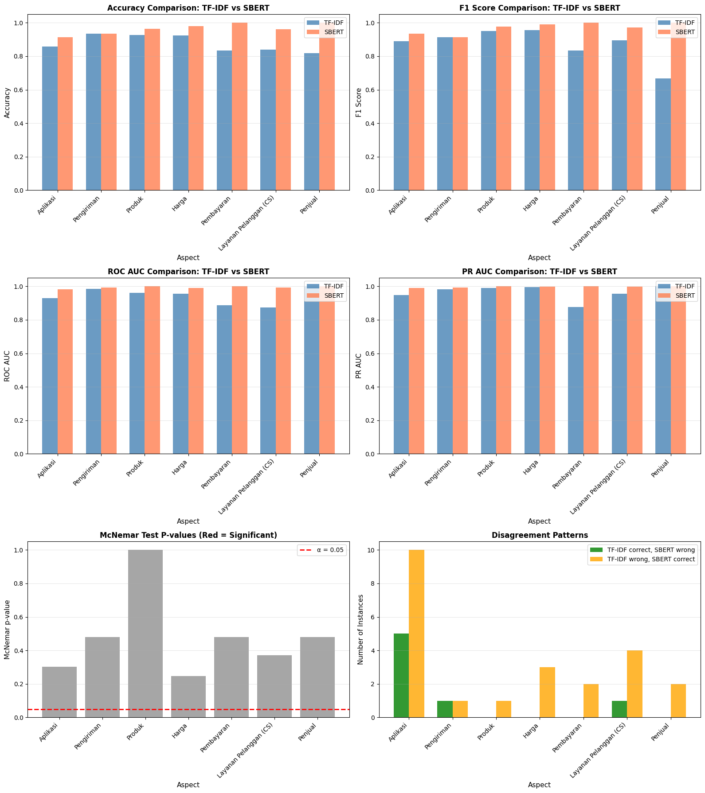
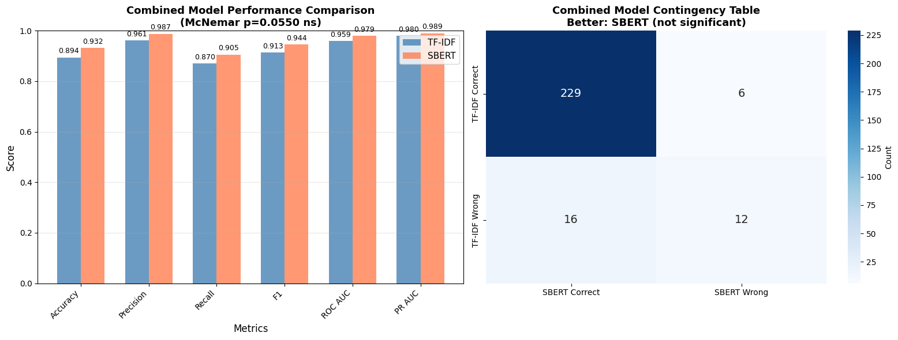
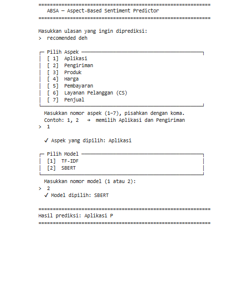

<div class="hero">

<h1>🏛️ Automated Information Center Chatbot for Class II Ambarawa Correctional Facility</h1>

<p>AI-Powered Information Service · Full-Stack Web Application · Secure Digital Communication</p>

<p>
  
  
  
  
  
  
</p>

<p>
A full-stack AI information platform designed to provide fast, structured,
and accessible information services for Lapas Kelas II Ambarawa.
</p>

</div>

---

## 📖 Project Overview

The **Automated Information Center Chatbot** is a full-stack web application developed for **Lapas Kelas II Ambarawa** to improve access to institutional information through an AI-assisted conversational interface.

The system combines a **Flask backend**, **HTML/CSS/JavaScript frontend**, **OpenAI GPT API**, **SQLite**, and **service-worker-based web functionality** to create a contact-free information channel for common inquiries.

The chatbot is designed to provide information related to:

* Visitation rules and procedures.
* Visiting schedules.
* Health services.
* Rehabilitation programs.
* Frequently asked questions.
* General institutional inquiries.
* Contact information.

The platform also includes a secure administrative dashboard so authorized staff can maintain chatbot content without modifying application source code.

> **Core objective:** transform static institutional information into an accessible conversational service while maintaining controlled administration, persistent data management, and operational visibility.

---

## 🎯 Problem & Solution

### The Problem

Information services in institutional environments can become inefficient when users must repeatedly contact staff for the same routine questions.

Common challenges include:

| Challenge                          | Impact                                                             |
| ---------------------------------- | ------------------------------------------------------------------ |
| Repetitive inquiries               | Increases administrative workload                                  |
| Static information sources         | Users may struggle to find the correct information                 |
| Manual content updates             | Changes require technical intervention                             |
| Limited accessibility              | Information is not always available through a convenient interface |
| Lack of interaction analytics      | Difficult to measure which information users request most          |
| Distributed communication channels | Inconsistent information delivery                                  |

### The Solution

The system introduces a centralized conversational information layer:

```text id="s3j8wv"
User
  ↓
Web Chat Interface
  ↓
Flask Application
  ↓
Intent / Context Processing
  ↓
OpenAI GPT API
  ↓
Context-Aware Response
  ↓
User
```

Administrative content is maintained separately through:

```text id="gk21qa"
Admin Dashboard
      ↓
Authentication
      ↓
CRUD Management
      ↓
SQLite Database
      ↓
Updated Information
      ↓
Chatbot Responses
```

---

## 🤖 AI Chatbot

### OpenAI GPT Integration

The chatbot integrates the OpenAI GPT API to generate natural-language responses based on custom application instructions and prompt design.

The system is designed to produce responses in **formal Bahasa Indonesia**, appropriate for an institutional information service.

### Custom Prompting & Intent Handling

The chatbot combines application-level logic with GPT-based language processing to:

* Interpret user intent.
* Provide context-aware responses.
* Guide users toward relevant institutional information.
* Handle general inquiries.
* Return fallback responses when a request falls outside the supported information scope.

Conceptually:

```text id="5z0f8e"
User Query
    ↓
Intent / Context Analysis
    ↓
Relevant Application Context
    ↓
Custom GPT Prompt
    ↓
Generated Response
    ↓
Response Validation / Fallback
    ↓
User
```

### Graceful Fallback

The application is designed to avoid presenting unsupported information as authoritative.

When a request falls outside the intended knowledge domain, the system can provide a controlled fallback response rather than pretending to have reliable information.

---

## 🔐 Security Architecture

Security is treated as a core application concern because the system operates in an institutional environment.

### Role-Based Administration

Authorized administrators have access to protected management functions while normal users are restricted to the information-service interface.

```text id="2qf1bb"
                    ┌───────────────────┐
                    │      User         │
                    │   Chat Interface  │
                    └─────────┬─────────┘
                              │
                              ↓
                    ┌───────────────────┐
                    │ Flask Application │
                    └─────────┬─────────┘
                              │
                ┌─────────────┴─────────────┐
                ↓                           ↓
       ┌─────────────────┐         ┌─────────────────┐
       │ Public Services │         │ Admin Services  │
       └─────────────────┘         └────────┬────────┘
                                            ↓
                                  Authentication /
                                  Authorization
```

### Authentication Controls

The administrative system includes:

* Login authentication.
* Session management.
* Role-based access control.
* Profile management.
* Password reset workflow.
* Salted password hashing.
* Brute-force protection.

The administrative login implements a **10-attempt protection limit** to reduce repeated unauthorized authentication attempts.

### Secure Session Handling

The application uses **HTTP-only session cookies** to reduce exposure of session credentials to client-side scripts.

### Rate Limiting

API and application interactions are rate-limited to reduce abusive request patterns.

Configured limits include:

```text id="k8st9p"
50 requests / hour
200 requests / day
```

### Additional Web Security

The application also incorporates security mechanisms and middleware such as:

* Werkzeug security utilities.
* Flask-CORS configuration.
* CSRF protection where applicable to protected workflows.
* Controlled administrative routes.
* Server-side validation and session handling.

> Security controls should be reviewed and adapted to the deployment environment, organizational policy, and applicable regulations before operational deployment.

---

## 📊 Administrative Dashboard

The system provides a dedicated administrative dashboard for authorized staff.

### 👤 User & Access Management

Administrators can manage account-related functions without directly interacting with the database.

### 💬 Conversation Monitoring

The dashboard can provide visibility into:

* Chat activity.
* Conversation history.
* Interaction patterns.
* AI response outcomes.

### 📝 Content Management

A key design objective is to allow **non-technical staff to update chatbot information without changing source code**.

Supported content areas include:

| Content Area           | Purpose                                   |
| ---------------------- | ----------------------------------------- |
| **FAQs**               | Maintain frequently requested information |
| **Visiting Schedules** | Update visitation-related schedules       |
| **Health Services**    | Maintain available service information    |
| **Contacts**           | Keep contact information current          |

This creates a separation between:

```text id="m7d2bp"
Application Code
      ≠
Operational Content
```

so that information can evolve without requiring code-level modification.

---

## 🗄️ Data Management

SQLite is used as the application's persistent data layer.

### Core Data Operations

The application supports CRUD-oriented management for administrative entities.

```text id="fj25g7"
Create
  ↓
Read
  ↓
Update
  ↓
Delete
```

### Database Initialization

Database initialization scripts are included to simplify application setup and provide a predictable starting state.

### Operational Logging

Chat interactions can be logged to support:

* Conversation monitoring.
* Response analysis.
* Usage analytics.
* Service effectiveness measurement.

---

## 📈 Data-Driven Analytics

The application goes beyond basic chatbot interaction by capturing operational signals from user conversations.

### Chat History

Interaction logs provide a record of chatbot activity that can be analyzed to understand recurring information needs.

### AI Response Success Tracking

The system tracks AI response outcomes to help assess how effectively the chatbot serves user requests.

### Interaction Visualization

Interaction metrics can be visualized to help leadership identify:

* Frequently requested information.
* Usage patterns.
* Response effectiveness.
* Opportunities for service improvement.

The analytics layer can therefore be represented as:

```text id="v8xmyr"
User Conversations
       ↓
Interaction Logs
       ↓
Metric Aggregation
       ↓
Visualization
       ↓
Operational Insight
```

---

## 📧 Communication Features

### Password Reset via Email

**Flask-Mail** is used to support email-based password reset workflows for administrative accounts.

### 🔔 Web Push Notifications

The application uses **pywebpush + VAPID** to support web push notification functionality.

This can be used for:

* Important alerts.
* Administrative updates.
* User-facing notifications.
* Real-time service announcements.

### 📱 Responsive User Experience

The frontend is designed to provide a consistent interaction model across desktop and mobile devices.

---

## 📱 Progressive Web App

The frontend incorporates **service workers** to improve availability and performance.

### Service Worker Capabilities

The application uses service-worker-based caching to support:

* Static asset caching.
* Improved repeat-load performance.
* Offline-capable access to cached resources.
* App-like web behavior.

### PWA Architecture

```text id="vp4rjg"
Browser
   ↓
Web Application
   ↓
Service Worker
   ├── Cache Management
   ├── Asset Retrieval
   └── Offline Fallback
```

The offline capability applies to resources that have been cached and should not be interpreted as unrestricted offline access to AI-generated responses or server-side functionality.

---

## 🏗️ System Architecture

The complete system can be viewed as four major layers.

### Frontend Layer

```text id="d1x6f3"
HTML5
CSS3
JavaScript (ES6)
Service Worker
PWA Manifest
```

Responsibilities:

* Chat interface.
* Administrative interface.
* Client-side validation.
* Responsive user experience.
* Service-worker integration.

### Application Layer

```text id="7q3fzm"
Flask
├── Route handling
├── Authentication
├── Session management
├── Business logic
├── API endpoints
└── Security middleware
```

### AI & Communication Layer

```text id="l2t8va"
OpenAI GPT API
Flask-Mail
pywebpush
VAPID
```

Responsibilities:

* Natural-language generation.
* Email delivery.
* Password reset workflow.
* Push notifications.

### Persistence Layer

```text id="e5w8o1"
SQLite
├── Users
├── FAQs
├── Schedules
├── Health Services
├── Contacts
├── Messages
└── Chat Logs
```

---

## 🔄 End-to-End Request Flow

A typical chatbot request follows this process:

```text id="q5y8j6"
┌──────────────────┐
│    User Query    │
└────────┬─────────┘
         ↓
┌──────────────────┐
│   Chat Frontend  │
└────────┬─────────┘
         ↓
┌──────────────────┐
│ Flask API Route  │
└────────┬─────────┘
         ↓
┌──────────────────┐
│ Context / Intent │
│    Processing    │
└────────┬─────────┘
         ↓
┌──────────────────┐
│ OpenAI GPT API   │
└────────┬─────────┘
         ↓
┌──────────────────┐
│ Response Handling│
└────────┬─────────┘
         ↓
┌──────────────────┐
│ User Response    │
└────────┬─────────┘
         ↓
┌──────────────────┐
│ Interaction Log  │
└──────────────────┘
```

---

## 🛠️ Technology Stack

| Layer                  | Technology                                | Purpose                                         |
| ---------------------- | ----------------------------------------- | ----------------------------------------------- |
| 🐍 **Backend**         | **Python**                                | Core application logic                          |
| 🌐 **Web Framework**   | **Flask**                                 | HTTP routing and application services           |
| 🤖 **AI**              | **OpenAI GPT API**                        | Natural-language understanding and generation   |
| 🗄️ **Database**       | **SQLite**                                | Persistent application data                     |
| 🎨 **Frontend**        | **HTML5 / CSS3 / JavaScript ES6**         | User and admin interfaces                       |
| 📱 **Web Platform**    | **Service Worker / PWA**                  | Caching and enhanced web experience             |
| 🔐 **Security**        | **Werkzeug / Flask-CORS / rate limiting** | Authentication and request protection           |
| 📧 **Email**           | **Flask-Mail**                            | Password reset and email communication          |
| 🔔 **Push**            | **pywebpush + VAPID**                     | Web Push notification delivery                  |
| 📊 **Analytics**       | **Plotly Express**                        | Interaction and service analytics visualization |
| 🔧 **Version Control** | **Git / GitHub**                          | Source management                               |

---

## 📦 Core Dependencies

The original project dependency baseline includes:

```txt id="xk9w3f"
Flask==2.3.0
Flask-Mail==0.9.1
Flask-Limiter==3.5.0
Flask-CORS==4.0.0
openai==0.28.0
pywebpush==1.14.0
Werkzeug==2.3.0
```

Additional dependencies may exist depending on the final application modules, database setup, testing utilities, or visualization components.

> Dependency versions should be treated as the project's historical environment specification. Updating them for a new deployment should be accompanied by compatibility testing.

---

## 🚀 Getting Started

### Prerequisites

* Python 3.8 or newer.
* Git.
* OpenAI API credentials.
* SMTP credentials for email-based workflows.
* Optional Docker installation for containerized execution.

### Clone the Repository

```bash id="z1g4j8"
git clone https://github.com/bers31/bernardo.github.io.git
cd bernardo.github.io
```

### Create a Virtual Environment

macOS / Linux:

```bash id="2gmx7j"
python -m venv prison_chatbot_env
source prison_chatbot_env/bin/activate
```

Windows:

```bash id="0g4z4f"
python -m venv prison_chatbot_env
prison_chatbot_env\Scripts\activate
```

### Install Dependencies

```bash id="knc8j0"
pip install -r requirements.txt
```

### Configure Environment Variables

Create a local `.env` file based on the project's environment configuration:

```env id="h3gxvt"
OPENAI_API_KEY=your_openai_api_key

SMTP_SERVER=your_smtp_server
SMTP_USERNAME=your_email
SMTP_PASSWORD=your_password
```

Never commit credentials or secrets to version control.

### Initialize the Database

If the project structure exposes the database initialization function:

```bash id="2bj0q9"
python -c "from backend import init_db; init_db()"
```

### Run the Application

```bash id="twx8d2"
python backend.py
```

Then access the local application through the configured Flask host and port.

---

## 🐳 Docker

For environments where Docker configuration is available:

```bash id="k7aqt2"
docker build -t prison-chatbot .
```

Run the container:

```bash id="6c4q9n"
docker run -p 5000:5000 --env-file .env prison-chatbot
```

Docker provides a more reproducible application environment by packaging the application and its runtime dependencies together.

---

## 🌐 Application Endpoints

A typical local deployment may expose:

| Interface        | Example                                  |
| ---------------- | ---------------------------------------- |
| Main Application | `http://localhost:5000`                  |
| Admin Login      | `http://localhost:5000/admin_login.html` |
| API              | `http://localhost:5000/api/`             |

The actual endpoints may differ according to the active Flask route configuration.

---

## 🧪 Testing

The original project structure anticipates automated testing through `pytest`.

Example commands:

```bash id="w85z9e"
python -m pytest tests/
```

Coverage:

```bash id="7g75jm"
python -m pytest --cov=backend tests/
```

Integration tests:

```bash id="g2j17s"
python -m pytest tests/integration/
```

Performance tests:

```bash id="w7o4m5"
python -m pytest tests/performance/
```

These commands assume that the corresponding test directories and test suites are present in the repository.

---

## 📊 Project Scope

This project combines AI, web development, security, data management, and analytics into a single institutional information platform.

| Module                           | Description                                                       | Status        |
| -------------------------------- | ----------------------------------------------------------------- | ------------- |
| 🤖 **AI Chatbot**                | GPT-powered conversational information service                    | ✅ Implemented |
| 🧠 **Intent / Context Handling** | Context-aware response generation and fallback behavior           | ✅ Implemented |
| 🔐 **Admin Authentication**      | Login, profile, reset, role-based access                          | ✅ Implemented |
| 🛡️ **Security Controls**        | Password hashing, brute-force protection, sessions, rate limiting | ✅ Implemented |
| 📊 **Admin Dashboard**           | Conversation monitoring and management                            | ✅ Implemented |
| 📝 **FAQ Management**            | CRUD content management                                           | ✅ Implemented |
| 📅 **Visitation Schedule**       | CRUD schedule management                                          | ✅ Implemented |
| 🏥 **Health Services**           | CRUD institutional health information                             | ✅ Implemented |
| 📞 **Contacts**                  | CRUD contact information                                          | ✅ Implemented |
| 📧 **Email Workflows**           | Password reset and email notification                             | ✅ Implemented |
| 🔔 **Push Notifications**        | Web Push using pywebpush + VAPID                                  | ✅ Implemented |
| 📱 **Service Worker**            | Caching and offline-capable web resources                         | ✅ Implemented |
| 🗄️ **SQLite**                   | Persistent application data                                       | ✅ Implemented |
| 📈 **Analytics**                 | Chat logging and interaction visualization                        | ✅ Implemented |

---

## 📈 Operational Analytics

The project's analytics layer is designed to transform raw interaction logs into operational information.

Potential indicators include:

| Indicator                   | Purpose                              |
| --------------------------- | ------------------------------------ |
| Chat volume                 | Understand service usage             |
| Frequently requested topics | Identify common information needs    |
| AI response success         | Monitor response effectiveness       |
| Conversation patterns       | Understand user interaction behavior |
| Time-based activity         | Identify changes in service demand   |

The resulting workflow is:

```text id="z3r1fd"
Chat Activity
     ↓
Structured Logs
     ↓
Metrics
     ↓
Visualization
     ↓
Service Improvement
```

This creates a feedback loop between the information service and its operational effectiveness.

---

## 🎥 Demo

### 🖥️ Live Portfolio Presentation

<div align="center">

<p>
<strong>Automated Information Center Chatbot</strong>
</p>

<p>
<a href="https://bers31.github.io/bernardo.github.io/Automated_Information_System_Chatbot/">
<strong>🔗 Visit Project Demo</strong>
</a>
</p>

</div>

### 📸 Interface Preview


*User-facing conversational information interface.*


*Protected authentication gateway for administrators.*



*Administrative monitoring and management interface.*

---

## 📱 Progressive Web App Features

### ⚡ Responsive Interface

The frontend is designed to adapt to different screen sizes for desktop and mobile access.

### 💾 Service-Worker Caching

Static resources can be cached to reduce repeated loading overhead and provide better resilience when connectivity is temporarily unavailable.

### 🔔 Push Notifications

The application supports web push through **pywebpush and VAPID**.

### 📲 Installable Web Experience

The PWA architecture allows the web application to behave more like an installable application on supported browsers and devices.

---

## 🧭 Deployment Context

The application was designed with the **Lapas_Ambarawa_3 network environment** in mind.

Because the system deals with an institutional environment and potentially sensitive information, deployment should consider:

* Network isolation.
* Secret management.
* HTTPS.
* Access control.
* Database protection.
* Logging and audit requirements.
* Organizational security policies.
* Applicable data-protection and institutional regulations.

> The public portfolio presentation does not expose internal credentials, proprietary operational data, or deployment secrets.

---

## 💼 Professional Impact

This project demonstrates the combination of software engineering and AI capabilities required to move an institutional information workflow from a purely manual model toward a digital service.

### Before

```text
User Question
      ↓
Manual Staff Response
      ↓
Repeated Work
```

### With the System

```text
User Question
      ↓
AI Information Service
      ↓
Immediate Response
      ↓
Interaction Logging
      ↓
Analytics & Improvement
```

The administrative layer further enables non-technical staff to maintain operational information without modifying application code.

---

## 🧠 Engineering Highlights

### Full-Stack Development

The application spans the complete web stack:

```text id="b5n2aq"
HTML5
  +
CSS3
  +
JavaScript ES6
  +
Flask
  +
SQLite
  +
OpenAI GPT
```

### Secure Administration

The project combines authentication, authorization, password hashing, session management, brute-force protection, and rate limiting in a single administrative workflow.

### AI + Business Logic

Rather than exposing a raw language model directly to users, the application places GPT behind application-specific context, prompts, and fallback handling.

### Editable Knowledge Layer

The CRUD administration system creates a maintainable information layer that can change independently from the application code.

### Analytics-Ready Architecture

Conversation logging provides the foundation for monitoring usage and improving the information service based on real interaction patterns.

---

## 🔭 Future Development

Potential extensions include:

* More structured knowledge grounding for institutional information.
* Retrieval-Augmented Generation (RAG) for controlled document-based responses.
* Improved intent classification.
* Expanded multilingual support.
* More advanced analytics dashboards.
* Audit trails for administrative content changes.
* More granular role and permission management.
* Monitoring and alerting for abnormal request patterns.
* Expanded service-worker strategies for network resilience.

These represent future enhancement directions and should not be interpreted as existing production features.

---

## 🔐 Security & Privacy Notice

This project was developed for an environment where information security and responsible data handling are important considerations.

The public repository should **not** contain:

* API keys.
* SMTP credentials.
* Private signing keys.
* Real user passwords.
* Internal authentication data.
* Confidential chat logs.
* Proprietary institutional data.
* Sensitive production configuration.

All secrets should be supplied through environment variables or an equivalent secure secret-management mechanism.

> **Important:** The portfolio repository documents the technical implementation and architecture. It does not authorize redistribution of confidential institutional information.

---

## 📄 Project Ownership

This system was developed as an academic/project implementation related to **Lapas Kelas II Ambarawa** at **Diponegoro University**, and is presented here as a professional portfolio case study.

The portfolio documentation describes the technical architecture and capabilities of the project without exposing confidential operational information.

Ownership and reuse of institutional data, deployment configuration, credentials, and other non-public materials remain subject to the relevant organizational agreements and policies.

---

## 📄 License

The original source code and documentation intentionally published in this repository are licensed under the **MIT License**, unless otherwise specified.

See [`LICENSE`](LICENSE) for the complete license text.

> **Important:** The MIT License applies to the publicly released source code and documentation. It does **not** grant permission to use or redistribute confidential institutional data, credentials, user information, production secrets, internal deployment configurations, or other proprietary materials belonging to Lapas Kelas II Ambarawa, Diponegoro University, or other third parties.

Third-party dependencies, libraries, APIs, and external services remain subject to their own licenses and terms.

---

<div class="contact-hero">

<p><strong>Interested in the project?</strong></p>

<p>
👨‍💻 <strong>Bernardo Nandaniar Sunia</strong><br/>
Bachelor of Computer Science — Diponegoro University<br/>
Full-Stack AI & Data Applications
</p>

<p>
<a href="https://linkedin.com/in/bernardo-sunia/">

</a>
<a href="https://mail.google.com/mail/?view=cm&fs=1&to=suniabernardo@gmail.com">

</a>
<a href="https://github.com/bers31">

</a>
<a href="https://bit.ly/bernardo-my_portfolio">

</a>
</p>

<p>
<em>AI automation · Full-stack engineering · Secure information systems · Data-driven service improvement</em>
</p>

</div>

---

## 📸 Full Screenshots







---

## 📌 Conclusion

The **Automated Information Center Chatbot for Class II Ambarawa Correctional Facility** demonstrates an end-to-end approach to building an institutional AI information service.

The project combines **Flask, Python, HTML/CSS/JavaScript, SQLite, OpenAI GPT, service workers, Web Push, email workflows, authentication, rate limiting, CRUD administration, and interaction analytics** into a unified platform.

Its most important architectural contribution is the separation between the **AI conversation layer** and the **maintainable institutional knowledge layer**, allowing authorized staff to update FAQs, visitation schedules, health services, and contact information without modifying application code.

The resulting system establishes a practical foundation for delivering faster information access, reducing repetitive communication workload, and using interaction data to continuously improve digital service effectiveness.