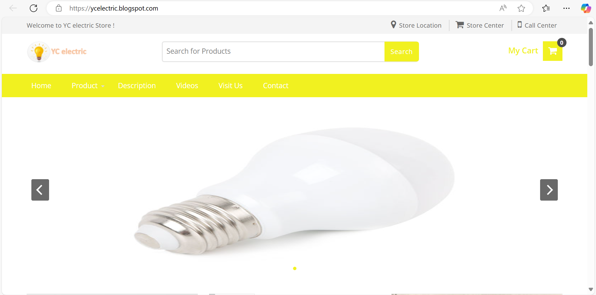
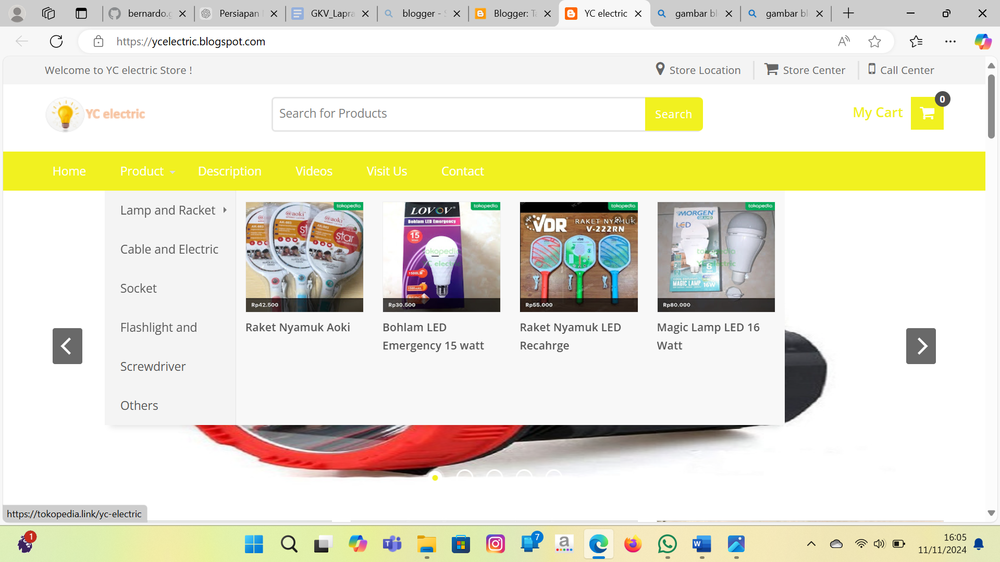
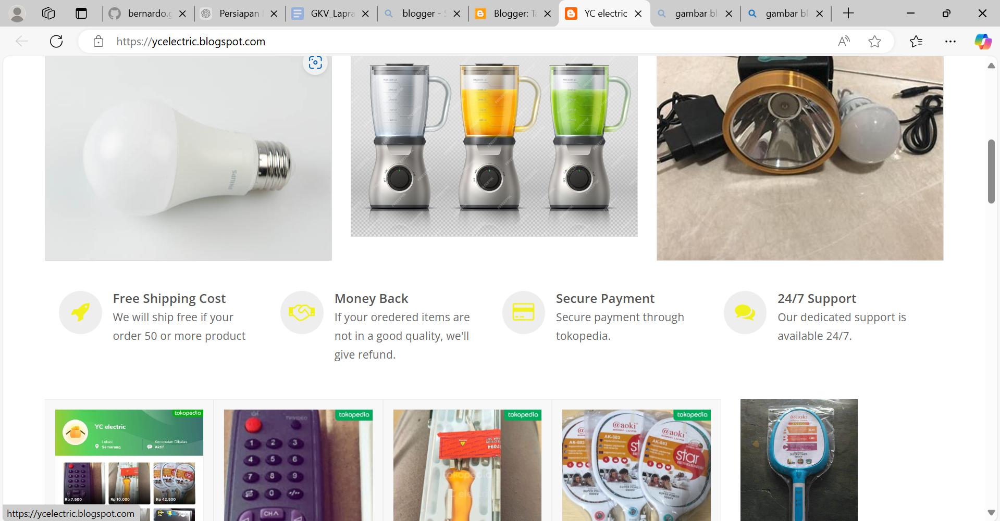
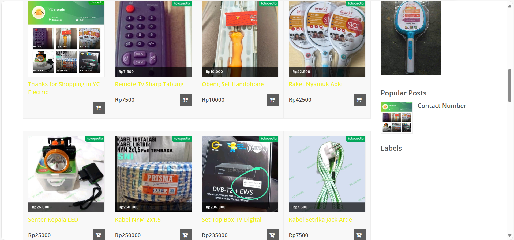
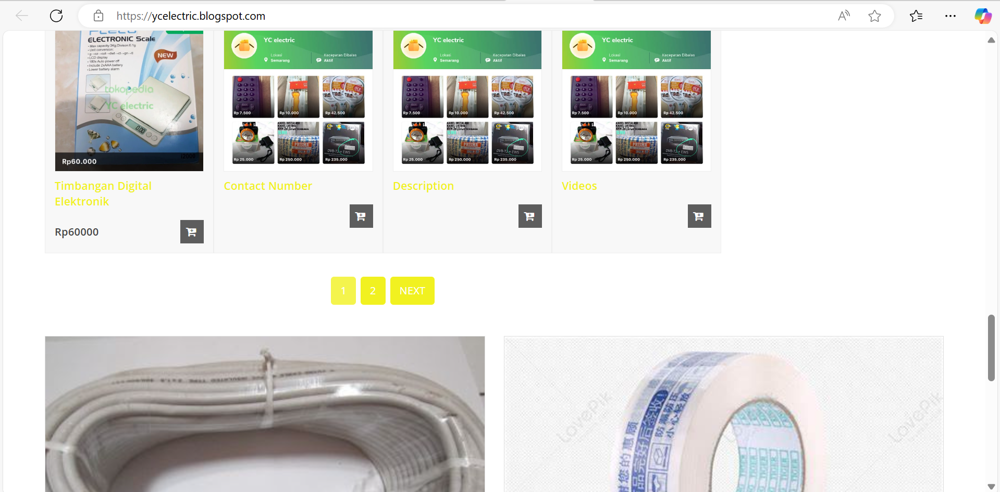

#  YC Electric - Premium Blogger Theme for Electronics Store

> **A modern, responsive, and SEO-optimized Blogger template designed specifically for electronics retail businesses**

---

<!-- Badges Section -->
<p align="center">
  
  
  
  
  
</p>

---

##  **About This Project**

**YC Electric** is a cutting-edge, open-source Blogger theme crafted specifically for electronics retailers and tech enthusiasts. Born from the vision of creating the perfect e-commerce experience on Blogger platform, this theme combines modern design aesthetics with powerful functionality to deliver an exceptional online shopping experience.

**Why YC Electric?**
- 🎯 **Purpose-Built**: Designed exclusively for electronics and tech product showcases
- 🚀 **Performance-First**: Optimized for lightning-fast loading times and smooth user experience
- 📱 **Mobile-Responsive**: Flawless performance across all devices and screen sizes
- 🔍 **SEO-Ready**: Built-in Schema.org markup and meta optimization for better search rankings

---

## 🚀 Key Features

### 🎨 Design & UI/UX
- Modern, clean interface optimized for electronics retail
- Fully responsive design (Mobile-first approach) 
- Customizable color schemes and branding
- Professional product showcase layouts
- Interactive mega menu navigation

### 🛒 E-commerce Capabilities  
- Integrated SimpleCart.js shopping cart system
- PayPal payment integration
- Product categorization and filtering
- Promotional banner spaces
- Call-to-action optimization

### ⚡ Performance & SEO
- Lightning-fast loading times
- JSON-LD Schema.org implementation  
- Open Graph meta tags for social sharing
- Google Fonts integration (Open Sans)
- Font Awesome 4.7.0 icon library

### 🔧 Customization & Features
- Blogger variable-based theming system
- Widget-ready sidebar and footer areas
- Image slider with navigation controls
- Popular posts and label cloud widgets
- Multi-language support ready

---

## 🛠️ Technology Stack

| Category | Technology | Version | Purpose |
|----------|------------|---------|---------|
| **Platform** |  | Latest | Content Management |
| **Markup** |  | 5.0 | Structure & Semantics |
| **Styling** |  | 3.0 | Responsive Design |
| **Scripting** |  | ES5+ | Interactivity |
| **Library** |  | 1.8.2 | DOM Manipulation |
| **Icons** |  | 4.7.0 | UI Icons |
| **Fonts** |  | Open Sans | Typography |
| **Cart** |  | MIT License | Shopping Cart |

---

## 🚀 **Installation & Setup**

### **Prerequisites**
- Active Blogger/Blogspot account
- Basic understanding of Blogger dashboard
- FTP access (optional, for custom assets)

### **Step-by-Step Installation**

```bash
# 1. Download the theme
git clone https://github.com/bers31/bernardo.github.io.git
cd bernardo.github.io

# 2. Locate the theme file
# File: yc-electric-theme.xml
```

```xml
<!-- 3. Blogger Installation Steps -->
1. Login to your Blogger Dashboard
2. Navigate to "Theme" → "Edit HTML"
3. Click "Upload" and select "yc-electric-theme.xml"
4. Click "Save theme"
5. Configure theme options in "Layout" section
```

### **Configuration**

```javascript
// Theme Options Configuration
{
  "paymentOption": "paypal",
  "paypalMail": "your-paypal@email.com",
  "currencyOption": "USD",
  "mainColor": "#007bff",
  "bodyBackground": "#ffffff"
}
```

---

## 🎥 Demo & Screenshots

### 🌐 Live Demo
[](https://bers31.github.io/bernardo.github.io/Custom_E_Commerce_Website/)

### 📸 Preview


---

## 🏗️ **Project Architecture**

```
YC Electric Theme Structure
│
├── 📁 Core Components
│   ├── 🎨 CSS Variables & Styling
│   ├── 🔧 JavaScript Functions
│   ├── 🏷️ Blogger Widget Integration
│   └── 📱 Responsive Media Queries
│
├── 📁 Features
│   ├── 🛒 Shopping Cart System
│   ├── 🎠 Image Slider Component
│   ├── 🧭 Navigation Menu System
│   └── 🔍 Search Functionality
│
├── 📁 SEO & Performance
│   ├── 🏷️ JSON-LD Schema Markup
│   ├── 📊 Open Graph Meta Tags
│   ├── ⚡ Optimized Loading
│   └── 📱 Mobile-First Design
│
└── 📁 Customization
    ├── 🎨 Theme Variables
    ├── 🔧 Widget Configuration
    ├── 🌐 Multi-language Ready
    └── 📊 Analytics Integration
```

---

## 📋 Project Roadmap

| Phase | Milestone | Features | Target Date | Status |
|-------|-----------|----------|-------------|---------|
| **1** | **Foundation** | Core Theme Structure, Basic Styling | Q1 2024 | ✅ Completed |
| **2** | **E-Commerce** | Shopping Cart Integration, PayPal Support | Q2 2024 | ✅ Completed |
| **3** | **SEO & Performance** | SEO Optimization, Schema Markup | Q3 2024 | ✅ Completed |
| **4** | **Customization** | Advanced Customization Options | Q4 2024 | 🚧 In Progress |
| **5** | **Analytics** | Premium Features, Analytics Dashboard | Q1 2025 | 📋 Planned |
| **6** | **Internationalization** | Multi-language Support, RTL Layout | Q2 2025 | 📋 Planned |

### 🎯 Current Focus (Phase 4)
- [ ] Theme customizer panel
- [ ] Advanced color scheme options
- [ ] Custom widget configurations
- [ ] Enhanced mobile responsiveness
- [ ] Performance optimization

### 🔮 Upcoming Features (Phase 5)
- [ ] Google Analytics integration
- [ ] Sales dashboard
- [ ] Inventory management
- [ ] Customer reviews system
- [ ] Advanced search functionality

---

## 🤝 **Contributing**

We welcome contributions from the community! Here's how you can help improve YC Electric:

### **Ways to Contribute**
- 🐛 **Bug Reports**: Found an issue? Please report it!
- 💡 **Feature Requests**: Have an idea? We'd love to hear it!
- 🔧 **Code Contributions**: Submit PRs for improvements
- 📖 **Documentation**: Help improve our docs
- 🎨 **Design**: Contribute UI/UX improvements

### **Development Setup**
```bash
# Fork the repository
git clone https://github.com/your-username/bernardo.github.io.git

# Create a feature branch
git checkout -b feature/amazing-feature

# Make your changes and commit
git commit -m "Add amazing feature"

# Push to your fork and submit a PR
git push origin feature/amazing-feature
```

### **Contribution Guidelines**
1. Follow existing code style and conventions
2. Test your changes thoroughly
3. Update documentation as needed
4. Write clear, descriptive commit messages

---

## 📄 **License**

This project is licensed under the **MIT License** - see the [LICENSE](LICENSE) file for details.

```
MIT License

Copyright (c) 2024 Bernardo - Universitas Diponegoro

Permission is hereby granted, free of charge, to any person obtaining a copy
of this software and associated documentation files (the "Software"), to deal
in the Software without restriction, including without limitation the rights
to use, copy, modify, merge, publish, distribute, sublicense, and/or sell
copies of the Software, subject to the following conditions:

The above copyright notice and this permission notice shall be included in all
copies or substantial portions of the Software.
```

## 📫 Contact & Connect

<p align="center">
<strong>👨‍💻 Bernardo - Computer Science Student</strong><br/>
Universitas Diponegoro 🎓
</p>

<p align="center">
<a href="https://linkedin.com/in/bernardo-sunia/">

</a>
<a href="https://mail.google.com/mail/?view=cm&fs=1&to=suniabernardo@gmail.com">

</a>
<a href="https://github.com/bers31">

</a>
<a href="https://bit.ly/bernardo-my_portfolio">

</a>
</p>

<p align="center">
⭐ <strong>If you found this project helpful, please give it a star!</strong> ⭐
</p>

<p align="center">
<em>Made with ❤️ by <a href="https://github.com/bers31">Bernardo</a> at Universitas Diponegoro</em><br/>

</p>

---

### Screenshots







## Conclusion
This project demonstrates the development of a functional e-commerce website using Blogger, HTML, CSS, JavaScript, and MySQL, providing a practical solution for small businesses to manage their online sales efficiently.
