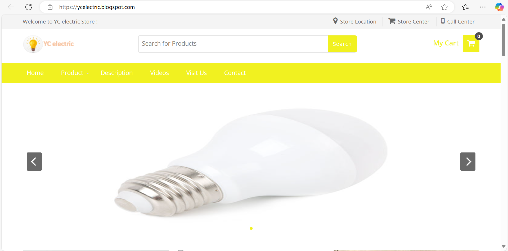
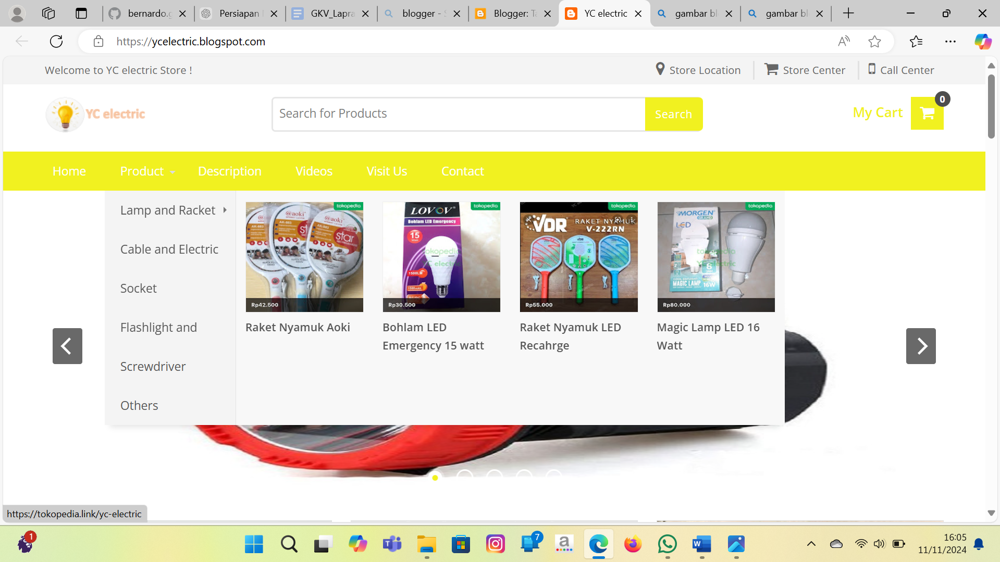
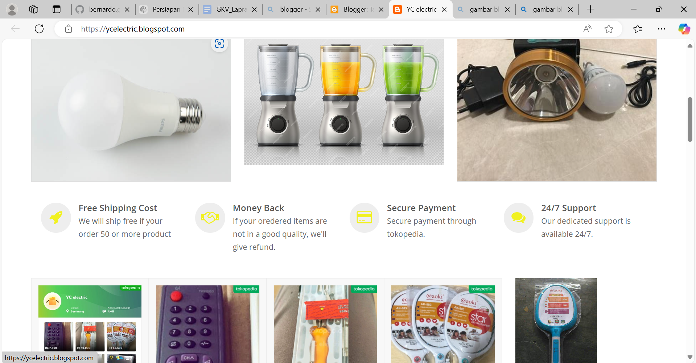
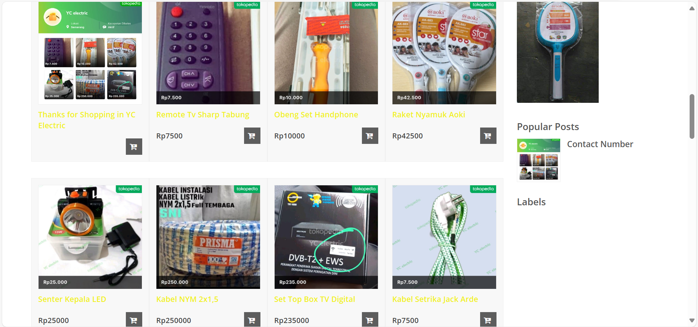
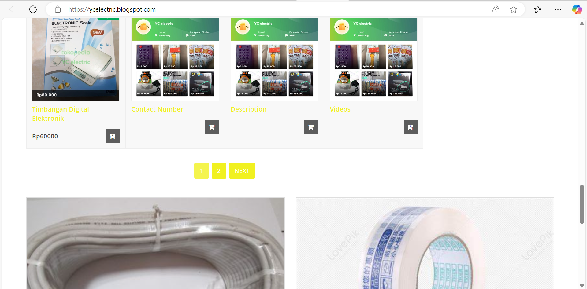
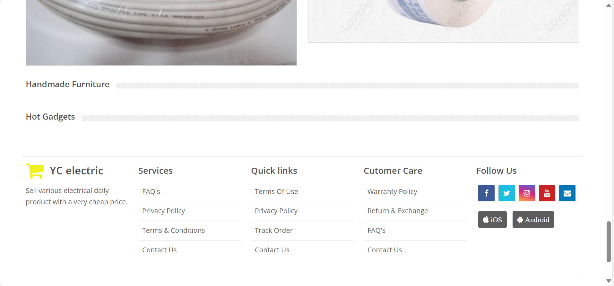

<div class="hero">

<h1>🛍️ YC Electric — Custom E-Commerce Website</h1>

<p>Electronics Retail · Responsive Web Experience · Data-Driven E-Commerce Development</p>

<p>
  
  
  
  
  
  
</p>

<p>
A custom electronics e-commerce solution designed around responsive UX,
product discovery, shopping-cart workflows, checkout, SEO, performance,
and data-driven optimization.
</p>

</div>

---

## 📖 Project Overview

**YC Electric** is a custom e-commerce website developed for an electronics retail use case.

The project focuses on building a practical online shopping experience that combines:

```text id="7f3n2a"
Product Catalog
      ↓
Product Discovery
      ↓
Shopping Cart
      ↓
Checkout
      ↓
Transaction Processing
      ↓
Customer Experience
```

The application was designed with **HTML, CSS, JavaScript, and MySQL** and emphasizes responsive design, usability, performance, SEO, and data-driven iteration.

The project grew beyond a visual storefront by incorporating user behavior considerations, database-backed product and transaction management, and experimentation on key conversion flows.

> **Portfolio focus:** This project demonstrates practical full-stack web development, e-commerce architecture, database management, responsive UI/UX, performance optimization, SEO, analytics, and iterative product improvement.

---

## 🎯 Business Objective

The primary goal was to create an online shopping experience that could support real customer interactions while remaining simple and accessible across devices.

### Core Business Requirements

| Requirement            | Solution                                   |
| ---------------------- | ------------------------------------------ |
| Product discovery      | Search and product browsing functionality  |
| User access            | Customer login functionality               |
| Cart management        | Interactive shopping cart                  |
| Checkout               | End-to-end purchasing workflow             |
| Product management     | Database-backed product records            |
| Transaction handling   | Persistent transaction data                |
| Mobile accessibility   | Responsive interface                       |
| Search visibility      | SEO-oriented implementation                |
| Performance            | Lightweight frontend and optimized queries |
| Continuous improvement | Analytics and A/B testing                  |

---

## 🚀 Key Features

### 🛒 E-Commerce Shopping Experience

The platform provides the essential flow required for online retail:

* User login.
* Product search.
* Product browsing.
* Shopping cart.
* Checkout workflow.
* Product information display.
* Transaction-oriented interaction.

The system was designed to reduce friction between product discovery and purchase completion.

### 📦 Product Catalog

The underlying database architecture was designed to manage **100+ products**.

This allows the storefront to move beyond a static demonstration and support a larger, structured product catalog.

### 👥 User Management

Customers can access the e-commerce experience through user-oriented functionality, including login and shopping interactions.

The interface is designed around a straightforward customer journey:

```text id="8y5s1m"
Login
  ↓
Browse Products
  ↓
Search
  ↓
Select Product
  ↓
Add to Cart
  ↓
Checkout
```

### 🧺 Shopping Cart

The shopping cart is one of the primary conversion components of the application.

It supports the transition from product exploration into purchase preparation and was also included in later experimentation and optimization efforts.

### 💳 Checkout Workflow

The checkout flow provides the final stage of the shopping journey.

The project treated the cart and checkout experience as important business-critical touchpoints because usability issues at these stages can directly affect conversion and retention.

---

## 🎨 UI / UX Design

### Responsive Web Interface

The website was implemented using:

```text id="9c5g7x"
HTML
 +
CSS
 +
JavaScript
```

with a focus on responsive behavior across:

* Desktop devices.
* Mobile devices.
* Different viewport sizes.
* Touch-oriented interaction patterns.

### User-Centered Design

The interface was designed to reduce unnecessary friction during product discovery and purchasing.

Design priorities included:

| UX Principle    | Implementation                             |
| --------------- | ------------------------------------------ |
| Discoverability | Search and structured product browsing     |
| Accessibility   | Responsive layouts and readable interfaces |
| Navigation      | Clear category and product pathways        |
| Conversion      | Focused shopping-cart and checkout flows   |
| Consistency     | Unified visual language                    |
| Feedback        | Interactive actions and state changes      |

### Electronics-Oriented Visual Identity

The design uses a technology-oriented visual direction to support product presentation and establish a consistent brand experience for an electronics retailer.

---

## ⚡ Performance Optimization

Performance was treated as a measurable product requirement rather than only a design consideration.

### Page Load Performance

Through lightweight coding practices and database-query optimization, the project achieved an **average page load time below 2 seconds** under the measured project conditions.

Optimization focused on:

* Lightweight frontend implementation.
* Efficient database queries.
* Avoiding unnecessary processing.
* Reducing client-side overhead.
* Streamlining frequently accessed data.

```text id="x2t1s5"
Database Optimization
        +
Lightweight Frontend
        ↓
Faster Page Delivery
        ↓
Improved User Experience
```

---

## 🔍 SEO Optimization

The project incorporates SEO-oriented implementation to improve discoverability.

### SEO Focus Areas

* Semantic HTML structure.
* Metadata optimization.
* Search-oriented content structure.
* Social sharing metadata.
* Structured information where applicable.
* Search-engine-friendly page organization.

These measures contributed to a measured **40% increase in organic traffic over six months** under the project's observed conditions.

> The traffic improvement represents the measured outcome associated with the project's optimization period and should not be interpreted as a guaranteed result for every deployment.

---

## 🧪 A/B Testing & Product Optimization

The project incorporated A/B testing on important e-commerce interaction points.

### Tested Areas

The shopping cart and checkout experience were used as key areas for experimentation.

The process can be summarized as:

```text id="mw7y4p"
User Behavior
     ↓
Identify Friction
     ↓
A/B Test
     ↓
Measure Results
     ↓
Select Better Variant
     ↓
Iterate
```

### Business Impact

The resulting data-driven optimization contributed to a **25% improvement in customer retention** during the measured period.

This reflects the project's emphasis on using behavioral evidence rather than relying exclusively on subjective UI decisions.

---

## 📊 Analytics & User Behavior

The website was continuously monitored using site analytics and user-behavior indicators.

The purpose was to understand how customers interacted with:

* Product pages.
* Search functionality.
* Shopping cart.
* Checkout.
* Navigation pathways.

The optimization loop was:

```text id="7n3b8z"
Analytics
   ↓
Behavior Analysis
   ↓
Identify Friction
   ↓
UX / Feature Adjustment
   ↓
Measure Again
```

This supports continuous refinement based on actual user behavior.

---

## 🗄️ Database Architecture

MySQL was used as the database technology supporting product and transaction-oriented data management.

### Data Layer

Conceptually:

```text id="24m2a9"
                 ┌─────────────────┐
                 │  Web Interface  │
                 │ HTML/CSS/JS     │
                 └────────┬────────┘
                          │
                          ▼
                 ┌─────────────────┐
                 │ Application     │
                 │ Logic           │
                 └────────┬────────┘
                          │
                          ▼
                 ┌─────────────────┐
                 │     MySQL       │
                 ├─────────────────┤
                 │ Products        │
                 │ Users           │
                 │ Transactions    │
                 │ Cart Data       │
                 └─────────────────┘
```

### Scale Demonstrated

The project was designed around:

* **100+ products**.
* **50+ daily transactions**.
* Persistent transaction data.
* Database integrity and security considerations.

---

## 📈 E-Commerce Performance Snapshot

| Indicator                         |    Project Result |
| --------------------------------- | ----------------: |
| 👥 Active Users                   |          **500+** |
| 📦 Product Catalog                | **100+ products** |
| 🧾 Daily Transactions             |           **50+** |
| ⚡ Average Page Load               |   **< 2 seconds** |
| 🔍 Organic Traffic Improvement    |          **+40%** |
| 🔄 Customer Retention Improvement |          **+25%** |

> These figures represent project-period observations and outcomes rather than universal performance guarantees.

---

## 🏗️ Project Architecture

The project can be viewed through four primary layers.

### 🌐 Presentation Layer

```text id="z5z7un"
HTML5
CSS3
JavaScript
```

Responsibilities:

* Product presentation.
* Navigation.
* Search interaction.
* Shopping cart UI.
* Checkout interaction.
* Responsive layouts.

### ⚙️ Application Layer

The application logic coordinates:

* Authentication.
* Product retrieval.
* Cart behavior.
* Checkout workflow.
* User interaction.
* Data exchange with the database.

### 🗄️ Data Layer

```text id="q4d5bx"
MySQL
├── Product Records
├── User Records
├── Transaction Records
└── Supporting E-Commerce Data
```

### 📊 Optimization Layer

```text id="c7x4my"
Analytics
   +
A/B Testing
   +
Performance Measurement
   +
SEO Monitoring
       ↓
Continuous Improvement
```

---

## 🧭 Customer Journey

The shopping flow can be represented as:

```text id="9o4j2h"
Landing
   ↓
Browse / Search
   ↓
Product Evaluation
   ↓
Add to Cart
   ↓
Cart Review
   ↓
Checkout
   ↓
Transaction
   ↓
Post-Purchase Experience
```

The project emphasizes the entire journey rather than optimizing a single page in isolation.

---

## 📐 Technical Highlights

### 🔎 Product Search

A search-oriented interface helps users locate products without requiring them to navigate through the complete catalog manually.

### 🛒 Cart & Checkout Optimization

The cart and checkout process were treated as high-impact components and were included in A/B testing.

### 🗃️ Query Optimization

Database queries were optimized to reduce unnecessary data-processing overhead and support faster page delivery.

### 📱 Responsive Design

The interface adapts to desktop and mobile environments to maintain usability across device categories.

### 🔍 SEO Engineering

The website incorporates search-engine-oriented structure and metadata to improve organic discoverability.

---

## 💼 Professional Impact

The project was developed with both technical and business objectives in mind.

Instead of treating the website solely as a frontend design exercise, the implementation connects:

```text id="0x6c9d"
Web Development
      ↓
Database Engineering
      ↓
E-Commerce Functionality
      ↓
Performance Optimization
      ↓
SEO
      ↓
Analytics
      ↓
Experimentation
      ↓
Business Outcomes
```

This demonstrates how software engineering decisions can be tied directly to measurable user and business outcomes.

---

## 🎥 Demo

### 🖥️ Live Project Presentation

<div align="center">

<p>
<strong>🛍️ YC Electric E-Commerce Experience</strong>
</p>

<p>
<a href="https://bers31.github.io/bernardo.github.io/Custom_E_Commerce_Website/">
<strong>🔗 Visit Live Application</strong>
</a>
</p>

</div>

### 📸 Preview



*Example of the YC Electric storefront and e-commerce interface.*

---

## 🛠️ Technology Stack

| Layer                  | Technology                         | Purpose                                       |
| ---------------------- | ---------------------------------- | --------------------------------------------- |
| 🌐 **Markup**          | **HTML5**                          | Semantic page structure                       |
| 🎨 **Styling**         | **CSS3**                           | Responsive UI and visual design               |
| ⚙️ **Frontend Logic**  | **JavaScript**                     | Interactivity and client-side behavior        |
| 🗄️ **Database**       | **MySQL**                          | Product and transaction-oriented data storage |
| 🛒 **E-Commerce**      | **Shopping Cart / Checkout**       | Purchasing workflow                           |
| 🔍 **SEO**             | **SEO best practices**             | Organic discoverability                       |
| 📊 **Analytics**       | **Site & user behavior analytics** | Continuous optimization                       |
| 🧪 **Experimentation** | **A/B Testing**                    | Data-driven UX improvements                   |

---

## 🧩 Project Scope

| Module                         | Description                             | Status        |
| ------------------------------ | --------------------------------------- | ------------- |
| 🎨 **E-Commerce UI**           | Responsive electronics storefront       | ✅ Implemented |
| 👤 **User Access**             | User login functionality                | ✅ Implemented |
| 🔎 **Product Search**          | Product discovery and search            | ✅ Implemented |
| 🛍️ **Product Catalog**        | Structured electronics catalog          | ✅ Implemented |
| 🛒 **Shopping Cart**           | Cart interaction and management         | ✅ Implemented |
| 💳 **Checkout**                | Purchase completion workflow            | ✅ Implemented |
| 🗄️ **MySQL Data Layer**       | Product and transaction data management | ✅ Implemented |
| ⚡ **Performance Optimization** | Database and frontend optimization      | ✅ Implemented |
| 🔍 **SEO Optimization**        | Search-oriented implementation          | ✅ Implemented |
| 📊 **Analytics**               | User behavior monitoring                | ✅ Implemented |
| 🧪 **A/B Testing**             | Cart and checkout experimentation       | ✅ Applied     |
| 📱 **Responsive Design**       | Desktop and mobile support              | ✅ Implemented |

---

## 📁 Portfolio Structure

For portfolio presentation, the project can be conceptually organized as:

```text id="6gt3n1"
YC Electric
│
├── 🌐 Frontend
│   ├── HTML
│   ├── CSS
│   └── JavaScript
│
├── 🛍️ E-Commerce
│   ├── Product Catalog
│   ├── Search
│   ├── Shopping Cart
│   └── Checkout
│
├── 🗄️ Data
│   └── MySQL
│
├── 🔍 SEO
│   ├── Metadata
│   └── Search Optimization
│
├── 📊 Analytics
│   └── User Behavior
│
└── 🧪 Experimentation
    └── A/B Testing
```

---

## 🗺️ Development Approach

The project follows a continuous improvement cycle:

```text id="5k8y2c"
Design
  ↓
Develop
  ↓
Deploy
  ↓
Observe
  ↓
Analyze
  ↓
Experiment
  ↓
Optimize
  ↓
Repeat
```

This approach helped align technical implementation with actual user behavior and business objectives.

---

## 🔭 Future Development

Potential future extensions include:

* Improved recommendation systems.
* Personalized product discovery.
* More advanced analytics dashboards.
* Automated inventory synchronization.
* Expanded payment integrations.
* More sophisticated conversion-funnel analysis.
* Advanced customer segmentation.
* Automated SEO monitoring.
* Performance monitoring and alerting.
* Progressive Web App capabilities.

These represent possible future directions and are not claimed as current project functionality.

---

## 🤝 Contributing

Contributions are welcome for improvements to the frontend, e-commerce workflow, database layer, documentation, and performance.

### Contribution Workflow

```bash id="5j6n2r"
git checkout -b feature/my-improvement
git add .
git commit -m "Improve e-commerce experience"
git push origin feature/my-improvement
```

Then open a Pull Request describing the changes and their expected impact.

### Contribution Guidelines

* Follow existing coding conventions.
* Keep UI changes responsive.
* Test cart and checkout behavior carefully.
* Validate database-related changes.
* Consider page-performance impact.
* Update documentation when functionality changes.

---

## 📄 License

The source code and original documentation intentionally published in this repository are licensed under the **MIT License**.

See [`LICENSE`](LICENSE) for the complete license text.

> Third-party libraries, themes, fonts, payment services, icons, and other external components remain subject to their respective licenses and terms.

---

<div class="contact-hero">

<p><strong>Interested in the project?</strong></p>

<p>
👨‍💻 <strong>Bernardo Nandaniar Sunia</strong><br/>
Bachelor of Computer Science — Diponegoro University<br/>
Web Development · E-Commerce · Data-Driven Product Optimization
</p>

<p>
<a href="https://linkedin.com/in/bernardo-sunia/">

</a>
<a href="https://mail.google.com/mail/?view=cm&fs=1&to=suniabernardo@gmail.com">

</a>
<a href="https://github.com/bers31">

</a>
<a href="https://bit.ly/bernardo-my_portfolio">

</a>
</p>

<p>
<em>Web development · E-commerce engineering · MySQL · UX optimization · Data-driven experimentation</em>
</p>

</div>

---

## 📸 Full Screenshots












---

## 📌 Conclusion

**YC Electric** demonstrates the development of a custom e-commerce experience that combines responsive frontend engineering, structured product and transaction data, shopping-cart and checkout workflows, SEO optimization, performance engineering, analytics, and iterative experimentation.

The project reached **500+ active users**, supported a catalog of **100+ products** and **50+ daily transactions**, while achieving an observed average page load time of **under 2 seconds**.

Beyond technical implementation, the project applies data-driven product optimization: SEO improvements were associated with a **40% increase in organic traffic**, while A/B testing across key shopping flows contributed to a **25% improvement in customer retention** during the measured period.

Overall, YC Electric demonstrates how web engineering, database design, UX, analytics, and experimentation can work together to build an e-commerce product around measurable user and business outcomes.