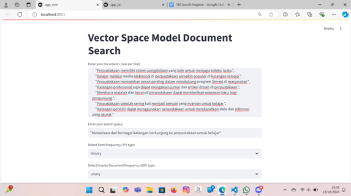
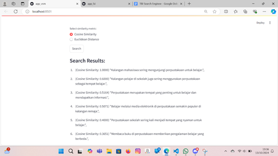
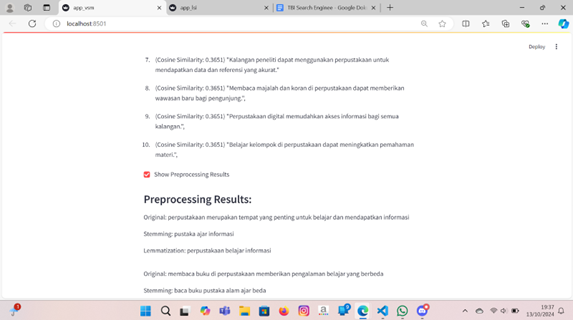
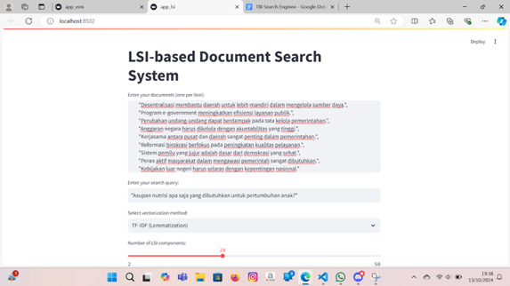
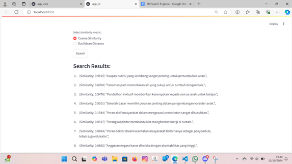
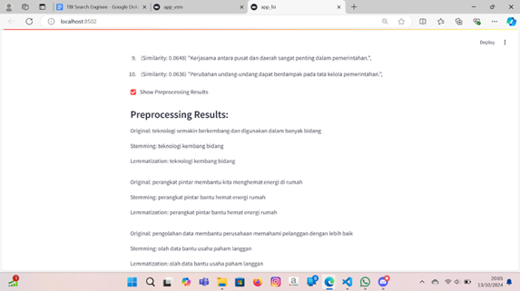

<h1>🔍 Information Retrieval Benchmark System</h1>

<div align="center">
<em>Comprehensive comparison of VSM, LSI, and Neural IR approaches using mBERT</em>

<br>


</div>

---

## 📖 Project Overview

Traditional Information Retrieval (IR) systems like **Vector Space Model (VSM)** and **Latent Semantic Indexing (LSI)** have proven their worth but are limited to term-frequency and linear statistical representations. Modern **Transformer-based models** like **mBERT** leverage cross-lingual context to significantly enhance relevance matching.

This project provides a comprehensive benchmark framework that implements and compares three distinct IR approaches, offering end-to-end pipeline from data extraction to performance evaluation with precision, recall, and F1-score metrics.

**🎯 Perfect for:** Researchers, Data Scientists, IR Engineers, and Academic Projects

---

## ✨ Key Features

- 🔄 **End-to-End Pipeline**: Complete workflow from raw data to evaluation metrics
- 🧠 **Three IR Approaches**: VSM, LSI, and Neural IR with mBERT
- 📊 **Comprehensive Evaluation**: Precision@k, Recall@k, F1-score with macro averaging
- 📈 **Advanced Visualizations**: Precision-Recall curves and Mean Average Precision
- 🔧 **Modular Architecture**: Easy to extend with new models or datasets
- 🌐 **Cross-lingual Support**: Multilingual capabilities through mBERT
- 📝 **Professional Documentation**: Detailed implementation guides and examples
- ⚡ **Performance Optimized**: Efficient processing with sparse matrices and batching

---

## 🛠️ Technologies & Tools

<div align="center">

<table>
<tr>
<th>Category</th>
<th>Technologies</th>
</tr>
<tr>
<td><strong>Language</strong></td>
<td></td>
</tr>
<tr>
<td><strong>Data Processing</strong></td>
<td> </td>
</tr>
<tr>
<td><strong>Machine Learning</strong></td>
<td> </td>
</tr>
<tr>
<td><strong>IR & NLP</strong></td>
<td> </td>
</tr>
<tr>
<td><strong>Visualization</strong></td>
<td> </td>
</tr>
</table>

</div>

### Core Dependencies
```bash
pandas>=1.3.0
numpy>=1.21.0
scikit-learn>=1.0.0
sentence-transformers>=2.2.0
torch>=1.9.0
ir-datasets>=0.5.0
matplotlib>=3.5.0
scipy>=1.7.0
```

---

## 🏗️ System Architecture

<pre>
    📊 Dataset                🔧 ETL Pipeline           📝 Preprocessing
   (ir_datasets)      →      (etl.py)          →      (Clean & Transform)
                                                               |
                                                               ↓
                                          🔀 IR Methods Selection
                                        /        |            \
                                       ↓         ↓             ↓
                              📊 VSM           🎯 LSI      🧠 Neural IR
                          (TF-IDF + Cosine)  (SVD + Latent)  (mBERT Embeddings)
                                       \         |             /
                                        \        |            /
                                         ↓       ↓           ↓
                                          📈 Evaluation Framework
                                         (Precision/Recall/F1)
                                                  |
                                                  ↓
                                          📊 Visualization
                                        (PR Curves & Metrics)
</pre>

**Architecture Components:**
- **Data Layer**: IR datasets with queries, documents, and relevance judgments
- **Processing Layer**: ETL pipeline with comprehensive text preprocessing
- **Model Layer**: Three distinct IR approaches (VSM, LSI, Neural)
- **Evaluation Layer**: Comprehensive metrics and visualization framework

---

## 🚀 Quick Start

### 1. Installation
```bash
# Clone the repository
git clone https://github.com/bers31/bernardo.github.io.git
cd bernardo.github.io

# Install dependencies
pip install -r requirements.txt
```

### 2. Data Preprocessing
```bash
# Extract and clean dataset
python src/etl.py \
  --input data/raw/ \
  --output data/processed/
```

### 3. Run IR Methods
```bash
# Vector Space Model
python src/vsm.py --data data/processed/

# Latent Semantic Indexing
python src/lsi.py --data data/processed/

# Neural IR with mBERT
python src/neural_ir.py --data data/processed/
```

### 4. Evaluate & Visualize
```bash
# Generate evaluation metrics and plots
python src/eval.py \
  --predictions output/ \
  --qrels data/processed/qrels.csv
```
### **5. Launch Interactive Demo**
```bash
# Start Streamlit application
streamlit run app_lsi.py
streamlitt run app_vsm.py
```
---

## 🎥 Demo & Screenshots

<p align="center">
  <a href="https://share.streamlit.io/">
    
  </a>
</p>

## 📊 Performance Comparison


<strong><a href="https://bers31.github.io/bernardo.github.io/Custom_Search_Engine_With_VSM%26LSI/">🎬 Live Demo</a></strong> | <strong><a href="https://github.com/bers31/bernardo.github.io/tree/main/Custom_Search_Engine_With_VSM%26LSI">📁 Explore Code</a></strong>

---

## 📁 Project Structure

```
📦 Information-Retrieval-Benchmark/
├── 📊 data/
│   ├── 🗂️ raw/                     # Original ir_datasets files
│   └── ✨ processed/               # Cleaned CSV/Parquet files
├── 📓 notebooks/
│   ├── 📊 TBI_VSM.ipynb            # VSM pipeline & evaluation
│   ├── 🎯 TBI_LSI.ipynb            # LSI pipeline & evaluation  
│   ├── 🧠 Code_Neural_IR_mBERT.ipynb # mBERT embedding & ranking
│   └── 📈 precision_recall.ipynb   # PR-curve & analysis
├── 🔧 src/
│   ├── ⚙️ etl.py                   # Extract & transform pipeline
│   ├── 📊 vsm.py                   # Vector Space Model functions
│   ├── 🎯 lsi.py                   # Latent Semantic Indexing
│   ├── 🧠 neural_ir.py             # mBERT embedding & ranking
│   └── 📈 eval.py                  # Metrics calculation & plotting
├── 📋 requirements.txt
├── 📖 README.md
└── ⚖️ LICENSE
```

---

## 🔬 Methodology Deep Dive

### 🗃️ Dataset Components
- **Queries**: `(query_id, text)` - Search queries with unique identifiers
- **Documents**: `(doc_id, text)` - Document collection corpus
- **Qrels**: `(query_id, doc_id, relevance)` - Relevance judgments for evaluation

### 🔄 ETL Pipeline
1. **Extract**: Load data using `ir_datasets` API
2. **Transform**: 
   - Remove duplicates and handle missing values
   - Case folding and non-alphanumeric character removal
   - Space normalization and optional tokenization
3. **Load**: Export cleaned DataFrames to processed data directory

### 🎯 IR Methods Implementation

<div align="center">

<table>
<tr>
<th>Method</th>
<th>Approach</th>
<th>Key Technology</th>
</tr>
<tr>
<td><strong>VSM</strong></td>
<td>TF-IDF vectorization with cosine similarity</td>
<td><code>sklearn.TfidfVectorizer</code></td>
</tr>
<tr>
<td><strong>LSI</strong></td>
<td>SVD dimensionality reduction on TF-IDF</td>
<td><code>sklearn.TruncatedSVD</code></td>
</tr>
<tr>
<td><strong>Neural IR</strong></td>
<td>mBERT embeddings with similarity search</td>
<td><code>sentence-transformers</code></td>
</tr>
</table>

</div>

---

## 📊 Evaluation Metrics

- **Precision@k**: Relevant documents in top-k results
- **Recall@k**: Coverage of relevant documents in top-k
- **F1-Score**: Harmonic mean of precision and recall
- **Mean Average Precision (mAP)**: Average precision across all queries
- **Precision-Recall Curves**: Visual performance analysis

---

## 🗓️ Project Roadmap

<div align="center">

<table>
<tr>
<th>Milestone</th>
<th>Target Date</th>
<th>Status</th>
</tr>
<tr>
<td>🏗️ Core Architecture Setup</td>
<td>2024</td>
<td><strong>✅ Completed</strong></td>
</tr>
<tr>
<td>📊 VSM Implementation</td>
<td>2024</td>
<td><strong>✅ Completed</strong></td>
</tr>
<tr>
<td>🎯 LSI Integration</td>
<td>2024</td>
<td><strong>✅ Completed</strong></td>
</tr>
<tr>
<td>🧠 Neural IR with mBERT</td>
<td>2024</td>
<td><strong>✅ Completed</strong></td>
</tr>
<tr>
<td>📈 Evaluation Framework</td>
<td>2024</td>
<td><strong>✅ Completed</strong></td>
</tr>
<tr>
<td>📝 Documentation & Testing</td>
<td>2024</td>
<td><strong>✅ Completed</strong></td>
</tr>
<tr>
<td>🚀 Performance Optimization</td>
<td>2025</td>
<td><strong>🔄 In Progress</strong></td>
</tr>
<tr>
<td>🌐 Multi-dataset Support</td>
<td>2026</td>
<td><strong>📋 Planned</strong></td>
</tr>
</table>

</div>

---

## 🤝 Contributing

We welcome contributions! Here's how you can help:

1. **🍴 Fork** the repository
2. **🌿 Create** a feature branch (`git checkout -b feature/AmazingFeature`)
3. **💾 Commit** your changes (`git commit -m 'Add AmazingFeature'`)
4. **📤 Push** to the branch (`git push origin feature/AmazingFeature`)
5. **🔄 Open** a Pull Request

### 🐛 Bug Reports & 💡 Feature Requests
Please use <a href="https://github.com/bers31/bernardo.github.io/issues">GitHub Issues</a> with appropriate labels.

### 👥 Contributors
<div align="center">
<a href="https://github.com/bers31/bernardo.github.io/graphs/contributors">
  
</a>
</div>

---

## 📄 **License**

This project is licensed under the **MIT License** - see the [LICENSE](LICENSE) file for details.

```
MIT License

Copyright (c) 2024 Bernardo - Universitas Diponegoro

Permission is hereby granted, free of charge, to any person obtaining a copy
of this software and associated documentation files (the "Software"), to deal
in the Software without restriction, including without limitation the rights
to use, copy, modify, merge, publish, distribute, sublicense, and/or sell
copies of the Software, subject to the following conditions:

The above copyright notice and this permission notice shall be included in all
copies or substantial portions of the Software.
```

## 📫 Contact & Connect

<p align="center">
<strong>👨‍💻 Bernardo - Computer Science Student</strong><br/>
Universitas Diponegoro 🎓
</p>

<p align="center">
<a href="https://linkedin.com/in/bernardo-sunia/">

</a>
<a href="https://mail.google.com/mail/?view=cm&fs=1&to=suniabernardo@gmail.com">

</a>
<a href="https://github.com/bers31">

</a>
<a href="https://bit.ly/bernardo-my_portfolio">

</a>
</p>

<p align="center">
⭐ <strong>If you found this project helpful, please give it a star!</strong> ⭐
</p>

<p align="center">
<em>Made with ❤️ by <a href="https://github.com/bers31">Bernardo</a> at Universitas Diponegoro</em><br/>

</p>

---
### Full Screenshots







### Conclusion
This project demonstrates the effectiveness of combining VSM and LSI to create a powerful search engine that delivers highly relevant search results. By leveraging Python and Streamlit, the project provides an intuitive and interactive user experience. The use of LSI significantly enhances search accuracy, making this search engine a valuable tool for finding information efficiently.
