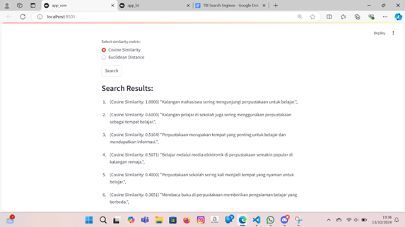
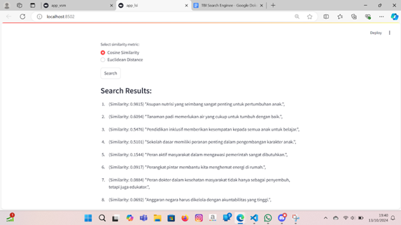
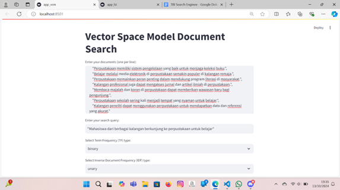
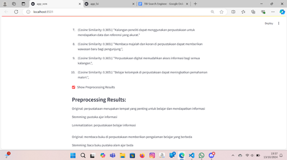
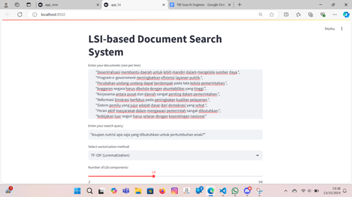
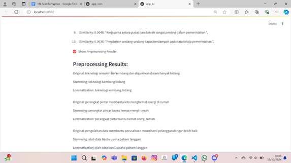

<div class="hero">

<h1>🔍 Custom Search Engine with VSM & LSI</h1>

<p>Information Retrieval · Indonesian Text Processing · Semantic Search · Interactive Streamlit Application</p>

<p>
  
  
  
  
  
  
</p>

<p>
An interactive information retrieval system comparing classical Vector Space Model
and Latent Semantic Indexing approaches for Indonesian document search.
</p>

</div>

---

## 📖 Project Overview

**Custom Search Engine with VSM & LSI** is an academic Information Retrieval project that explores how classical lexical retrieval and latent semantic representations can be used to improve document search.

The system implements two complementary approaches:

* **Vector Space Model (VSM)** using TF / TF-IDF weighting and cosine similarity.
* **Latent Semantic Indexing (LSI)** using Truncated SVD to reduce the term-document matrix into a lower-dimensional latent semantic space.

The complete workflow covers:

```text id="m8q2pz"
Document Corpus
      ↓
Text Preprocessing
      ↓
TF / TF-IDF Representation
      ↓
┌───────────────────────────────┐
│                               │
↓                               ↓
VSM                          LSI
Cosine Similarity            Truncated SVD
│                               │
└──────────────┬────────────────┘
               ↓
        Ranked Search Results
               ↓
      Accuracy@K + MRR
               ↓
      Streamlit Application
```

The project was designed to translate core Information Retrieval concepts into an interactive search experience that users can inspect and understand through a web interface.

> **Portfolio focus:** This project demonstrates practical Information Retrieval, Indonesian-language text processing, feature representation, dimensionality reduction, ranking, evaluation, data visualization, and interactive application development.

---

## 🎯 Project Objectives

The main objectives are:

1. Build an end-to-end document retrieval pipeline.
2. Develop a robust preprocessing workflow for Indonesian text.
3. Implement the Vector Space Model using TF and TF-IDF representations.
4. Extend retrieval using Latent Semantic Indexing.
5. Experiment with multiple latent-topic configurations.
6. Determine an effective balance between retrieval quality and model complexity.
7. Evaluate ranking effectiveness using Accuracy@K and Mean Reciprocal Rank.
8. Deliver the retrieval system through an interactive Streamlit application.

---

## 🧠 Retrieval Approaches

### 📐 Vector Space Model

The **Vector Space Model (VSM)** represents queries and documents as vectors in a common term space.

The implementation supports:

* Term Frequency (TF).
* TF-IDF weighting.
* Cosine similarity.
* Ranked document retrieval.

Conceptually:

```text id="f7t3w2"
Query
  ↓
TF / TF-IDF Vector
  ↓
Cosine Similarity
  ↓
Document Scores
  ↓
Ranked Results
```

The method provides an interpretable lexical baseline where document relevance is driven by term importance and similarity in vector space.

### 🧩 Latent Semantic Indexing

**Latent Semantic Indexing (LSI)** extends the traditional vector-space representation by applying **Truncated Singular Value Decomposition (SVD)** to the term-document matrix.

```text id="e2q1ks"
TF-IDF Matrix
     ↓
Truncated SVD
     ↓
Latent Semantic Space
     ↓
Query Projection
     ↓
Similarity Search
     ↓
Ranked Results
```

The purpose is to capture latent semantic structure within the corpus and reduce some of the limitations of purely lexical matching, including synonymy.

---

## 🔤 Indonesian Text Preprocessing

High-quality retrieval depends heavily on the quality of the input representation.

The project therefore implements a preprocessing pipeline specifically designed for Indonesian text.

### Processing Workflow

```text id="v8u7cz"
Raw Text
   ↓
Normalization
   ↓
Tokenization
   ↓
Indonesian Stopword Removal
   ↓
Stemming with Sastrawi
   ↓
Lemmatization
   ↓
Clean Representation
```

### Normalization

Standardizes textual forms before feature extraction.

### Tokenization

Breaks documents and queries into meaningful textual units.

### Indonesian Stopword Removal

Removes common function words that provide limited retrieval value.

### Sastrawi Stemming

Uses **Sastrawi** to reduce Indonesian words toward their stems.

This helps reduce unnecessary variation between related word forms.

### Lemmatization

Additional normalization can be applied where appropriate to improve consistency in downstream retrieval.

> The preprocessing pipeline is important because lexical representations such as TF-IDF are directly affected by differences in tokenization, word forms, and noise.

---

## 🧪 Experimental Design

The LSI component was evaluated under several latent-dimensional configurations:

| n_components | Purpose                                    |
| -----------: | ------------------------------------------ |
|        **2** | Very low-dimensional latent representation |
|        **5** | Small semantic space                       |
|       **10** | Intermediate representation                |
|       **20** | Higher-dimensional latent representation   |

The experiments evaluate the trade-off between representation complexity and retrieval quality.

### Selected Configuration

The experimental analysis identified:

> **10 latent topics as the optimal balance between retrieval performance and model complexity.**

The result reflects the observed behavior of the evaluated corpus rather than a universal rule for all Information Retrieval datasets.

---

## 📊 Evaluation Methodology

The system evaluates retrieval quality using ranking-oriented metrics.

### Accuracy@K

Accuracy@K measures whether relevant information appears within the top-K retrieved results according to the experiment's evaluation definition.

It provides a practical view of top-of-list retrieval effectiveness.

### Mean Reciprocal Rank

**Mean Reciprocal Rank (MRR)** measures how highly the first relevant result appears in the ranked result list.

Conceptually:

```text id="a8d4ke"
RR = 1 / rank of first relevant document

MRR = average(RR across queries)
```

A higher MRR indicates that relevant results tend to appear closer to the top of the ranking.

### Why Ranking Metrics Matter

For a search engine, retrieving a relevant document somewhere in the corpus is not enough.

The system should preferably surface useful results near the top:

```text id="q5z4m7"
Query
 ↓
Rank 1  ← Most important
Rank 2
Rank 3
Rank 4
Rank 5
 ...
```

This makes top-of-list ranking behavior particularly important for practical search experiences.

---

## 📈 Retrieval Evaluation

The project evaluates the impact of different representation strategies on search effectiveness.

The experimental comparison focuses on:

| Dimension      | VSM                                       | LSI                                          |
| -------------- | ----------------------------------------- | -------------------------------------------- |
| Representation | TF / TF-IDF term space                    | Reduced latent semantic space                |
| Similarity     | Cosine similarity                         | Similarity in latent space                   |
| Semantics      | Primarily lexical                         | Captures latent structures                   |
| Dimensionality | High-dimensional sparse representation    | Lower-dimensional dense representation       |
| Main Strength  | Interpretability and direct term matching | Reduced semantic sparsity / synonymy effects |

The evaluation is performed using **Accuracy@K and MRR**, allowing the project to measure not only whether relevant documents are retrieved but also how early they appear in the ranking.

---

## 🔬 Technical Highlights

### TF and TF-IDF Weighting

TF-based representations emphasize term frequency within a document, while TF-IDF further incorporates the discriminative value of a term across the corpus.

This provides the foundation for the VSM implementation.

### Cosine Similarity

Cosine similarity is used to compare query and document vectors.

Conceptually:

```text id="u8q1xm"
            q · d
cos(q,d) = -------
           ||q|| ||d||
```

Higher similarity indicates closer orientation between query and document representations.

### Truncated SVD

LSI applies **Truncated SVD** to project the original term-document matrix into a lower-dimensional latent space.

```text id="c6j4hz"
Original Matrix
      ↓
Truncated SVD
      ↓
Latent Components
      ↓
Reduced Representation
```

This provides a compact representation of the underlying semantic structure captured by the corpus.

### Query Ranking

For each user query:

```text id="n3b7vr"
User Query
    ↓
Preprocess
    ↓
Transform into Retrieval Space
    ↓
Similarity Calculation
    ↓
Sort by Relevance
    ↓
Top-K Documents
```

---

## 🏗️ System Architecture

### 📥 Data Layer

The retrieval corpus contains the information required to build the search index and evaluate relevance.

The architecture separates:

* Documents.
* Search queries.
* Relevance information.
* Processed representations.

### 🔄 Processing Layer

Responsible for:

* Text extraction.
* Cleaning.
* Normalization.
* Tokenization.
* Indonesian stopword removal.
* Stemming.
* Lemmatization.

### 🧠 Retrieval Layer

The retrieval layer contains two primary approaches:

```text id="1v7q3a"
             Processed Corpus
                    ↓
          ┌─────────┴─────────┐
          ↓                   ↓
         VSM                 LSI
          ↓                   ↓
 TF / TF-IDF + Cosine    Truncated SVD
          ↓                   ↓
          └─────────┬─────────┘
                    ↓
             Ranked Documents
```

### 📊 Evaluation Layer

The evaluation layer computes ranking metrics and produces visualizations for comparative analysis.

### 🖥️ Interface Layer

A Streamlit application exposes the retrieval functionality through an interactive web interface.

---

## 📊 Topic-Dimension Analysis

One of the main experiments investigates the effect of latent dimensionality.

```text id="f6g2n4"
n_components
│
├── 2
│
├── 5
│
├── 10  ← Selected configuration
│
└── 20
```

The objective is not simply to maximize the number of latent dimensions.

A useful configuration should balance:

```text id="s1p6r8"
Retrieval Quality
      +
Representation Efficiency
      +
Model Complexity
```

The experiments indicate that **10 components** provided the best overall balance for the evaluated search corpus.

---

## 🖥️ Streamlit Application

The retrieval engine is exposed through a **Streamlit interface**.

The interactive application allows users to:

* Enter search queries.
* Compare retrieval behavior.
* Inspect ranked results.
* Explore VSM-based retrieval.
* Explore LSI-based retrieval.
* Visualize retrieval-related metrics.

The interface bridges the gap between theoretical IR algorithms and practical search interaction.

### Application Flow

```text id="6n6d2y"
User
 ↓
Search Query
 ↓
Streamlit Interface
 ↓
Preprocessing
 ↓
VSM / LSI Retrieval
 ↓
Ranked Results
 ↓
Visualization
```

---

## 🎥 Demo

### 🖥️ Live Application

<div align="center">

<p>
<strong>🔍 Custom Information Retrieval Search Engine</strong>
</p>

<p>
<a href="https://bers31.github.io/bernardo.github.io/Custom_Search_Engine_With_VSM%26LSI/">
<strong>► Visit Live Application</strong>
</a>
</p>

</div>

### 📸 Retrieval Preview



*Example of retrieval analysis associated with the VSM approach.*



*Example of retrieval analysis associated with the LSI approach.*

---

## 🛠️ Technology Stack

| Layer                      | Technology           | Purpose                                  |
| -------------------------- | -------------------- | ---------------------------------------- |
| 🐍 **Programming**         | **Python**           | Core implementation                      |
| 📓 **Research**            | **Jupyter Notebook** | Experimentation and analysis             |
| 🖥️ **Application**        | **Streamlit**        | Interactive search interface             |
| 📊 **Data Processing**     | **Pandas**           | Dataset and experiment management        |
| 🔢 **Numerical Computing** | **NumPy**            | Numerical operations                     |
| 🇮🇩 **Indonesian NLP**    | **Sastrawi**         | Indonesian stemming                      |
| 🔤 **NLP Processing**      | **NLTK**             | Tokenization and text processing         |
| 🤖 **Machine Learning**    | **scikit-learn**     | TF-IDF, cosine similarity, Truncated SVD |
| 📈 **Visualization**       | **Matplotlib**       | Analytical visualizations                |
| 📊 **Visualization**       | **Plotly**           | Interactive data visualization           |

---

## 📦 Core Dependencies

The project uses the following main Python ecosystem:

```txt id="h2n7pm"
pandas
numpy
scikit-learn
Sastrawi
NLTK
matplotlib
plotly
streamlit
jupyter
```

Specific versions can be defined in `requirements.txt` to reproduce the experimental environment.

---

## 🚀 Getting Started

### Prerequisites

* Python 3.8 or newer.
* `pip` or Conda.
* Sufficient memory for loading and transforming the document corpus.

### Clone the Repository

```bash id="e5s8u1"
git clone https://github.com/bers31/bernardo.github.io.git
cd bernardo.github.io
```

### Install Dependencies

```bash id="bw2m7x"
pip install -r requirements.txt
```

### Run the Preprocessing Pipeline

```bash id="z8x4m1"
python src/etl.py
```

The exact arguments depend on the corpus and implementation configuration.

### Run VSM

```bash id="d6k8q2"
python src/vsm.py
```

### Run LSI

```bash id="f7m4c9"
python src/lsi.py
```

### Evaluate Retrieval

```bash id="j2q9x8"
python src/eval.py
```

### Launch the Streamlit Application

For the VSM interface:

```bash id="v4x8z2"
streamlit run app_vsm.py
```

For the LSI interface:

```bash id="q9j4m6"
streamlit run app_lsi.py
```

---

## 📁 Project Structure

```text id="z7s4cp"
Custom_Search_Engine_With_VSM_LSI/
│
├── 📂 data/
│   ├── raw/                         # Original document/query data
│   └── processed/                   # Cleaned and transformed data
│
├── 📂 notebooks/
│   ├── TBI_VSM.ipynb                # VSM implementation and analysis
│   ├── TBI_LSI.ipynb                # LSI implementation and analysis
│   └── precision_recall.ipynb       # Retrieval evaluation / visualization
│
├── 📂 src/
│   ├── etl.py                       # Data preparation
│   ├── vsm.py                       # Vector Space Model
│   ├── lsi.py                       # Latent Semantic Indexing
│   └── eval.py                       # Evaluation
│
├── 📂 images/
│   ├── Picture1.png
│   ├── Picture2.png
│   ├── Picture3.png
│   ├── Picture4.png
│   ├── Picture5.png
│   └── Picture6.png
│
├── app_vsm.py
├── app_lsi.py
├── requirements.txt
├── LICENSE
└── README.md
```

---

## 🗺️ Project Scope

This project was developed as a **self-contained academic Information Retrieval project at Diponegoro University**.

| Module                           | Description                                                                           | Status        |
| -------------------------------- | ------------------------------------------------------------------------------------- | ------------- |
| ⚙️ **Text Preprocessing**        | Indonesian normalization, stopword removal, tokenization, stemming, and lemmatization | ✅ Implemented |
| 📐 **TF Representation**         | Term-frequency document representation                                                | ✅ Implemented |
| 📊 **TF-IDF**                    | Weighted lexical representation                                                       | ✅ Implemented |
| 🔍 **VSM Retrieval**             | Cosine-similarity-based ranking                                                       | ✅ Implemented |
| 🧩 **LSI Retrieval**             | Truncated SVD latent-space retrieval                                                  | ✅ Implemented |
| 🧪 **Topic Experiments**         | n_components = 2, 5, 10, 20                                                           | ✅ Evaluated   |
| 🎯 **Optimal LSI Configuration** | 10 latent components selected                                                         | ✅ Selected    |
| 📈 **Evaluation**                | Accuracy@K and MRR                                                                    | ✅ Implemented |
| 📊 **Visualization**             | Retrieval and topic-related visualizations                                            | ✅ Implemented |
| 🖥️ **Streamlit Application**    | Interactive VSM and LSI search                                                        | ✅ Implemented |

---

## 📌 Research Findings

### VSM Provides an Interpretable Baseline

The Vector Space Model offers a direct and transparent way to understand how term weighting influences document retrieval.

Its main strengths are:

* Straightforward implementation.
* Interpretable term-based representation.
* Efficient cosine-similarity retrieval.
* Strong baseline for comparison.

### LSI Introduces Latent Semantic Structure

LSI reduces the original term space into a smaller number of latent dimensions.

This allows the system to model relationships that are not always represented by exact term overlap.

Conceptually:

```text id="d2t4y8"
Keyword Space
     ↓
Dimensionality Reduction
     ↓
Latent Semantic Space
```

### Ten Components as the Selected Balance

Experiments across `2`, `5`, `10`, and `20` latent components identified **10 components as the preferred balance between retrieval quality and complexity** for this corpus.

This result is corpus-specific and should be re-evaluated when the document collection changes substantially.

---

## 🔬 From Classical IR to Practical Search

The project demonstrates how classical Information Retrieval concepts can be transformed into a usable search application.

```text id="b1q5c8"
IR Theory
   ↓
Text Representation
   ↓
Ranking Algorithm
   ↓
Evaluation
   ↓
Visualization
   ↓
Interactive Search Application
```

This is important because the value of an IR algorithm is not only its mathematical formulation, but also its ability to produce useful ranked results in an understandable interface.

---

## 💼 Portfolio Alignment

The implementation directly reflects the technical capabilities represented in the project description:

| LinkedIn Competency               | Repository Evidence                                                    |
| --------------------------------- | ---------------------------------------------------------------------- |
| Interactive Streamlit application | `app_vsm.py` and `app_lsi.py`                                          |
| Indonesian text preprocessing     | Normalization, stopword removal, tokenization, stemming, lemmatization |
| Vector Space Model                | TF / TF-IDF + cosine similarity                                        |
| Latent Semantic Indexing          | Truncated SVD                                                          |
| Topic configuration experiments   | `n_components = 2, 5, 10, 20`                                          |
| Optimal model configuration       | 10 latent components                                                   |
| Retrieval evaluation              | Accuracy@K and MRR                                                     |
| Dynamic visualization             | Matplotlib and Plotly                                                  |
| Documentation                     | Notebooks and implementation documentation                             |
| User-friendly delivery            | Streamlit-based search interface                                       |

> **Portfolio positioning:** This project demonstrates the translation of classical Information Retrieval algorithms into an interactive search system, combining Indonesian NLP preprocessing, vector-space representation, latent semantic modeling, ranking evaluation, and visualization.

---

## 🔭 Future Development

Potential future extensions include:

* Hybrid VSM + LSI retrieval.
* Neural reranking.
* Semantic embeddings.
* BM25 baseline comparison.
* Query expansion.
* Relevance feedback.
* Learning-to-Rank.
* Larger multilingual corpora.
* ANN/vector-search infrastructure.
* Search analytics and query monitoring.

These are future directions and are not presented as implemented features of the current project.

---

## 🤝 Contributing

Contributions are welcome for improvements to the retrieval algorithms, preprocessing pipeline, visualization, application interface, and documentation.

### Contribution Workflow

```bash id="1f7t3m"
git checkout -b feature/my-improvement
git add .
git commit -m "Improve retrieval pipeline"
git push origin feature/my-improvement
```

Then open a Pull Request with a description of the implementation and its effect on retrieval performance.

### Guidelines

* Keep preprocessing and retrieval components modular.
* Validate changes against the existing evaluation methodology.
* Document significant algorithmic changes.
* Preserve reproducibility of experiments.
* Test changes in both VSM and LSI workflows where applicable.

---

## 📄 License

The source code and original documentation intentionally published in this repository are licensed under the **MIT License**.

See [`LICENSE`](LICENSE) for the complete license text.

> Third-party software, libraries, datasets, fonts, and other external components remain subject to their respective licenses and terms.

---

<div class="contact-hero">

<p><strong>Interested in the project?</strong></p>

<p>
👨‍💻 <strong>Bernardo Nandaniar Sunia</strong><br/>
Bachelor of Computer Science — Diponegoro University<br/>
Information Retrieval · NLP · Search Systems
</p>

<p>
<a href="https://linkedin.com/in/bernardo-sunia/">

</a>
<a href="https://mail.google.com/mail/?view=cm&fs=1&to=suniabernardo@gmail.com">

</a>
<a href="https://github.com/bers31">

</a>
<a href="https://bit.ly/bernardo-my_portfolio">

</a>
</p>

<p>
<em>Information Retrieval · Indonesian NLP · VSM · LSI · Search Applications</em>
</p>

</div>

---

## 📸 Full Screenshots











---

## 📌 Conclusion

This project demonstrates the development of an interactive **Information Retrieval system** using two classical approaches: **Vector Space Model (VSM)** and **Latent Semantic Indexing (LSI)**.

The system combines Indonesian-language preprocessing, TF / TF-IDF representations, cosine similarity, Truncated SVD, retrieval evaluation, and Streamlit-based visualization into a complete search workflow.

Experiments across multiple latent dimensions identified **10 LSI components as the preferred balance between retrieval quality and model complexity for the evaluated corpus**.

Overall, the project demonstrates how classical IR theory can be translated into a practical search application while maintaining an interpretable and measurable evaluation framework.