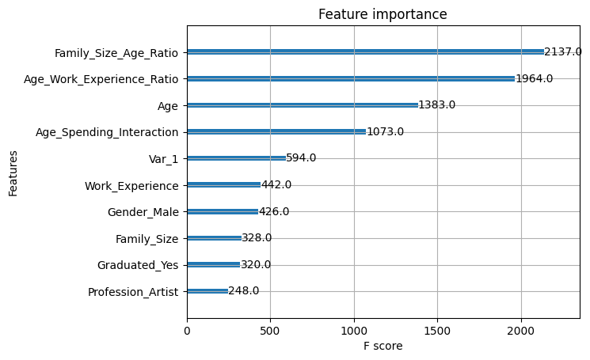
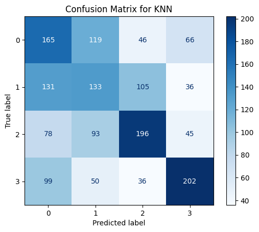
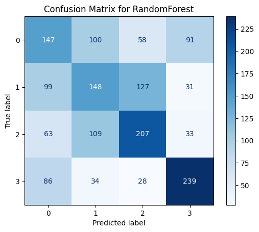
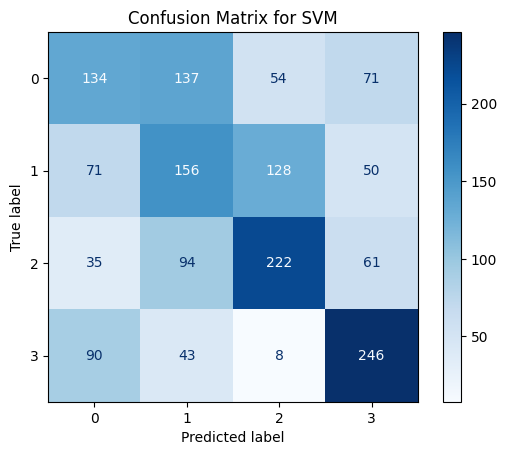
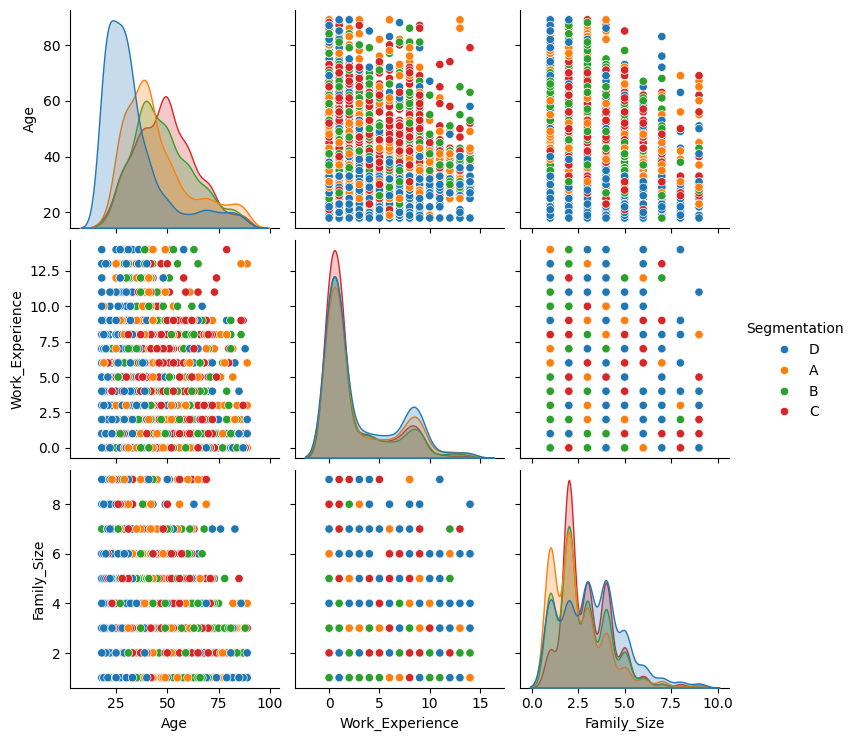
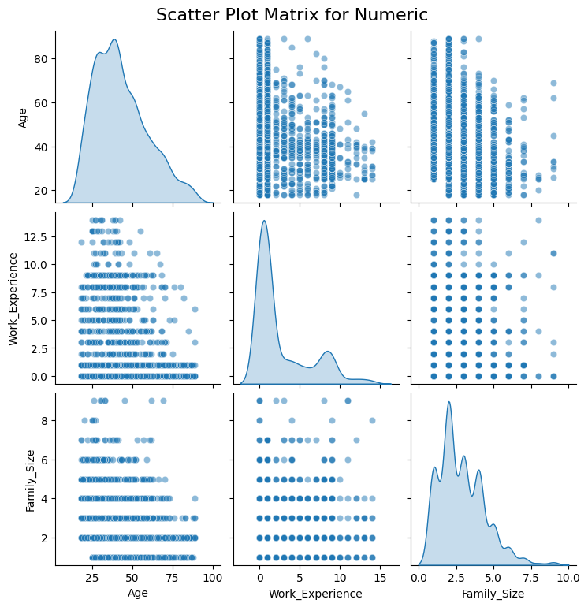

<div class="hero">

<h1>🛍️ Customer Segmentation - Supervised Multi-Class Classification</h1>

<p>Customer Profiling · Machine Learning Benchmarking · Interactive Streamlit Analytics</p>

<p>
  
  
  
  
  
  
  
</p>

<p>
A supervised machine learning system for customer-group prediction,
model benchmarking, and interactive customer profiling through Streamlit.
</p>

</div>

---

## 📖 Project Overview

This project develops a **supervised machine learning approach to customer segmentation**, treating predefined customer groups as a **multi-class classification problem**.

Rather than using clustering to discover segments without labels, the system learns from labeled customer data and predicts which segment a new customer belongs to based on available demographic and behavioral characteristics.

The project combines multiple supervised learning algorithms:

```text id="7m1q2a"
Customer Data
      ↓
Data Preparation
      ↓
Feature Engineering
      ↓
Train / Validation
      ↓
┌──────────┬────────────┬──────────┬──────────┐
│   k-NN   │   Random   │   SVM    │ XGBoost  │
│          │   Forest   │          │          │
└──────────┴────────────┴──────────┴──────────┘
                     ↓
             Model Comparison
                     ↓
          Hyperparameter Tuning
                     ↓
          Performance Evaluation
                     ↓
          Streamlit Visualization
```

The resulting system is intended to make customer-group analysis easier to explore and translate machine learning outputs into business-oriented insights.

> **Portfolio focus:** This project demonstrates supervised machine learning, multi-class classification, model benchmarking, hyperparameter optimization, evaluation, data visualization, and interactive analytical application development.

---

## 🎯 Business Objective

Customer groups often differ in their behavior, characteristics, and potential business value.

A predictive segmentation system can help organizations move from generic customer treatment toward more targeted strategies.

| Business Need            | Analytical Use                                                   |
| ------------------------ | ---------------------------------------------------------------- |
| 🎯 Targeted marketing    | Identify which customer group a customer belongs to              |
| 👥 Customer profiling    | Understand characteristics of different customer segments        |
| 🔄 Customer engagement   | Support differentiated engagement strategies                     |
| 📈 Strategic planning    | Use segment information as an input to business decisions        |
| ⚙️ Resource allocation   | Focus efforts on relevant customer groups                        |
| 📊 Data-driven decisions | Replace purely intuition-based grouping with predictive analysis |

---

## 🧠 Why Supervised Customer Segmentation?

This project treats segmentation as a **classification problem**.

The distinction is important:

```text id="p4w8c2"
Traditional Unsupervised Segmentation
          ↓
Discover clusters from unlabeled data

This Project
          ↓
Learn predefined customer-group labels
          ↓
Predict segment for new customers
```

This approach is particularly useful when historical customer segments or business-defined labels already exist and the objective is to build a model that can consistently classify future customers.

---

## ✨ Key Features

### 🎯 Multi-Class Customer Classification

The system evaluates multiple supervised classifiers for customer-group prediction.

The primary models include:

* **k-Nearest Neighbors (k-NN)**
* **Random Forest**
* **Support Vector Machine (SVM)**
* **XGBoost**

Each model provides a different modeling strategy, allowing direct benchmarking across multiple algorithm families.

### 🌲 Random Forest

Random Forest provides an ensemble-based approach that can capture nonlinear relationships between customer features.

It is also useful for model interpretation through feature-importance analysis.

### ⚡ XGBoost

XGBoost provides a gradient-boosting approach designed to learn complex feature interactions and nonlinear decision boundaries.

### 🔍 Support Vector Machine

SVM provides a margin-based classification approach and is useful for evaluating how a different decision-boundary strategy performs on the customer dataset.

### 📍 k-Nearest Neighbors

k-NN classifies observations based on the characteristics of nearby observations in feature space.

This provides a distance-based perspective that complements the tree-based and margin-based models.

---

## 🔧 Data Processing & Feature Engineering

The modeling workflow includes data preparation before classification.

The general pipeline is:

```text id="m3w7k1"
Raw Customer Data
        ↓
Data Cleaning
        ↓
Feature Preparation
        ↓
Encoding / Transformation
        ↓
Feature Scaling
        ↓
Model Training
```

The goal is to ensure that customer attributes are represented consistently before being passed to the machine learning models.

### Feature Engineering

Feature engineering focuses on preparing customer characteristics in a form that can be interpreted effectively by the selected classifiers.

This includes appropriate handling of:

* Numerical variables.
* Categorical variables.
* Missing or inconsistent values.
* Feature scales.
* Model-specific input requirements.

---

## 🧪 Model Benchmarking

One of the central objectives of the project is to compare different supervised learning approaches under a common evaluation framework.

| Model             | Modeling Strategy             | Key Strength                                 |
| ----------------- | ----------------------------- | -------------------------------------------- |
| **k-NN**          | Distance-based classification | Local neighborhood patterns                  |
| **Random Forest** | Ensemble decision trees       | Nonlinear relationships and interpretability |
| **SVM**           | Margin-based classification   | Effective decision boundaries                |
| **XGBoost**       | Gradient boosting             | Complex nonlinear feature interactions       |

This benchmarking process makes it possible to evaluate which algorithm provides the most effective customer-group classification for the evaluated dataset.

---

## 🎛️ Hyperparameter Optimization

Model performance is not determined only by algorithm selection.

Each model can behave significantly differently depending on its hyperparameters.

The project therefore incorporates **hyperparameter tuning** to search for configurations that improve classification performance.

Conceptually:

```text id="q8r4x2"
Model
  ↓
Candidate Hyperparameters
  ↓
Cross-Validation / Evaluation
  ↓
Best Configuration
  ↓
Final Model
```

This prevents the comparison from relying solely on default model settings.

---

## 📊 Model Evaluation

The models are evaluated using multiple classification metrics.

### Accuracy

Measures the proportion of correctly classified customers.

```text id="4t8n2j"
Accuracy =
Correct Predictions
------------------
Total Predictions
```

### Precision

Measures how often predictions for a given class are correct.

### Recall

Measures how many customers belonging to a class are successfully identified.

### F1-Score

Balances precision and recall:

```text id="9h3x6c"
F1 =
2 × Precision × Recall
----------------------
Precision + Recall
```

Evaluating several metrics is important because a model should not be selected solely on overall accuracy when class-level behavior also matters.

---

## 📈 Evaluation Workflow

```text id="2f8q5n"
                   Model Training
                         ↓
              ┌──────────┴──────────┐
              ↓                     ↓
        Validation Data        Test Data
              ↓                     ↓
       Hyperparameter          Final Evaluation
          Tuning                     ↓
              └──────────┬──────────┘
                         ↓
                Performance Metrics
                         ↓
               Model Comparison
```

The resulting metrics are used to identify the strongest candidate model and understand differences between algorithms.

---

## 🎨 Data Visualization

The project uses visualization to make the segmentation analysis easier to interpret.

Visual analysis can include:

* Customer feature distributions.
* Segment distributions.
* Confusion matrices.
* Model comparison.
* Feature importance.
* Classification performance.

### Feature Importance

For models that expose feature-importance information, the analysis can help identify which customer attributes contribute most strongly to segment prediction.

Conceptually:

```text id="a5y7q2"
Customer Features
       ↓
Model Prediction
       ↓
Feature Contribution / Importance
       ↓
Business Interpretation
```

This is valuable because the system is intended not only to predict a segment but also to help users understand the characteristics behind the prediction.

---

## 🖥️ Streamlit Application

The project includes an interactive **Streamlit application** for exploring segmentation results.

The interface is designed to transform model output into a more accessible analytical experience.

Users can interact with:

* Customer information.
* Predicted customer groups.
* Model outputs.
* Performance visualizations.
* Segment-level analysis.
* Classification insights.

### Application Workflow

```text id="h7w3r5"
Customer Input / Dataset
        ↓
Streamlit Interface
        ↓
Preprocessing
        ↓
Trained Model
        ↓
Predicted Segment
        ↓
Visualization / Interpretation
```

This creates a bridge between the underlying machine learning models and stakeholder-facing analytical exploration.

---

## 📊 Customer Profiling

The system supports a customer-profiling workflow:

```text id="p5n8k3"
Customer Attributes
       ↓
ML Classification
       ↓
Predicted Segment
       ↓
Segment Characteristics
       ↓
Business Insight
```

This allows users to move from individual observations toward broader segment-level understanding.

---

## 🏗️ System Architecture

The project can be viewed through four major layers.

### 📥 Data Layer

Contains the customer dataset and the features used for supervised classification.

### 🔄 Processing Layer

Responsible for:

* Cleaning.
* Transformation.
* Feature preparation.
* Scaling.
* Dataset preparation for model training.

### 🧠 Modeling Layer

Contains the supervised classification algorithms:

```text id="k2m7w1"
                 Customer Data
                      ↓
          ┌───────────┴───────────┐
          ↓           ↓           ↓
         k-NN     Random Forest   SVM
          │           │           │
          └───────────┬───────────┘
                      ↓
                   XGBoost
                      ↓
              Model Comparison
```

### 📊 Application Layer

The Streamlit interface exposes analytical outputs in an interactive form.

```text id="v6j2p9"
Machine Learning Models
          ↓
Evaluation Results
          ↓
Streamlit Dashboard
          ↓
Interactive Customer Insights
```

---

## 🔬 Technical Highlights

### Multi-Algorithm Benchmarking

Instead of relying on a single classifier, the project compares multiple model families to determine which modeling strategy is most effective for the customer dataset.

### Hyperparameter Tuning

Model configurations are systematically optimized rather than relying solely on default parameters.

### Interpretability

Feature-importance analysis provides an additional layer of interpretation for understanding which variables are associated with customer-group predictions.

### Interactive Analytics

Streamlit converts static model outputs into an interactive analytical experience, enabling users to explore results without directly interacting with notebook code.

### Reproducible Research Workflow

Jupyter Notebook provides a structured environment for experimentation, analysis, and documentation of the modeling workflow.

---

## 📊 Project Workflow

The full analytical workflow can be summarized as:

```text id="s7m3y9"
1. Load Customer Dataset
          ↓
2. Explore Customer Characteristics
          ↓
3. Clean & Prepare Data
          ↓
4. Engineer Features
          ↓
5. Train Multiple Classifiers
          ↓
6. Tune Hyperparameters
          ↓
7. Evaluate Classification Performance
          ↓
8. Compare Models
          ↓
9. Visualize Segment Insights
          ↓
10. Expose Results through Streamlit
```

---

## 🗺️ Project Scope

This project was developed as an academic **Machine Learning project at Diponegoro University** and focuses on supervised customer-group classification.

| Module                        | Description                                                | Status        |
| ----------------------------- | ---------------------------------------------------------- | ------------- |
| 📊 **Exploratory Analysis**   | Analyze customer characteristics and segment distributions | ✅ Implemented |
| 🧹 **Data Preparation**       | Cleaning and preparation of model inputs                   | ✅ Implemented |
| 🔧 **Feature Engineering**    | Transform customer attributes for classification           | ✅ Implemented |
| 📍 **k-NN**                   | Distance-based multi-class classification                  | ✅ Implemented |
| 🌲 **Random Forest**          | Ensemble classification with interpretability              | ✅ Implemented |
| 🔍 **SVM**                    | Margin-based classification                                | ✅ Implemented |
| ⚡ **XGBoost**                 | Gradient-boosting classification                           | ✅ Implemented |
| 🎛️ **Hyperparameter Tuning** | Optimize model configurations                              | ✅ Implemented |
| 📈 **Model Evaluation**       | Accuracy, precision, recall, and F1-score                  | ✅ Implemented |
| 🎨 **Visualization**          | Confusion matrices and model/feature analysis              | ✅ Implemented |
| 🖥️ **Streamlit Application** | Interactive customer segmentation exploration              | ✅ Implemented |

---

## 💼 Portfolio Alignment

The README is aligned with the competencies represented in the project description:

| LinkedIn Capability              | Project Evidence                                       |
| -------------------------------- | ------------------------------------------------------ |
| Supervised customer segmentation | Multi-class customer-group classification              |
| Random Forest                    | Ensemble classifier                                    |
| SVM                              | Margin-based classification                            |
| XGBoost                          | Gradient boosting classifier                           |
| k-NN                             | Distance-based classifier                              |
| Model benchmarking               | Cross-model performance comparison                     |
| Hyperparameter tuning            | Optimization of model configurations                   |
| Model evaluation                 | Precision, recall, F1-score, and accuracy              |
| Streamlit                        | Interactive segmentation application                   |
| UI/UX                            | User-friendly analytical visualization                 |
| Customer insights                | Segment-level profiling                                |
| Real-time analysis               | Interactive customer analysis within the application   |
| Documentation                    | Notebook-based workflow and architecture documentation |

> **Portfolio positioning:** This project demonstrates how supervised machine learning can convert customer attributes into actionable segment predictions and expose those predictions through an interactive analytical interface.

---

## 📌 Business Applications

A predictive customer-segmentation framework can support use cases such as:

### 🎯 Targeted Marketing

Different customer segments can receive differentiated campaigns based on their characteristics.

### 🤝 Customer Engagement

Segment-aware strategies can help tailor engagement to customer profiles.

### 📈 Decision Support

Segment predictions can become an input to broader business analysis.

### ⚙️ Resource Allocation

Organizations can use segment information to prioritize marketing or operational resources.

The core idea is:

```text id="1s4x5m"
Customer Data
     ↓
Predicted Segment
     ↓
Customer Profile
     ↓
Business Strategy
```

---

## 📊 From Model Output to Business Insight

A machine learning prediction becomes more useful when it can be interpreted in business terms.

For example:

```text id="b3m6q7"
Prediction
    ↓
"Customer belongs to Segment A"
    ↓
Which features characterize Segment A?
    ↓
What differentiates Segment A from other segments?
    ↓
What business strategy is appropriate?
```

This project therefore combines predictive modeling with visualization and profiling rather than treating classification output as the final analytical product.

---

## 🖥️ Demo & Screenshots

### 🌐 Live Project

<div align="center">

<p>
<strong>🖥️ Interactive Customer Segmentation Application</strong>
</p>

<p>
<a href="https://bers31.github.io/bernardo.github.io/Customer_Segmentation_Supervised_Learning_Project/">
<strong>► View Live Project</strong>
</a>
</p>

</div>

### 📸 Application Preview



*Example visualization from the customer segmentation analysis.*

---

## 🛠️ Technology Stack

| Layer                   | Technology               | Purpose                                   |
| ----------------------- | ------------------------ | ----------------------------------------- |
| 🐍 **Programming**      | **Python**               | Core implementation                       |
| 📓 **Research**         | **Jupyter Notebook**     | Experimentation and model analysis        |
| 🖥️ **Application**     | **Streamlit**            | Interactive customer profiling            |
| 📊 **Data Analysis**    | **Pandas / NumPy**       | Data preparation and numerical processing |
| 🤖 **Machine Learning** | **scikit-learn**         | Classification and preprocessing          |
| ⚡ **Boosting**          | **XGBoost**              | Gradient-boosted classification           |
| 📈 **Visualization**    | **Matplotlib / Seaborn** | Model and customer analysis               |

---

## 🚀 Getting Started

### Prerequisites

* Python 3.8 or newer.
* `pip` or Conda.
* Jupyter Notebook.
* Streamlit.

### Clone the Repository

```bash id="r4c7m2"
git clone https://github.com/bers31/bernardo.github.io.git
cd bernardo.github.io
```

### Create a Virtual Environment

Windows:

```bash id="f5p3t7"
python -m venv venv
venv\Scripts\activate
```

macOS / Linux:

```bash id="m4k8q1"
python -m venv venv
source venv/bin/activate
```

### Install Dependencies

```bash id="v6r9c2"
pip install -r requirements.txt
```

### Launch Jupyter Notebook

```bash id="w2f6p8"
jupyter notebook
```

Open the relevant analysis notebooks and execute the workflow sequentially.

### Launch the Streamlit Application

```bash id="p8k3v5"
streamlit run app.py
```

The exact application filename may differ depending on the final repository structure.

---

## 📦 Recommended Dependencies

```txt id="z4m8q1"
pandas
numpy
scikit-learn
xgboost
matplotlib
seaborn
jupyter
streamlit
```

Exact versions should be pinned in `requirements.txt` when reproducibility across environments is required.

---

## 📁 Project Structure

A portfolio-oriented structure can be organized as:

```text id="c5x7m2"
Customer_Segmentation/
│
├── 📂 data/
│   ├── raw/                     # Original customer data
│   └── processed/               # Prepared modeling data
│
├── 📂 notebooks/
│   ├── exploration.ipynb        # Exploratory data analysis
│   ├── preprocessing.ipynb      # Data preparation
│   ├── models.ipynb             # Model training and comparison
│   └── evaluation.ipynb         # Model evaluation
│
├── 📂 src/
│   ├── preprocessing.py         # Data preparation
│   ├── models.py                # Model definitions
│   ├── evaluation.py            # Evaluation utilities
│   └── visualization.py         # Visualization utilities
│
├── 📂 images/
│   ├── image.png
│   ├── image1.png
│   ├── image2.png
│   ├── image3.png
│   ├── image4.png
│   └── image5.png
│
├── requirements.txt
├── LICENSE
└── README.md
```

---

## 🔭 Future Development

Potential extensions include:

* Real-time customer-data ingestion.
* Automated segment prediction APIs.
* Customer lifetime-value integration.
* Customer churn prediction.
* Personalized recommendation workflows.
* Automated marketing campaign targeting.
* More advanced explainable-AI techniques.
* Model monitoring and drift detection.
* Larger and more diverse customer datasets.
* Production-oriented deployment.

These represent future directions and are not presented as current implementations unless explicitly available in the repository.

---

## 🤝 Contributing

Contributions are welcome for improvements to the machine learning pipeline, visualization, Streamlit interface, documentation, and experimentation.

### Contribution Workflow

```bash id="j6q2x8"
git checkout -b feature/my-improvement
git add .
git commit -m "Improve customer classification"
git push origin feature/my-improvement
```

Then open a Pull Request describing the implementation and its expected analytical impact.

### Guidelines

* Keep preprocessing and model components modular.
* Document changes to model configurations.
* Validate model modifications using the existing evaluation methodology.
* Test Streamlit interactions after interface changes.
* Update documentation when the analytical workflow changes.

---

## 📄 License

The source code and original documentation intentionally published in this repository are licensed under the **MIT License**.

See [`LICENSE`](LICENSE) for the complete license text.

> Third-party libraries, datasets, pretrained components, and other external materials remain subject to their respective licenses and terms.

---

<div class="contact-hero">

<p><strong>Interested in the project?</strong></p>

<p>
👨‍💻 <strong>Bernardo Nandaniar Sunia</strong><br/>
Bachelor of Computer Science — Diponegoro University<br/>
Machine Learning · Customer Analytics · Data Applications
</p>

<p>
<a href="https://linkedin.com/in/bernardo-sunia/">

</a>
<a href="https://mail.google.com/mail/?view=cm&fs=1&to=suniabernardo@gmail.com">

</a>
<a href="https://github.com/bers31">

</a>
<a href="https://bit.ly/bernardo-my_portfolio">

</a>
</p>

<p>
<em>Machine Learning · Customer Segmentation · Classification · Interactive Analytics</em>
</p>

</div>

---

## 📸 Full Screenshots












---

## 📌 Conclusion

This project demonstrates how **supervised machine learning can be applied to customer segmentation as a multi-class classification problem**.

By benchmarking **k-NN, Random Forest, SVM, and XGBoost**, the project provides a structured comparison of different algorithm families while incorporating hyperparameter tuning and multi-metric evaluation.

The addition of an interactive **Streamlit application** transforms the resulting models from a notebook-only experiment into a more accessible analytical tool for exploring customer groups and their characteristics.

Overall, the project combines **machine learning, model evaluation, customer profiling, visualization, and interactive analytics** to demonstrate how predictive customer segmentation can support more targeted and data-driven business decisions.