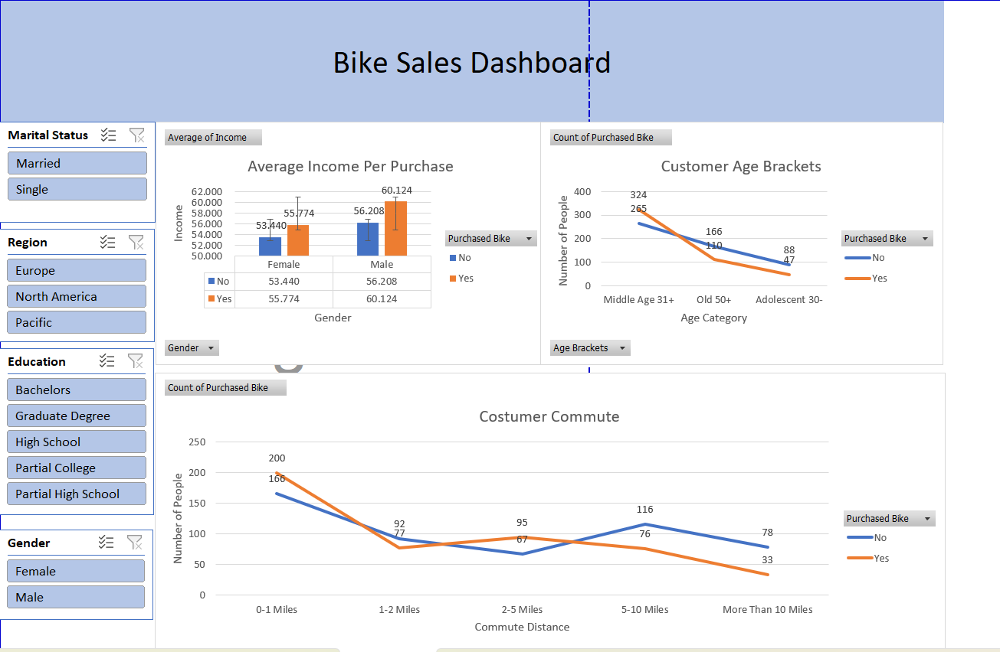
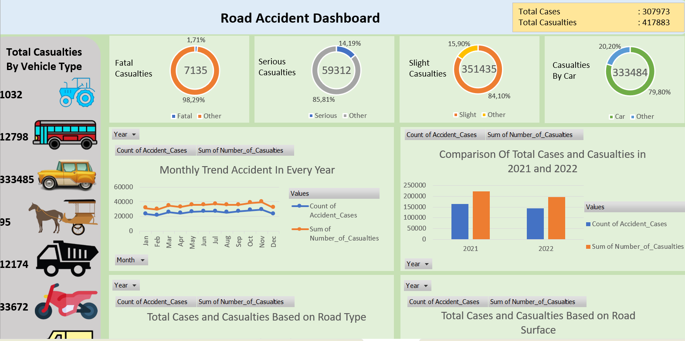
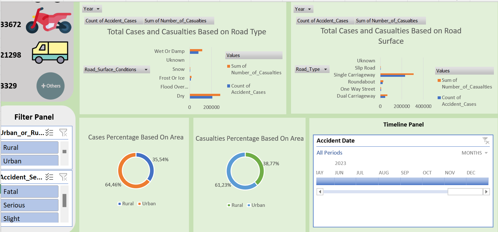

# 📊 Data Analysis Dashboard
*Transform Excel Analytics into Interactive Intelligence*

[](https://github.com/bers31/bernardo.github.io)
[](LICENSE)
[](https://github.com/bers31/bernardo.github.io/releases)
[](https://reactjs.org/)
[](https://nodejs.org/)
[](https://www.postgresql.org/)

---

## 📖 About This Project

This project consolidates multiple Excel workbook analyses into a **unified Data Analysis Dashboard** with role-based access control. Born from the need to transform static Excel reports into dynamic, interactive intelligence, this application serves as a comprehensive solution for data visualization, user management, and business insights.

**Why This Matters:** In today's data-driven world, stakeholders need instant access to relevant insights. This dashboard eliminates the friction between raw data and actionable intelligence, providing a centralized platform where students, faculty, and administrators can access tailored analytics based on their roles and responsibilities.

---

## ✨ Key Features

🔐 **Role-Based Access Control** - Tailored dashboards for Admin, Students, Lecturers, Department Heads, and Deans

📊 **Real-Time Analytics** - Interactive visualizations with live data updates

⚡ **Automated ETL Pipeline** - Seamless Excel-to-Database transformation

🎯 **Multi-Dataset Integration** - Sales analysis, customer segmentation, and accident reporting

📋 **Export Capabilities** - PDF/CSV reports with customizable layouts

📱 **Responsive Design** - Optimized for desktop, tablet, and mobile devices

---

## 🛠️ Technology Stack

<table>
<tr>
<td align="center" width="96">

<br><strong>React</strong>
</td>
<td align="center" width="96">

<br><strong>Node.js</strong>
</td>
<td align="center" width="96">

<br><strong>PostgreSQL</strong>
</td>
<td align="center" width="96">

<br><strong>Python</strong>
</td>
<td align="center" width="96">

<br><strong>Docker</strong>
</td>
</tr>
<tr>
<td align="center"><strong>Frontend</strong></td>
<td align="center"><strong>Backend</strong></td>
<td align="center"><strong>Database</strong></td>
<td align="center"><strong>ETL</strong></td>
<td align="center"><strong>DevOps</strong></td>
</tr>
</table>

### 📋 Complete Tech Specifications

| Category | Technologies |
|----------|-------------|
| **Frontend** | React 18.2.0, Vite, Tailwind CSS, Recharts, React Router |
| **Backend** | Node.js, Express.js, JWT Authentication, Bcrypt |
| **Database** | PostgreSQL 15+, Sequelize ORM |
| **ETL Pipeline** | Python, Pandas, NumPy, SQLAlchemy |
| **Visualization** | Chart.js, ECharts, React-Recharts |
| **DevOps** | Docker, Docker Compose, GitHub Actions |
| **Testing** | Jest, React Testing Library, Supertest |

---


## 🚀 Quick Start Guide

### Prerequisites
```bash
Node.js >= 18.0.0
Python >= 3.8
PostgreSQL >= 13
Docker (optional)
```

### Installation & Setup

**1. Clone the Repository**
```bash
git clone https://github.com/bers31/bernardo.github.io.git
cd bernardo.github.io/Data_Analysis_Excel
```

**2. Backend Setup**
```bash
cd backend
npm install
cp .env.example .env
# Configure your database connection in .env
npm run db:migrate
npm run db:seed
```

**3. Frontend Setup**
```bash
cd ../frontend
npm install
cp .env.example .env
# Configure API endpoints in .env
```

**4. ETL Pipeline Setup**
```bash
cd ../etl
pip install -r requirements.txt
python setup_pipeline.py
```

**5. Start Development Servers**
```bash
# Terminal 1 - Backend
cd backend && npm run dev

# Terminal 2 - Frontend  
cd frontend && npm run dev

# Terminal 3 - ETL (optional)
cd etl && python scheduler.py
```

**6. Docker Alternative (Recommended)**
```bash
docker-compose up -d
# Access application at http://localhost:3000
```

---

## 🎥 Demo & Screenshots

### 🌟 Live Demo

**[View Demo →](https://bers31.github.io/bernardo.github.io/Data_Analysis_Excel/)**

<div align="center">


</div>

---

### 📱 Application Screenshots

#### 🔐 Login Interface

**Login Page** - Secure authentication with role-based redirection

---

#### 📈 Sales Analytics Dashboard

**Sales Dashboard** - Comprehensive revenue and profit analytics

---

#### 👥 User Management Panel

**User Management** - Admin panel for user and role management

---

#### 📤 Data Upload System

**Data Upload** - Seamless Excel file processing and validation

---

## 🗃️ Data Sources & Schema

### 📊 Integrated Datasets

<table>
<tr>
<th>Dataset</th>
<th>Records</th>
<th>Key Metrics</th>
<th>Analysis Focus</th>
</tr>
<tr>
<td><strong>Sales Data</strong></td>
<td>112,036 rows</td>
<td>Revenue, Profit, Quantity</td>
<td>Time series, Regional performance</td>
</tr>
<tr>
<td><strong>Customer Segmentation</strong></td>
<td>1,026 rows</td>
<td>Demographics, Purchase behavior</td>
<td>Buyer personas, Conversion analysis</td>
</tr>
<tr>
<td><strong>Accident Reports</strong></td>
<td>Pending upload</td>
<td>Location, Severity, Time</td>
<td>Safety analytics, Trend analysis</td>
</tr>
</table>

### 🏗️ Database Architecture

```sql
-- Core Tables Structure
users (id, name, email, role, created_at)
sales (id, date, product_id, region_id, quantity, revenue, profit)
products (id, name, category, sub_category)
regions (id, name, country)
bike_buyers (id, demographics, purchase_behavior)
```

<details>
<summary><strong>🔍 View Complete Schema</strong></summary>

```sql
-- Users & Authentication
CREATE TABLE users (
    id SERIAL PRIMARY KEY,
    name VARCHAR(255) NOT NULL,
    email VARCHAR(255) UNIQUE NOT NULL,
    password_hash VARCHAR(255) NOT NULL,
    role VARCHAR(50) DEFAULT 'student',
    created_at TIMESTAMP DEFAULT CURRENT_TIMESTAMP,
    updated_at TIMESTAMP DEFAULT CURRENT_TIMESTAMP
);

-- Sales Analytics
CREATE TABLE sales (
    id SERIAL PRIMARY KEY,
    date DATE NOT NULL,
    product_id INTEGER REFERENCES products(id),
    region_id INTEGER REFERENCES regions(id),
    customer_age INTEGER,
    quantity INTEGER NOT NULL,
    unit_cost DECIMAL(10,2),
    unit_price DECIMAL(10,2),
    revenue DECIMAL(12,2),
    profit DECIMAL(12,2),
    created_at TIMESTAMP DEFAULT CURRENT_TIMESTAMP
);

-- Additional tables: products, regions, bike_buyers...
```

</details>

---

## 🎯 Project Roadmap

<table>
<tr>
<th>Phase</th>
<th>Milestone</th>
<th>Target Date</th>
<th>Status</th>
</tr>
<tr>
<td rowspan="3"><strong>Phase 1</strong><br><em>Foundation</em></td>
<td>Database Schema & ETL Pipeline</td>
<td>2022</td>
<td>✅ Complete</td>
</tr>
<tr>
<td>Authentication & Role Management</td>
<td>2025</td>
<td>🔄 In Progress</td>
</tr>
<tr>
<td>Basic Dashboard Interface</td>
<td>2025</td>
<td>🔄 In Progress</td></td>
</tr>
<tr>
<td rowspan="3"><strong>Phase 2</strong><br><em>Core Features</em></td>
<td>Sales Analytics Dashboard</td>
<td>2026</td>
<td>📋 Planned</td>
</tr>
<tr>
<td>Customer Segmentation Module</td>
<td>2026</td>
<td>📋 Planned</td>
</tr>
<tr>
<td>Export & Reporting Features</td>
<td>2026</td>
<td>📋 Planned</td>
</tr>
<tr>
<td rowspan="2"><strong>Phase 3</strong><br><em>Enhancement</em></td>
<td>Real-time Data Streaming</td>
<td>2027</td>
<td>🔮 Future</td>
</tr>
<tr>
<td>Mobile Optimization & PWA</td>
<td>2027</td>
<td>🔮 Future</td>
</tr>
</table>

---

## 🤝 Contributing

We welcome contributions from the community! Whether you're fixing bugs, adding features, or improving documentation, your help makes this project better.

### How to Contribute

**1. Fork & Clone**
```bash
git fork https://github.com/bers31/bernardo.github.io
git clone https://github.com/YOUR_USERNAME/bernardo.github.io
cd bernardo.github.io/Data_Analysis_Excel
```

**2. Create Feature Branch**
```bash
git checkout -b feature/amazing-feature
```

**3. Make Your Changes**
```bash
# Make your improvements
git add .
git commit -m "Add amazing feature"
```

**4. Submit Pull Request**
```bash
git push origin feature/amazing-feature
# Create PR through GitHub interface
```

### 📋 Development Guidelines

- Follow existing code style and conventions
- Add tests for new features
- Update documentation as needed
- Ensure all tests pass before submitting
- Use meaningful commit messages

<details>
<summary><strong>🔧 Code Style Guide</strong></summary>

```javascript
// JavaScript/React
- Use ES6+ features
- Follow Airbnb style guide
- Use functional components with hooks
- Implement proper error handling

// Python (ETL)
- Follow PEP 8 standards
- Use type hints where applicable
- Implement proper logging
- Write comprehensive docstrings
```

</details>

---

## 📄 **License**

This project is licensed under the **MIT License** - see the [LICENSE](LICENSE) file for details.

```
MIT License

Copyright (c) 2024 Bernardo - Universitas Diponegoro

Permission is hereby granted, free of charge, to any person obtaining a copy
of this software and associated documentation files (the "Software"), to deal
in the Software without restriction, including without limitation the rights
to use, copy, modify, merge, publish, distribute, sublicense, and/or sell
copies of the Software, subject to the following conditions:

The above copyright notice and this permission notice shall be included in all
copies or substantial portions of the Software.
```

## 📫 Contact & Connect

<p align="center">
<strong>👨‍💻 Bernardo - Computer Science Student</strong><br/>
Universitas Diponegoro 🎓
</p>

<p align="center">
<a href="https://linkedin.com/in/bernardo-sunia/">

</a>
<a href="https://mail.google.com/mail/?view=cm&fs=1&to=suniabernardo@gmail.com">

</a>
<a href="https://github.com/bers31">

</a>
<a href="https://bit.ly/bernardo-my_portfolio">

</a>
</p>

<p align="center">
⭐ <strong>If you found this project helpful, please give it a star!</strong> ⭐
</p>

<p align="center">
<em>Made with ❤️ by <a href="https://github.com/bers31">Bernardo</a> at Universitas Diponegoro</em><br/>

</p>

---

### Full Screenshots





### Impact and Results
- **Simplification of Complex Data**: By using effective visualizations, this dashboard simplifies complex data into easily understandable information.
- **Faster Decision-Making**: The dashboard helps users quickly identify relevant patterns and trends, supporting more informed decision-making.
