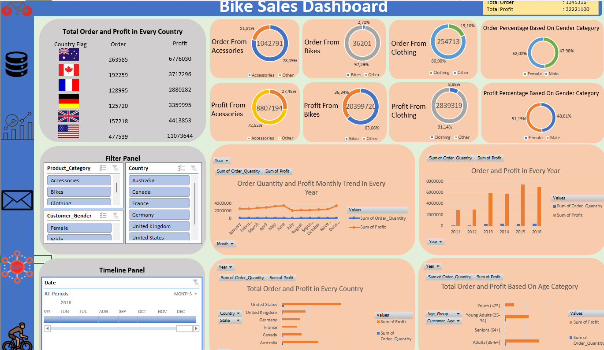
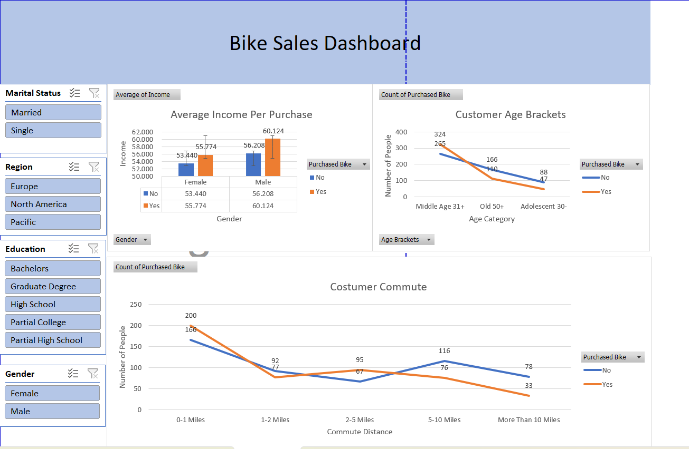
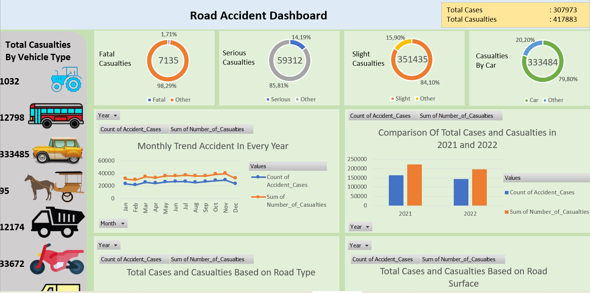
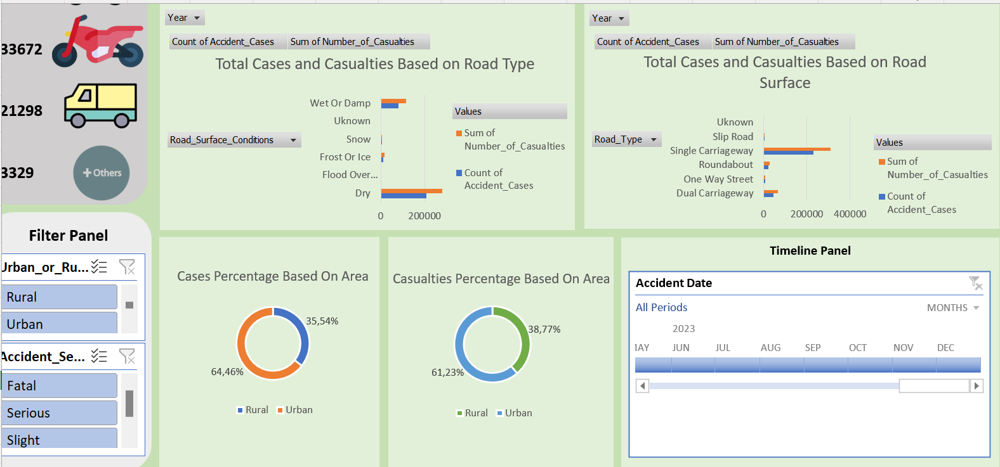

<div align="center">
  <h1>📊 Data Analysis Dashboard</h1>
  <em>Transform Raw Data into Strategic Intelligence — Entirely in Microsoft Excel</em>
  <p>
    
    
    
    
    
    
  </p>
</div>

---

## 📖 About This Project

This project delivers a fully interactive **business intelligence dashboard built entirely within Microsoft Excel**, transforming complex, multi-dimensional datasets into visually compelling and strategically actionable insights — with zero external tooling or programming dependencies.

Developed as part of the Data Warehouse and Business Intelligence course at **Universitas Diponegoro**, the dashboard demonstrates that Excel, when harnessed to its full capability, is a powerful analytical platform in its own right. From dynamic visualizations and pivot-based exploration to KPI tracking and real-time interactive filters, every component was designed with both analytical rigour and end-user experience in mind.

> **Core philosophy:** Data only creates value when it is understood. This dashboard bridges the gap between raw numbers and decisive, informed action.

---

## ✨ Key Features

**Dynamic Visualizations** — A suite of sophisticated line, bar, and pie charts communicates data trends with clarity, reducing cognitive load and enabling stakeholders to grasp complex relationships at a glance.

**Pivot Table Engine** — Robust pivot tables empower users to explore, filter, and cross-analyse data across multiple dimensions simultaneously, offering precision and flexibility without requiring any technical expertise.

**KPI Summary Panel** — High-impact metrics — including total sales, annual growth rates, and performance benchmarks — are surfaced through visually striking KPI cards designed for rapid strategic insight extraction.

**Interactive Slicers & Filters** — Seamlessly integrated slicers deliver real-time, user-driven customisation of every data view, making the dashboard accessible to both analysts and non-technical stakeholders alike.

**Advanced Excel Functions** — The analytical backbone leverages conditional formatting, `VLOOKUP`, `SUMIFS`, and automated calculations to ensure both computational accuracy and operational efficiency throughout.

**Iterative UX Optimisation** — Multiple rounds of user testing informed ongoing refinements to layout, readability, and interactivity — resulting in a polished, intuitive interface with measurably improved engagement.

---

## 🛠️ Technology Stack

| Category | Detail |
|----------|--------|
| **Platform** | Microsoft Excel (`.xlsx`) |
| **Visualisation** | Native Excel charts — line, bar, pie, and combo |
| **Data Modelling** | Pivot Tables with multi-dimensional slicing |
| **Analytics Functions** | `VLOOKUP`, `SUMIFS`, `COUNTIFS`, `IF`, conditional formatting |
| **Interactivity** | Slicers, dropdown filters, dynamic named ranges |
| **Output Format** | Self-contained `.xlsx` workbook |

---

## 🗃️ Data Sources

| Dataset | Records | Key Metrics | Analysis Focus |
|---------|---------|-------------|----------------|
| **Sales Data** | 112,036 rows | Revenue, Profit, Quantity | Time-series trends, regional performance |
| **Customer Segmentation** | 1,026 rows | Demographics, Purchase behaviour | Buyer personas, conversion analysis |
| **Accident Reports** | Variable | Location, Severity, Time | Safety analytics, trend identification |

---

## 🎥 Demo & Screenshots

**[👁 View Demo →](https://bers31.github.io/bernardo.github.io/Data_Analysis_Excel/)**

<div align="center">
  
</div>

---

## 🗺️ Project Scope

This project was developed as a **complete, self-contained academic deliverable** for the Data Warehouse and Business Intelligence course at Universitas Diponegoro. The table below reflects what was fully implemented and delivered.

| Module | Description | Status |
|--------|-------------|--------|
| 📊 **Sales Analysis** | Revenue, profit, and quantity trend analysis with regional and time-series breakdowns | ✅ Done |
| 👥 **Customer Segmentation** | Demographic and purchase behaviour analysis for buyer persona insights | ✅ Done |
| 🚨 **Accident Report Analysis** | Location, severity, and temporal trend analysis for safety insights | ✅ Done |
| 🎯 **KPI Summary Panel** | Total sales, annual growth, and performance benchmark cards for executive-level views | ✅ Done |
| 🔁 **Pivot Table Engine** | Multi-dimensional exploration across all three datasets | ✅ Done |
| 🎛️ **Slicers & Filters** | Real-time interactive filters for seamless data view customisation | ✅ Done |
| 📋 **Documentation** | Development process and technical implementation notes for long-term maintainability | ✅ Done |

---

## 📁 Project Structure

```
Data_Analysis_Excel/
│
├── 📂 workbooks/
│   ├── sales_dashboard.xlsx          # Sales analysis & KPI dashboard
│   ├── customer_segmentation.xlsx    # Customer persona analysis
│   └── accident_report.xlsx          # Safety analytics dashboard
│
├── 📂 images/                        # Dashboard screenshots
│
├── LICENSE
└── README.md
```

---

## 📄 License

This project is licensed under the **MIT License** — see the [LICENSE](LICENSE) file for details.

---

### Full Screenshots





---

## 📫 Contact & Connect

<p align="center">
<strong>👨‍💻 Bernardo Nandaniar Sunia — Computer Science Graduate</strong><br/>
Universitas Diponegoro 🎓
</p>

<p align="center">
<a href="https://linkedin.com/in/bernardo-sunia/">

</a>
<a href="https://mail.google.com/mail/?view=cm&fs=1&to=suniabernardo@gmail.com">

</a>
<a href="https://github.com/bers31">

</a>
<a href="https://bit.ly/bernardo-my_portfolio">

</a>
</p>

<p align="center">
⭐ <strong>If you found this project helpful, please give it a star!</strong> ⭐
</p>

<p align="center">
<em>Made with ❤️ by <a href="https://github.com/bers31">Bernardo</a> at Universitas Diponegoro</em><br/>

</p>
