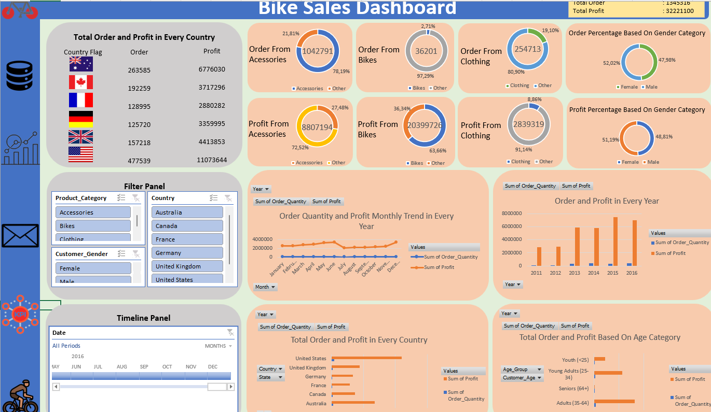
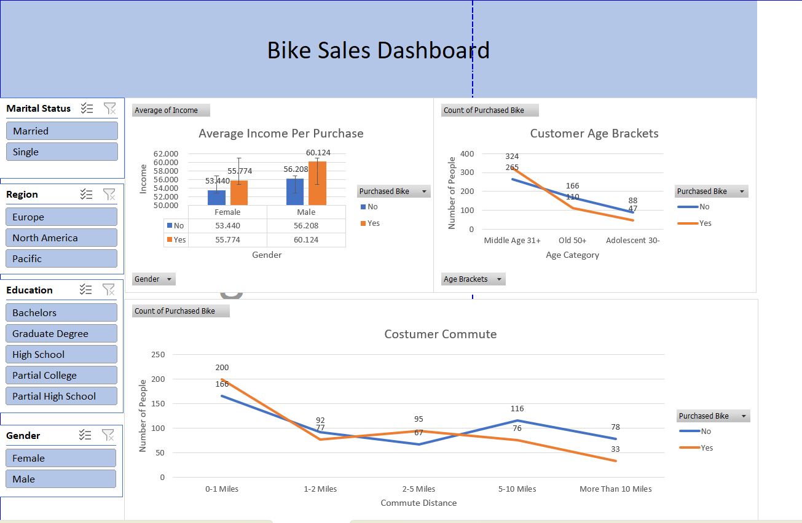
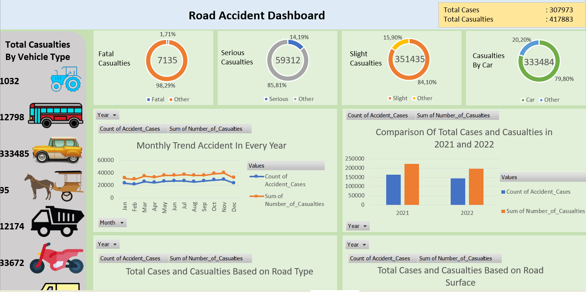
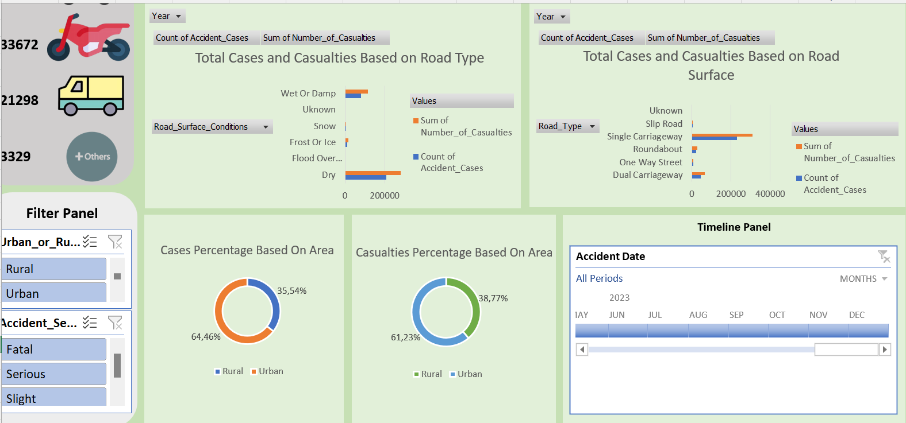

<div class="hero">

<h1>📊 Data Analysis Dashboard — Microsoft Excel</h1>

<p>Interactive Business Intelligence · KPI Reporting · Multi-Dimensional Data Analysis</p>

<p>
  
  
  
  
  
</p>

<p>
An interactive Microsoft Excel dashboard designed to transform complex datasets
into clear, actionable insights for data-informed decision-making.
</p>

</div>

---

## 📖 Project Overview

This project is an **interactive data analysis and business intelligence dashboard built entirely in Microsoft Excel**.

The dashboard demonstrates how Excel can be used not only for spreadsheet calculations, but also as a practical analytical platform for:

* Data exploration.
* Multi-dimensional analysis.
* KPI monitoring.
* Interactive filtering.
* Trend analysis.
* Business reporting.
* Visual communication of insights.

The project was developed as part of the **Data Warehouse and Business Intelligence course at Diponegoro University**.

The central workflow is:

```text id="8p4m2z"
Raw / Structured Data
        ↓
Data Preparation
        ↓
Pivot-Based Analysis
        ↓
Excel Calculations
        ↓
KPI Development
        ↓
Interactive Filters
        ↓
Visual Dashboard
        ↓
Business Insights
```

> **Core philosophy:** A dashboard should reduce the distance between raw data and a decision. The design therefore emphasizes clarity, interactivity, and rapid insight extraction.

---

## 🎯 Project Objectives

The dashboard was designed to achieve several analytical objectives:

1. Transform complex datasets into understandable business information.
2. Provide dynamic views across multiple dimensions.
3. Surface important KPIs for rapid decision-making.
4. Allow users to interactively filter and explore results.
5. Communicate trends and patterns through intuitive visualizations.
6. Improve usability through iterative user testing.
7. Provide documentation that supports future maintenance and enhancement.

---

## ✨ Key Features

### 📈 Dynamic Data Visualization

The dashboard uses native Excel charts to communicate trends and relationships visually.

Visualization types include:

* Line charts.
* Bar charts.
* Pie charts.
* Combined / comparative chart views.

The objective is to translate numerical patterns into information that can be understood quickly without reading raw tables.

### 🔄 Pivot Table Analysis

PivotTables provide the analytical engine for multi-dimensional exploration.

Users can analyze data across different dimensions without manually rebuilding calculations for every view.

Conceptually:

```text id="6d1x8v"
Dataset
   ↓
PivotTable
   ├── Filter
   ├── Group
   ├── Aggregate
   └── Compare
        ↓
    Dashboard View
```

### 🎯 KPI Summary Panel

The dashboard surfaces key performance indicators for fast executive-style interpretation.

Example KPI categories include:

* Total sales.
* Annual growth.
* Performance benchmarks.
* Other summary indicators derived from the underlying data.

The KPI layer intentionally prioritizes **high-value information above detailed tables**.

### 🎛️ Interactive Slicers & Filters

Interactive slicers and filters allow users to change dashboard views without modifying formulas manually.

The interaction model is:

```text id="p7x3w9"
Select Filter
     ↓
Pivot / Data View Updates
     ↓
Charts Update
     ↓
KPI Context Changes
     ↓
New Analytical Perspective
```

This makes the dashboard useful for both analysts and non-technical stakeholders.

### 🧮 Excel-Based Analytics

The analytical layer uses built-in Excel functionality, including:

* `VLOOKUP`
* `SUMIFS`
* `COUNTIFS`
* `IF`
* Conditional Formatting
* Automated calculations

These functions support both data preparation and dashboard-level calculations.

### 🎨 Iterative UX Optimization

The dashboard was refined through user testing and iterative design changes.

Attention was given to:

* Layout.
* Readability.
* Visual hierarchy.
* Filter accessibility.
* Information density.
* Overall usability.

The objective was not only analytical correctness, but also an interface that users could understand and operate efficiently.

---

## 🧠 Analytical Workflow

The complete dashboard development process can be summarized as:

```text id="6f4m1q"
Data
 ↓
Understand
 ↓
Prepare
 ↓
Analyze
 ↓
Summarize
 ↓
Visualize
 ↓
Interact
 ↓
Evaluate
 ↓
Refine
```

This iterative approach combines analytical development with user-experience considerations.

---

## 📊 Dashboard Design Principles

### 1. Information Hierarchy

High-level KPIs are presented before detailed analytical views so that users can understand the most important signals immediately.

### 2. Interactive Exploration

Slicers and filters allow users to move from broad summaries toward specific analytical views.

### 3. Visual Simplicity

Charts are designed to communicate trends without introducing unnecessary visual complexity.

### 4. Consistent Analytical Logic

PivotTables and standardized formulas help ensure that different dashboard views remain logically consistent.

### 5. User-Centered Refinement

User testing is used to identify usability issues and guide subsequent dashboard improvements.

---

## 🗂️ Analytical Components

| Component                     | Purpose                                   |
| ----------------------------- | ----------------------------------------- |
| 📋 **Structured Data**        | Provides the foundation for analysis      |
| 🔁 **PivotTables**            | Enables multi-dimensional aggregation     |
| 🎯 **KPI Panel**              | Surfaces high-value metrics               |
| 🎛️ **Slicers**               | Enables interactive filtering             |
| 📈 **Line Charts**            | Communicates trends over time             |
| 📊 **Bar Charts**             | Supports category comparisons             |
| 🥧 **Pie Charts**             | Shows proportional composition            |
| 🧮 **Excel Formulas**         | Performs supporting calculations          |
| 🎨 **Conditional Formatting** | Highlights meaningful values and patterns |

---

## 🔬 Technical Implementation

### PivotTable-Based Analysis

PivotTables are used to aggregate and reorganize data dynamically.

This allows multiple analytical perspectives to be derived from the same underlying dataset.

### Formula-Driven Calculations

Excel functions provide reusable calculation logic for metrics and supporting analysis.

For example:

```text id="p8x6m2"
SUMIFS
   ↓
Conditional aggregation

COUNTIFS
   ↓
Conditional counting

VLOOKUP
   ↓
Reference / lookup mapping

IF
   ↓
Conditional business logic
```

### Conditional Formatting

Conditional formatting is used to improve visual interpretation by highlighting important values, thresholds, or patterns.

### Dashboard Interactivity

Slicers and filters provide a controlled interaction layer over the analytical model.

This allows the workbook to function as an **interactive analytical tool** rather than a static report.

---

## 🎯 KPI Framework

The dashboard emphasizes KPI-oriented reporting.

A typical analytical hierarchy is:

```text id="m2v9q4"
                    BUSINESS OVERVIEW
                           │
              ┌────────────┼────────────┐
              ↓            ↓            ↓
          Total Sales   Growth Rate   Benchmark
              │            │            │
              └────────────┼────────────┘
                           ↓
                    Detailed Analysis
                           ↓
                    Filtered Insights
```

This structure helps users move from executive-level summaries to detailed investigation.

---

## 🧪 User Testing & Iterative Optimization

The project incorporates user testing as part of the dashboard development process.

The refinement cycle follows:

```text id="k5r3x8"
Initial Dashboard
       ↓
User Testing
       ↓
Identify Usability Issues
       ↓
Layout / Interaction Refinement
       ↓
Re-Test
       ↓
Improved Dashboard
```

Areas considered during refinement include:

* Ease of navigation.
* Visual clarity.
* KPI visibility.
* Filter usability.
* Chart readability.
* Information hierarchy.

> **Design principle:** analytical correctness alone is not sufficient; the resulting dashboard must also be understandable and usable by its intended audience.

---

## 📈 From Data to Decision

The dashboard is designed to support a progression from raw information to strategic interpretation.

```text id="8z5y2q"
Raw Data
    ↓
Descriptive Analysis
    ↓
KPI Extraction
    ↓
Trend Identification
    ↓
Interactive Exploration
    ↓
Business Insight
    ↓
Data-Informed Decision
```

The workbook therefore functions as both an analytical environment and a communication medium.

---

## 🛠️ Technology Stack

| Layer                 | Technology                           | Purpose                                       |
| --------------------- | ------------------------------------ | --------------------------------------------- |
| 📊 **Platform**       | **Microsoft Excel**                  | Complete analytical and dashboard environment |
| 🔄 **Data Modeling**  | **PivotTables**                      | Multi-dimensional aggregation                 |
| 🎛️ **Interactivity** | **Slicers / Filters**                | User-driven analysis                          |
| 📈 **Visualization**  | **Excel Charts**                     | Trend and comparison visualization            |
| 🧮 **Analytics**      | **VLOOKUP / SUMIFS / COUNTIFS / IF** | Analytical calculations                       |
| 🎨 **Formatting**     | **Conditional Formatting**           | Visual emphasis and interpretation            |
| 🎯 **Reporting**      | **KPI Panels**                       | High-level performance monitoring             |

---

## 🖥️ Dashboard Architecture

The workbook can be conceptualized as four logical layers.

### 📥 Data Layer

Contains the structured data used as the source for analytical calculations and PivotTables.

### 🔄 Analysis Layer

Uses PivotTables and formulas to aggregate, filter, and derive analytical metrics.

### 📊 Visualization Layer

Transforms analytical outputs into charts, KPI panels, and visual summaries.

### 🎛️ Interaction Layer

Uses slicers and filters to allow users to change the analytical perspective dynamically.

```text id="7t2m5c"
┌──────────────────────┐
│      DATA LAYER      │
│ Structured Workbook  │
└──────────┬───────────┘
           ↓
┌──────────────────────┐
│    ANALYSIS LAYER    │
│ PivotTables + Excel  │
│       Formulas       │
└──────────┬───────────┘
           ↓
┌──────────────────────┐
│  VISUALIZATION LAYER │
│ Charts + KPI Panels  │
└──────────┬───────────┘
           ↓
┌──────────────────────┐
│   INTERACTION LAYER  │
│   Slicers + Filters  │
└──────────────────────┘
```

---

## 🗺️ Project Scope

This project was developed as a **self-contained academic Data Warehouse and Business Intelligence project at Diponegoro University**.

| Module                        | Description                                     | Status        |
| ----------------------------- | ----------------------------------------------- | ------------- |
| 📊 **Data Analysis**          | Transform structured data into analytical views | ✅ Implemented |
| 🔁 **PivotTable Analysis**    | Multi-dimensional data exploration              | ✅ Implemented |
| 🎯 **KPI Dashboard**          | High-level performance indicators               | ✅ Implemented |
| 🎛️ **Interactive Slicers**   | Dynamic dashboard filtering                     | ✅ Implemented |
| 📈 **Line Charts**            | Trend analysis and time-based visualization     | ✅ Implemented |
| 📊 **Bar Charts**             | Comparative category analysis                   | ✅ Implemented |
| 🥧 **Pie Charts**             | Proportion and composition analysis             | ✅ Implemented |
| 🧮 **Excel Formulas**         | Automated analytical calculations               | ✅ Implemented |
| 🎨 **Conditional Formatting** | Visual analytical emphasis                      | ✅ Implemented |
| 🧪 **User Testing**           | Usability evaluation and iterative refinement   | ✅ Applied     |
| 📚 **Documentation**          | Technical and development documentation         | ✅ Implemented |

---

## 🎥 Demo

### 🖥️ Live Dashboard Presentation

<div align="center">

<p>
<strong>📊 Microsoft Excel Data Analysis Dashboard</strong>
</p>

<p>
<a href="https://bers31.github.io/bernardo.github.io/Data_Analysis_Excel/">
<strong>► View Project Demo</strong>
</a>
</p>

</div>

### 📸 Dashboard Preview



*Interactive Excel dashboard demonstrating KPI reporting, visualization, and analytical exploration.*

---

## 📸 Full Screenshots








---

## 💼 Portfolio Alignment

The project directly reflects the capabilities represented in the professional project description:

| Professional Capability              | Project Evidence                             |
| ------------------------------------ | -------------------------------------------- |
| Advanced Excel dashboard development | Interactive BI dashboard                     |
| Dynamic visualizations               | Line, bar, and pie charts                    |
| Multi-dimensional analysis           | PivotTables                                  |
| KPI reporting                        | KPI summary panel                            |
| Interactive analysis                 | Slicers and filters                          |
| Advanced Excel functions             | VLOOKUP, SUMIFS, COUNTIFS, IF                |
| UX optimization                      | User testing and iterative refinement        |
| Data-driven decision support         | KPI and trend-oriented analytical views      |
| Documentation                        | Development and implementation documentation |

> **Portfolio positioning:** This project demonstrates the ability to turn spreadsheet-based data into an interactive analytical product rather than simply producing static Excel reports.

---

## 📚 Documentation & Maintainability

The project includes documentation describing the development approach and technical implementation.

Documentation supports:

* Understanding dashboard logic.
* Maintaining analytical calculations.
* Extending the workbook.
* Handing the project over to future users or developers.
* Supporting future dashboard enhancements.

The workbook is therefore intended to remain understandable beyond the initial implementation.

---

## 🔭 Future Development

Potential enhancements include:

* Automated data refresh workflows.
* More advanced Excel data modeling.
* Power Query integration.
* Power Pivot / DAX-based modeling.
* More granular KPI drill-downs.
* Automated report generation.
* Expanded dashboard navigation.
* Additional scenario and what-if analysis.

These represent possible future directions and are not presented as features of the current implementation.

---

## 📄 License

The original source workbook structure, formulas, dashboard design, and documentation intentionally published in this repository are licensed under the **MIT License**.

See [`LICENSE`](LICENSE) for the complete license text.

> Any third-party datasets, logos, templates, fonts, icons, or other external assets remain subject to their respective licenses and terms.

---

<div class="contact-hero">

<p><strong>Interested in the project?</strong></p>

<p>
👨‍💻 <strong>Bernardo Nandaniar Sunia</strong><br/>
Computer Science Graduate — Diponegoro University<br/>
Data Analysis · Business Intelligence · Microsoft Excel
</p>

<p>
<a href="https://linkedin.com/in/bernardo-sunia/">

</a>
<a href="https://mail.google.com/mail/?view=cm&fs=1&to=suniabernardo@gmail.com">

</a>
<a href="https://github.com/bers31">

</a>
<a href="https://bit.ly/bernardo-my_portfolio">

</a>
</p>

<p>
<em>Microsoft Excel · Data Analysis · Business Intelligence · Interactive Dashboards</em>
</p>

</div>

---

## 📌 Conclusion

This project demonstrates how **Microsoft Excel can be used as a complete analytical and business-intelligence environment**, combining structured data analysis, PivotTables, KPI reporting, interactive slicers, visualization, and advanced spreadsheet formulas.

The focus is not simply on presenting numbers, but on transforming analytical outputs into a dashboard that supports rapid interpretation and data-informed decision-making.

Through iterative user testing and refinement, the dashboard was designed to balance **analytical rigor with usability**, demonstrating the practical application of Excel for interactive business reporting and stakeholder-facing analytics.