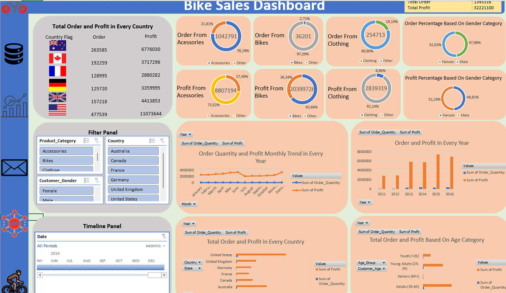

# 📊 Data Analysis Dashboard
*Transform Excel Analytics into Interactive Intelligence*

<div align="center">


</div>

---

## 📖 About This Project

This project consolidates multiple Excel workbook analyses into a **unified Data Analysis Dashboard** with role-based access control. Born from the need to transform static Excel reports into dynamic, interactive intelligence, this application serves as a comprehensive solution for data visualization, user management, and business insights.

**Why This Matters:** In today's data-driven world, stakeholders need instant access to relevant insights. This dashboard eliminates the friction between raw data and actionable intelligence, providing a centralized platform where students, faculty, and administrators can access tailored analytics based on their roles and responsibilities.

---

## ✨ Key Features

<picture>
  <source media="(prefers-color-scheme: dark)" srcset="https://via.placeholder.com/20/00D4AA/000000?text=+">
  
</picture> **Role-Based Access Control** - Tailored dashboards for Admin, Students, Lecturers, Department Heads, and Deans

<picture>
  <source media="(prefers-color-scheme: dark)" srcset="https://via.placeholder.com/20/FF6B6B/000000?text=+">
  
</picture> **Real-Time Analytics** - Interactive visualizations with live data updates

<picture>
  <source media="(prefers-color-scheme: dark)" srcset="https://via.placeholder.com/20/4ECDC4/000000?text=+">
  
</picture> **Automated ETL Pipeline** - Seamless Excel-to-Database transformation

<picture>
  <source media="(prefers-color-scheme: dark)" srcset="https://via.placeholder.com/20/45B7D1/000000?text=+">
  
</picture> **Multi-Dataset Integration** - Sales analysis, customer segmentation, and accident reporting

<picture>
  <source media="(prefers-color-scheme: dark)" srcset="https://via.placeholder.com/20/FFA07A/000000?text=+">
  
</picture> **Export Capabilities** - PDF/CSV reports with customizable layouts

<picture>
  <source media="(prefers-color-scheme: dark)" srcset="https://via.placeholder.com/20/98D8C8/000000?text=+">
  
</picture> **Responsive Design** - Optimized for desktop, tablet, and mobile devices

---

## 🛠️ Technology Stack

<table>
<tr>
<td align="center" width="96">

<br><strong>React</strong>
</td>
<td align="center" width="96">

<br><strong>Node.js</strong>
</td>
<td align="center" width="96">

<br><strong>PostgreSQL</strong>
</td>
<td align="center" width="96">

<br><strong>Python</strong>
</td>
<td align="center" width="96">

<br><strong>Docker</strong>
</td>
</tr>
<tr>
<td align="center"><strong>Frontend</strong></td>
<td align="center"><strong>Backend</strong></td>
<td align="center"><strong>Database</strong></td>
<td align="center"><strong>ETL</strong></td>
<td align="center"><strong>DevOps</strong></td>
</tr>
</table>

<details>
<summary><strong>📋 Complete Tech Specifications</strong></summary>

| Category | Technologies |
|----------|-------------|
| **Frontend** | React 18.2.0, Vite, Tailwind CSS, Recharts, React Router |
| **Backend** | Node.js, Express.js, JWT Authentication, Bcrypt |
| **Database** | PostgreSQL 15+, Sequelize ORM |
| **ETL Pipeline** | Python, Pandas, NumPy, SQLAlchemy |
| **Visualization** | Chart.js, ECharts, React-Recharts |
| **DevOps** | Docker, Docker Compose, GitHub Actions |
| **Testing** | Jest, React Testing Library, Supertest |

</details>

---

## 🚀 Quick Start Guide

### Prerequisites
```bash
Node.js >= 18.0.0
Python >= 3.8
PostgreSQL >= 13
Docker (optional)
```

### Installation & Setup

**1. Clone the Repository**
```bash
git clone https://github.com/bers31/bernardo.github.io.git
cd bernardo.github.io/Data_Analysis_Excel
```

**2. Backend Setup**
```bash
cd backend
npm install
cp .env.example .env
# Configure your database connection in .env
npm run db:migrate
npm run db:seed
```

**3. Frontend Setup**
```bash
cd ../frontend
npm install
cp .env.example .env
# Configure API endpoints in .env
```

**4. ETL Pipeline Setup**
```bash
cd ../etl
pip install -r requirements.txt
python setup_pipeline.py
```

**5. Start Development Servers**
```bash
# Terminal 1 - Backend
cd backend && npm run dev

# Terminal 2 - Frontend  
cd frontend && npm run dev

# Terminal 3 - ETL (optional)
cd etl && python scheduler.py
```

**6. Docker Alternative (Recommended)**
```bash
docker-compose up -d
# Access application at http://localhost:3000
```

---

## 🎥 Demo & Screenshots

<div align="center">

### 🌟 Live Demo
**[View Dashboard →](https://bers31.github.io/bernardo.github.io/)**

<picture>
  <source media="(prefers-color-scheme: dark)" srcset="https://via.placeholder.com/800x400/2D3748/E2E8F0?text=Dashboard+Screenshot+(Dark+Mode)">
  
</picture>

</div>

<details>
<summary><strong>📱 View More Screenshots</strong></summary>

| Feature | Preview |
|---------|---------|
| **Login Page** |  |
| **Sales Dashboard** |  |
| **User Management** |  |
| **Data Upload** |  |

</details>

---

## 🗃️ Data Sources & Schema

### 📊 Integrated Datasets

<table>
<tr>
<th>Dataset</th>
<th>Records</th>
<th>Key Metrics</th>
<th>Analysis Focus</th>
</tr>
<tr>
<td><strong>Sales Data</strong></td>
<td>112,036 rows</td>
<td>Revenue, Profit, Quantity</td>
<td>Time series, Regional performance</td>
</tr>
<tr>
<td><strong>Customer Segmentation</strong></td>
<td>1,026 rows</td>
<td>Demographics, Purchase behavior</td>
<td>Buyer personas, Conversion analysis</td>
</tr>
<tr>
<td><strong>Accident Reports</strong></td>
<td>Pending upload</td>
<td>Location, Severity, Time</td>
<td>Safety analytics, Trend analysis</td>
</tr>
</table>

### 🏗️ Database Architecture

```sql
-- Core Tables Structure
users (id, name, email, role, created_at)
sales (id, date, product_id, region_id, quantity, revenue, profit)
products (id, name, category, sub_category)
regions (id, name, country)
bike_buyers (id, demographics, purchase_behavior)
```

<details>
<summary><strong>🔍 View Complete Schema</strong></summary>

```sql
-- Users & Authentication
CREATE TABLE users (
    id SERIAL PRIMARY KEY,
    name VARCHAR(255) NOT NULL,
    email VARCHAR(255) UNIQUE NOT NULL,
    password_hash VARCHAR(255) NOT NULL,
    role VARCHAR(50) DEFAULT 'student',
    created_at TIMESTAMP DEFAULT CURRENT_TIMESTAMP,
    updated_at TIMESTAMP DEFAULT CURRENT_TIMESTAMP
);

-- Sales Analytics
CREATE TABLE sales (
    id SERIAL PRIMARY KEY,
    date DATE NOT NULL,
    product_id INTEGER REFERENCES products(id),
    region_id INTEGER REFERENCES regions(id),
    customer_age INTEGER,
    quantity INTEGER NOT NULL,
    unit_cost DECIMAL(10,2),
    unit_price DECIMAL(10,2),
    revenue DECIMAL(12,2),
    profit DECIMAL(12,2),
    created_at TIMESTAMP DEFAULT CURRENT_TIMESTAMP
);

-- Additional tables: products, regions, bike_buyers...
```

</details>

---

## 🎯 Project Roadmap

<table>
<tr>
<th>Phase</th>
<th>Milestone</th>
<th>Target Date</th>
<th>Status</th>
</tr>
<tr>
<td rowspan="3"><strong>Phase 1</strong><br><em>Foundation</em></td>
<td>Database Schema & ETL Pipeline</td>
<td>Week 1-2</td>
<td>✅ Complete</td>
</tr>
<tr>
<td>Authentication & Role Management</td>
<td>Week 2-3</td>
<td>🔄 In Progress</td>
</tr>
<tr>
<td>Basic Dashboard Interface</td>
<td>Week 3-4</td>
<td>📋 Planned</td>
</tr>
<tr>
<td rowspan="3"><strong>Phase 2</strong><br><em>Core Features</em></td>
<td>Sales Analytics Dashboard</td>
<td>Week 5-6</td>
<td>📋 Planned</td>
</tr>
<tr>
<td>Customer Segmentation Module</td>
<td>Week 7-8</td>
<td>📋 Planned</td>
</tr>
<tr>
<td>Export & Reporting Features</td>
<td>Week 8-9</td>
<td>📋 Planned</td>
</tr>
<tr>
<td rowspan="2"><strong>Phase 3</strong><br><em>Enhancement</em></td>
<td>Real-time Data Streaming</td>
<td>Week 10-11</td>
<td>🔮 Future</td>
</tr>
<tr>
<td>Mobile Optimization & PWA</td>
<td>Week 12</td>
<td>🔮 Future</td>
</tr>
</table>

---

## 🤝 Contributing

We welcome contributions from the community! Whether you're fixing bugs, adding features, or improving documentation, your help makes this project better.

### How to Contribute

**1. Fork & Clone**
```bash
git fork https://github.com/bers31/bernardo.github.io
git clone https://github.com/YOUR_USERNAME/bernardo.github.io
cd bernardo.github.io/Data_Analysis_Excel
```

**2. Create Feature Branch**
```bash
git checkout -b feature/amazing-feature
```

**3. Make Your Changes**
```bash
# Make your improvements
git add .
git commit -m "Add amazing feature"
```

**4. Submit Pull Request**
```bash
git push origin feature/amazing-feature
# Create PR through GitHub interface
```

### 📋 Development Guidelines

- Follow existing code style and conventions
- Add tests for new features
- Update documentation as needed
- Ensure all tests pass before submitting
- Use meaningful commit messages

<details>
<summary><strong>🔧 Code Style Guide</strong></summary>

```javascript
// JavaScript/React
- Use ES6+ features
- Follow Airbnb style guide
- Use functional components with hooks
- Implement proper error handling

// Python (ETL)
- Follow PEP 8 standards
- Use type hints where applicable
- Implement proper logging
- Write comprehensive docstrings
```

</details>

---

## 📄 License

This project is licensed under the **MIT License** - see the [LICENSE](LICENSE) file for details.

```
MIT License

Copyright (c) 2025 Bernardo - Universitas Diponegoro

Permission is hereby granted, free of charge, to any person obtaining a copy
of this software and associated documentation files (the "Software")...
```

---

## 📫 Contact & Connect

<div align="center">

**Bernardo** | *Information Technology Student*  
**Universitas Diponegoro** | *Semarang, Indonesia*

<table>
<tr>
<td align="center">
<a href="https://linkedin.com/in/YOUR_LINKEDIN">

</a>
</td>
<td align="center">
<a href="mailto:your.email@domain.com">

</a>
</td>
<td align="center">
<a href="https://github.com/bers31">

</a>
</td>
</tr>
</table>

---

<sub>⭐ **Star this repository** if you find it helpful! | 🍴 **Fork it** to contribute | 📢 **Share it** with your network</sub>

<picture>
  <source media="(prefers-color-scheme: dark)" srcset="https://via.placeholder.com/400x100/2D3748/E2E8F0?text=Thank+you+for+visiting!">
  
</picture>

</div>

---

<div align="center">
<sub>Built with ❤️ for the data community | Powered by modern web technologies | Designed for impact</sub>
</div>

### Screenshots



### Impact and Results
- **Simplification of Complex Data**: By using effective visualizations, this dashboard simplifies complex data into easily understandable information.
- **Faster Decision-Making**: The dashboard helps users quickly identify relevant patterns and trends, supporting more informed decision-making.
