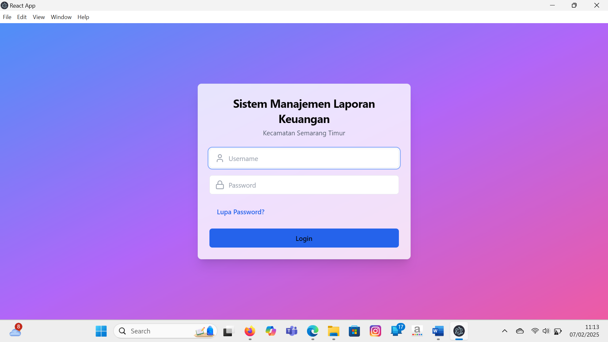
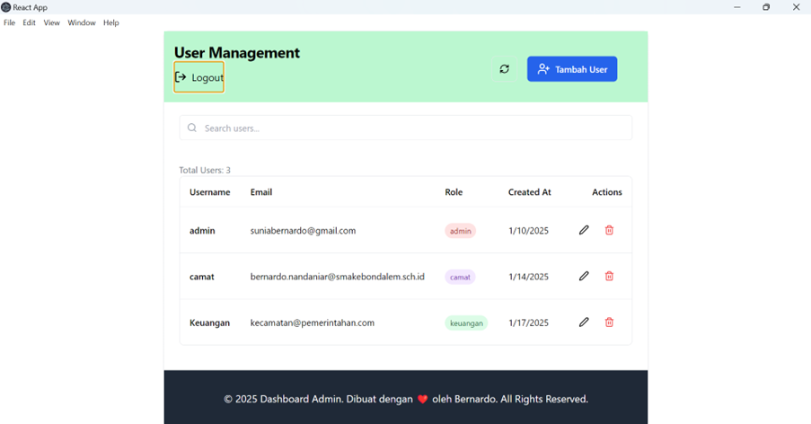
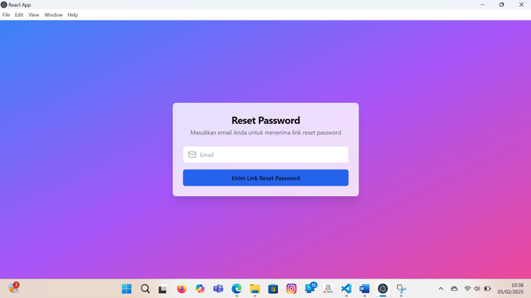
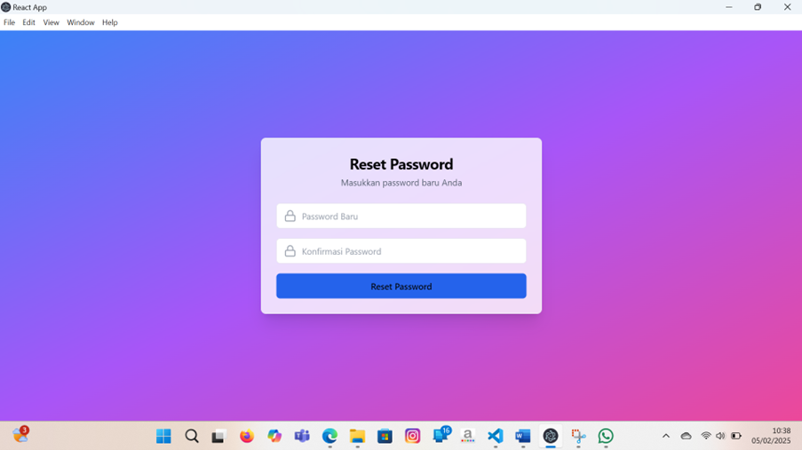
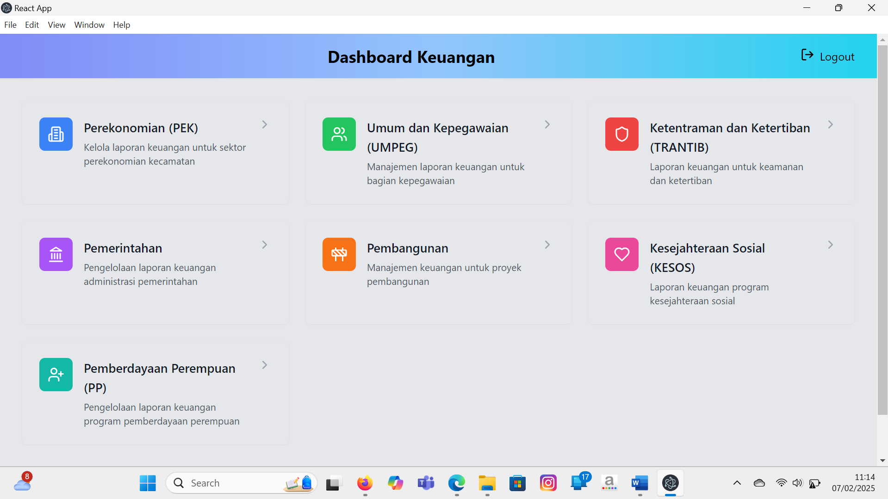
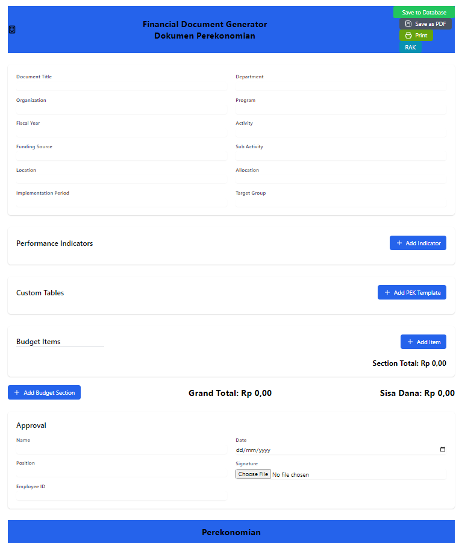
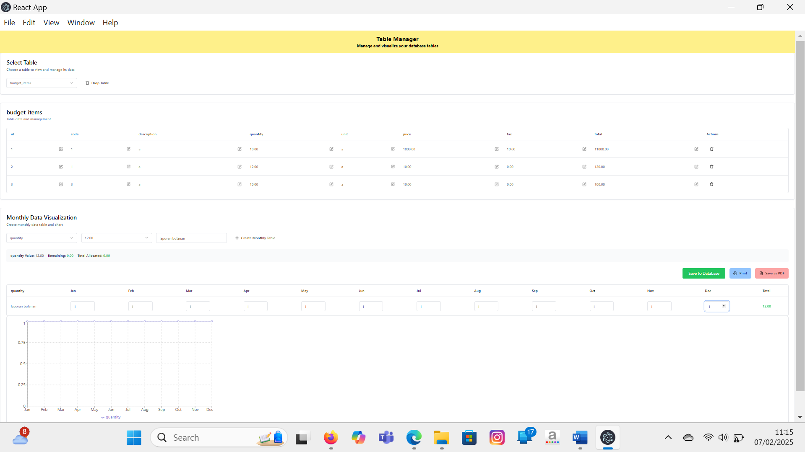

# 💼 Financial Report Management System
> *Streamlining financial reporting workflows with modern web technology and role-based access control*

<div align="center">


</div>

---

## 📖 Project Overview

<div align="center">

</div>

The **Financial Report Management System** is a comprehensive web application designed to revolutionize financial reporting processes at the district level. Built specifically for East Semarang District, this system addresses the critical need for standardized, efficient, and secure financial document management across multiple departments.

### 🎯 Background & Benefits

Traditional financial reporting in government institutions often suffers from inconsistent formats, manual data entry errors, and lack of proper audit trails. This system provides a unified platform that:

- **Reduces manual work by 70%** through automated form generation and calculation
- **Ensures data accuracy** with built-in budget validation and error checking
- **Enhances transparency** through comprehensive audit logging and role-based access
- **Improves security** with token-based authentication and route protection

---

## ✨ Key Features

<table>
<tr>
<td width="50%">

<h3>🔐 Authentication & Security</h3>
<ul>
<li>Multi-role user management (Admin, Camat, Sekcam, Finance)</li>
<li>Token-based authentication with email verification</li>
<li>Protected routes based on user permissions</li>
<li>Password reset functionality via SendGrid</li>
</ul>

<h3>📊 Dynamic Form Generation</h3>
<ul>
<li>Customizable financial report templates</li>
<li>Real-time budget validation and calculations</li>
<li>Dynamic table creation and management</li>
<li>Performance indicator tracking</li>
</ul>

</td>
<td width="50%">

<h3>📈 Data Visualization</h3>
<ul>
<li>Interactive charts and graphs using Recharts</li>
<li>Monthly financial reports with visual analytics</li>
<li>Export capabilities (PDF generation via jsPDF)</li>
<li>Responsive dashboard for all device types</li>
</ul>

<h3>🏛️ Department Management</h3>
<ul>
<li>Support for multiple departments (PEK, UMPEG, TRANTIB, etc.)</li>
<li>Centralized document storage and retrieval</li>
<li>Audit trail for all financial transactions</li>
<li>Bulk data import/export functionality</li>
</ul>

</td>
</tr>
</table>

---

## 🛠️ Technology Stack

<div align="center">

<h3>Frontend Technologies</h3>
<table>
<tr>
<th>Technology</th>
<th>Version</th>
<th>Purpose</th>
</tr>
<tr>
<td></td>
<td>18+</td>
<td>UI Framework</td>
</tr>
<tr>
<td></td>
<td>3.x</td>
<td>Styling</td>
</tr>
<tr>
<td></td>
<td>Latest</td>
<td>State Management</td>
</tr>
<tr>
<td></td>
<td>6.x</td>
<td>Routing</td>
</tr>
<tr>
<td></td>
<td>2.x</td>
<td>Data Visualization</td>
</tr>
</table>

<h3>Backend Technologies</h3>
<table>
<tr>
<th>Technology</th>
<th>Version</th>
<th>Purpose</th>
</tr>
<tr>
<td></td>
<td>18+</td>
<td>Runtime Environment</td>
</tr>
<tr>
<td></td>
<td>4.x</td>
<td>Web Framework</td>
</tr>
<tr>
<td></td>
<td>Latest</td>
<td>Email Service</td>
</tr>
<tr>
<td></td>
<td>Latest</td>
<td>Authentication</td>
</tr>
</table>

</div>

---

## 🏗️ System Architecture

<pre>
```
┌─────────────────────────────────────────────────────────────────┐
│                          CLIENT LAYER                           │
├─────────────────┬─────────────────┬─────────────────────────────┤
│   Login Page    │  Dashboard      │     Admin Panel             │
│                 │                 │                             │
│ • Authentication│ • Role-based    │ • User Management           │
│ • Password Reset│   Navigation    │ • System Configuration      │
│                 │ • Quick Actions │ • Audit Logs                │
└─────────────────┴─────────────────┴─────────────────────────────┘
                           │
                           ▼
┌─────────────────────────────────────────────────────────────────┐
│                      APPLICATION LAYER                          │
├─────────────────┬─────────────────┬─────────────────────────────┤
│ Financial Forms │  Table Manager  │    Document Generator       │
│                 │                 │                             │
│ • Dynamic Forms │ • CRUD Tables   │ • PDF Export                │
│ • Validation    │ • Data Import   │ • Template Management       │
│ • Calculations  │ • Charts        │ • Batch Processing          │
└─────────────────┴─────────────────┴─────────────────────────────┘
                           │
                           ▼
┌─────────────────────────────────────────────────────────────────┐
│                       SERVICE LAYER                             │
├─────────────────┬─────────────────┬─────────────────────────────┤
│ Auth Service    │  Email Service  │    Data Service             │
│                 │                 │                             │
│ • JWT Tokens    │ • SendGrid      │ • Database Operations       │
│ • Role Checking │ • Notifications │ • File Management           │
│ • Session Mgmt  │ • Templates     │ • Backup & Recovery         │
└─────────────────┴─────────────────┴─────────────────────────────┘
                           │
                           ▼
┌─────────────────────────────────────────────────────────────────┐
│                        DATA LAYER                               │
├─────────────────┬─────────────────┬─────────────────────────────┤
│   User Data     │ Financial Data  │     System Data             │
│                 │                 │                             │
│ • Profiles      │ • Reports       │ • Configurations            │
│ • Roles         │ • Tables        │ • Logs                      │
│ • Sessions      │ • Documents     │ • Backups                   │
└─────────────────┴─────────────────┴─────────────────────────────┘
```
</pre>

---

## 🚀 Installation & Setup

### Prerequisites
```bash
# Ensure you have Node.js installed
node --version  # Should be 18.0.0 or higher
npm --version   # Should be 8.0.0 or higher
```

### Quick Start
```bash
# Clone the repository
git clone https://github.com/bers31/bernardo.github.io.git
cd bernardo.github.io

# Install dependencies
npm install

# Set up environment variables
cp .env.example .env
# Edit .env with your configuration

# Start development server
npm run dev

# Build for production
npm run build

# Start production server
npm start
```

### Environment Configuration
```bash
# Backend Configuration
NODE_ENV=development
PORT=3001
JWT_SECRET=your_jwt_secret_here
SENDGRID_API_KEY=your_sendgrid_api_key
DATABASE_URL=your_database_connection_string

# Frontend Configuration
REACT_APP_API_URL=http://localhost:3001/api
REACT_APP_ENV=development
```

---

## 🎥 Demo & Screenshots

<div align="center">

<h3>🔐 Login Interface</h3>


<h3>📊 Financial Dashboard</h3>


<h3>📋 Report Generation</h3>


<h3>👥 User Management</h3>


</div>

<h3>🌐 <a href="https://bers31.github.io/bernardo.github.io/Financial_Reporting_Application/">Live Demo</a></h3>

---

## 📅 Development Roadmap

<div align="center">

<table>
<tr>
<th>Phase</th>
<th>Milestone</th>
<th>Target Date</th>
<th>Status</th>
</tr>
<tr>
<td><strong>Phase 1</strong></td>
<td>Core Authentication System</td>
<td>Q1 2024</td>
<td>✅ Complete</td>
</tr>
<tr>
<td><strong>Phase 2</strong></td>
<td>Financial Form Builder</td>
<td>Q1 2024</td>
<td>✅ Complete</td>
</tr>
<tr>
<td><strong>Phase 3</strong></td>
<td>PDF Export & Reporting</td>
<td>Q2 2024</td>
<td>✅ Complete</td>
</tr>
<tr>
<td><strong>Phase 4</strong></td>
<td>Advanced Analytics</td>
<td>Q2 2025</td>
<td>🔄 In Progress</td>
</tr>
<tr>
<td><strong>Phase 5</strong></td>
<td>Mobile App Integration</td>
<td>Q3 2025</td>
<td>📋 Planned</td>
</tr>
<tr>
<td><strong>Phase 6</strong></td>
<td>API Documentation</td>
<td>Q3 2026</td>
<td>📋 Planned</td>
</tr>
</table>

</div>

---

## 🤝 Contributing

We welcome contributions from the community! Here's how you can help:

### Getting Started
1. **Fork** the repository
2. **Create** a feature branch (`git checkout -b feature/amazing-feature`)
3. **Commit** your changes (`git commit -m 'Add some amazing feature'`)
4. **Push** to the branch (`git push origin feature/amazing-feature`)
5. **Open** a Pull Request

### Development Guidelines
- Follow the existing code style and conventions
- Write clear, concise commit messages
- Include tests for new features
- Update documentation as needed
- Ensure all tests pass before submitting

### Areas We Need Help With
- 🐛 Bug fixes and optimization
- 🌐 Internationalization (i18n)
- 📱 Mobile responsiveness improvements
- 🧪 Test coverage expansion
- 📚 Documentation improvements

---

## 📄 **License**

This project is licensed under the **MIT License** - see the [LICENSE](LICENSE) file for details.

```
MIT License

Copyright (c) 2024 Bernardo - Universitas Diponegoro

Permission is hereby granted, free of charge, to any person obtaining a copy
of this software and associated documentation files (the "Software"), to deal
in the Software without restriction, including without limitation the rights
to use, copy, modify, merge, publish, distribute, sublicense, and/or sell
copies of the Software, subject to the following conditions:

The above copyright notice and this permission notice shall be included in all
copies or substantial portions of the Software.
```

## 📫 Contact & Connect

<p align="center">
<strong>👨‍💻 Bernardo - Computer Science Student</strong><br/>
Universitas Diponegoro 🎓
</p>

<p align="center">
<a href="https://linkedin.com/in/bernardo-sunia/">

</a>
<a href="https://mail.google.com/mail/?view=cm&fs=1&to=suniabernardo@gmail.com">

</a>
<a href="https://github.com/bers31">

</a>
<a href="https://bit.ly/bernardo-my_portfolio">

</a>
</p>

<p align="center">
⭐ <strong>If you found this project helpful, please give it a star!</strong> ⭐
</p>

<p align="center">
<em>Made with ❤️ by <a href="https://github.com/bers31">Bernardo</a> at Universitas Diponegoro</em><br/>

</p>

---

### Full Screenshots








## Conclusion
This project demonstrates the creation of an engaging 3D game using C++ and OpenGL, showcasing advanced graphics techniques and interactive gameplay elements.
