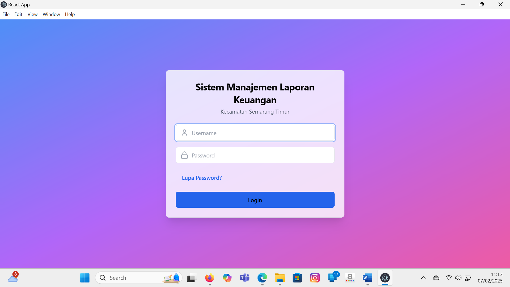
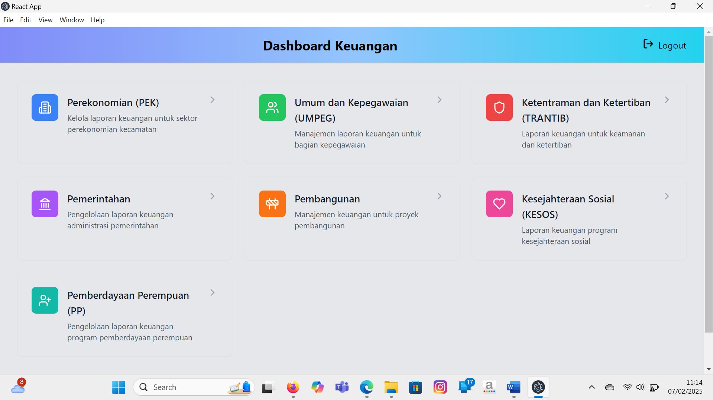
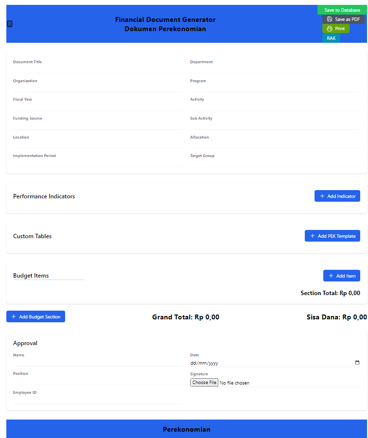
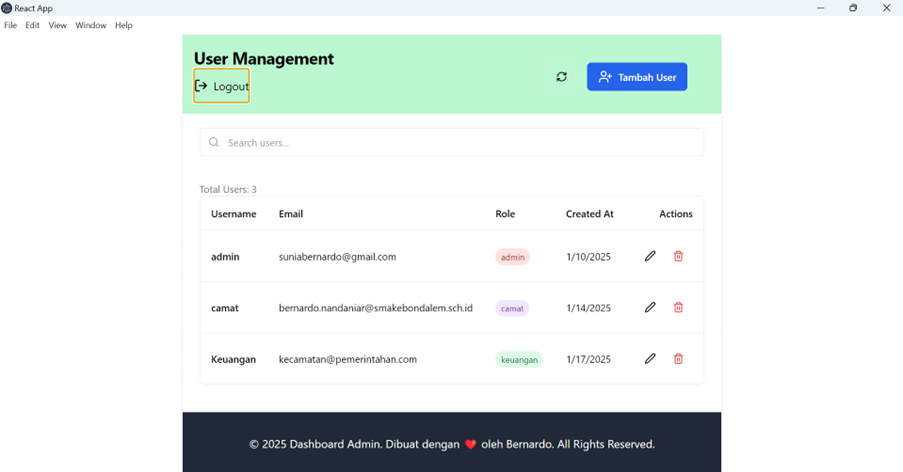
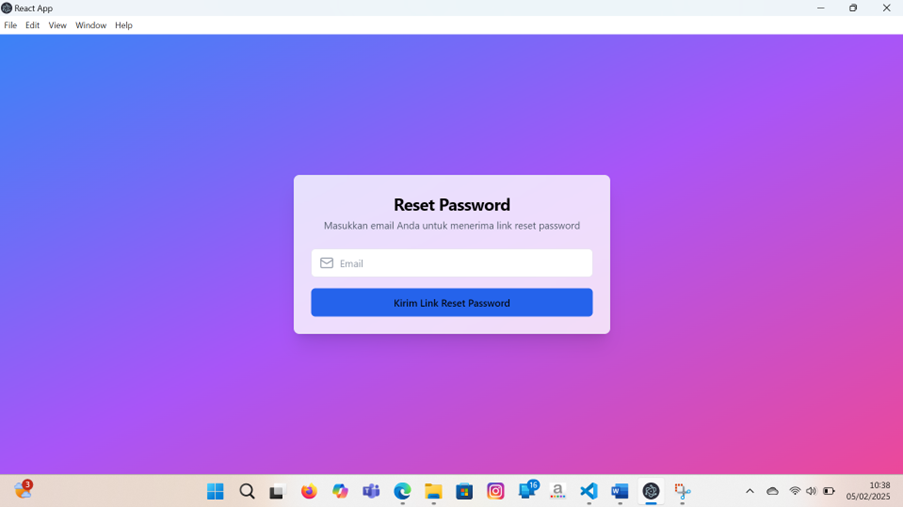
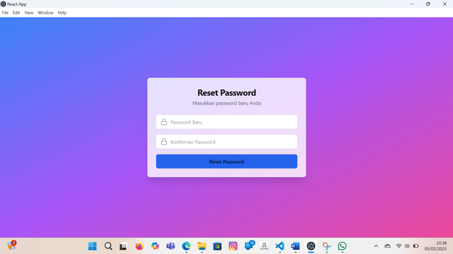
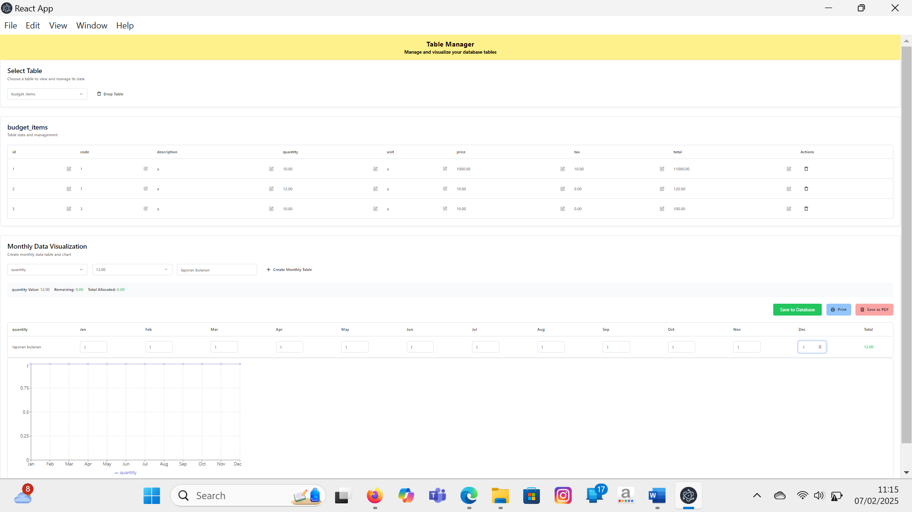

<div class="hero">

<h1>💼 Financial Report Management System</h1>

<p>Financial Data Management · Interactive Reporting · Secure Role-Based Access</p>

<p>
  
  
  
  
  
  
  
  
</p>

<p>
A full-stack financial reporting application designed to make financial data
easier to process, retrieve, visualize, and manage through a secure web-based interface.
</p>

</div>

---

## 📖 Project Overview

The **Financial Report Management System** is a full-stack application designed to improve the management and presentation of financial information.

The system combines a modern **React.js frontend**, **Node.js / Express.js backend**, and **MySQL database** with **Prisma ORM** to support financial data processing and interactive reporting workflows.

The platform focuses on four major areas:

```text id="9g4x2m"
Financial Data
      ↓
Data Processing
      ↓
Database Management
      ↓
Interactive Reporting
      ↓
Visualization & Analysis
      ↓
Secure Stakeholder Access
```

The application is designed to make financial information easier to access and interpret while maintaining controlled access to sensitive reporting functionality.

> **Portfolio focus:** This project demonstrates full-stack development, relational data management, ORM-based data access, financial reporting workflows, interactive dashboards, performance optimization, visualization, authentication, and role-based access control.

---

## 🎯 Project Objectives

The primary objectives are:

1. Build a structured application for managing financial reporting workflows.
2. Improve financial data accessibility for stakeholders.
3. Process and retrieve financial information efficiently.
4. Provide interactive financial reports through a React-based interface.
5. Visualize financial information through dynamic charts and dashboards.
6. Protect financial data through authentication and role-based access control.
7. Benchmark database and application performance.
8. Document the system architecture, database schema, and API integrations for future development.

---

## 💰 Financial Reporting Workflow

The core reporting workflow can be represented as:

```text id="z6m4q8"
Financial Data
      ↓
Database Storage
      ↓
Prisma ORM
      ↓
Express.js API
      ↓
React.js Interface
      ↓
Report Generation
      ↓
Filtering / Customization
      ↓
Financial Visualization
```

This separates data persistence, business logic, API access, and presentation into distinct application layers.

---

## 📊 Interactive Financial Dashboard

The React-based dashboard provides an interactive environment for working with financial reports.

Users can interact with financial information through:

* Report generation.
* Filtering.
* Customization.
* Dynamic data visualization.
* Structured financial views.

The dashboard is intended to reduce friction when moving from raw financial records to interpretable reports.

### Dashboard Flow

```text id="k7f2p1"
User
 ↓
React Dashboard
 ↓
Report Request
 ↓
Express API
 ↓
Prisma ORM
 ↓
MySQL
 ↓
Processed Financial Data
 ↓
Charts / Tables / Reports
```

---

## 🗄️ Financial Data Management

### MySQL

MySQL provides the relational database layer for the financial reporting system.

It is responsible for persistent storage of application data and supports structured financial-data retrieval.

### Prisma ORM

**Prisma** provides the data-access abstraction between the Node.js application and the MySQL database.

Conceptually:

```text id="r3b8q4"
React.js
   ↓
Express.js
   ↓
Prisma ORM
   ↓
MySQL
```

This architecture helps separate application logic from direct database queries and makes the data-access layer easier to maintain.

---

## ⚙️ Data Processing & Reporting

Financial reporting requires more than simply displaying database records.

The application includes processing logic designed to:

* Retrieve financial records efficiently.
* Transform database results into report-ready structures.
* Support filtering and customization.
* Improve data accessibility.
* Present processed information through interactive dashboards.

The general flow is:

```text id="p8x5d2"
Stored Records
     ↓
Query / Retrieval
     ↓
Data Processing
     ↓
Report Structure
     ↓
Visualization
```

---

## 📈 Financial Data Visualization

The application uses interactive visualization to make financial information easier to understand.

Dynamic charts can communicate:

* Financial trends.
* Comparative performance.
* Changes across reporting periods.
* Other relevant financial indicators.

The visualization layer is integrated directly into the reporting workflow rather than existing as a separate analytical artifact.

```text id="m6c3v8"
Financial Data
     ↓
Processed Metrics
     ↓
Interactive Charts
     ↓
Stakeholder Interpretation
```

---

## 🔐 Authentication & Role-Based Access Control

Because financial reports contain sensitive information, access control is an important part of the system architecture.

### Authentication

The application includes authenticated access to protected areas of the system.

### Role-Based Access

Users can be granted different permissions based on their roles.

Conceptually:

```text id="f9w5a2"
User Login
    ↓
Authentication
    ↓
Role Identification
    ↓
Permission Check
    ↓
Authorized Application Area
```

This helps prevent users from accessing functionality or information outside their assigned responsibilities.

### OpenSSL

OpenSSL-related security capabilities are incorporated as part of the application's security environment and secure communication considerations.

---

## 📧 Email Integration

**SendGrid** is integrated into the application to support application-level email workflows.

Potential uses include:

* Account-related notifications.
* Authentication workflows.
* Reporting-related communication.
* System notifications.

The email layer can be represented as:

```text id="w4m7p2"
Application Event
      ↓
Node.js / Express
      ↓
SendGrid
      ↓
Email Delivery
```

---

## 🖥️ Cross-Platform Application Support

The project incorporates **Electron** as part of its technology stack, providing a path for packaging application functionality in a desktop-oriented environment.

This expands the application beyond a browser-only interaction model and creates opportunities for broader operational deployment.

---

## ⚡ Performance Engineering

Performance benchmarking was conducted to evaluate database retrieval and application responsiveness.

Particular attention was given to:

* Query execution.
* Financial data retrieval.
* Response efficiency.
* Dashboard responsiveness.

The optimization loop can be summarized as:

```text id="x2m8c5"
Measure
  ↓
Identify Bottleneck
  ↓
Optimize Query / Processing
  ↓
Benchmark Again
  ↓
Compare Results
```

The objective is to ensure that users can access financial information without unnecessary delays.

---

## 🧪 Performance Benchmarking

Benchmarking is especially important for financial applications because reporting workflows can involve repeated database queries and large amounts of structured information.

The project evaluates:

| Area                | Goal                                   |
| ------------------- | -------------------------------------- |
| Database Retrieval  | Efficient access to financial records  |
| Query Execution     | Reduce unnecessary processing overhead |
| API Response        | Maintain responsive data delivery      |
| Dashboard Rendering | Keep reporting interactions responsive |
| Data Processing     | Improve report-generation efficiency   |

> Performance optimization is treated as an engineering concern alongside functionality and usability.

---

## 🎨 UI / UX Design

The interface was designed to make financial reporting understandable and practical for stakeholders.

Key design considerations include:

* Clear information hierarchy.
* Interactive report controls.
* Readable data presentation.
* Accessible dashboard interactions.
* Visual emphasis on relevant financial information.
* Consistent reporting workflows.

The design objective is:

```text id="c5r7m9"
Complex Financial Data
        ↓
Structured Information
        ↓
Clear Interface
        ↓
Faster Understanding
```

---

## 🏗️ System Architecture

The application can be understood through four major layers.

### 🌐 Presentation Layer

```text id="a7m2q6"
React.js
  ↓
Dashboard
  ↓
Reports
  ↓
Filters
  ↓
Visualizations
```

Responsibilities include:

* User interface.
* Report interaction.
* Filtering.
* Financial visualization.
* Stakeholder-facing data presentation.

### ⚙️ Application Layer

```text id="q8v4n6"
Node.js
   +
Express.js
```

Responsibilities include:

* API routing.
* Application logic.
* Authentication handling.
* Data processing.
* Communication with external services.

### 🧩 Data Access Layer

```text id="m1k6z3"
Prisma ORM
      ↓
MySQL
```

Prisma acts as the application-facing data-access layer while MySQL provides persistent relational storage.

### 🔐 Supporting Services

```text id="d4w8q2"
SendGrid
   +
OpenSSL
   +
Electron
```

These components support communication, security, and cross-platform application delivery.

---

## 🔄 End-to-End System Flow

```text id="y5k3r8"
┌─────────────────────┐
│       User          │
└──────────┬──────────┘
           ↓
┌─────────────────────┐
│    React.js UI      │
└──────────┬──────────┘
           ↓
┌─────────────────────┐
│    Express API      │
│      Node.js        │
└──────────┬──────────┘
           ↓
┌─────────────────────┐
│     Prisma ORM      │
└──────────┬──────────┘
           ↓
┌─────────────────────┐
│       MySQL         │
└──────────┬──────────┘
           ↓
┌─────────────────────┐
│ Financial Data      │
│ Processing / Query  │
└──────────┬──────────┘
           ↓
┌─────────────────────┐
│ Reports & Charts    │
└─────────────────────┘
```

Authentication and role-based authorization operate across the protected application workflow.

---

## 📐 Technical Highlights

### React.js Dashboard

React provides the presentation framework for interactive reporting and financial-data exploration.

### Express.js API

Express provides the backend routing and service layer connecting frontend requests with application logic and database access.

### Prisma ORM

Prisma provides structured access to MySQL and helps keep database interaction organized within the application architecture.

### MySQL Data Layer

MySQL provides relational persistence for the financial information managed by the application.

### Interactive Reporting

The reporting interface allows users to generate, filter, and customize financial information according to their analytical needs.

### Dynamic Visualization

Interactive visualizations transform processed financial data into more interpretable graphical representations.

### Secure Access

Authentication and role-based authorization help control access to sensitive functionality and financial information.

---

## 📊 Reporting Use Cases

The system is designed around stakeholder-oriented financial reporting.

Potential workflows include:

| Use Case              | Outcome                                                  |
| --------------------- | -------------------------------------------------------- |
| 📋 Generate Reports   | Convert stored financial data into structured reports    |
| 🔎 Filter Reports     | Focus analysis on selected financial dimensions          |
| 🎛️ Customize Views   | Adapt reporting views to stakeholder requirements        |
| 📈 Visualize Metrics  | Understand financial patterns through interactive charts |
| 🔐 Controlled Access  | Limit sensitive reporting functions by role              |
| ⚡ Efficient Retrieval | Reduce delays when accessing financial records           |

---

## 🗺️ Project Scope

This project was developed as a **self-contained financial reporting application project** at Diponegoro University.

| Module                         | Description                                | Status        |
| ------------------------------ | ------------------------------------------ | ------------- |
| 💼 **Financial Reporting**     | Generate and present financial reports     | ✅ Implemented |
| 🖥️ **React Dashboard**        | Interactive financial reporting interface  | ✅ Implemented |
| 🗄️ **MySQL Database**         | Persistent financial data storage          | ✅ Implemented |
| 🧩 **Prisma ORM**              | Structured database access                 | ✅ Implemented |
| ⚙️ **Express API**             | Backend service layer                      | ✅ Implemented |
| 📈 **Data Visualization**      | Dynamic financial charts                   | ✅ Implemented |
| 🔐 **Authentication**          | Protected application access               | ✅ Implemented |
| 👥 **Role-Based Access**       | Permission-aware application functionality | ✅ Implemented |
| 📧 **SendGrid Integration**    | Application email workflows                | ✅ Implemented |
| ⚡ **Performance Benchmarking** | Query and retrieval performance analysis   | ✅ Implemented |
| 🎨 **UI/UX Optimization**      | Stakeholder-oriented interface refinement  | ✅ Implemented |
| 🖥️ **Electron**               | Desktop application support                | ✅ Integrated  |

---

## 📊 Technology Stack

| Layer                    | Technology                 | Purpose                                 |
| ------------------------ | -------------------------- | --------------------------------------- |
| 🌐 **Frontend**          | **React.js**               | Interactive reporting interface         |
| ⚙️ **Backend Runtime**   | **Node.js**                | Application runtime                     |
| 🚀 **Backend Framework** | **Express.js**             | API and server-side application logic   |
| 🗄️ **Database**         | **MySQL**                  | Financial data persistence              |
| 🧩 **ORM**               | **Prisma**                 | Database access and query abstraction   |
| 📧 **Email Service**     | **SendGrid**               | Application email workflows             |
| 🔐 **Security**          | **OpenSSL**                | Security / secure communication support |
| 🖥️ **Desktop Runtime**  | **Electron**               | Desktop-oriented application packaging  |
| 📊 **Visualization**     | Interactive charting layer | Financial data presentation             |

---

## 💻 Development Architecture

The project separates technical responsibilities so that each layer can evolve independently.

```text id="n9f3q1"
Frontend
React.js
   │
   ↓
Backend
Node.js + Express.js
   │
   ↓
Data Access
Prisma ORM
   │
   ↓
Database
MySQL
```

Supporting services:

```text id="b4m7x8"
SendGrid → Email Communication
OpenSSL  → Security Infrastructure
Electron  → Desktop Application Layer
```

This separation improves maintainability and provides a clearer foundation for future scaling.

---

## 📁 Project Organization

A conceptual project structure is:

```text id="s8q2m4"
Financial_Report_Management_System/
│
├── 📂 frontend/
│   └── React.js application
│
├── 📂 backend/
│   ├── Express.js server
│   ├── API routes
│   └── application services
│
├── 📂 prisma/
│   ├── schema
│   └── database configuration
│
├── 📂 database/
│   └── MySQL-related configuration
│
├── 📂 electron/
│   └── desktop application integration
│
├── 📂 images/
│   └── project screenshots
│
├── LICENSE
└── README.md
```

The exact directory names may vary depending on the final repository implementation.

---

## 🎥 Demo

### 🖥️ Financial Reporting Application

<div align="center">

<p>
<strong>💼 Interactive Financial Reporting System</strong>
</p>

<p>
<a href="https://bers31.github.io/bernardo.github.io/Financial_Reporting_Application/">
<strong>► View Project Demo</strong>
</a>
</p>

</div>

### 🔐 Login Interface



*Authentication interface for controlled application access.*

### 📊 Financial Dashboard



*Interactive dashboard for financial reporting and analysis.*

### 📋 Report Generation



*Financial report generation and presentation workflow.*

### 👥 User Management



*Administrative functionality for managing application users and access.*

---

## 💼 Portfolio Alignment

The project directly reflects the capabilities represented in the professional project description:

| LinkedIn Capability       | Project Evidence                                     |
| ------------------------- | ---------------------------------------------------- |
| Financial data processing | Backend processing and structured database retrieval |
| React.js application      | Interactive financial reporting dashboard            |
| MySQL                     | Persistent relational financial data                 |
| Prisma / ORM              | Structured data-access layer                         |
| Express.js                | Backend API and application services                 |
| Performance benchmarking  | Database/query performance analysis                  |
| Interactive visualization | Dynamic financial charts and reporting views         |
| Authentication            | Protected application access                         |
| Role-based access control | Permission-aware functionality                       |
| SendGrid                  | Application email integration                        |
| OpenSSL                   | Security infrastructure                              |
| Electron                  | Desktop application support                          |
| Documentation             | Architecture, database, and API documentation        |

> **Portfolio positioning:** This project demonstrates the ability to combine enterprise-style web application architecture with financial data processing, secure access control, interactive reporting, and performance-oriented engineering.

---

## 🔬 Engineering Principles

### Separation of Concerns

Frontend presentation, backend logic, data access, and persistence are separated into distinct technical layers.

### Data Accessibility

The application converts structured financial records into stakeholder-friendly reports and visualizations.

### Performance Awareness

Database retrieval and application responsiveness are treated as measurable engineering concerns.

### Security by Design

Financial functionality is protected through authentication and role-based access control.

### Maintainability

System architecture, database schema, and API integration details are documented to support future development and scaling.

---

## 🔭 Future Development

Potential future enhancements include:

* More granular role and permission management.
* Advanced financial KPI dashboards.
* Automated report scheduling.
* Expanded financial analytics.
* Audit-log visualization.
* More advanced query optimization.
* Automated data validation.
* Additional export formats.
* Extended desktop functionality through Electron.
* More comprehensive monitoring and performance analytics.

These represent future development directions and are not presented as current capabilities unless implemented in the repository.

---

## 📄 License

The original source code and documentation intentionally published in this repository are licensed under the **MIT License**.

See [`LICENSE`](LICENSE) for the complete license text.

> Third-party software, libraries, APIs, fonts, and other external components remain subject to their respective licenses and terms.

---

<div class="contact-hero">

<p><strong>Interested in the project?</strong></p>

<p>
👨‍💻 <strong>Bernardo Nandaniar Sunia</strong><br/>
Bachelor of Computer Science — Diponegoro University<br/>
Financial Systems · Full-Stack Development · Data Applications
</p>

<p>
<a href="https://linkedin.com/in/bernardo-sunia/">

</a>
<a href="https://mail.google.com/mail/?view=cm&fs=1&to=suniabernardo@gmail.com">

</a>
<a href="https://github.com/bers31">

</a>
<a href="https://bit.ly/bernardo-my_portfolio">

</a>
</p>

<p>
<em>React.js · Node.js · MySQL · Prisma · Financial Reporting · Secure Systems</em>
</p>

</div>

---

## 📸 Full Screenshots









---

## 📌 Conclusion

The **Financial Report Management System** demonstrates how a full-stack application can transform financial data into accessible, interactive, and structured reporting workflows.

By combining **React.js, Node.js, Express.js, Prisma, MySQL, SendGrid, OpenSSL, and Electron**, the project integrates financial data processing, relational data management, interactive dashboards, visualization, secure authentication, role-based access control, and performance benchmarking into a unified application architecture.

The project emphasizes not only the retrieval and presentation of financial data, but also the engineering principles required to make a reporting system **secure, maintainable, responsive, and easier for stakeholders to use**.