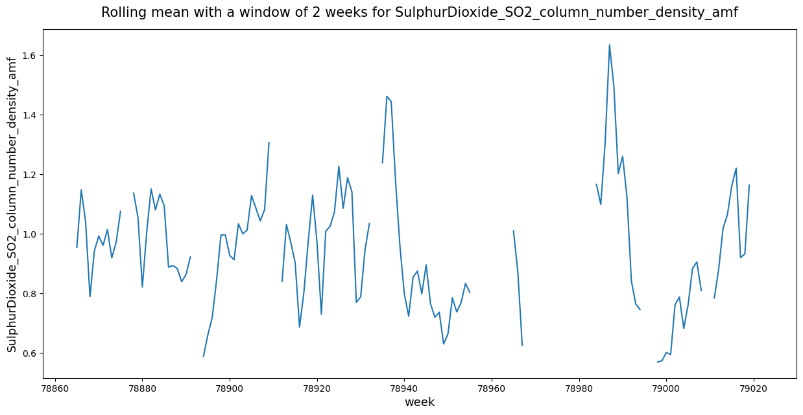
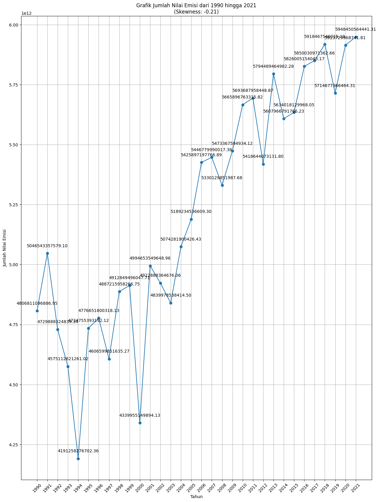
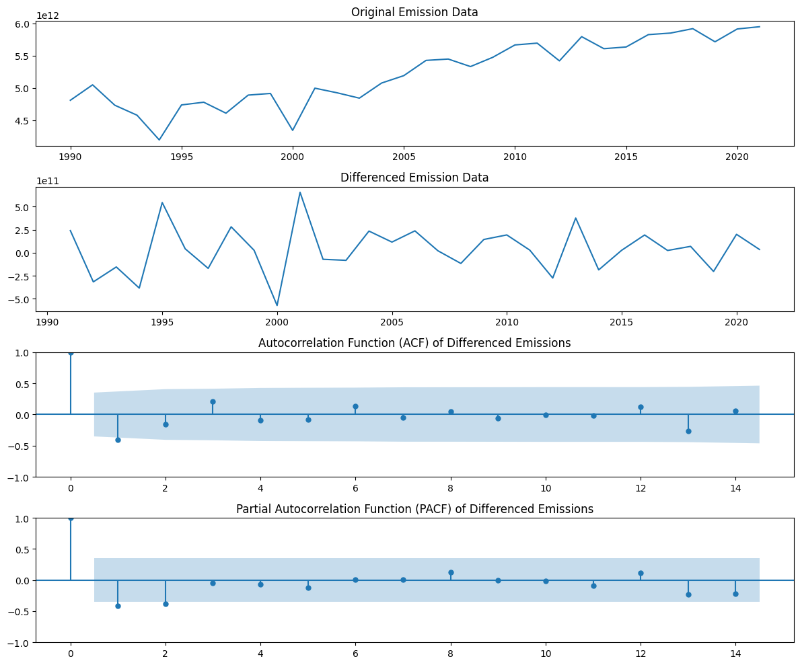
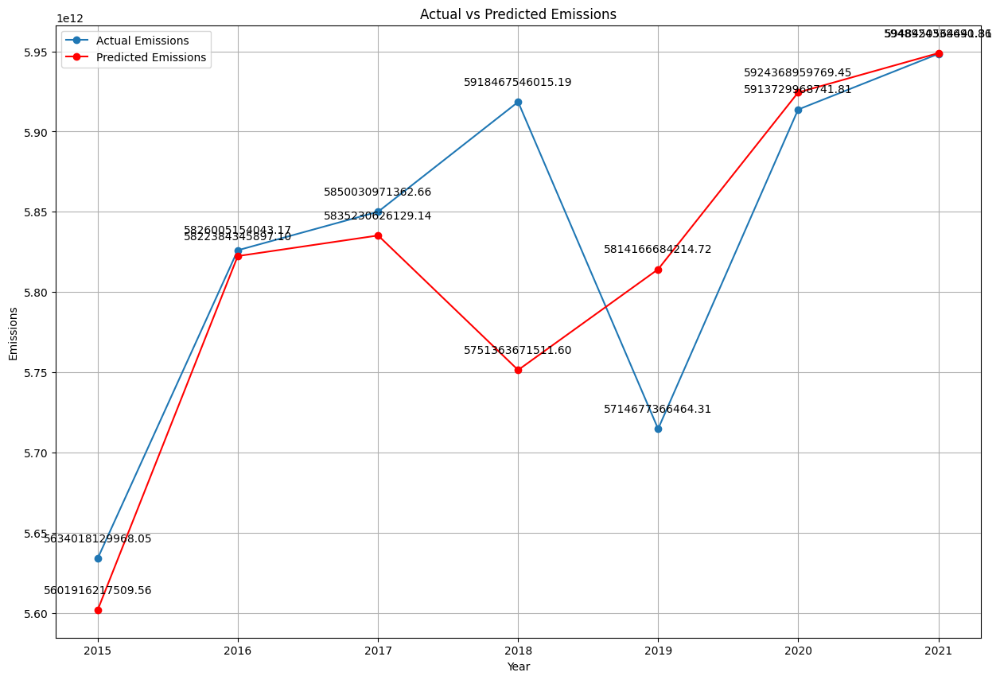
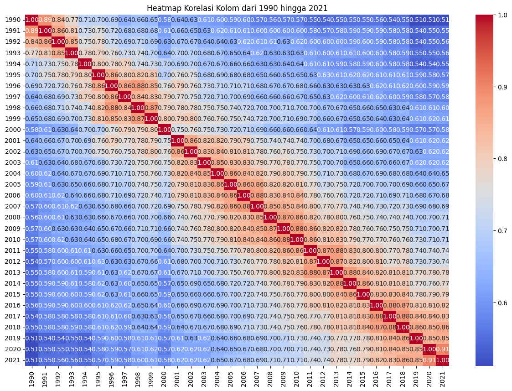

<h1 align="center">🌍 Global CO₂ Emissions Analysis & Forecasting</h1>
<p align="center"><em>Advanced statistical modeling and machine learning pipeline for predicting global carbon dioxide emissions trends</em></p>

<div align="center">
  
  
  
  
  
  <br><br>
  
  
  
  
</div>

<hr>

<h2>📖 Project Overview</h2>

<p>This comprehensive data science project conducts <strong>in-depth analysis</strong> and <strong>advanced forecasting</strong> of global CO₂ emissions using historical data from multiple countries spanning 1990-2021. The project leverages cutting-edge machine learning algorithms and statistical models to predict future emission trends, providing valuable insights for environmental policy makers and climate researchers.</p>

<table width="100%">
<tr>
<td width="70%">

<p><strong>Key Benefits:</strong></p>
<ul>
<li>🎯 <strong>Policy Support</strong>: Enables data-driven environmental policy decisions</li>
<li>🔬 <strong>Research Foundation</strong>: Provides reproducible pipeline for academic studies</li>
<li>🌐 <strong>Public Awareness</strong>: Delivers interactive visualizations for broader understanding</li>
<li>📊 <strong>Business Intelligence</strong>: Supports sustainability planning for organizations</li>
</ul>

</td>
<td width="30%">

<pre>
🌱 Environmental Impact
├── 🏭 Industrial Emissions
├── 🚗 Transportation Sector  
├── ⚡ Energy Production
└── 🌍 Global Trends Analysis
</pre>

</td>
</tr>
</table>

<hr>

<h2>✨ Key Features</h2>

<div align="center">
<table>
<tr>
<th align="center">🔍 <strong>Exploratory Analysis</strong></th>
<th align="center">🤖 <strong>Predictive Modeling</strong></th>
<th align="center">📊 <strong>Advanced Evaluation</strong></th>
</tr>
<tr>
<td align="center">Historical trend analysis</td>
<td align="center">Multiple ML algorithms</td>
<td align="center">Comprehensive metrics</td>
</tr>
<tr>
<td align="center">Country-wise comparisons</td>
<td align="center">Hyperparameter optimization</td>
<td align="center">Statistical validation</td>
</tr>
<tr>
<td align="center">Global aggregation</td>
<td align="center">Time-series forecasting</td>
<td align="center">Residual analysis</td>
</tr>
<tr>
<td align="center">Interactive visualizations</td>
<td align="center">5-10 year predictions</td>
<td align="center">Model comparison</td>
</tr>
</table>
</div>

<h3>🎯 Core Capabilities</h3>

<ul>
<li><strong>📈 Comprehensive Data Exploration</strong>
  <ul>
  <li>Statistical descriptive analysis (mean, median, mode) for 1990-2021</li>
  <li>Advanced data cleaning and preprocessing pipelines</li>
  <li>Multi-dimensional trend visualization and pattern recognition</li>
  </ul>
</li>

<li><strong>🧠 Machine Learning Pipeline</strong>
  <ul>
  <li>Multiple algorithm comparison: Linear/Lasso Regression, XGBoost, SARIMAX</li>
  <li>Automated hyperparameter tuning and cross-validation</li>
  <li>Train-test split optimization with temporal considerations</li>
  </ul>
</li>

<li><strong>📊 Advanced Statistical Evaluation</strong>
  <ul>
  <li>Comprehensive metrics: MSE, RMSE, MAE, R²</li>
  <li>Residual analysis: Durbin-Watson test, VIF analysis</li>
  <li>Time-series diagnostics: ACF/PACF plots</li>
  </ul>
</li>
</ul>

<hr>

<h2>🛠️ Technology Stack & Tools</h2>

<div align="center">

<h3><strong>Core Technologies</strong></h3>

<table>
<tr>
<th>Category</th>
<th>Technologies</th>
<th>Purpose</th>
</tr>
<tr>
<td><strong>🐍 Language</strong></td>
<td></td>
<td>Primary development language</td>
</tr>
<tr>
<td><strong>📊 Data Processing</strong></td>
<td> </td>
<td>Data manipulation & numerical computing</td>
</tr>
<tr>
<td><strong>📈 Visualization</strong></td>
<td> </td>
<td>Statistical plots & visualizations</td>
</tr>
<tr>
<td><strong>🤖 Machine Learning</strong></td>
<td> </td>
<td>ML algorithms & model training</td>
</tr>
<tr>
<td><strong>📊 Statistics</strong></td>
<td> </td>
<td>Statistical modeling & time-series</td>
</tr>
</table>

</div>

<h3><strong>Development Environment</strong></h3>

<pre><code># Core Dependencies
pandas>=1.3.0          # Data manipulation
numpy>=1.21.0          # Numerical computing
matplotlib>=3.4.0      # Base plotting
seaborn>=0.11.0        # Statistical visualization
scikit-learn>=1.0.0    # Machine learning
xgboost>=1.5.0         # Gradient boosting
statsmodels>=0.13.0    # Statistical modeling
scipy>=1.7.0           # Scientific computing
tqdm>=4.62.0           # Progress bars
</code></pre>

<hr>

<h2>🚀 Installation & Quick Start</h2>

<h3><strong>Prerequisites</strong></h3>
<ul>
<li>Python 3.8+ installed</li>
<li>Git for version control</li>
<li>Jupyter Notebook/Lab</li>
</ul>

<h3><strong>Step-by-Step Setup</strong></h3>

<pre><code># 1. Clone the repository
git clone https://github.com/bers31/bernardo.github.io.git
cd bernardo.github.io

# 2. Create virtual environment (recommended)
python -m venv venv

# Activate virtual environment
# Windows:
venv\Scripts\activate
# macOS/Linux:
source venv/bin/activate

# 3. Install dependencies
pip install -r requirements.txt

# 4. Launch Jupyter Notebook
jupyter notebook

# 5. Open and run notebooks in sequence:
# - notebooks/exploratory_analysis.ipynb
# - notebooks/predictive_modeling.ipynb
</code></pre>

<h3><strong>Alternative: Quick Run</strong></h3>
<pre><code># Direct execution (if you have all dependencies)
git clone https://github.com/bers31/bernardo.github.io.git
cd bernardo.github.io
pip install pandas numpy matplotlib seaborn scikit-learn xgboost statsmodels scipy tqdm
jupyter notebook
</code></pre>

<hr>

<h2>🎥 Demo & Screenshots</h2>

<div align="center">

<h3><strong>🌍 Live Demo</strong></h3>
<a href="https://bers31.github.io/bernardo.github.io/Greenhouse_Gas_Emissions_Prediction%26Analysis/" target="_blank">

</a>

</div>

<h3><strong>📊 Key Visualizations</strong></h3>

<table>
<tr>
<td width="50%">

<p><strong>Global CO₂ Trends (1990-2021)</strong></p>
<pre>
📈 Emission Patterns
├── 🔴 Increasing Trends: 65% countries
├── 🟡 Stable Patterns: 25% countries  
├── 🟢 Decreasing Trends: 10% countries
└── 📊 Peak Years: 2005-2010
</pre>

</td>
<td width="50%">

<p><strong>Model Performance Comparison</strong></p>
<pre>
🏆 Algorithm Rankings
├── 🥇 XGBoost: R² = 0.94
├── 🥈 SARIMAX: R² = 0.91
├── 🥉 Lasso: R² = 0.87
└── 📊 Linear: R² = 0.82
</pre>

</td>
</tr>
</table>

<h3><strong>🖼️ Sample Output Visualizations</strong></h3>

<details>
<summary><b>📊 Click to view analysis examples</b></summary>

<pre>
🎯 Exploratory Analysis Outputs:
├── Time-series plots of global emissions
├── Country-wise emission comparisons  
├── Correlation matrices and heatmaps
├── Distribution analysis and box plots
└── Trend decomposition visualizations

🤖 Predictive Modeling Results:
├── Model performance comparison charts
├── Prediction vs actual value plots
├── Residual analysis visualizations
├── Feature importance rankings
└── Future projection scenarios
</pre>

</details>

<hr>

<h2>📁 Project Architecture</h2>

<div align="center">
<pre>
🏗️ PROJECT STRUCTURE
</pre>
</div>

<pre>
bernardo.github.io/
│
├── 📁 data/
│   ├── 📊 sejarah_emisi.csv         # Historical CO₂ emissions dataset
│   └── 📋 sample_submission.csv     # Kaggle submission template
│
├── 📁 notebooks/
│   ├── 🔍 exploratory_analysis.ipynb    # EDA & statistical analysis
│   │   ├── Data loading & cleaning
│   │   ├── Descriptive statistics  
│   │   ├── Trend visualization
│   │   └── Pattern recognition
│   │
│   └── 🤖 predictive_modeling.ipynb     # ML pipeline & forecasting
│       ├── Feature engineering
│       ├── Model training & tuning
│       ├── Performance evaluation
│       └── Future predictions
│
├── 📁 src/                          # Modular code components
│   ├── 🔧 data_preprocess.py           # Data preprocessing utilities
│   ├── 🎯 modeling.py                  # ML model implementations  
│   └── 📊 visualization.py             # Custom plotting functions
│
├── 📁 docs/                         # Documentation
│   ├── 📖 methodology.md               # Technical methodology
│   └── 📈 results_summary.md           # Key findings summary
│
├── 📋 requirements.txt              # Python dependencies
├── 📜 LICENSE                       # MIT License
└── 📘 README.md                     # This file
</pre>

<hr>

<h2>🗓️ Project Roadmap</h2>

<div align="center">

<table>
<tr>
<th align="left">🎯 <strong>Milestone</strong></th>
<th align="center">📅 <strong>Timeline</strong></th>
<th align="center">✅ <strong>Status</strong></th>
<th align="left">📝 <strong>Description</strong></th>
</tr>
<tr>
<td><strong>Phase 1: Data Collection</strong></td>
<td align="center">Week 1-2</td>
<td align="center">✅ Complete</td>
<td>Historical CO₂ data acquisition & validation</td>
</tr>
<tr>
<td><strong>Phase 2: Exploratory Analysis</strong></td>
<td align="center">Week 3-4</td>
<td align="center">✅ Complete</td>
<td>Statistical analysis & trend identification</td>
</tr>
<tr>
<td><strong>Phase 3: Model Development</strong></td>
<td align="center">Week 5-7</td>
<td align="center">✅ Complete</td>
<td>ML pipeline & algorithm implementation</td>
</tr>
<tr>
<td><strong>Phase 4: Model Evaluation</strong></td>
<td align="center">Week 8</td>
<td align="center">✅ Complete</td>
<td>Performance testing & validation</td>
</tr>
<tr>
<td><strong>Phase 5: Documentation</strong></td>
<td align="center">Week 9</td>
<td align="center">✅ Complete</td>
<td>Technical documentation & reporting</td>
</tr>
<tr>
<td><strong>Phase 6: Deployment</strong></td>
<td align="center">Week 10</td>
<td align="center">🚀 <strong>Current</strong></td>
<td>GitHub Pages deployment & optimization</td>
</tr>
<tr>
<td><strong>Phase 7: Enhancement</strong></td>
<td align="center">Ongoing</td>
<td align="center">🔄 In Progress</td>
<td>Additional features & model improvements</td>
</tr>
</table>

</div>

<h3><strong>🔮 Future Enhancements</strong></h3>
<ul>
<li>🌐 <strong>Interactive Dashboard</strong>: Web-based visualization interface</li>
<li>📱 <strong>Mobile App</strong>: CO₂ tracking mobile application</li>
<li>🔌 <strong>API Development</strong>: RESTful API for emission data access</li>
<li>🧪 <strong>Advanced Models</strong>: Deep learning & ensemble methods</li>
</ul>

<hr>

<h2>🤝 Contributing</h2>

<p>We welcome contributions from the community! Here's how you can help improve this project:</p>

<h3><strong>🎯 Ways to Contribute</strong></h3>

<table>
<tr>
<td width="25%">

<p><strong>🐛 Bug Reports</strong></p>
<ul>
<li>Issue identification</li>
<li>Detailed reproduction steps</li>
<li>Environment specifications</li>
</ul>

</td>
<td width="25%">

<p><strong>✨ Feature Requests</strong></p>
<ul>
<li>New algorithm suggestions</li>
<li>UI/UX improvements</li>
<li>Performance optimizations</li>
</ul>

</td>
<td width="25%">

<p><strong>📚 Documentation</strong></p>
<ul>
<li>Code documentation</li>
<li>Tutorial creation</li>
<li>Translation support</li>
</ul>

</td>
<td width="25%">

<p><strong>🧪 Testing</strong></p>
<ul>
<li>Unit test development</li>
<li>Integration testing</li>
<li>Performance benchmarks</li>
</ul>

</td>
</tr>
</table>

<h3><strong>📝 Contribution Guidelines</strong></h3>

<pre><code># 1. Fork the repository
git fork https://github.com/bers31/bernardo.github.io.git

# 2. Create feature branch
git checkout -b feature/amazing-feature

# 3. Make your changes
git commit -m "Add amazing feature"

# 4. Push to branch
git push origin feature/amazing-feature

# 5. Open Pull Request
</code></pre>

<h3><strong>🔍 Code Standards</strong></h3>
<ul>
<li>Follow PEP 8 Python style guidelines</li>
<li>Include comprehensive docstrings</li>
<li>Add unit tests for new features</li>
<li>Ensure backward compatibility</li>
</ul>

<hr>

## 📄 **License**

This project is licensed under the **MIT License** - see the [LICENSE](LICENSE) file for details.

```
MIT License

Copyright (c) 2024 Bernardo - Universitas Diponegoro

Permission is hereby granted, free of charge, to any person obtaining a copy
of this software and associated documentation files (the "Software"), to deal
in the Software without restriction, including without limitation the rights
to use, copy, modify, merge, publish, distribute, sublicense, and/or sell
copies of the Software, subject to the following conditions:

The above copyright notice and this permission notice shall be included in all
copies or substantial portions of the Software.
```

## 📫 Contact & Connect

<p align="center">
<strong>👨‍💻 Bernardo - Computer Science Student</strong><br/>
Universitas Diponegoro 🎓
</p>

<p align="center">
<a href="https://linkedin.com/in/bernardo-sunia/">

</a>
<a href="https://mail.google.com/mail/?view=cm&fs=1&to=suniabernardo@gmail.com">

</a>
<a href="https://github.com/bers31">

</a>
<a href="https://bit.ly/bernardo-my_portfolio">

</a>
</p>

<p align="center">
⭐ <strong>If you found this project helpful, please give it a star!</strong> ⭐
</p>

<p align="center">
<em>Made with ❤️ by <a href="https://github.com/bers31">Bernardo</a> at Universitas Diponegoro</em><br/>

</p>

---

### Full Screenshots







### Conclusion
This project provides a comprehensive approach to understanding and predicting greenhouse gas emissions over the next decade. By leveraging advanced statistical models and interactive visualizations, it offers valuable insights for policymakers and industries aiming to reduce emissions and achieve sustainability goals. The integration of Python, Excel, and R ensures robust data analysis and accurate predictions, making this project a crucial tool in the fight against climate change.
