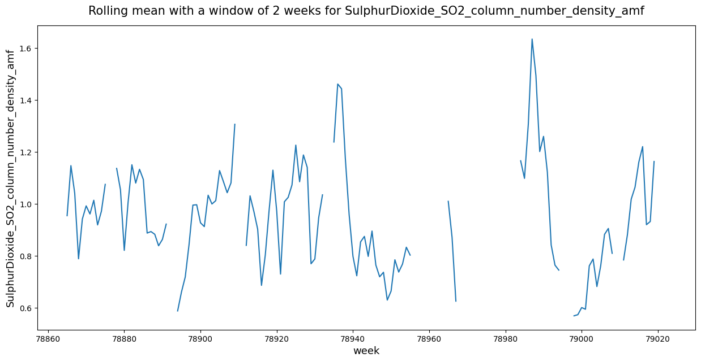
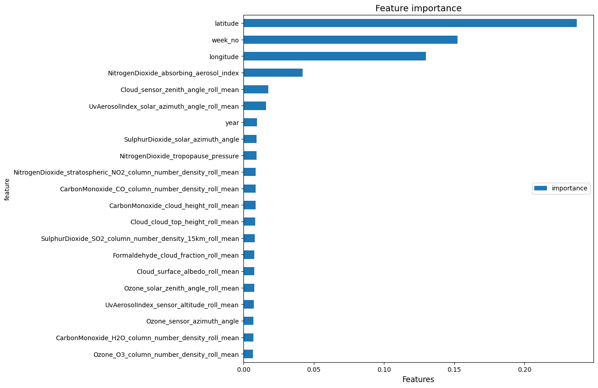
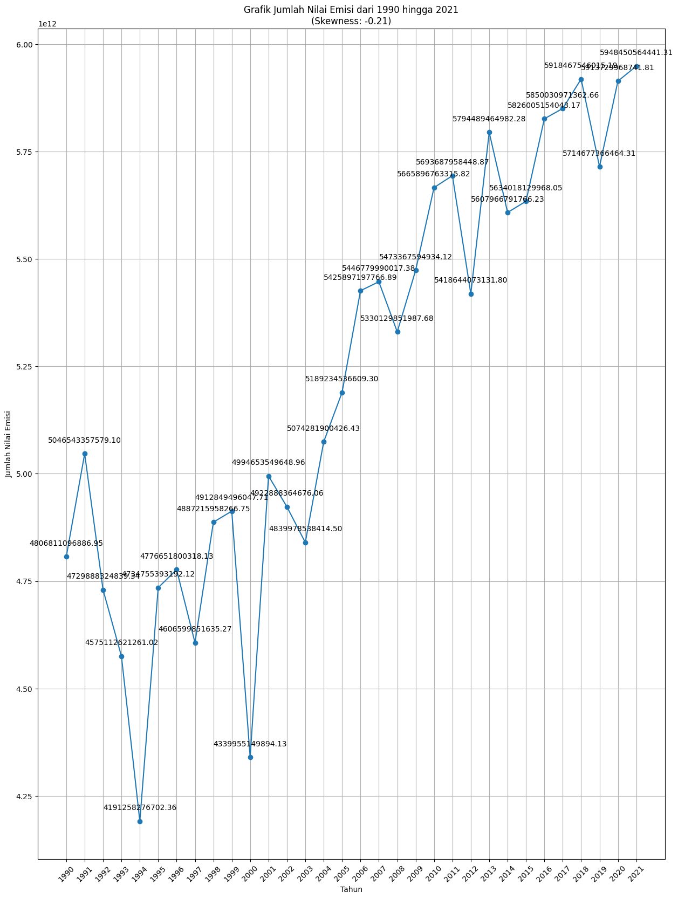
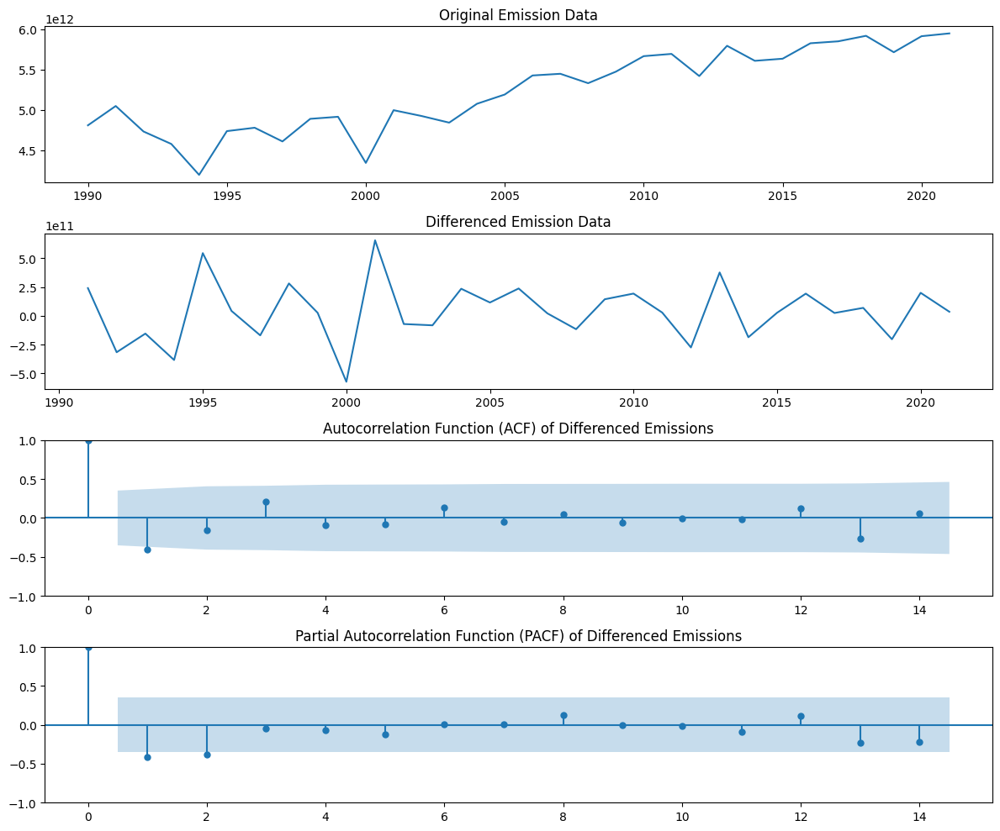
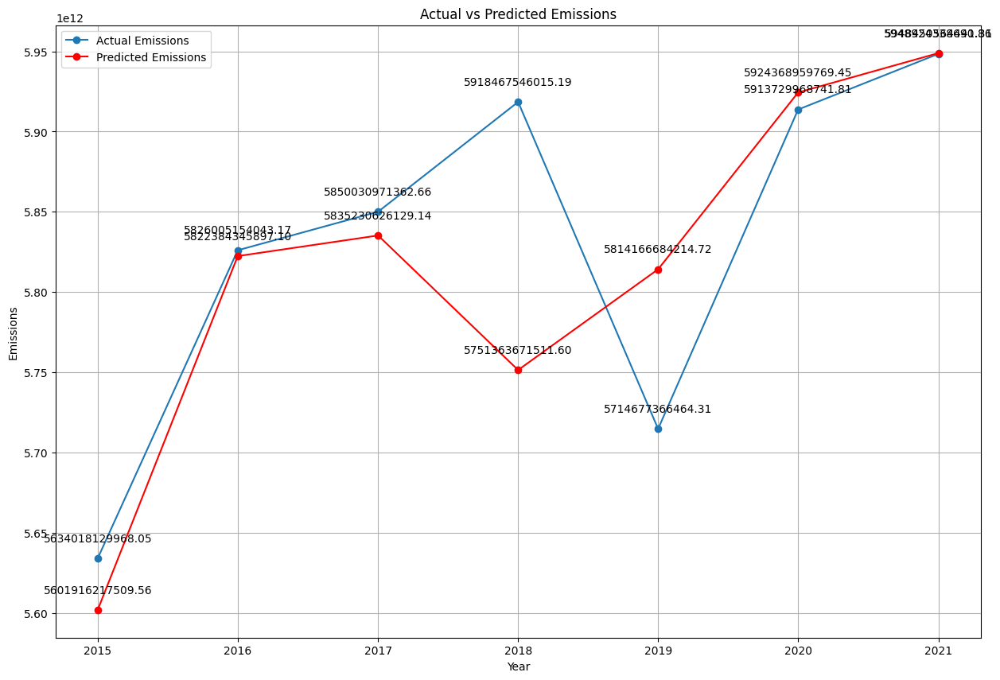
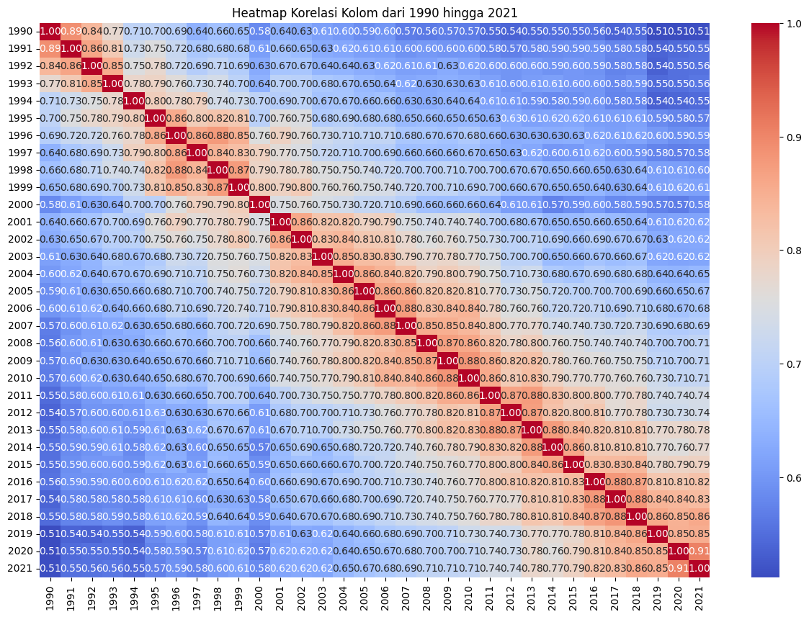

<div class="hero">

<h1>🌍 Global CO₂ Emissions Analysis & Forecasting</h1>

<p>Environmental Data Analysis · Regression · Time-Series Forecasting · Evidence-Based Decision Support</p>

<p>
  
  
  
  
  
  
</p>

<p>
A predictive environmental analytics project that combines historical CO₂ data,
data preparation, trend analysis, regression, time-series forecasting,
model validation, and stakeholder-oriented reporting.
</p>

</div>

---

## 📖 Project Overview

This project analyzes historical **greenhouse gas / carbon dioxide emissions data** and develops predictive models to forecast future emission trends.

The objective is to transform historical environmental observations into interpretable forecasts that can support:

* Environmental policy development.
* Emissions-reduction planning.
* Identification of historical trends.
* Understanding of contributing patterns.
* Evidence-based stakeholder discussions.

The project combines **Microsoft Excel, Python, R, and time-series forecasting techniques** across the analytical workflow.

The overall process can be summarized as:

```text id="x7m2q9"
Environmental Data
       ↓
Data Collection
       ↓
Data Cleaning & Validation
       ↓
Exploratory Analysis
       ↓
Trend Analysis
       ↓
Regression / Time-Series Modeling
       ↓
Model Validation
       ↓
Future Forecasts
       ↓
Visualization & Reporting
       ↓
Decision Support
```

> **Portfolio focus:** This project demonstrates the complete progression from environmental data preparation to predictive modeling, validation, visualization, and communication of forecasting results to non-technical stakeholders.

---

## 🎯 Project Objectives

The project was developed around several analytical objectives:

1. Collect and prepare historical greenhouse gas emissions data.
2. Explore long-term emissions trends and patterns.
3. Apply regression and time-series techniques to model historical behavior.
4. Forecast future emissions over the coming decade.
5. Validate model behavior against historical environmental trends.
6. Visualize predicted and observed patterns clearly.
7. Translate technical findings into actionable environmental insights.
8. Present the final analysis in a format accessible to both technical and non-technical audiences.

---

## 🌱 Environmental Context

Greenhouse gas emissions are influenced by multiple economic, industrial, transportation, and energy-related activities.

The analysis therefore treats emissions as a longitudinal phenomenon rather than a single static measurement.

```text id="m6q3w8"
Historical Emissions
        ↓
Annual Trend
        ↓
Rate of Change
        ↓
Pattern Identification
        ↓
Forecast
        ↓
Potential Intervention Areas
```

The project is intended to help answer questions such as:

* How have emissions changed over time?
* Which historical patterns are persistent?
* What do current trends imply for future emissions?
* Where might intervention be most relevant?
* How reliable are the resulting predictions?

---

## 📊 Data Collection & Preparation

### 🗃️ Data Collection

Historical environmental data were collected and organized to provide a consistent basis for analysis.

**Microsoft Excel** was used as part of the data preparation workflow to organize, inspect, and clean the environmental dataset.

### 🧹 Data Cleaning

Data preparation focused on improving consistency and analytical readiness.

Typical activities include:

```text id="t8f4k1"
Raw Environmental Data
        ↓
Consistency Checking
        ↓
Missing / Invalid Data Review
        ↓
Formatting & Standardization
        ↓
Analysis-Ready Dataset
```

The goal was to ensure that downstream forecasting models received reliable historical observations.

### ✅ Data Validation

Validation was performed to check whether the prepared data were consistent with the expected environmental trends and suitable for predictive analysis.

---

## 🔍 Exploratory Data Analysis

Exploratory analysis provides the foundation for understanding historical emissions before applying predictive models.

The analysis focuses on:

* Historical trends.
* Temporal patterns.
* Changes in emission levels.
* Comparative behavior across observations.
* Potential relationships relevant to forecasting.

### 📈 Trend Analysis

Historical observations are visualized over time to identify:

* Increasing trends.
* Decreasing trends.
* Stable periods.
* Structural changes.
* Unusual observations.

Conceptually:

```text id="p3c8v2"
Emission Level
     │
     │       ╭─────╮
     │   ╭───╯     ╰───
     │───╯
     └──────────────────→ Time
```

Understanding historical behavior is essential before extrapolating future emissions.

---

## 🧠 Predictive Modeling

The project applies **regression and time-series forecasting techniques** to estimate future greenhouse gas emission levels.

Rather than treating forecasting as a black-box exercise, the modeling process follows a structured analytical workflow:

```text id="k9w4m2"
Historical Data
      ↓
Feature / Time Preparation
      ↓
Model Development
      ↓
Forecast Generation
      ↓
Validation
      ↓
Interpretation
```

### 📐 Regression Analysis

Regression techniques are used to model relationships between historical observations and relevant explanatory patterns.

The regression stage provides a quantitative basis for understanding how emission values evolve in relation to the available variables and temporal behavior.

### ⏳ Time-Series Forecasting

Time-series forecasting is used to model the chronological structure of emissions data.

The forecasting objective is:

```text id="c7m5x8"
Past Emissions
      ↓
Temporal Pattern
      ↓
Forecast Model
      ↓
Future Emissions
```

The resulting model is intended to provide an evidence-based view of possible emissions trajectories over the coming decade.

---

## 🧪 Model Validation & Testing

Forecasting results are not accepted solely because a model generates predictions.

The project includes validation and testing to assess whether predictions remain consistent with historical environmental behavior.

### Validation Workflow

```text id="d8q2m5"
Training / Historical Data
          ↓
Model Fitting
          ↓
Prediction
          ↓
Validation / Testing
          ↓
Compare with Observed Data
          ↓
Assess Robustness
```

Validation helps determine whether the model captures meaningful patterns rather than simply reproducing noise.

### Robustness Perspective

The final forecasting interpretation considers:

* Agreement with historical trends.
* Prediction behavior.
* Model stability.
* Relevance to environmental observations.
* Practical applicability.

> Forecasts should be interpreted as model-based projections rather than guaranteed future outcomes.

---

## 📈 Visualization & Communication

Visualization is a key part of the project because emissions forecasting results need to be understood beyond the modeling environment.

The project uses visual analysis to communicate:

* Historical emissions trends.
* Forecast trajectories.
* Observed vs. predicted behavior.
* Key patterns.
* Potential areas of concern.

The communication workflow is:

```text id="m7c5x1"
Model Output
     ↓
Data Visualization
     ↓
Trend Interpretation
     ↓
Stakeholder Insight
```

This makes the technical output accessible to decision-makers and other non-technical audiences.

---

## 💡 Actionable Insights

The purpose of forecasting is not simply to produce a future number.

The analysis is intended to support questions such as:

| Analytical Question               | Potential Insight                            |
| --------------------------------- | -------------------------------------------- |
| What is the historical direction? | Identify persistent emissions trends         |
| What could happen next?           | Understand projected trajectories            |
| Where are changes most visible?   | Highlight areas for closer investigation     |
| How reliable is the projection?   | Evaluate model robustness                    |
| What action may be relevant?      | Support evidence-based intervention planning |

The project therefore connects:

```text id="b4m9q7"
Data
 ↓
Evidence
 ↓
Forecast
 ↓
Interpretation
 ↓
Potential Policy Action
```

---

## 🏛️ Policy & Decision Support

The resulting forecasts are designed to support environmental policy discussions by providing quantitative evidence about possible future emissions trajectories.

Potential applications include:

* Emissions-reduction planning.
* Environmental program prioritization.
* Sustainability strategy development.
* Scenario discussion.
* Long-term monitoring.

> **Important:** The project provides analytical evidence for decision support; it does not replace expert policy judgment, domain expertise, or formal environmental assessment.

---

## 🤝 Collaboration with Environmental Experts

The project incorporated collaboration with environmental experts to refine model parameters and improve the practical relevance of the analysis.

This collaboration helped connect:

```text id="x9m5v4"
Technical Modeling
      +
Environmental Domain Knowledge
      ↓
More Relevant Forecasting
```

This is an important part of the project because forecasting quality depends not only on statistical technique, but also on whether assumptions and outputs make sense in the real-world domain.

---

## 📊 Reporting

A detailed final report was prepared to communicate:

* Data preparation methodology.
* Analytical approach.
* Modeling decisions.
* Forecasting results.
* Validation findings.
* Visualized trends.
* Recommended areas for intervention.

The reporting workflow can be represented as:

```text id="w3q8z2"
Analysis
  ↓
Results
  ↓
Interpretation
  ↓
Visualization
  ↓
Recommendations
  ↓
Final Report
```

The report was designed to make technically complex results accessible to a broader audience.

---

## 🛠️ Technology Stack

| Layer                        | Technology                              | Purpose                                                   |
| ---------------------------- | --------------------------------------- | --------------------------------------------------------- |
| 🐍 **Data Science**          | **Python**                              | Data analysis, visualization, and model development       |
| 📊 **Data Preparation**      | **Microsoft Excel**                     | Environmental data collection, cleaning, and organization |
| 📐 **Statistical Computing** | **R**                                   | Statistical / analytical workflow support                 |
| ⏳ **Forecasting**            | **Time-Series Forecasting**             | Future emissions prediction                               |
| 📈 **Modeling**              | **Regression Techniques**               | Quantitative relationship and trend modeling              |
| 📊 **Visualization**         | Python / analytical visualization tools | Communicating trends and forecasts                        |

---

## 🏗️ Project Architecture

The project can be understood as five analytical layers.

### 📥 Data Layer

Historical emissions observations are collected and organized into an analysis-ready dataset.

### 🧹 Preparation Layer

Excel and analytical tooling are used to clean, validate, and prepare the data.

### 📐 Modeling Layer

Regression and time-series techniques are applied to historical observations.

### 📈 Evaluation Layer

Predictions are validated against observed environmental data to assess robustness.

### 📋 Communication Layer

The final results are converted into visualizations, written findings, and recommendations.

```text id="z5c2m7"
┌─────────────────────────┐
│      Environmental      │
│          Data           │
└────────────┬────────────┘
             ↓
┌─────────────────────────┐
│ Data Cleaning &        │
│ Validation              │
│ Excel / Python / R      │
└────────────┬────────────┘
             ↓
┌─────────────────────────┐
│ Trend & Exploratory     │
│ Analysis                │
└────────────┬────────────┘
             ↓
┌─────────────────────────┐
│ Regression / Time-Series│
│ Forecasting             │
└────────────┬────────────┘
             ↓
┌─────────────────────────┐
│ Validation & Testing    │
└────────────┬────────────┘
             ↓
┌─────────────────────────┐
│ Visualization & Report  │
└────────────┬────────────┘
             ↓
┌─────────────────────────┐
│ Decision Support        │
└─────────────────────────┘
```

---

## 🔬 Technical Highlights

### 📊 Historical Trend Modeling

The project analyzes historical emissions as a time-dependent phenomenon, allowing long-term changes to be interpreted before generating forecasts.

### 📐 Regression-Based Analysis

Regression methods provide a statistical framework for estimating relationships and trends within the emissions data.

### ⏳ Time-Series Forecasting

Temporal dependencies are incorporated into the forecasting workflow to produce future emissions projections.

### ✅ Model Validation

Predictions are compared against observed environmental patterns to evaluate whether the model behaves consistently with historical evidence.

### 📈 Visualization

Results are transformed into clear visualizations so that forecast behavior can be communicated to both technical and non-technical audiences.

### 📝 Professional Reporting

The final deliverable combines technical methodology with practical interpretation and intervention-oriented recommendations.

---

## 🧭 Forecasting Workflow

```text id="r8m4q2"
                    Historical Data
                          ↓
                 Data Cleaning / QA
                          ↓
                  Exploratory Analysis
                          ↓
                  Trend Identification
                          ↓
              ┌───────────┴───────────┐
              ↓                       ↓
         Regression             Time-Series
              │                       │
              └───────────┬───────────┘
                          ↓
                    Forecast Results
                          ↓
                   Model Validation
                          ↓
                 Visual Interpretation
                          ↓
                  Final Recommendations
```

---

## 🗺️ Project Scope

This project was developed as an academic **Data Mining / Machine Learning and environmental forecasting project at Diponegoro University**.

| Module                        | Description                                          | Status        |
| ----------------------------- | ---------------------------------------------------- | ------------- |
| 📥 **Data Collection**        | Collect and organize historical environmental data   | ✅ Implemented |
| 🧹 **Data Cleaning**          | Prepare the dataset for analysis                     | ✅ Implemented |
| ✅ **Data Validation**         | Check data quality and analytical consistency        | ✅ Implemented |
| 🔍 **Trend Analysis**         | Examine historical emissions behavior                | ✅ Implemented |
| 📐 **Regression Modeling**    | Apply regression-based predictive analysis           | ✅ Implemented |
| ⏳ **Time-Series Forecasting** | Generate future emissions projections                | ✅ Implemented |
| 🧪 **Model Validation**       | Test forecasting robustness against observations     | ✅ Implemented |
| 📊 **Visualization**          | Communicate trends and predictions                   | ✅ Implemented |
| 📝 **Final Reporting**        | Document findings and recommendations                | ✅ Implemented |
| 🤝 **Domain Collaboration**   | Refine model parameters with environmental expertise | ✅ Applied     |

---

## 💼 Portfolio Alignment

The project directly reflects the capabilities described in the professional project entry:

| LinkedIn Capability                   | Project Evidence                                      |
| ------------------------------------- | ----------------------------------------------------- |
| Predictive greenhouse gas forecasting | Regression and time-series forecasting workflow       |
| Python                                | Data analysis, visualization, and model development   |
| Excel                                 | Environmental data collection and cleaning            |
| R                                     | Statistical / analytical workflow support             |
| Historical trend analysis             | Longitudinal emissions analysis                       |
| Data preparation                      | Cleaning and validation                               |
| Model validation                      | Prediction testing against environmental observations |
| Stakeholder insights                  | Visual interpretation of forecast results             |
| Expert collaboration                  | Environmental-domain refinement                       |
| Reporting                             | Detailed final analytical report                      |
| Non-technical communication           | Clear visualizations and professional presentation    |

> **Portfolio positioning:** This project demonstrates the ability to move from environmental data preparation through predictive modeling, validation, visualization, and stakeholder-oriented recommendations.

---

## 📊 From Data to Environmental Insight

The project's analytical value can be summarized as:

```text id="q6w3p9"
Historical Environmental Data
           ↓
      Clean & Validate
           ↓
       Analyze Trends
           ↓
      Build Forecast
           ↓
       Validate Model
           ↓
    Visualize Results
           ↓
   Interpret Implications
           ↓
 Recommend Intervention Areas
```

This emphasizes the complete analytical lifecycle rather than treating the forecasting model as an isolated technical component.

---

## 🔭 Future Development

Potential extensions include:

* Interactive environmental dashboards.
* Automated data-refresh pipelines.
* Scenario-based emissions forecasting.
* Additional explanatory variables.
* Comparative forecasting models.
* More granular regional or sectoral analysis.
* Confidence intervals and uncertainty visualization.
* REST API access to forecast outputs.
* Automated monitoring of forecast drift.
* Integration with sustainability KPI reporting.

These are future directions and are not presented as current project functionality.

---

## 🚀 Getting Started

### Prerequisites

* Python 3.8 or newer.
* Microsoft Excel.
* R / RStudio where required by the analytical workflow.
* Jupyter Notebook for Python-based analysis.
* Git.

### Clone the Repository

```bash id="g4k8x2"
git clone https://github.com/bers31/bernardo.github.io.git
cd bernardo.github.io
```

### Python Environment

```bash id="m7p3q9"
python -m venv venv
```

Windows:

```bash id="v6k2r4"
venv\Scripts\activate
```

macOS / Linux:

```bash id="j5q8w1"
source venv/bin/activate
```

Install Python dependencies:

```bash id="z2m6c8"
pip install -r requirements.txt
```

### Launch Jupyter

```bash id="x4p9n7"
jupyter notebook
```

Open the project notebooks and follow the documented analytical sequence.

> The exact notebook and source filenames depend on the final repository structure.

---

## 📦 Python Ecosystem

The Python-side workflow may use common analytical packages such as:

```text id="w5k2m8"
pandas
numpy
matplotlib
scikit-learn
statsmodels
scipy
```

Exact dependencies should be maintained in `requirements.txt` according to the version of the project actually published in the repository.

---

## 🎥 Demo

### 🌍 Live Project Presentation

<div align="center">

<p>
<strong>🌱 Global CO₂ Emissions Analysis & Forecasting</strong>
</p>

<p>
<a href="https://bers31.github.io/bernardo.github.io/Greenhouse_Gas_Emissions_Prediction%26Analysis/">
<strong>► View Project Presentation</strong>
</a>
</p>

</div>

---

## 📸 Project Screenshots













---

## 📄 License

The original source code and documentation intentionally published in this repository are licensed under the **MIT License**.

See [`LICENSE`](LICENSE) for the complete license text.

> Third-party datasets, environmental data sources, analytical libraries, and other external materials remain subject to their respective licenses and terms.

---

<div class="contact-hero">

<p><strong>Interested in the project?</strong></p>

<p>
👨‍💻 <strong>Bernardo Nandaniar Sunia</strong><br/>
Bachelor of Computer Science — Diponegoro University<br/>
Data Analysis · Forecasting · Environmental Analytics
</p>

<p>
<a href="https://linkedin.com/in/bernardo-sunia/">

</a>
<a href="https://mail.google.com/mail/?view=cm&fs=1&to=suniabernardo@gmail.com">

</a>
<a href="https://github.com/bers31">

</a>
<a href="https://bit.ly/bernardo-my_portfolio">

</a>
</p>

<p>
<em>Environmental analytics · Time-series forecasting · Data-driven decision support</em>
</p>

</div>

---

## 📌 Conclusion

This project demonstrates an end-to-end approach to **greenhouse gas emissions analysis and forecasting**, combining historical environmental data preparation, exploratory analysis, regression, time-series forecasting, model validation, visualization, and professional reporting.

By combining **Python, Microsoft Excel, R, and forecasting techniques**, the project transforms historical emissions data into forward-looking analytical evidence that can support environmental planning and policy discussion.

The most important aspect of the project is the connection between **technical forecasting and practical interpretation**: model outputs are validated against observed environmental trends, translated into clear visualizations, and presented as evidence that can help stakeholders identify potential areas for intervention.