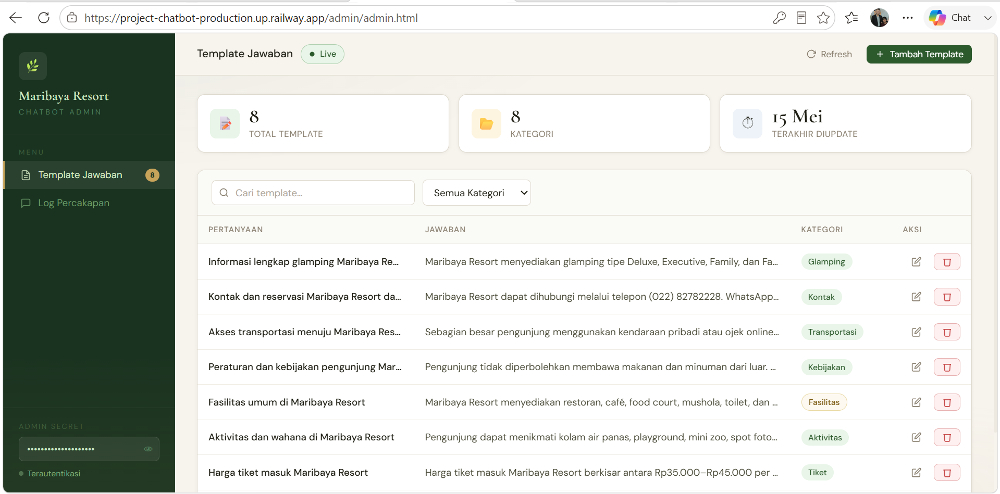
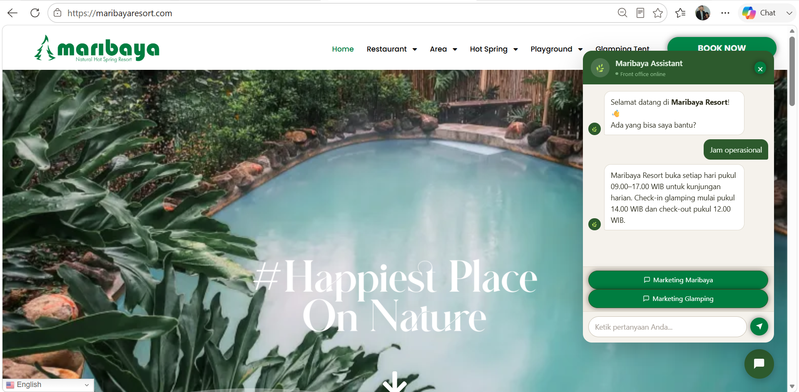

  <h1>🤖 Maribaya Chatbot: NLP-Based Semantic FAQ Assistant</h1>
  <h3>Embedding-Based Question Matching · Automated Data Lifecycle · Access-Controlled Admin Dashboard</h3>

   

  
  
  
  
  

    

  Part of my <a href="https://bers31.github.io/bernardo.github.io/">Data Analyst portfolio</a>

---

## 📖 Project Overview

Maribaya Chatbot is a natural-language FAQ assistant built for **Maribaya**, a resort and glamping destination in Central Java. Rather than relying on rigid keyword rules, every visitor message is converted into a vector **embedding representation** and matched against the closest stored question, so the assistant can understand paraphrased or loosely-worded queries and still return the most relevant answer.

The system was shaped by two operational constraints that mattered more than open-ended conversational flexibility: keeping the embedding database efficient, and keeping storage lean over time. Both trade-offs are documented below because they reflect real decisions for a live, cost-conscious production system rather than a research prototype.

> **Design principle:** for a destination FAQ use case, staying fast and cheap to run matters more than supporting arbitrarily long free-form dialogue, so the system is built to optimize for **speed and storage efficiency**.

---

## ⚙️ How It Works

| Step | Description |
|------|-------------|
| 1. Input Capture | Visitor sends a message through the chat widget (max. 100 characters) |
| 2. Embedding Generation | The input text is converted into a vector embedding |
| 3. Similarity Matching | The vector is compared against a database of pre-embedded question–answer pairs |
| 4. Best-Match Retrieval | The closest matching question is selected and its paired answer is returned |
| 5. Log Retention | Conversation logs are kept for 30 days, then purged automatically |

---

## 🧩 Key Design Decisions

| Decision | Rationale |
|----------|-----------|
| **100-character input limit** | Keeps the embedding database compact and speeds up embedding generation for every incoming message |
| **30-day automatic log deletion** | Prevents unbounded storage growth while retaining enough history for short-term monitoring |
| **Access-key protected admin dashboard** | Separates public-facing chat access from the internal CRUD interface used to maintain the knowledge base |

---

## 🔐 Admin Dashboard

A dedicated admin panel provides full **Create, Read, Update, and Delete (CRUD)** control over the chatbot's question–answer knowledge base, gated behind an access key so content management stays separate from public visitor access.

---

## 🛠️ Tech Stack

| Layer | Technology |
|-------|------------|
| **Core Logic** | Python, sentence-embedding based semantic matching |
| **Admin Interface** | Web-based dashboard (HTML/CSS/JavaScript) |
| **Deployment** | Railway |
| **Data Lifecycle** | Scheduled job for 30-day log purging |

---

## 🚀 Deployment & Access

This chatbot is deployed and actively serving visitor queries in production. The admin dashboard URL and access key are kept private to protect the integrity of Maribaya's live knowledge base and are available on request.

---

## 🔬 Outcomes

- Replaced a purely rule-based FAQ flow with **semantic, paraphrase-tolerant matching**, reducing "no answer found" cases on loosely-worded visitor questions.
- Balanced conversational flexibility against real infrastructure constraints (database size, embedding latency, storage cost) through the character limit and log-retention policy.
- Delivered a self-service admin tool so non-technical staff can update the chatbot's knowledge base without developer involvement.

---

## 📄 Project Ownership

This project was developed during my tenure as **Data Analyst at PT Wiraky Nusa Telekomunikasi** for the Maribaya property. It is documented here as a professional portfolio case study; the source code and production environment remain the property of PT Wiraky Nusa Telekomunikasi / Maribaya.

## 📫 Contact & Connect

<strong>👨‍💻 Bernardo - Bachelor of Computer Science</strong> 
Diponegoro University🎓

⭐ <strong>If you found this project helpful, please give it a star!</strong> ⭐

<em>Made with ❤️ by <a href="https://github.com/bers31">Bernardo</a> at Diponegoro University</em> 

---

</a>

