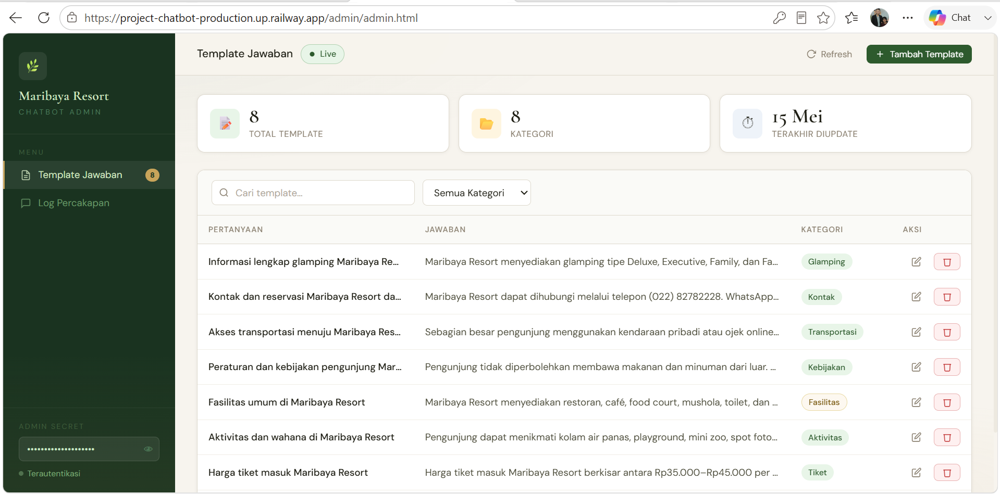
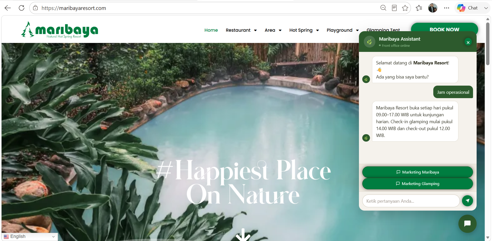

<div class="hero">

<h1>🤖 Maribaya Chatbot — NLP-Based Semantic FAQ Assistant</h1>

<p>Semantic Question Matching · Automated Knowledge-Base Management · Production NLP Application</p>

<p>
  
  
  
  
  
  
</p>

<p>
A production-oriented NLP FAQ assistant that uses semantic embeddings to match
visitor questions with curated answers from a domain-specific knowledge base.
</p>

</div>

---

## 📖 Project Overview

**Maribaya Chatbot** is an NLP-powered customer service assistant developed for **Maribaya**, a resort and glamping destination.

The system is designed around a practical FAQ retrieval problem:

> Visitors do not always phrase the same question using the same words.

A conventional keyword-based FAQ system can fail when a user asks a question using different wording from the stored FAQ.

This project addresses that limitation by converting user queries into **semantic embeddings** and comparing them against pre-embedded questions in a curated knowledge base.

```text id="k7m4p2"
Visitor Question
      ↓
Text Embedding
      ↓
Semantic Similarity
      ↓
Compare with Knowledge Base
      ↓
Best-Matching Question
      ↓
Associated Answer
      ↓
Visitor
```

The system therefore behaves as a **semantic retrieval assistant**, rather than a free-form generative chatbot.

> **Core design principle:** for a destination FAQ system, fast retrieval, predictable answers, low infrastructure overhead, and maintainable knowledge management are more valuable than unrestricted open-ended conversation.

---

## 🎯 The Problem

A traditional FAQ system often relies on exact keywords or predefined phrases.

For example:

```text id="p4x8z1"
Stored FAQ:
"Apakah tersedia kolam renang?"

User:
"Ada swimming pool nggak?"
```

A keyword-based system may fail if the wording does not overlap sufficiently.

A semantic retrieval system instead focuses on meaning:

```text id="v5q2m8"
Question A → Semantic Representation
Question B → Semantic Representation
              ↓
       Similarity Comparison
              ↓
         Relevant Match
```

This allows the system to handle **paraphrased and loosely worded visitor questions** more effectively.

---

## ⚙️ How the System Works

The complete request lifecycle consists of five primary steps.

| Step  | Process              | Description                                                  |
| ----- | -------------------- | ------------------------------------------------------------ |
| **1** | Input Capture        | Visitor submits a question through the chat interface        |
| **2** | Embedding Generation | Input is converted into a semantic vector representation     |
| **3** | Similarity Matching  | Input embedding is compared with stored question embeddings  |
| **4** | Best-Match Retrieval | The most relevant stored question is selected                |
| **5** | Answer Delivery      | The answer associated with the selected question is returned |

The flow is:

```text id="m8w2q4"
User Input
    ↓
Embedding Model
    ↓
Query Vector
    ↓
Knowledge-Base Vectors
    ↓
Similarity Comparison
    ↓
Highest-Relevance Match
    ↓
Stored Answer
```

---

## 🧠 Semantic Embedding Architecture

The key technical component is **embedding-based semantic matching**.

Instead of comparing strings directly, the system represents text as vectors in a semantic space.

Conceptually:

```text id="x3k7p1"
"Bagaimana cara reservasi?"

            ↓

       [Embedding]
            ↓

[0.12, -0.37, 0.81, ...]
```

A second question with similar meaning should occupy a nearby region in the embedding space.

```text id="z8m2q5"
Question A ─────┐
                │
                │ High Semantic Similarity
                │
Question B ─────┘
```

This allows the retrieval process to be more tolerant of differences in wording.

---

## 🔍 Keyword Matching vs Semantic Matching

| Characteristic            | Keyword Matching    | Semantic Matching                |
| ------------------------- | ------------------- | -------------------------------- |
| Exact wording             | Important           | Less important                   |
| Paraphrases               | Often difficult     | Better suited                    |
| Contextual similarity     | Limited             | Captured through embeddings      |
| Implementation complexity | Low                 | Moderate                         |
| Knowledge control         | High                | High when using curated answers  |
| Response generation       | Rule / lookup-based | Retrieval from stored answer     |
| Suitable for FAQ          | Basic               | Stronger for varied user wording |

The project deliberately chooses semantic retrieval because FAQ questions often have many valid linguistic forms.

---

## 🧩 Knowledge Base

The chatbot uses a curated question–answer knowledge base.

Each stored entry can be represented conceptually as:

```text id="f5m9q2"
Question
   +
Answer
   +
Embedding
```

At runtime:

```text id="c7v4x1"
User Question
      ↓
Generated Embedding
      ↓
Compare against stored question embeddings
      ↓
Select closest question
      ↓
Return stored answer
```

This approach keeps the system's answers grounded in predefined content instead of relying on unconstrained text generation.

---

## 🔐 Admin Dashboard

The application includes a dedicated administrative dashboard for maintaining the knowledge base.

The dashboard supports full **CRUD operations**:

* **Create** new FAQ entries.
* **Read** existing knowledge-base entries.
* **Update** existing answers.
* **Delete** outdated entries.

```text id="n4w7k3"
Admin
 ↓
Access Control
 ↓
Knowledge Base
 ├── Create
 ├── Read
 ├── Update
 └── Delete
```

This allows content managers to maintain the chatbot without requiring direct modification of the underlying application logic.

### Access Control

The admin dashboard is protected through an access key and is intentionally separated from the public visitor-facing chat interface.

> The administrative endpoint and access credentials are not publicly exposed in this portfolio repository.

---

## 🧠 Knowledge-Base Lifecycle

The project treats the knowledge base as a maintainable operational asset.

The lifecycle is:

```text id="x6q2m9"
Create FAQ
   ↓
Generate / Store Embedding
   ↓
Deploy Knowledge
   ↓
Serve Visitor Queries
   ↓
Monitor Usage
   ↓
Update / Remove FAQ
```

This allows the system to evolve as visitor information requirements change.

---

## 🗑️ Data Retention & Storage Management

A significant engineering consideration was maintaining a sustainable storage footprint.

### Input Constraint

Visitor messages are limited to **100 characters**.

The constraint helps:

* Control input size.
* Reduce unnecessary embedding computation.
* Keep the retrieval workload predictable.
* Limit storage growth associated with user-generated input.

### Log Retention

Conversation logs are retained for **30 days** and then automatically purged.

```text id="g8m2v5"
Conversation Log
      ↓
30-Day Retention
      ↓
Automatic Purge
      ↓
Reduced Storage Growth
```

This creates a bounded retention model rather than allowing operational logs to grow indefinitely.

> The retention policy is an engineering trade-off between short-term monitoring value and long-term storage efficiency.

---

## ⚡ Performance-Oriented Design

The architecture prioritizes efficient retrieval rather than expensive open-ended generation.

The core optimization strategy is:

```text id="m3x8q7"
Short Input
    ↓
Compact Embedding Workload
    ↓
Pre-Embedded Knowledge Base
    ↓
Similarity Search
    ↓
Fast Answer Retrieval
```

Because stored FAQ questions are embedded ahead of time, the system does not need to regenerate embeddings for the entire knowledge base for every visitor query.

This reduces unnecessary computation during request handling.

---

## 🏭 Production Deployment

The chatbot is deployed using **Railway** and is designed as a production-oriented application.

```text id="y7p3m1"
Visitor
   ↓
Production Web Interface
   ↓
NLP Retrieval Service
   ↓
Semantic Knowledge Base
   ↓
Relevant FAQ Response
```

The production environment is maintained separately from the public portfolio documentation.

### Operational Access

The public repository intentionally does not expose:

* Production credentials.
* Admin access keys.
* Private endpoints.
* Sensitive configuration.
* Internal operational information.

These remain private to protect the integrity of the deployed knowledge base.

---

## 🛠️ Technology Stack

| Layer                        | Technology                       | Purpose                                    |
| ---------------------------- | -------------------------------- | ------------------------------------------ |
| 🐍 **Core Language**         | **Python**                       | Application and NLP logic                  |
| 🧠 **Embeddings**            | **Sentence-Transformers**        | Semantic text representation               |
| 🔍 **Retrieval**             | **Semantic Similarity Matching** | Query-to-FAQ matching                      |
| 🌐 **Frontend**              | **HTML / CSS / JavaScript**      | Visitor chat interface and admin dashboard |
| 🚀 **Deployment**            | **Railway**                      | Production hosting                         |
| 🔐 **Administration**        | **Access-Controlled Dashboard**  | Knowledge-base maintenance                 |
| 🗑️ **Lifecycle Management** | **Scheduled Log Purging**        | Bounded storage retention                  |

---

## 🏗️ System Architecture

The application can be viewed through four logical layers.

### 🌐 Presentation Layer

```text id="f8k4m2"
HTML
CSS
JavaScript
   ↓
Visitor Chat Interface
   +
Admin Dashboard
```

### 🧠 NLP Layer

```text id="r5q8x3"
Visitor Question
      ↓
Sentence Embedding
      ↓
Semantic Vector
      ↓
Similarity Calculation
```

### 🗂️ Knowledge Layer

```text id="m7p2v8"
FAQ Question
     +
Answer
     +
Stored Embedding
```

### ⚙️ Operations Layer

```text id="c4x7n2"
Access Control
     +
Log Retention
     +
Scheduled Cleanup
     +
Production Deployment
```

---

## 🔄 End-to-End Architecture

```text id="j8m4q3"
┌─────────────────────┐
│       Visitor       │
└──────────┬──────────┘
           ↓
┌─────────────────────┐
│    Chat Interface   │
│   HTML/CSS/JS       │
└──────────┬──────────┘
           ↓
┌─────────────────────┐
│   Python NLP Layer  │
└──────────┬──────────┘
           ↓
┌─────────────────────┐
│ Sentence Embedding  │
└──────────┬──────────┘
           ↓
┌─────────────────────┐
│ Semantic Similarity │
│      Matching       │
└──────────┬──────────┘
           ↓
┌─────────────────────┐
│ Curated FAQ Base    │
│ Question → Answer   │
└──────────┬──────────┘
           ↓
┌─────────────────────┐
│ Relevant Response   │
└─────────────────────┘
```

Administrative operations run through a separate protected interface:

```text id="p6w4x9"
Admin
  ↓
Access Key
  ↓
Admin Dashboard
  ↓
CRUD Knowledge Base
  ↓
Updated FAQ Entries
```

---

## 📊 Operational Design Trade-Offs

One of the strongest engineering aspects of this project is that the system does not attempt to maximize functionality at the expense of operational efficiency.

| Trade-Off                                    | Decision                          |
| -------------------------------------------- | --------------------------------- |
| Flexible input vs. resource usage            | 100-character input limit         |
| Unlimited logs vs. bounded storage           | 30-day automatic retention        |
| Generative flexibility vs. response control  | Curated FAQ retrieval             |
| Public administration vs. system integrity   | Access-controlled admin dashboard |
| Runtime computation vs. retrieval efficiency | Pre-embedded knowledge base       |

These choices reflect the constraints of a live, cost-conscious customer-service application.

---

## 🔬 Technical Highlights

### Semantic Question Matching

The core retrieval mechanism focuses on **semantic similarity**, allowing user queries to match predefined FAQ questions even when wording differs.

### Pre-Embedded Knowledge Base

FAQ questions can be embedded ahead of time so that runtime requests primarily perform query embedding and similarity comparison.

### Controlled Response Generation

Instead of generating arbitrary answers, the system retrieves answers maintained in the curated knowledge base.

This improves consistency for a fixed-domain FAQ application.

### CRUD Knowledge Management

The administrative dashboard makes the knowledge base independently maintainable.

### Bounded Data Lifecycle

Input and retention controls prevent uncontrolled growth of computational and storage requirements.

### Production Deployment

The application is deployed on Railway and structured for ongoing maintenance and knowledge-base expansion.

---

## 💼 Business Value

The system addresses a practical customer-service problem:

```text id="q3m7x2"
Repeated Visitor Questions
          ↓
Manual Response Work
          ↓
Operational Overhead
```

The semantic FAQ assistant provides an alternative:

```text id="v5n8k3"
Visitor Question
       ↓
Semantic Matching
       ↓
Curated Answer
       ↓
Immediate Information Access
```

The administrative layer creates an additional operational benefit:

```text id="y4p7m9"
Staff
 ↓
Update FAQ
 ↓
Knowledge Base
 ↓
Improved Visitor Response
```

This allows the system to evolve as services, policies, and visitor information change.

---

## 📈 Customer Service Use Cases

The semantic FAQ architecture is suitable for domain-specific questions such as:

* Accommodation information.
* Facility information.
* Reservation-related questions.
* Visitor services.
* Property policies.
* General destination information.

The exact knowledge scope depends on the operational content maintained in the production knowledge base.

---

## 🗺️ Project Scope

| Module                       | Description                                  | Status        |
| ---------------------------- | -------------------------------------------- | ------------- |
| 🧠 **Semantic Matching**     | Embedding-based question similarity          | ✅ Implemented |
| 🗂️ **FAQ Knowledge Base**   | Curated question–answer repository           | ✅ Implemented |
| 🔐 **Admin Access Control**  | Protected administrative interface           | ✅ Implemented |
| 📝 **CRUD Management**       | Create, read, update, and delete FAQ entries | ✅ Implemented |
| 📏 **Input Control**         | 100-character visitor-message limit          | ✅ Implemented |
| 🗑️ **Log Retention**        | Automatic 30-day conversation-log purge      | ✅ Implemented |
| ⚡ **Efficient Retrieval**    | Pre-embedded knowledge-base matching         | ✅ Implemented |
| 🌐 **Web Interface**         | HTML/CSS/JavaScript client interface         | ✅ Implemented |
| 🚀 **Production Deployment** | Railway-hosted application                   | ✅ Deployed    |
| 📈 **Knowledge Expansion**   | Maintainable FAQ administration workflow     | ✅ Implemented |

---

## 🧭 Portfolio Alignment

The implementation directly reflects the capabilities described in the professional project entry:

| LinkedIn Capability                  | Project Evidence                       |
| ------------------------------------ | -------------------------------------- |
| NLP-powered customer service chatbot | Python-based semantic FAQ assistant    |
| Semantic embeddings                  | Sentence-Transformer representations   |
| Contextual question matching         | Embedding similarity retrieval         |
| Curated knowledge base               | Predefined FAQ question–answer pairs   |
| Admin dashboard                      | Protected web-based administration     |
| CRUD functionality                   | FAQ create/read/update/delete workflow |
| Data-retention controls              | 30-day automatic log purging           |
| Input controls                       | 100-character maximum input            |
| Production deployment                | Railway                                |
| Ongoing maintenance                  | Expandable knowledge-base architecture |

> **Portfolio positioning:** This project demonstrates how NLP semantic embeddings can be converted into a practical production customer-service system, combining retrieval quality, controlled responses, knowledge management, and operational efficiency.

---

## 🔭 Future Development

Potential extensions include:

* Semantic similarity thresholds for confidence-based rejection.
* Hybrid keyword + embedding retrieval.
* Frequently Asked Question analytics.
* Question clustering for knowledge-base maintenance.
* Retrieval confidence monitoring.
* Multilingual FAQ support.
* Automated embedding refresh after knowledge-base updates.
* Query analytics and topic monitoring.
* Retrieval-Augmented Generation for larger document collections.
* Knowledge-base versioning and audit history.

These represent future development directions and are not claimed as current production functionality.

---

## 📸 Project Screenshots



*Visitor-facing semantic FAQ chat interface.*



*Administrative interface for maintaining the FAQ knowledge base.*

---

## 🔐 Security & Privacy Notice

Because this application operates in a production customer-service environment, deployment credentials and operational information are intentionally excluded from the public portfolio.

The repository should not expose:

* Production access keys.
* Administrative credentials.
* Private environment variables.
* Sensitive customer interaction logs.
* Internal infrastructure details.
* Confidential business information.

The public documentation focuses on architecture, methodology, and portfolio-level implementation rather than exposing operational secrets.

---

## 📄 Project Ownership

This project was developed during my tenure as a **Data Analyst at PT Wiraky Nusa Telekomunikasi** for the **Maribaya** property.

It is documented here as a professional portfolio case study.

The **source code, production environment, knowledge-base content, customer interaction data, and other proprietary materials remain subject to the ownership and confidentiality requirements of PT Wiraky Nusa Telekomunikasi / Maribaya**.

This public documentation does not grant ownership or redistribution rights over those proprietary materials.

---

## 📄 License

This project is licensed under the **MIT License**. See the [`LICENSE`](LICENSE) file for the complete license text.

Third-party libraries, services, datasets, and external components remain subject to their respective licenses and terms.

---

<div class="contact-hero">

<p><strong>Interested in the project?</strong></p>

<p>
👨‍💻 <strong>Bernardo Nandaniar Sunia</strong><br/>
Bachelor of Computer Science — Diponegoro University<br/>
Data Analyst · NLP · Semantic Search
</p>

<p>
<a href="https://linkedin.com/in/bernardo-sunia/">

</a>
<a href="https://mail.google.com/mail/?view=cm&fs=1&to=suniabernardo@gmail.com">

</a>
<a href="https://github.com/bers31">

</a>
<a href="https://bit.ly/bernardo-my_portfolio">

</a>
</p>

<p>
<em>NLP · Semantic Embeddings · Information Retrieval · Customer Service Automation</em>
</p>

</div>

---

## 📌 Conclusion

**Maribaya Chatbot** demonstrates the application of NLP semantic embeddings to a practical customer-service problem: matching varied visitor questions with relevant, controlled FAQ responses.

The system combines **Python, Sentence-Transformers, semantic similarity matching, HTML/CSS/JavaScript, protected CRUD administration, data-lifecycle controls, and Railway deployment** into a production-oriented architecture.

Its main technical strength is the balance between **semantic flexibility and operational control**. Visitors can phrase questions naturally without requiring exact keyword matches, while the business retains control over the answers through a curated and maintainable knowledge base.

The project therefore represents more than a chatbot interface: it is a **domain-specific semantic retrieval system with an operational knowledge-management layer**, designed around speed, maintainability, storage efficiency, and ongoing production use.
