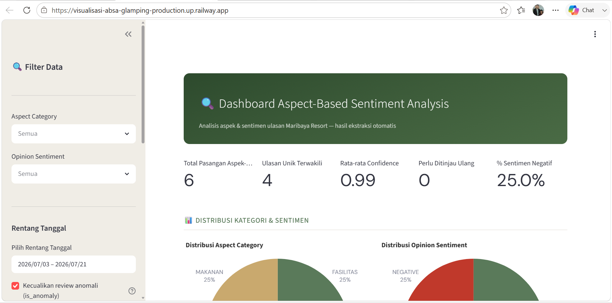
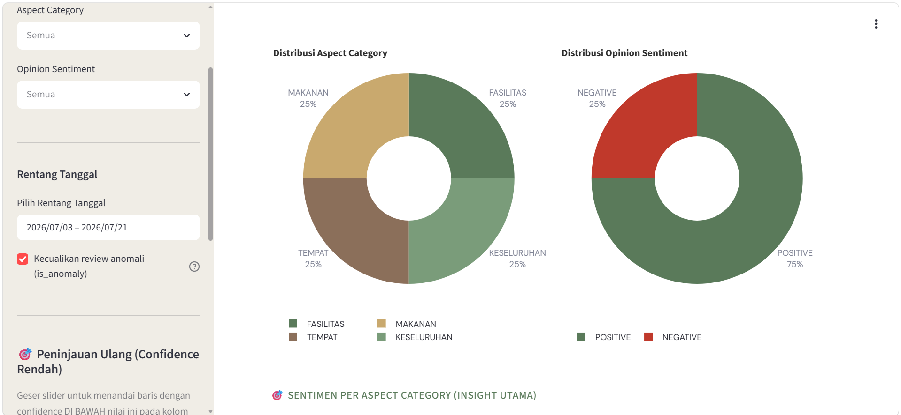
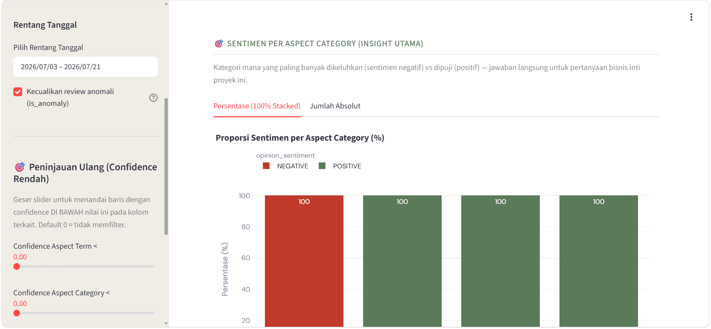
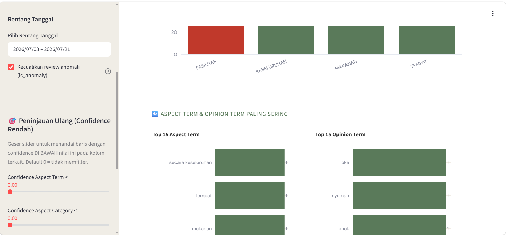
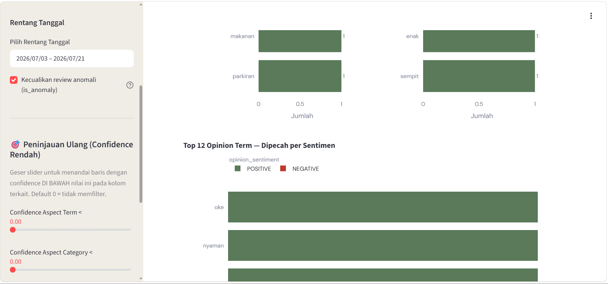
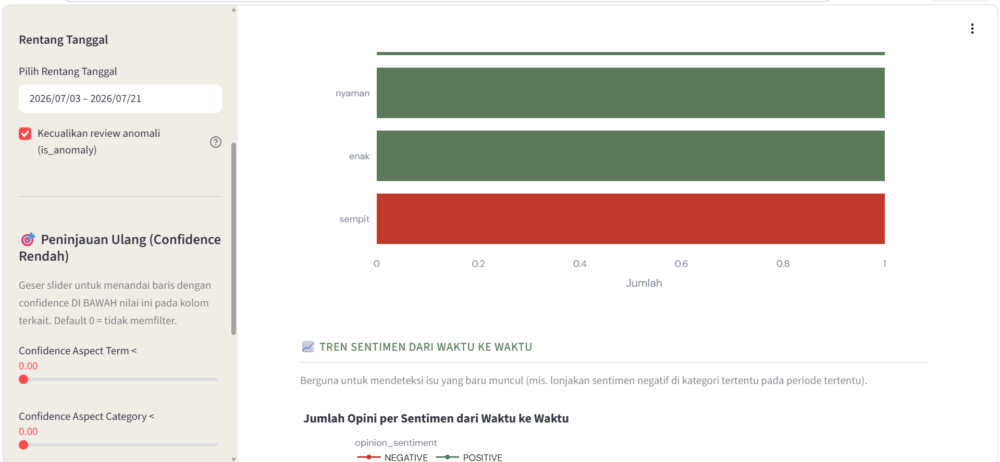
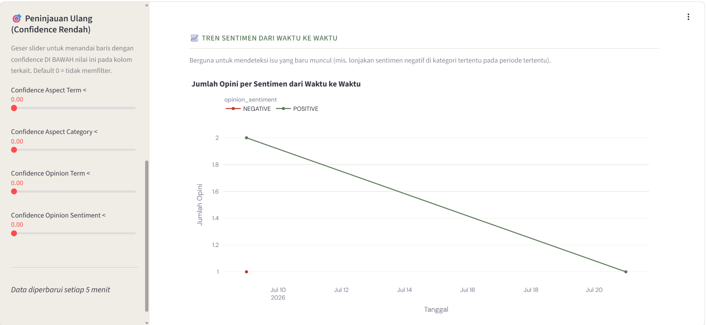
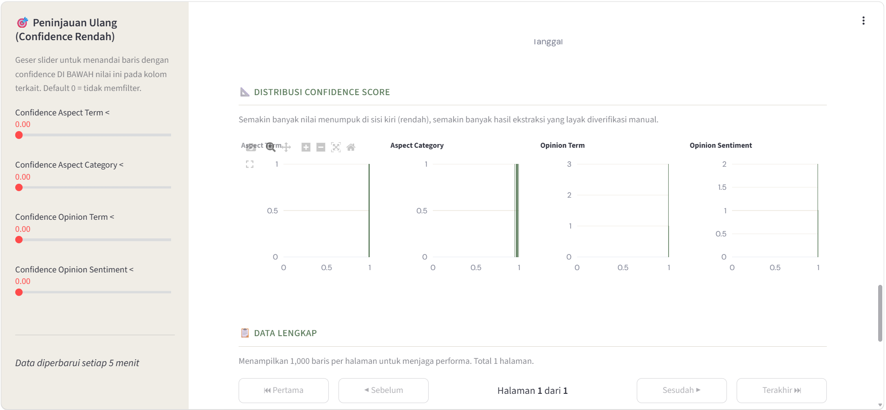
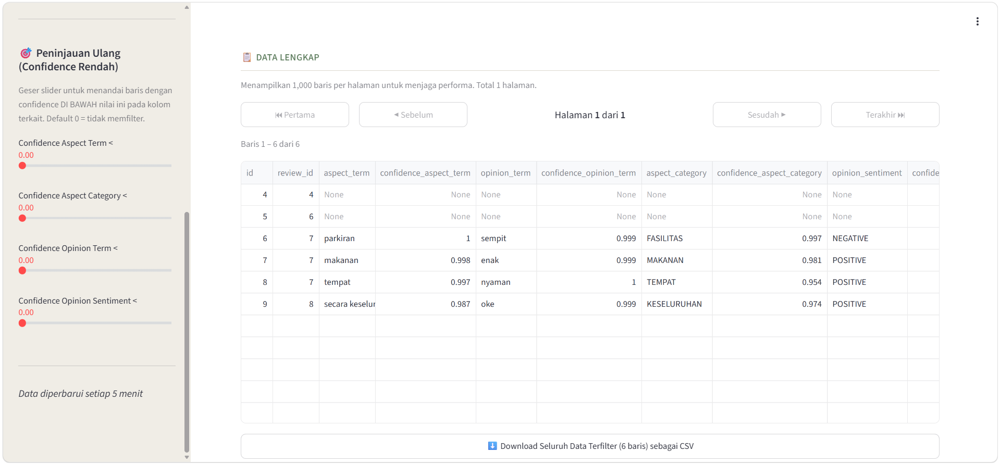

<div class="hero">

<h1>📋 Maribaya Visitor Review System</h1>

<p>First-Party Feedback Collection · Data Validation · Multi-Signal Anomaly Detection</p>

<p>
  
  
  
  
  
  
  
  
</p>

<p>
A web-based first-party customer feedback platform for collecting structured
visitor reviews, validating submissions, identifying anomalous patterns,
and exposing review data through interactive dashboards.
</p>

</div>

---

## 📖 Project Overview

The **Maribaya Visitor Review System** is a first-party customer feedback platform designed to collect structured visitor reviews across **Maribaya Resort and Maribaya Glamping** operations.

The system was developed around a practical problem: feedback collected through publicly accessible forms can be affected by duplicate submissions, suspicious patterns, and other anomalies that may distort downstream analysis.

Instead of treating every submission equally, the platform combines:

```text id="8x4m2q"
Visitor Feedback
       ↓
Submission Validation
       ↓
Token Verification
       ↓
Multi-Signal Analysis
       ↓
Anomaly Risk Classification
       ↓
Interactive Dashboard
       ↓
CSV Export / Further Analysis
```

The objective is to provide a more reliable foundation for analyzing first-party customer feedback.

> **Portfolio focus:** This project demonstrates practical web application development, REST-oriented data handling, token-based access control, data validation, anomaly detection, dashboard development, and operational feedback analytics.

---

## 🎯 Business Problem

First-party customer feedback is valuable because it is collected directly from visitors rather than relying exclusively on public review platforms.

However, the quality of the resulting dataset depends on the integrity of the submission process.

Potential problems include:

| Problem                   | Potential Impact                                 |
| ------------------------- | ------------------------------------------------ |
| Unauthorized submissions  | Contaminates the feedback dataset                |
| Duplicate identities      | Can distort customer-level statistics            |
| Repeated review text      | May indicate automated or suspicious submissions |
| Similar rating patterns   | Can indicate abnormal submission behavior        |
| Unusual submission timing | May provide an additional anomaly signal         |
| Large unfiltered datasets | Increases manual moderation effort               |

The system addresses these challenges by combining access controls, validation, anomaly scoring, and visualization.

---

## 🔐 Token-Based Access Control

Every review submission is associated with a **system-issued token**.

The token mechanism provides a controlled entry point to the feedback form.

### 15-Minute Expiration

Tokens expire after **15 minutes**.

```text id="m4q7p1"
System-Issued Token
        ↓
Visitor Opens Form
        ↓
Token Validation
        ↓
Valid → Submit Review
Invalid / Expired → Reject Access
```

The expiration window limits the period during which a submission link remains valid.

This helps reduce unauthorized reuse or sharing of review links.

---

## ✅ Submission Validation

Before review data enters the feedback dataset, the submission is checked against the application's validation rules.

The general workflow is:

```text id="f8m2x5"
Incoming Submission
       ↓
Validate Token
       ↓
Validate Submitted Fields
       ↓
Accept / Reject
       ↓
Persist Valid Feedback
```

Optional fields can be supported where appropriate so that visitors are not forced to provide information that is irrelevant to their experience.

---

## 🚨 Multi-Signal Anomaly Detection

The system uses multiple behavioral signals instead of relying on a single rule.

Four primary signals are evaluated:

### 👤 Repeated Identity

Repeated combinations of identity-related fields within a short time window can indicate that the same browser/session information is being reused.

### 📝 Text Similarity

Repeated or highly similar review text can indicate suspicious repetition patterns.

This signal is intentionally treated cautiously because genuine visitors may sometimes use similar language.

### ⭐ Rating Pattern Similarity

Similar combinations of submitted ratings can provide another indication of repeated or unusual submission behavior.

This signal is also not sufficient on its own to label a review as fraudulent.

### 🕐 Submission Timing

Unusual submission times can provide additional evidence when they fall outside expected operating conditions.

---

## 🧠 Anomaly Scoring Model

The system combines the available signals into a practical risk-classification framework.

```text id="w7k3m9"
                 Incoming Review
                       ↓
        ┌──────────────┼──────────────┐
        ↓              ↓              ↓
   Identity         Text           Rating
   Pattern        Similarity       Pattern
        │              │              │
        └──────────────┼──────────────┘
                       ↓
                Timing Signal
                       ↓
              Signal Combination
                       ↓
              Anomaly Risk Tier
```

### Risk Tiers

| Tier          | Interpretation                                                 |
| ------------- | -------------------------------------------------------------- |
| 🔴 **Strong** | Multiple strong signals or a high-confidence anomaly condition |
| 🟠 **Medium** | One meaningful signal or a combination requiring review        |
| 🟡 **Low**    | Weak or isolated similarity pattern                            |
| 🟢 **Normal** | No meaningful anomaly signal detected                          |

The scoring framework is intended to **prioritize moderation attention**, not to automatically declare that a visitor is fraudulent.

> Anomaly detection provides a risk signal for review prioritization. It should not be interpreted as definitive proof of malicious behavior.

---

## 📊 Why Multi-Signal Detection?

A single behavioral pattern can occur naturally.

For example:

```text id="p5x8n2"
Same Rating
    ≠
Fraud
```

Similarly:

```text id="m3q7v1"
Similar Review Text
    ≠
Fraud
```

The system therefore considers combinations and relative signal strength:

```text id="z8k4r6"
Weak Signal
     +
Weak Signal
     ↓
Low / Medium Risk

Strong Signal
     +
Supporting Signal
     ↓
Higher Risk
```

This reduces dependence on simplistic one-rule moderation.

---

## 📈 Interactive Review Dashboards

The collected feedback is exposed through interactive dashboards that allow users to inspect the dataset more efficiently.

The dashboard supports:

* Review filtering.
* Feedback pattern monitoring.
* Aggregate review analysis.
* Anomaly-oriented inspection.
* Dataset export.

The system provides separate operational views for:

* **Maribaya Resort**
* **Maribaya Glamping**

---

## 🔎 Data Exploration Workflow

```text id="c7m4x2"
Collected Reviews
       ↓
Dashboard
       ↓
Filter
       ↓
Inspect Patterns
       ↓
Identify Relevant Reviews
       ↓
Export
       ↓
Further Analysis
```

This allows users to move from raw submissions toward targeted review analysis.

---

## 📤 CSV Export

The dashboard supports exporting collected feedback to **CSV**.

This allows the review dataset to be used in downstream workflows such as:

* Statistical analysis.
* Data cleaning.
* Customer-experience analysis.
* NLP processing.
* Reporting.
* External analytical tooling.

```text id="r8m2w5"
Dashboard
    ↓
Filtered / Complete Dataset
    ↓
CSV Export
    ↓
External Analysis
```

---

## 🌐 REST-Oriented Application Architecture

The project incorporates a web application architecture with structured data communication.

Conceptually:

```text id="v4q7m8"
Visitor
   ↓
Web Interface
   ↓
Application / REST API
   ↓
Validation
   ↓
Anomaly Analysis
   ↓
Database
   ↓
Dashboard
```

The API-oriented structure provides a separation between user-facing interactions and backend processing.

---

## 🏗️ System Architecture

The application can be understood through five logical layers.

### 🌐 Presentation Layer

Responsible for:

* Review submission interface.
* Dashboard interface.
* Filtering controls.
* Data visualization.
* Export interaction.

### 🔐 Access Layer

Responsible for:

* Token generation.
* Token validation.
* Expiration handling.
* Submission access control.

### ⚙️ Processing Layer

Responsible for:

* Input validation.
* Review normalization.
* Anomaly signal calculation.
* Risk-tier classification.

### 🗄️ Data Layer

Responsible for:

* Review persistence.
* Submission metadata.
* Anomaly indicators.
* Dashboard data retrieval.

### 📊 Analytics Layer

Responsible for:

* Aggregate review analysis.
* Interactive filtering.
* Pattern monitoring.
* CSV export.

---

## 🔄 End-to-End System Flow

```text id="n5x7m2"
┌─────────────────────┐
│       Visitor       │
└──────────┬──────────┘
           ↓
┌─────────────────────┐
│   Review Form       │
└──────────┬──────────┘
           ↓
┌─────────────────────┐
│ Token Verification  │
│     + Validation    │
└──────────┬──────────┘
           ↓
┌─────────────────────┐
│ Review Processing    │
└──────────┬──────────┘
           ↓
┌─────────────────────┐
│ Multi-Signal        │
│ Anomaly Detection   │
└──────────┬──────────┘
           ↓
┌─────────────────────┐
│ Persistent Review   │
│ Data                │
└──────────┬──────────┘
           ↓
┌─────────────────────┐
│ Interactive         │
│ Dashboard           │
└──────────┬──────────┘
           ↓
┌─────────────────────┐
│ CSV Export /        │
│ Further Analysis    │
└─────────────────────┘
```

---

## 🧩 Data Quality Strategy

The system treats **data quality as a first-class concern**.

The objective is not merely to collect more reviews, but to collect feedback that can be trusted for subsequent analysis.

The quality pipeline is:

```text id="q2m8x4"
Access Control
      +
Field Validation
      +
Behavioral Analysis
      ↓
Higher-Quality Feedback Dataset
```

This is especially relevant for first-party feedback because the collected dataset may later become an input for customer-experience analysis and decision-making.

---

## ⚡ Operational Design

The system is designed around a lightweight feedback-collection workflow:

```text id="z6p3w8"
Visitor
 ↓
Short Review Flow
 ↓
Immediate Validation
 ↓
Automated Screening
 ↓
Dashboard Availability
```

This minimizes unnecessary complexity for the visitor while shifting anomaly screening to the application layer.

---

## 💼 Business Value

The project supports customer-experience operations in several ways.

### More Reliable First-Party Feedback

Token-controlled submission reduces the exposure of the review form to uncontrolled access.

### Lower Manual Moderation Burden

Anomaly tiers help teams focus attention on submissions with stronger suspicious signals.

### Better Data Accessibility

Interactive dashboards make review patterns easier to inspect without working directly with raw records.

### Easier Downstream Analysis

CSV export allows the dataset to be moved into additional analytical workflows.

The overall value chain is:

```text id="y8m4q2"
Feedback Collection
       ↓
Data Validation
       ↓
Anomaly Screening
       ↓
Structured Dataset
       ↓
Dashboard Exploration
       ↓
Customer Insight
```

---

## 🛠️ Technology Stack

| Layer                  | Technology                     | Purpose                                   |
| ---------------------- | ------------------------------ | ----------------------------------------- |
| 🐍 **Backend / Logic** | **Python**                     | Application and anomaly-processing logic  |
| 🌐 **API**             | **REST API**                   | Structured application data communication |
| ✅ **Validation**       | **Data Validation**            | Submission integrity checks               |
| 🚨 **Detection**       | **Multi-Signal Anomaly Rules** | Identify potentially suspicious reviews   |
| 📊 **Dashboard**       | **Web Application Dashboard**  | Interactive review analysis               |
| 📤 **Export**          | **CSV**                        | Downstream data analysis                  |
| 🚀 **Deployment**      | **Railway**                    | Application deployment                    |

---

## 🔬 Technical Highlights

### Token-Based Security

The 15-minute token expiration window creates a controlled submission mechanism rather than exposing an unrestricted review form.

### Behavioral Anomaly Detection

Multiple behavioral indicators are combined instead of relying on a single hard-coded rule.

### Risk-Based Classification

Reviews are assigned practical risk tiers to help prioritize moderation and investigation.

### Interactive Analytics

The dashboard provides filtering and review-pattern exploration without requiring users to manipulate backend data directly.

### Portable Data

CSV export allows collected feedback to be used by external analysis workflows.

### Web Application Architecture

The application separates data collection, validation, anomaly processing, persistence, and dashboard presentation into logical components.

---

## 🗺️ Project Scope

| Module                                 | Description                                                     | Status        |
| -------------------------------------- | --------------------------------------------------------------- | ------------- |
| 📝 **First-Party Feedback Collection** | Structured review collection for resort and glamping operations | ✅ Implemented |
| 🔐 **Token Access Control**            | System-issued access tokens with 15-minute expiry               | ✅ Implemented |
| ✅ **Data Validation**                  | Submission validation before persistence                        | ✅ Implemented |
| 👤 **Identity Signal**                 | Detect repeated identity patterns                               | ✅ Implemented |
| 📝 **Text Similarity Signal**          | Detect repeated or similar review text                          | ✅ Implemented |
| ⭐ **Rating Signal**                    | Detect similar rating combinations                              | ✅ Implemented |
| 🕐 **Timing Signal**                   | Detect unusual submission timing patterns                       | ✅ Implemented |
| 🚨 **Anomaly Classification**          | Low-to-strong risk framework                                    | ✅ Implemented |
| 📊 **Interactive Dashboard**           | Filter and monitor collected reviews                            | ✅ Implemented |
| 📤 **CSV Export**                      | Export feedback data for further analysis                       | ✅ Implemented |
| 🚀 **Railway Deployment**              | Web application deployment                                      | ✅ Implemented |

---

## 📊 Portfolio Alignment

The project directly reflects the capabilities represented in your LinkedIn entry:

| LinkedIn Capability                    | Project Evidence                           |
| -------------------------------------- | ------------------------------------------ |
| First-party customer feedback platform | Structured visitor review collection       |
| Python                                 | Application and anomaly-processing logic   |
| REST API                               | Structured backend communication           |
| Data validation                        | Controlled review submission flow          |
| Token-based access control             | 15-minute access-token expiration          |
| Multi-signal anomaly detection         | Identity, text, rating, and timing signals |
| Anomaly classification                 | Low-to-strong risk tiers                   |
| Dashboard                              | Interactive review monitoring              |
| CSV                                    | Dataset export                             |
| Railway                                | Deployment                                 |
| Web application                        | End-to-end browser-based feedback platform |

> **Portfolio positioning:** This project demonstrates the ability to build a practical feedback-data platform that combines secure access, data validation, anomaly detection, interactive analytics, and exportable datasets into one operational workflow.

---

## 🔭 Future Development

Potential extensions include:

* More sophisticated anomaly models.
* Statistical anomaly scoring.
* Behavioral baselines based on historical submissions.
* Automated anomaly-threshold calibration.
* Review trend monitoring over time.
* NLP-based sentiment and topic analysis.
* Reviewer-level behavioral profiling.
* Anomaly audit trails.
* Automated alerts for anomaly spikes.
* Integration with broader customer-experience analytics.

These represent future development directions and are not claimed as current implementations.

---

## 🚀 Deployment

The application is deployed using **Railway**.

The deployment architecture can be represented as:

```text id="m8x4q1"
Visitor
   ↓
Railway Deployment
   ↓
Web Application
   ↓
Validation + Anomaly Processing
   ↓
Feedback Dataset
   ↓
Dashboard / CSV Export
```

Operational endpoints and sensitive data are intentionally not exposed through the public portfolio documentation.

---

## 🔐 Security & Privacy Notice

The platform handles customer feedback and therefore should be deployed with appropriate protection for user-submitted information.

The public portfolio should not expose:

* Production credentials.
* Authentication tokens.
* Private environment variables.
* Sensitive visitor data.
* Internal operational configuration.
* Raw production review datasets.

The documentation focuses on the system's architecture and methodology rather than exposing operational information.

---

## 📄 Project Ownership

This project was developed during my tenure as a **Data Analyst at PT Wiraky Nusa Telekomunikasi** for the **Maribaya** property.

It is documented here as a professional portfolio case study.

Project materials, deployment configuration, operational data, and other non-public components should be handled according to the applicable organizational ownership and confidentiality requirements.

---

## 📄 License

This project is licensed under the **MIT License**. See the [`LICENSE`](LICENSE) file for the complete license text.

Third-party libraries, services, datasets, and external components remain subject to their respective licenses and terms.

---

<div class="contact-hero">

<p><strong>Interested in the project?</strong></p>

<p>
👨‍💻 <strong>Bernardo Nandaniar Sunia</strong><br/>
Bachelor of Computer Science — Diponegoro University<br/>
Data Analyst · Data Validation · Anomaly Detection · Web Applications
</p>

<p>
<a href="https://linkedin.com/in/bernardo-sunia/">

</a>
<a href="https://mail.google.com/mail/?view=cm&fs=1&to=suniabernardo@gmail.com">

</a>
<a href="https://github.com/bers31">

</a>
<a href="https://bit.ly/bernardo-my_portfolio">

</a>
</p>

<p>
<em>Python · REST API · Data Validation · Anomaly Detection · Dashboard · Railway</em>
</p>

</div>

---

## 📸 Full Screenshots



















---

## 📌 Conclusion

The **Maribaya Visitor Review System** demonstrates how a first-party feedback workflow can be strengthened through a combination of **controlled access, data validation, behavioral anomaly detection, interactive dashboards, and exportable datasets**.

The platform uses **15-minute token-based access control** to restrict review submissions, then evaluates incoming feedback through multiple signals including **repeated identity patterns, text similarity, rating similarity, and unusual submission timing**.

Rather than automatically rejecting potentially suspicious reviews, the system applies a **risk-based anomaly classification framework** that helps prioritize moderation and investigation.

The result is a practical web application that transforms customer feedback from simple form submissions into a more structured and analyzable data asset.