# Student Academic Information System (SI-MAS)

SI-MAS is an academic information system designed to assist students in filling out their Study Plan Forms (IRS) each semester, with automatic validation from academic advisors.

## Project Description
This project facilitates the management of academic data for over 1,000 students and 100 academic advisors, featuring efficient IRS submission and automatic data validation.

### Key Features
- **IRS Submission**: Students can select and fill out their courses each semester.
- **Automatic Advisor Validation**: Reduces input errors and speeds up the IRS validation process.
- **Class Schedule and Transcript Display**: Students can easily access their class schedules and academic transcripts.

### Technologies Used
- **Laravel**: Framework for managing CRUD operations and backend processes.
- **MySQL**: Database for storing over 10,000 academic records.
- **JavaScript**: For dynamic front-end interactions.

### How to Run the Project
1. **Clone Repository**: `git clone <repo-url>`
2. **Install Dependencies**: `composer install`
3. **Setup Database**: Configure the `.env` file for MySQL.
4. **Run Local Server**: `php artisan serve`

### Screenshots

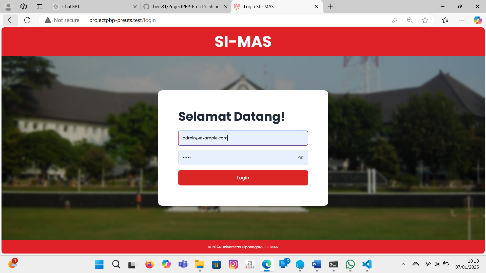
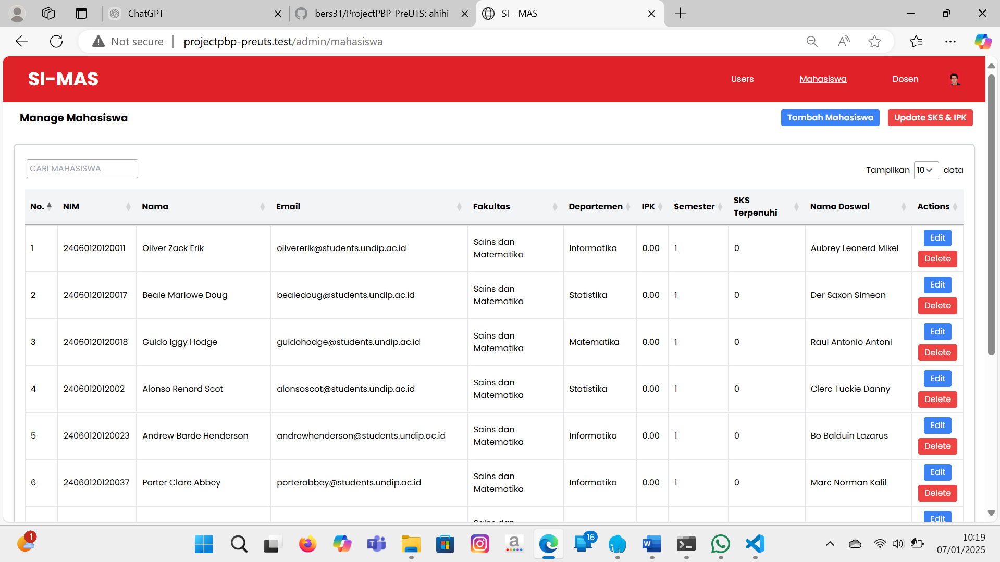
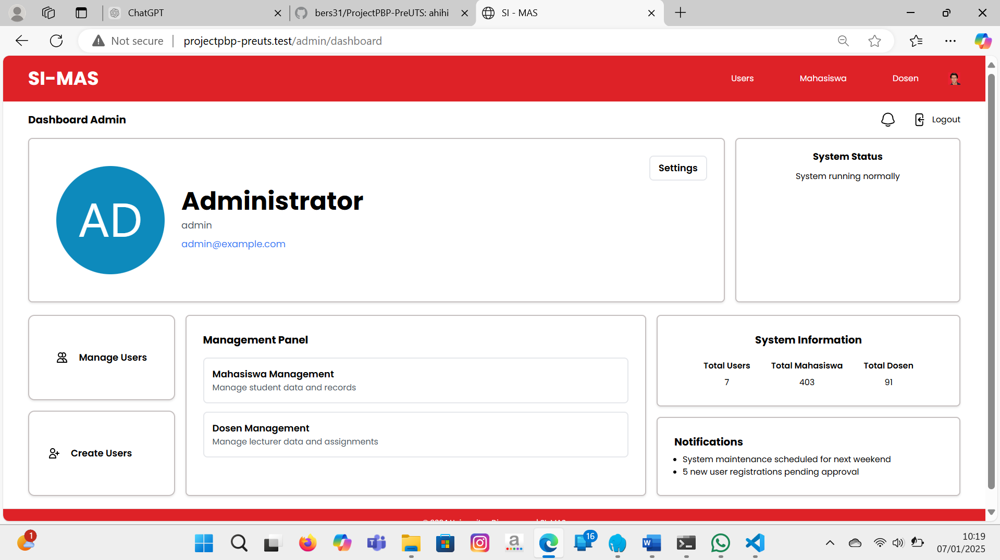
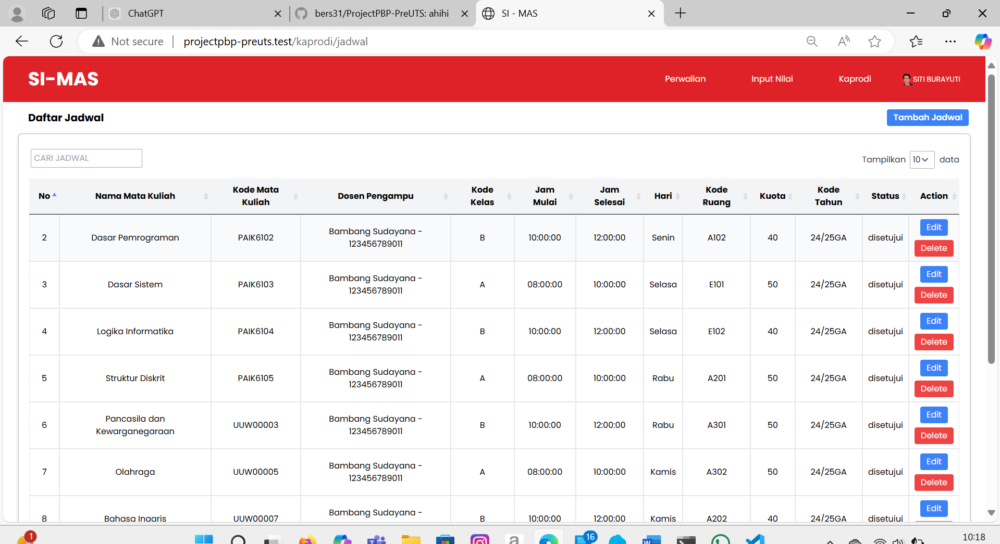
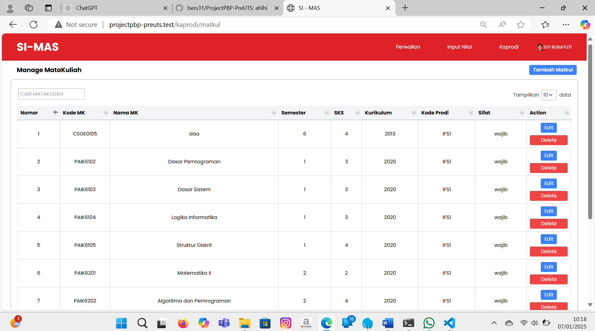
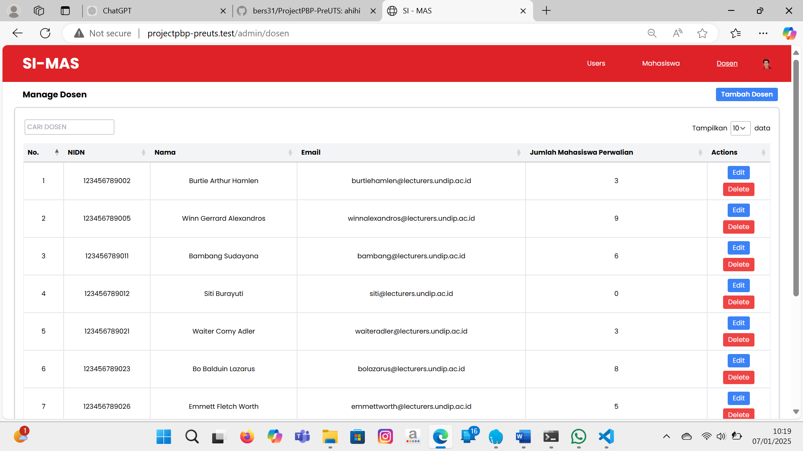
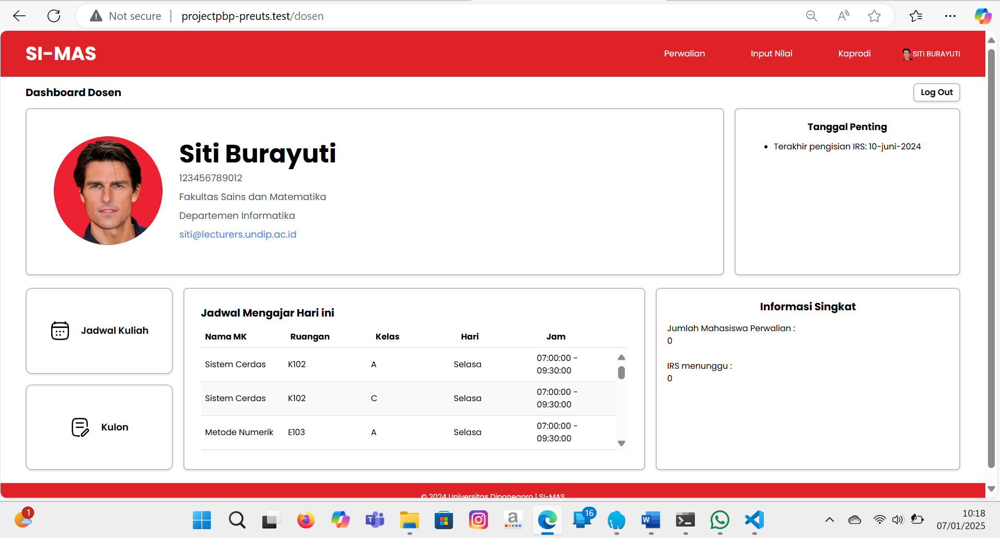
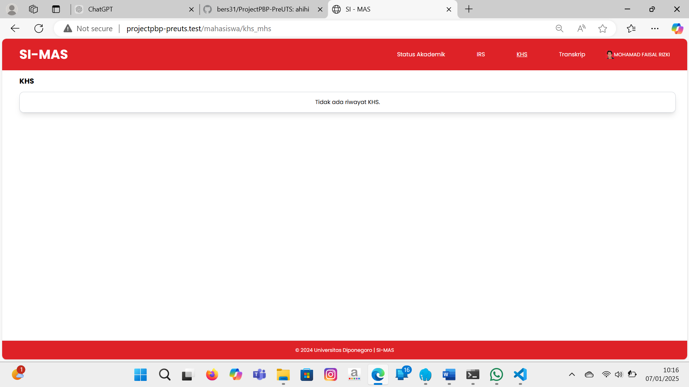
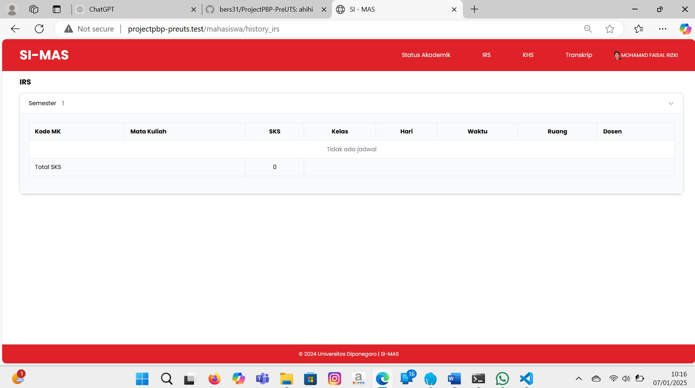
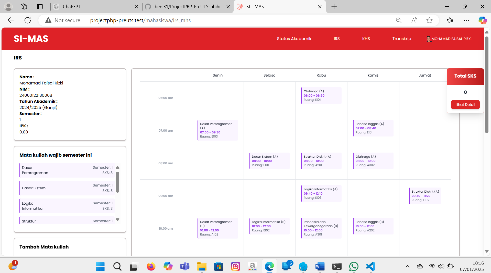
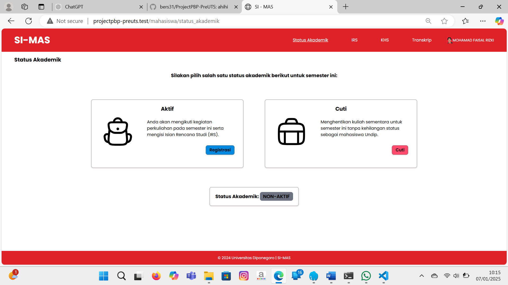
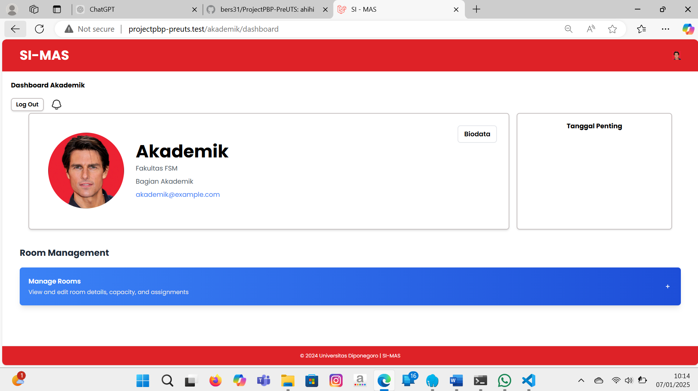
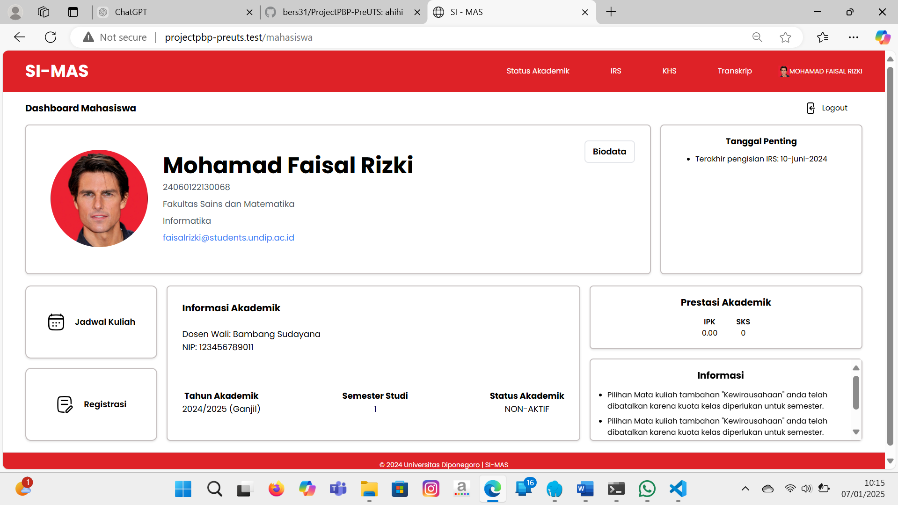
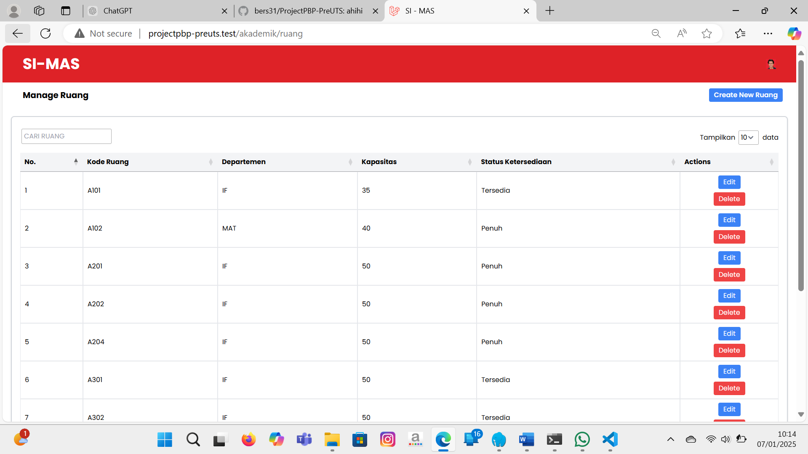
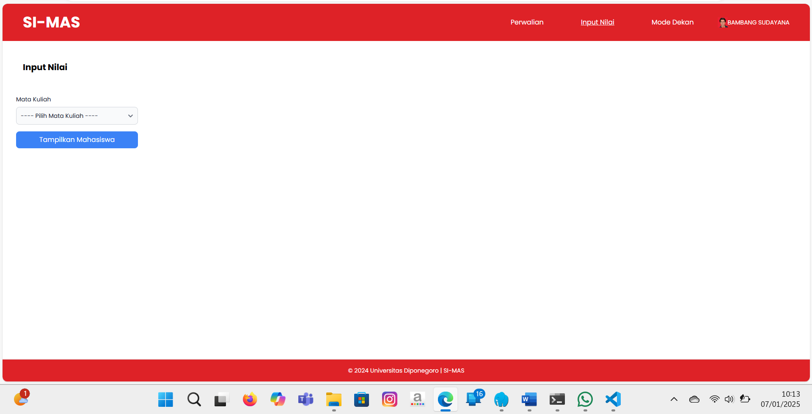
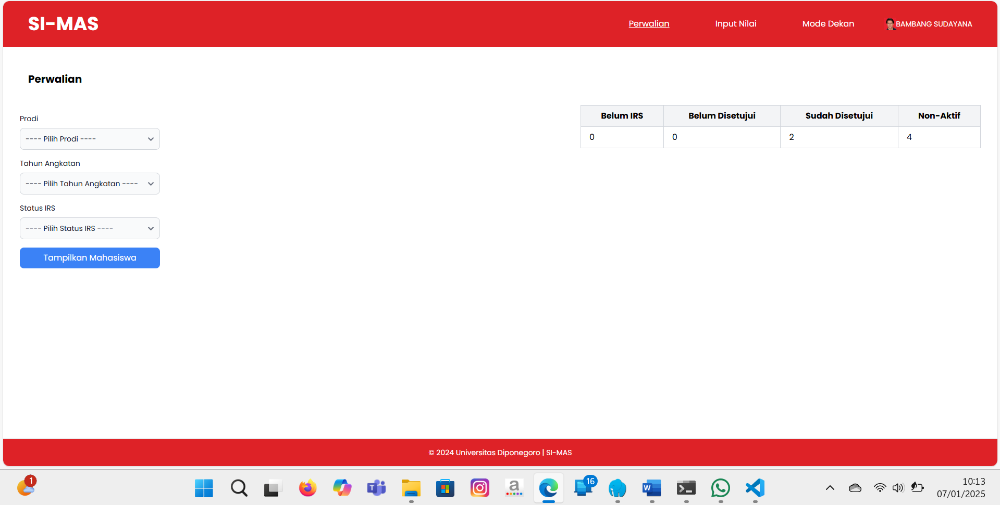
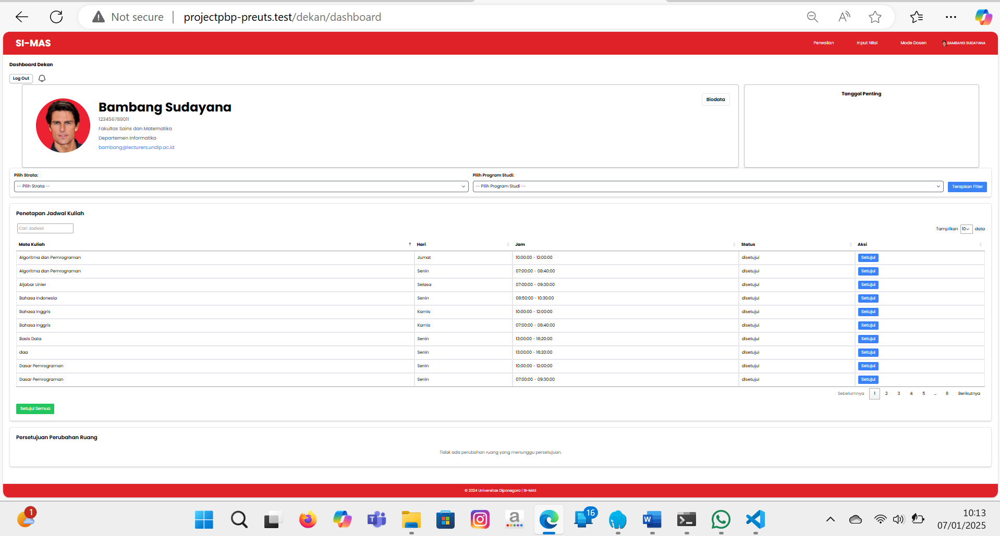
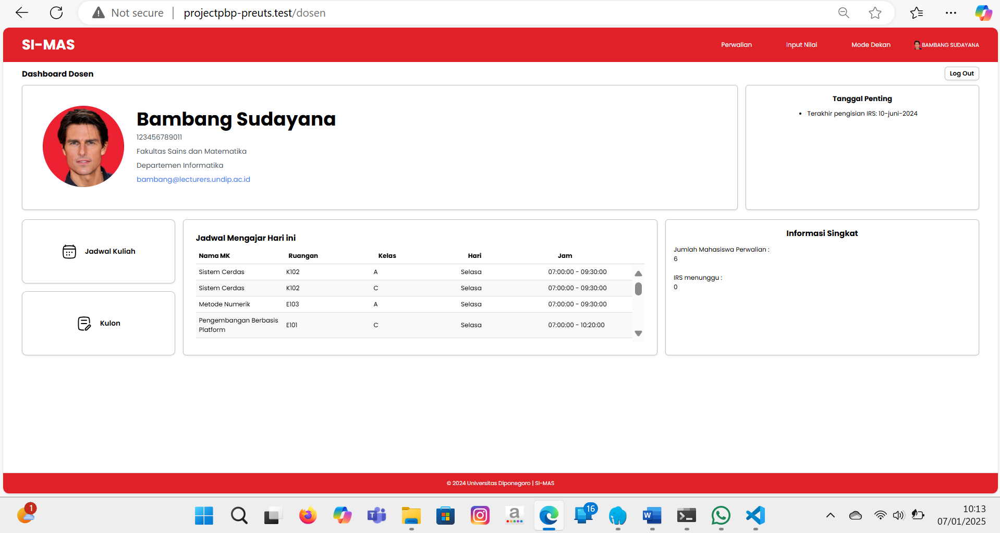

## Conclusion
This project demonstrates the development of an efficient academic information system using Laravel, MySQL, and JavaScript, providing a seamless experience for students and academic advisors.
