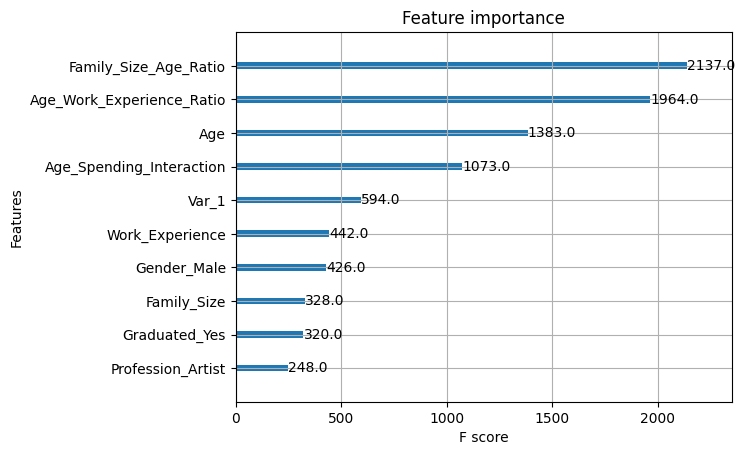

# Advanced Customer Segmentation Using Supervised Learning

This project demonstrates the development of an advanced customer segmentation system utilizing cutting-edge supervised learning algorithms to deliver insightful and actionable segmentation for businesses.

## Project Description
The customer segmentation system is designed to group customers based on shared characteristics and behaviors. This project implements state-of-the-art machine learning techniques to classify customers into distinct segments, enabling businesses to tailor their strategies for better engagement and profitability.

### Key Features
- **k-Nearest Neighbors (k-NN)**: A straightforward algorithm that classifies customers based on proximity in feature space.
- **Random Forest**: A powerful ensemble learning method for robust and interpretable segmentation.
- **Support Vector Machine (SVM)**: Leverages hyperplanes to separate customer segments efficiently.
- **XGBoost**: A gradient boosting framework optimized for high-performance segmentation.
- **Logistic Regression**: A baseline model to benchmark performance with simplicity and effectiveness.

### Technologies Used
- **Python**: The primary language for implementing the segmentation models.
- **Jupyter Notebook**: Interactive environment for iterative development and analysis.
- **Libraries**:
  - **NumPy, Pandas**: Data manipulation and preprocessing.
  - **Scikit-learn**: Core machine learning library.
  - **Matplotlib, Seaborn**: Visualization tools for insights.
  - **XGBoost**: Advanced gradient boosting library.

### Project Steps
1. **Data Exploration and Preprocessing**: Performed exploratory data analysis (EDA) and preprocessing tasks, including:
   - Handling missing values
   - Encoding categorical features
   - Scaling numerical features
2. **Model Implementation**: Developed and optimized multiple supervised learning algorithms to classify customer segments.
3. **Evaluation and Comparison**: Assessed each model using key performance metrics, such as accuracy, precision, recall, and F1-score.
4. **Visualization**: Created detailed plots to illustrate data distributions, feature importance, and model performance.

### How to Run the Project
1. **Clone Repository**: Clone the project repository using the following command:
   ```bash
   git clone https://github.com/yourusername/customer-segmentation.git
   ```
2. **Install Dependencies**: Install the required libraries:
   ```bash
   pip install -r requirements.txt
   ```
3. **Run the Notebook**: Open and execute the Jupyter Notebook step-by-step to reproduce the results:
   ```bash
   jupyter notebook
   ```

### Screenshots





### Future Work
- **Integration of Deep Learning**: Exploring neural network-based approaches for enhanced segmentation.
- **Real-time Segmentation**: Developing an online segmentation system for real-time applications.
- **Interactive Dashboards**: Building a web-based dashboard for visualizing segmentation insights interactively.
