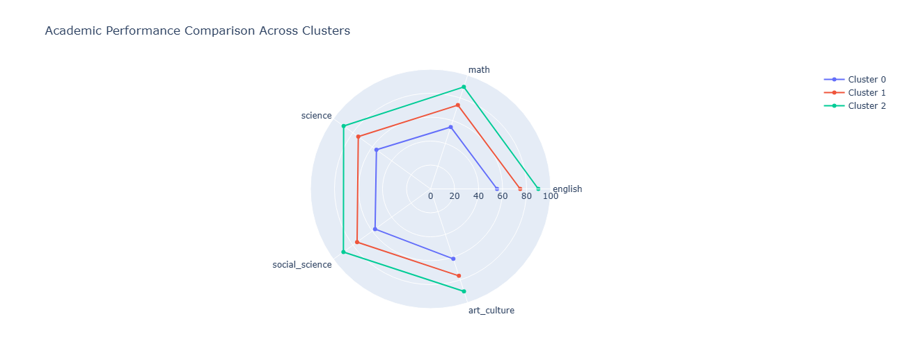

# Student Performance Clustering Using Unsupervised Learning

This project showcases the development of a student performance clustering system using the K-Means algorithm, an unsupervised learning approach, to identify patterns and group students based on their performance. The system includes an interactive user interface built with Streamlit to provide a seamless and engaging experience for exploring the clustering results.

## Project Description

Understanding student performance is critical for educational institutions aiming to enhance learning outcomes and provide targeted interventions. This project leverages the power of K-Means clustering to analyze student data and uncover meaningful clusters. By grouping students with similar performance characteristics, educators can implement data-driven strategies to support academic success and address challenges proactively.

### Key Features

- **K-Means Clustering**: A robust algorithm for identifying distinct groups within student performance data based on similarities.
- **Streamlit Integration**: An interactive web-based interface for visualizing and interpreting clustering results in real time.
- **Data Preprocessing**: Comprehensive handling of missing values, normalization, and feature engineering to ensure high-quality input for clustering.
- **Dynamic Visualization**: Intuitive charts and graphs for exploring clusters and gaining actionable insights.
- **Actionable Insights**: Identification of clusters that represent varying levels of performance, enabling tailored interventions.

### Technologies Used

- **Python**: The core programming language for data analysis and algorithm implementation.
- **Jupyter Notebook**: For data exploration, preprocessing, and initial clustering model development.
- **Streamlit**: To build an interactive and user-friendly interface for cluster exploration.
- **Libraries**:
  - **NumPy, Pandas**: Essential tools for data manipulation and preprocessing.
  - **Scikit-learn**: Provides the K-Means implementation and supporting functions for clustering.
  - **Matplotlib, Seaborn**: For generating insightful visualizations.
  - **Plotly**: To create dynamic and interactive cluster plots within the Streamlit app.

### Project Steps

1. **Data Exploration and Cleaning**:
   - Conducted exploratory data analysis (EDA) to understand the dataset.
   - Addressed missing values and outliers to prepare the data for clustering.
   - Engineered meaningful features for optimal clustering performance.

2. **K-Means Clustering Implementation**:
   - Applied the elbow method to determine the optimal number of clusters.
   - Implemented and fine-tuned the K-Means algorithm to segment students into performance-based clusters.

3. **Cluster Evaluation and Visualization**:
   - Evaluated clusters using metrics such as inertia and silhouette scores.
   - Visualized clusters with dynamic plots, highlighting key features and group characteristics.

4. **Interactive Streamlit App Development**:
   - Designed an intuitive UI for visualizing clustering results.
   - Integrated dynamic input sliders and filters for exploring data in real time.

### How to Run the Project

1. **Clone the Repository**:
   ```bash
   git clone https://github.com/yourusername/student-performance-clustering.git
   
2. **Install Dependencies**:
   ```bash
   pip install -r requirements.txt

3. **Run the Streamlit App**:
   ```bash
   streamlit run app.py

### Screenshots





### Conclusion
This project demonstrates the application of K-Means clustering to uncover actionable insights from student performance data. By providing an interactive interface through Streamlit, the system enables educators and stakeholders to explore and interpret clustering results effectively. The findings can guide tailored educational strategies, foster student success, and support data-driven decision-making. Future enhancements could include integrating advanced clustering algorithms, adding real-time data processing capabilities, and expanding the visualization suite for deeper analysis. Contributions and feedback are warmly welcomed to elevate this project further
