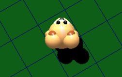
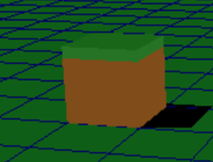
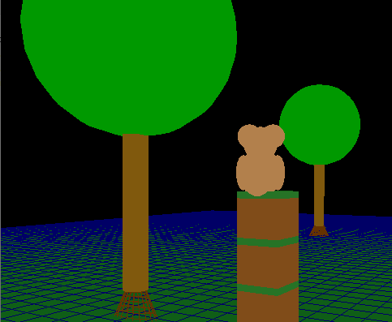
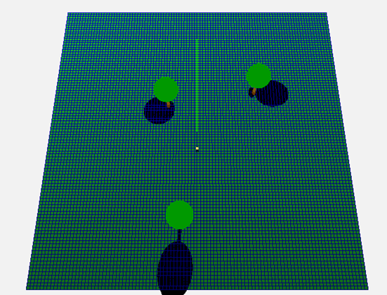

# 3D Game Development Using C++ and OpenGL

Game 3D ini menampilkan karakter beruang yang dapat berinteraksi dengan objek di lingkungan permainan 3D.

## Deskripsi Proyek
Game ini dibangun dengan OpenGL dan C++, memberikan pengalaman bermain interaktif dengan berbagai elemen seperti pepohonan, komet, balok, dan karakter beruang yang dilengkapi dengan kontrol dan efek pencahayaan dinamis.

### Fitur Utama
- **Karakter Utama Beruang**: Dapat berjalan, melompat, dan berinteraksi.
- **Objek Lingkungan**: Terdapat pepohonan, komet, balok, dan bebatuan.
- **Pencahayaan Dinamis dan Bayangan**: Menggunakan proyeksi bayangan untuk tampilan lebih realistis.

### Teknologi yang Digunakan
- **C++ dan OpenGL**: Untuk pengembangan grafis 3D.
- **GL Functions**: Mengoptimalkan performa grafis dengan manipulasi matriks.

### Cara Menjalankan Proyek
1. **Clone Repository**: `git clone <repo-url>`
2. **Compile**: Kompilasi di lingkungan Dev C++ atau lainnya.
3. **Jalankan Game**: Run executable file.

### Tangkapan Layar

