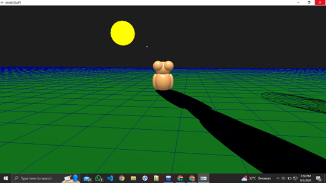

# 3D Game Development Using C++ and OpenGL

This 3D game features a bear character that can interact with various objects in a dynamic 3D environment.

## Project Description
Built using OpenGL and C++, this game offers an interactive experience with elements such as trees, meteors, blocks, and a bear character equipped with controls and dynamic lighting effects.

### Key Features
- **Main Bear Character**: Capable of walking, jumping, and interacting with the environment.
- **Environmental Objects**: Includes trees, meteors, blocks, and rocks.
- **Dynamic Lighting and Shadows**: Utilizes shadow projection for a more realistic appearance.

### Technologies Used
- **C++ and OpenGL**: For 3D graphics development.
- **GL Functions**: To optimize graphics performance through matrix manipulation.

### How to Run the Project
1. **Clone Repository**: `git clone <repo-url>`
2. **Compile**: Compile in Dev C++ or any other suitable environment.
3. **Run the Game**: Execute the compiled file.

### Screenshots

## Conclusion
This project demonstrates the creation of an engaging 3D game using C++ and OpenGL, showcasing advanced graphics techniques and interactive gameplay elements.
