

# 👋 Bernardo Nandaniar Sunia

**Data Analyst · Data Scientist · NLP & Aspect-Based Sentiment Analysis**

📍 Semarang, Indonesia

---

## 🎯 Professional Summary

Informatics graduate (S.Kom.) from Universitas Diponegoro with hands-on experience as a Data Analyst. Skilled in Python, SQL, machine learning, and Natural Language Processing, with a focus on ABSA and ASQE. Experienced in transforming raw data into actionable insights for business and property investment, from data modeling and analysis to building dashboards for non-technical stakeholders.

---

## 🎓 Education

### 🏛️ Universitas Diponegoro, Bachelor of Science in Informatics
**August 2022 - March 2026** · GPA 3.78/4.00

- 📚 Concentrated on Data Science, Machine Learning, and Software Engineering.
- 🏆 Maintained a 3.78/4.00 GPA throughout the program.

---

## 💼 Professional Experience

### 🏨 PT Wiraky Nusa Telekomunikasi, Data Analyst
**May 2026 - July 2026**

Responsible for data analysis across the Maribaya and Glamping properties, covering NLP model development, visitor review collection, and property analytics.

- 🧠 Built an **Aspect Sentiment Quad Extraction (ASQE)** pipeline for Maribaya and Glamping guest reviews, pulling out aspect term, opinion term, aspect category, and sentiment together, each with its own confidence score. This closes a real gap in star ratings, which often hide what's actually working or not at the aspect level.
- 📊 Hand built a 1,000-review Maribaya dataset for fine-tuning, targeting the hard cases: sarcasm, double negation, code-mixing, informal language, and implicit sentiment. Also re-labeled the public Airyroom hotel review dataset from aspect-sentiment pairs into a quad extraction format.
- 🤖 Designed an NLP chatbot using embedding-based matching, complete with an admin dashboard for managing conversation data (CRUD) and an automatic log cleanup job to keep storage costs down.
- 🔐 Built a visitor review form with token-based access and a multi-signal anomaly detection system checking for repeated identity, similar text, similar rating patterns, and off-hours submissions, backed by a visualization dashboard with CSV export.
- 🏘️ Designed a property analysis database split into operational and analytical schemas, integrating macroeconomic indicators (IHPR, BI Rate, inflation, GDP, regional minimum wage, PIR) to support investment analysis from the national level down to individual listings.

**Project documentation:**

### 🏛️ Class II Correctional Facility Ambarawa, Intern, AI Chatbot Developer
**May 2025 - July 2025** · Ambarawa, Indonesia

- 🤖 Built a full-stack AI chatbot with Flask, HTML5, CSS3, JavaScript, and the OpenAI GPT API for a public information service.
- 🔒 Built a role-based admin dashboard with authentication and brute-force protection.
- 📈 Added analytics to track chatbot performance and user engagement.
- 🔔 Improved the user experience with web push notifications and a responsive layout.

### 🏢 East Semarang District Office, Intern, Financial Reporting Developer
**December 2024 - February 2025** · Semarang, Indonesia

- 💰 Built a financial reporting application with ReactJS, MySQL, and Prisma ORM.
- 📊 Improved data accuracy and processing efficiency for the district's financial reporting.
- 🎨 Designed an interactive dashboard with real-time visualizations using Chart.js and D3.js.
- 🔐 Implemented authentication and role-based access control.

### 🏫 Universitas Diponegoro, Laboratory Teaching Assistant
**June 2023 - June 2025** · Semarang, Indonesia

- 👨‍🏫 Mentored 20+ students in Python programming and algorithmic problem solving.
- 📚 Designed structured assignments and an evaluation framework for core IT competencies.
- 📈 Helped raise average lab scores by **15%** through more effective teaching methods.

### ⚡ YC Electric, Assistant Manager & Supply Chain Assistant
**January 2022 - December 2024** · Semarang, Indonesia

- 📦 Optimized inventory management through better tracking and data analysis.
- 🔗 Streamlined supply chain operations to cut costs.
- 📈 Prepared comprehensive financial reports that supported higher profitability.

---

## 🏆 Featured Project

### 🧠 Aspect Sentiment Quad Extraction (ASQE) for Tourism Review Analysis

  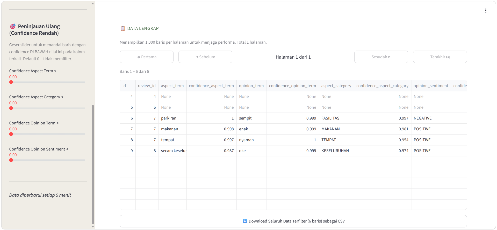

A single star rating can hide a lot. A guest might leave a 3 after writing that the pool was excellent and only the parking was cramped. This project builds an ASQE pipeline that pulls four things out of every review at once: the aspect being discussed, the opinion tied to it, its category, and its sentiment, each with a confidence score.

- 🔄 Re-labeled the public Airyroom hotel review dataset, originally built for aspect-sentiment pair extraction, into a quad extraction format.
- 🗂️ Hand built a **1,000-review Maribaya dataset**, targeting the hard cases: sarcasm, double negation, dense multi-aspect reviews, informal language and slang, code-mixing, sentiment-carrying emoji, comparative and conditional sentences, and mixed sentiment within a single aspect.
- 🔭 Mapped out the next steps: timeline-based aspect tracking, emerging issue detection, zero-shot topic clustering with BERTopic, and weighting clusters by their correlation with business outcomes like overall rating, repeat bookings, and cancellations.

> **💡 Sample output.** For the review *"Tempatnya bagus, tapi parkirannya sempit"* (the place is nice, but parking is tight), the pipeline detects the aspects **place** and **parking** at confidence `0.9`. Sentiment comes back positive for place `(1.0)` and negative for parking `(0.9)`.

---

## 🔬 Data Science, Machine Learning & NLP Projects

### 🛍️ TF-IDF vs SBERT: Aspect-Based Sentiment Classification on E-Commerce Reviews

    

  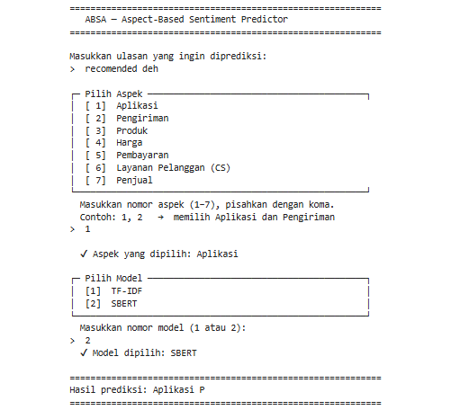

- 🔬 Ran a comparative NLP study on aspect-based sentiment classification using Indonesian-language Shopee reviews.
- ⚖️ Compared sparse TF-IDF and dense SBERT representations under the same Logistic Regression classifier.
- 🔄 Built the full pipeline: data collection, aspect discovery, annotation, modeling, and statistical evaluation.

### 🔍 Multilingual Information Retrieval System Built on mBERT

   

  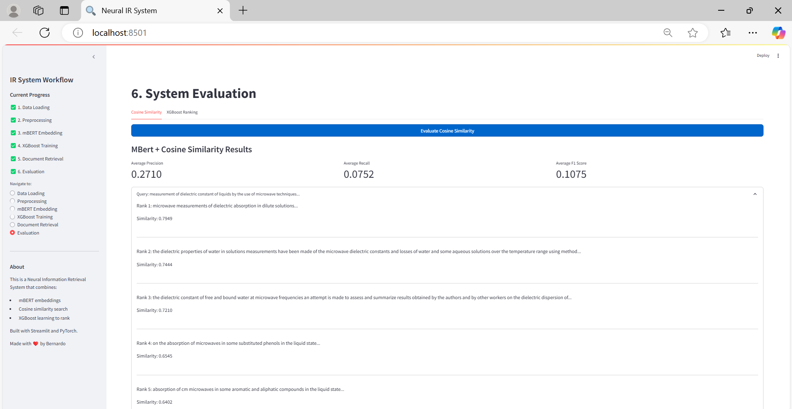

- ⚡ Built a multilingual neural IR system with sub-second query response time.
- 🌐 Fine-tuned mBERT for Indonesian-English semantic search.
- 📈 Beat the traditional BM25 baseline by a clear margin.

### 🐦 Twitter Sentiment & Information Diffusion Analysis

   

  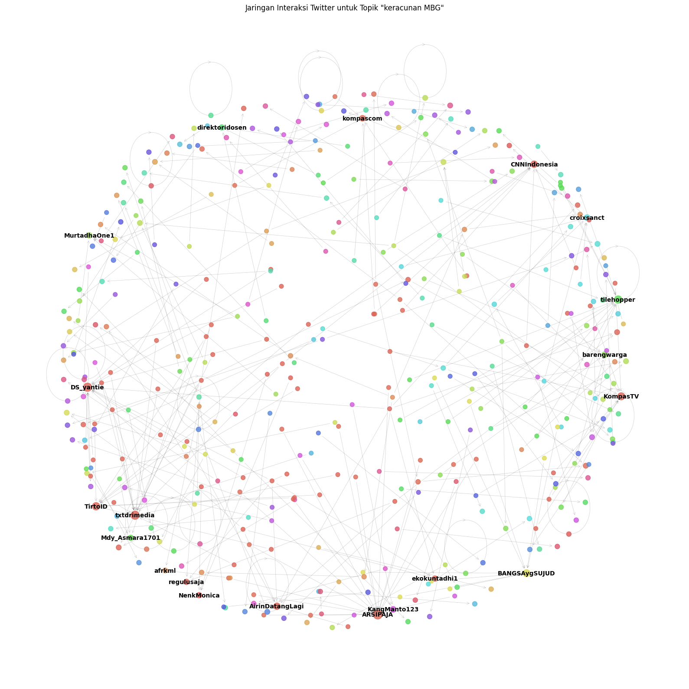

- 📥 Processed **500,000+ tweets a day** through a fault-tolerant ingestion pipeline.
- 🎯 Reached **92% accuracy** on sentiment classification using ensemble methods.
- 🕸️ Identified the top **1% most influential** accounts through network analysis.

### 🎯 Customer Segmentation with Supervised Learning

    

  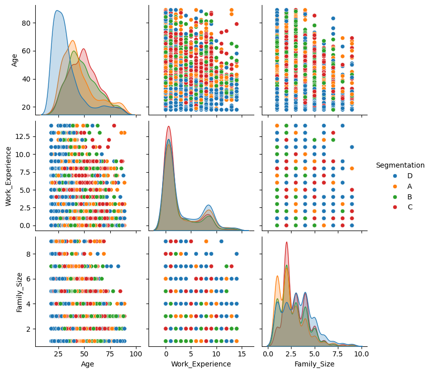

- 🎯 Built customer segments using a mix of supervised learning algorithms: Random Forest, XGBoost, SVM, and k-NN.
- 📊 Pushed segmentation accuracy well above the baseline model.
- 💻 Built an interactive Streamlit interface for real-time customer analysis.
- 🚀 Turned the segments into targeting recommendations the business could act on.

### 🎓 Student Performance Clustering

   

  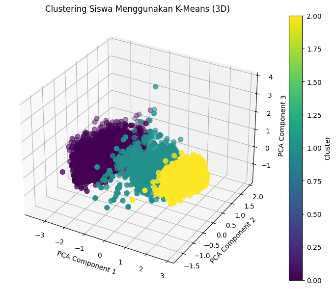

- 🎓 Built a K-Means clustering system to group students by academic performance.
- 💻 Built an interactive Streamlit interface so instructors could explore clusters on their own.
- 🎯 Tuned the clustering using silhouette score and hyperparameter search.
- 📚 Used the resulting groups to support more targeted academic interventions.

### 🔎 Search Engine Built on VSM & LSI

    

  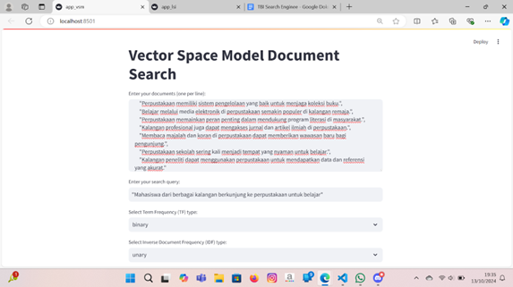

- 🔎 Built an interactive search engine to demonstrate Vector Space Model and Latent Semantic Indexing.
- ✂️ Built Indonesian-language text preprocessing with Sastrawi stemming and tokenization.
- ⚙️ Tuned retrieval accuracy through systematic LSI topic configuration testing.
- 📈 Improved search relevance, measured with Accuracy@K and MRR.

### 🌍 Greenhouse Gas Emissions Forecast

   

  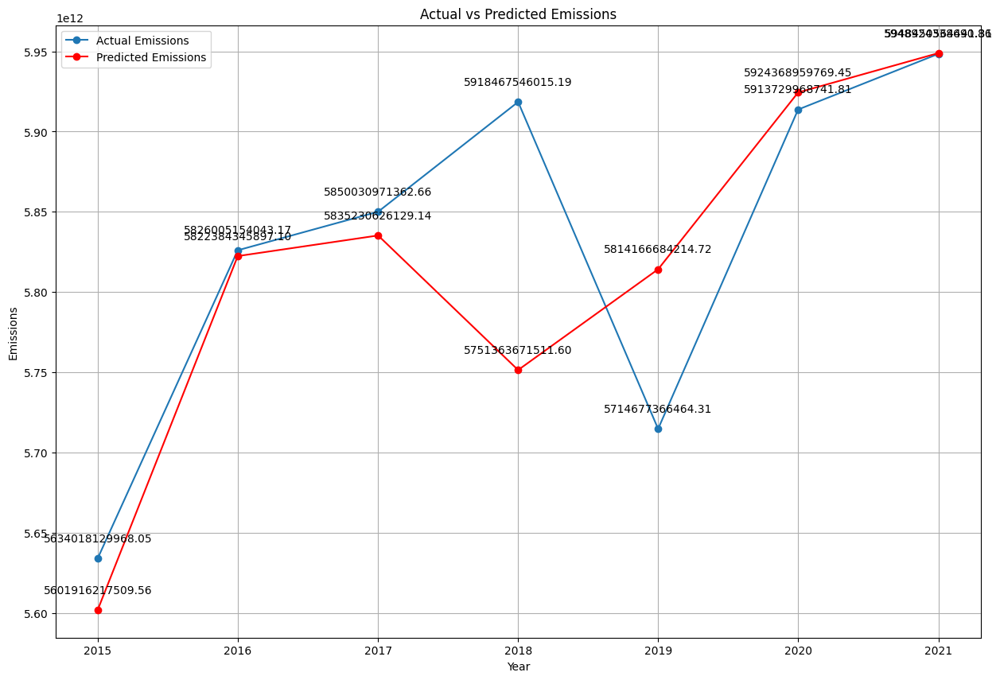

- 🌍 Built a forecasting model projecting greenhouse gas emissions a decade out.
- 📉 Applied time-series and regression techniques for the projection.
- 📋 Turned the results into recommendations to support emissions policy.
- 📊 Wrote up the findings with clear visualizations for stakeholder decisions.

### 📊 Excel Data Analysis Dashboard

  

  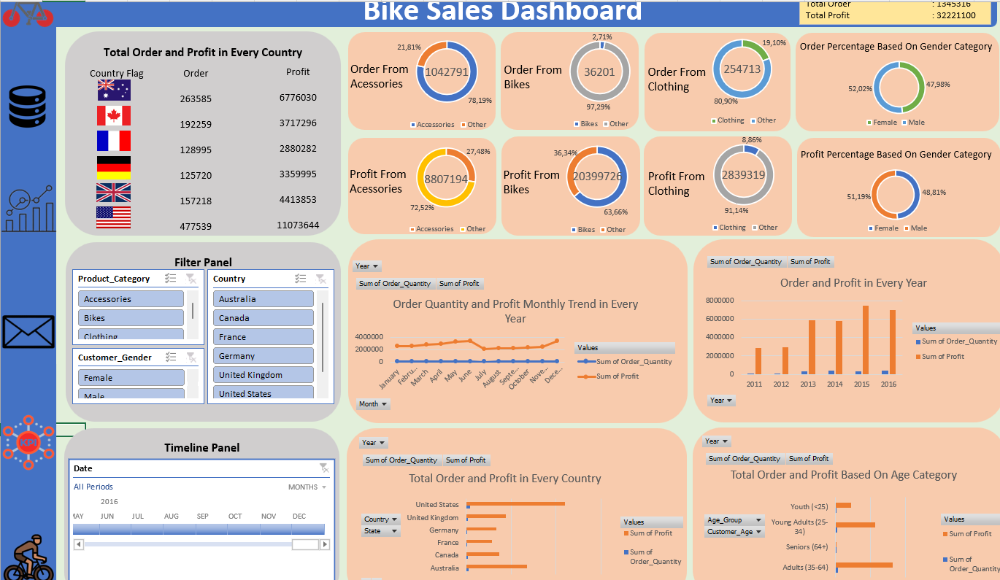

- 💡 Built a data analysis dashboard that turns messy datasets into clear takeaways.
- 📊 Built dynamic charts and interactive pivot tables.
- 🎚️ Added slicers and filters for real-time data exploration.
- ⚙️ Used advanced Excel functions including VLOOKUP, SUMIFS, and conditional formatting.

---

## 💻 Other Development Projects

These projects show full-stack range outside my core focus on data analysis.

### 🎓 Student Academic Information System (SI-MAS)

  

  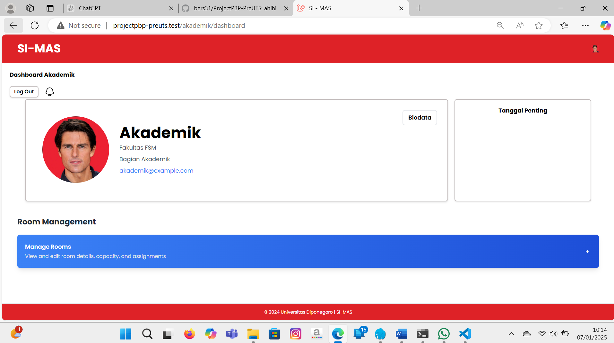

- 🎓 Built a web-based system serving **1,000+ students** and **100+ faculty members**.
- ⏱️ Cut course registration time by **30%** through process optimization.
- ✅ Added automated validation that reduced errors and faculty workload.

### 🛒 YC Electric E-Commerce Website

   

  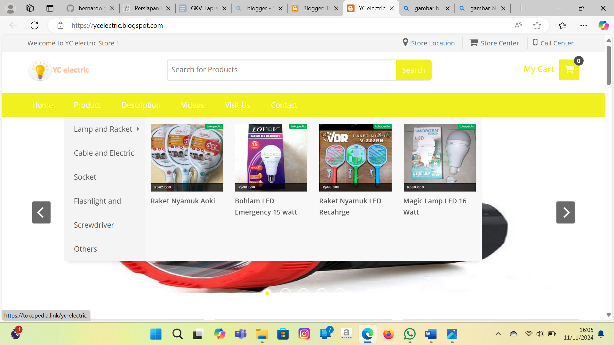

- 🛒 Led development of a custom e-commerce site that reached **500+ active users**.
- 🗄️ Built the MySQL database behind **100+ products** and **50+ daily transactions**.
- ⚡ Got page load time under 2 seconds through query and code optimization.
- 📈 Grew organic traffic by **40%** and customer retention by **25%** through SEO and A/B testing.

### 🎮 3D Minecraft-Inspired Game

 

  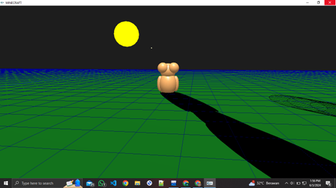

- 🎮 Designed and built an immersive 3D game with a bear character in an interactive environment.
- 🌐 Built a dynamic world with interactive objects using advanced OpenGL techniques.
- ⚙️ Kept gameplay smooth through efficient matrix manipulation and vector optimization.
- 🎯 Built an intuitive control scheme that held up well across different hardware.

---

## 🛠️ Technical Skills

**Languages & Data Analysis**

  

**Machine Learning & NLP**

  

**Data Visualization & BI**

  

**Web Development**

  

**Database & Cloud**

  

**Tools**

---

## 🎯 Core Competencies

| 🧠 Technical Skills | 🤝 Soft Skills |
|---|---|
| Machine Learning & Deep Learning | Public Speaking & Leadership |
| Natural Language Processing & ABSA | Creative Problem Solving |
| Data Analysis & Visualization | Strategic Planning & Management |
| Information Retrieval Systems | Team Collaboration & Communication |
| Full-Stack Web Development | Project Management |
| Database Design & Cloud Computing | Research & Analytical Thinking |

---

## 📜 Certifications

- ⚖️ **Intellectual Property Certificate, Chatbot** · Ministry of Law of the Republic of Indonesia (2025)
- 🤖 **PyTorch and Generative AI** · Avalon AI (2024)
- 🗄️ **Database Programming with SQL** · Oracle Academy (2024)
- ☕ **Java Programming** · Oracle Academy (2024)
- ☁️ **Cloud Computing** · Alibaba Cloud (2024)
- 📊 **Data Analysis Bootcamp** · Universitas Diponegoro (2023)

---

## 🌟 Key Achievements

- 🎯 **Measurable results**: 92% sentiment classification accuracy, a 30% gain in academic registration efficiency, a 15% lift in average lab scores, and a 25% increase in customer retention.
- 🧠 **NLP innovation**: designed an Aspect Sentiment Quad Extraction (ASQE) approach for multi-aspect Indonesian-language review analysis.
- 🌐 **End-to-end ownership**: comfortable taking a project from database schema design through modeling to a working dashboard.
- 🤝 **Leadership**: mentored 20+ students as a lab teaching assistant and worked across multidisciplinary teams.

---

## 📈 GitHub Stats

---

## 📫 Contact

Open to project discussions, collaboration, or just connecting with fellow builders.

  

*Always up for a good data problem.*

