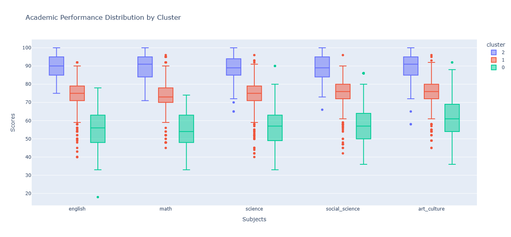
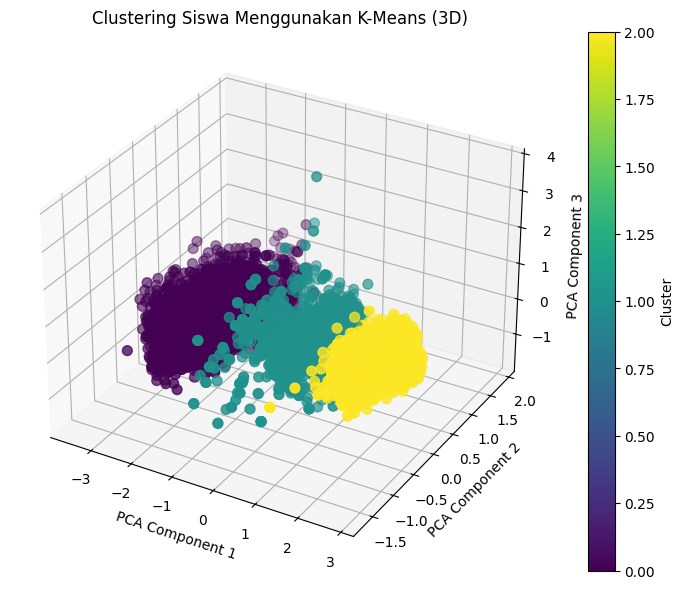
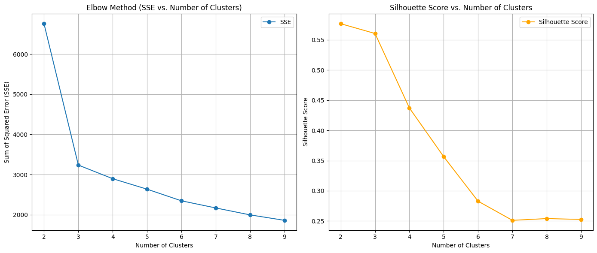
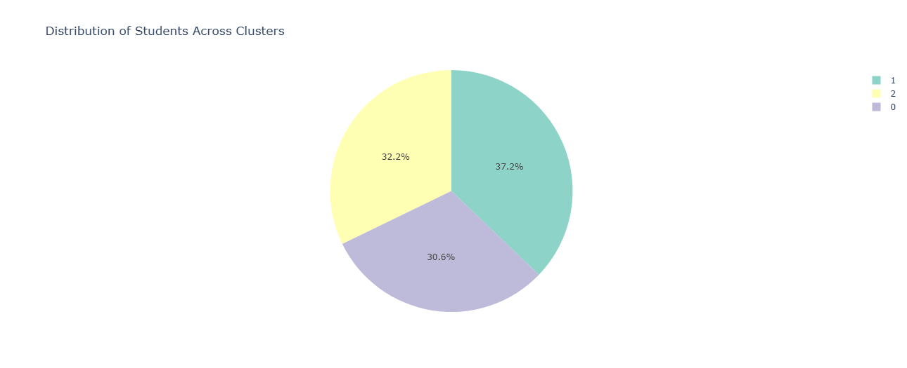
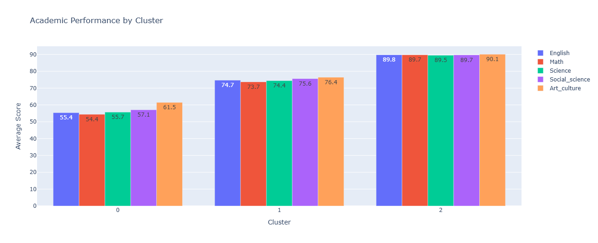
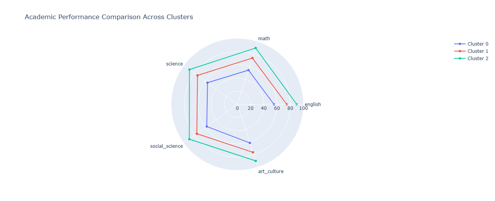

<div class="hero">

<h1>🧠 Student Performance Clustering</h1>

<p>K-Means Analysis · Student Segmentation · Educational Data Exploration</p>

<p>
  
  
  
  
  
  
  
</p>

<p>
An interactive unsupervised-learning system that segments students into
meaningful performance groups and turns clustering results into interpretable
educational insights.
</p>

</div>

---

## 📖 Project Overview

The **Student Performance Clustering** project applies **K-Means clustering** to student performance data in order to discover groups of students with similar characteristics.

Unlike supervised classification, the objective is not to predict a predefined label. Instead, the system identifies naturally occurring patterns in the data and groups students according to similarity.

The overall analytical objective is:

```text id="m8q3x7"
Student Performance Data
          ↓
Data Preprocessing
          ↓
Feature Engineering
          ↓
Feature Scaling
          ↓
K-Means Clustering
          ↓
Cluster Evaluation
          ↓
Cluster Interpretation
          ↓
Educational Insights
```

The project combines analytical experimentation with an interactive **Streamlit** interface so educators and non-technical users can explore clustering outcomes more easily.

> **Portfolio focus:** This project demonstrates unsupervised machine learning, student segmentation, data preprocessing, feature engineering, model evaluation, interactive visualization, and translation of analytical results into practical educational insights.

---

## 🎯 Problem Statement

Educational datasets can contain multiple dimensions of student behavior and performance.

Looking at individual records independently makes it difficult to identify broader patterns such as:

* Groups of students with similar academic characteristics.
* Differences between high- and low-performing groups.
* Relationships between performance-related features.
* Groups that may require different educational strategies.

Clustering provides a way to move from individual records toward **student-level segments**.

```text id="x5m8p2"
Individual Students
       ↓
Feature Representation
       ↓
Similarity Analysis
       ↓
Student Clusters
       ↓
Segment Interpretation
```

---

## 🧠 Why K-Means?

K-Means is used as the primary clustering algorithm because it provides a clear and interpretable way to group observations based on similarity.

Conceptually:

```text id="q7m4x3"
Data Points
   ↓
Choose K Clusters
   ↓
Initialize Centroids
   ↓
Assign Students to Nearest Centroid
   ↓
Update Centroids
   ↓
Repeat Until Convergence
   ↓
Final Student Segmentation
```

The resulting clusters can then be analyzed according to the characteristics of the students assigned to them.

---

## 🧹 Data Preprocessing Pipeline

Clustering quality depends heavily on the quality of the input data.

The project includes a preprocessing workflow covering:

### 📥 Data Loading

Student data is loaded from CSV-based sources.

### 🔎 Data Quality Assessment

The data is examined for issues such as:

* Missing values.
* Inconsistent values.
* Incorrect data types.
* Statistical irregularities.

### 🛠️ Feature Engineering

Relevant variables are transformed or aggregated into features suitable for clustering.

### 📏 Feature Scaling

Numerical features are standardized so that variables with different scales do not disproportionately influence the clustering process.

The full pipeline is:

```text id="c4m9x7"
Raw Dataset
    ↓
Quality Check
    ↓
Cleaning
    ↓
Feature Engineering
    ↓
Standardization
    ↓
Clustering-Ready Dataset
```

---

## 📐 Feature Representation

The clustering process operates on a numerical feature representation of student characteristics.

Depending on the dataset, the analytical feature space can incorporate:

* Academic performance.
* Attendance-related attributes.
* Study behavior.
* Demographic characteristics.
* Other measurable student indicators.

The objective is to represent students consistently so that K-Means can identify meaningful similarities.

---

## 🎯 Cluster Selection

Choosing the number of clusters is an important modeling decision.

The project evaluates candidate cluster counts using clustering-quality analysis.

### Elbow Method

The **Elbow Method** examines how within-cluster variation changes as the number of clusters increases.

```text id="p8m3q5"
K = 2
   ↓
K = 3
   ↓
K = 4
   ↓
...
   ↓
Identify diminishing improvement
```

### Silhouette Analysis

The **Silhouette Score** evaluates how well each observation fits within its assigned cluster relative to neighboring clusters.

A higher score generally indicates stronger separation and internal cohesion.

```text id="v4m7x2"
High Silhouette
      ↓
Better-separated clusters

Low Silhouette
      ↓
More overlap between groups
```

These techniques are used together to support a more informed cluster-count decision.

---

## 🧠 K-Means Clustering

After preprocessing and cluster-count exploration, the K-Means algorithm is applied to the standardized student feature matrix.

The conceptual process is:

```text id="m3x8q6"
Standardized Features
        ↓
K-Means
        ↓
Cluster Assignment
        ↓
Cluster Centroids
        ↓
Student Segments
```

Each student receives a cluster label, allowing subsequent comparison of the characteristics of each group.

---

## 📊 Cluster Evaluation

Clustering requires evaluation because a mathematically valid grouping is not automatically a meaningful grouping.

The project evaluates cluster quality using measures such as:

### Silhouette Score

Measures the relationship between:

* Similarity to observations in the same cluster.
* Separation from observations in other clusters.

### Cluster Separation

The resulting groups are inspected to determine whether their characteristics are sufficiently distinct to support interpretation.

### Cluster Characteristics

Each cluster is profiled by examining its feature patterns.

```text id="k8m4p1"
Cluster ID
    ↓
Feature Statistics
    ↓
Characteristic Profile
    ↓
Interpretation
```

---

## 🔎 Student Segment Interpretation

The most important analytical step occurs after clustering.

Cluster labels themselves have no inherent meaning.

For example:

```text id="r7m3x5"
Cluster 0
Cluster 1
Cluster 2
```

does not automatically mean:

```text
High Performer
Moderate Performer
At-Risk
```

Those interpretations must be derived from the actual characteristics of each cluster.

The project therefore analyzes the feature profile of each cluster before translating it into educational meaning.

Possible interpretations may include:

| Example Segment                 | Possible Characteristics                                  | Potential Educational Use                      |
| ------------------------------- | --------------------------------------------------------- | ---------------------------------------------- |
| 🟢 **Higher-Performance Group** | Strong academic performance and consistent study behavior | Enrichment and advanced learning opportunities |
| 🟡 **Developing Group**         | Moderate performance with room for improvement            | Targeted academic support                      |
| 🔴 **Higher-Risk Group**        | Weaker performance or problematic attendance patterns     | Earlier intervention and closer monitoring     |

These labels are interpretive examples rather than fixed labels produced by K-Means itself.

---

## 📈 Interactive Streamlit Dashboard

The project includes a **Streamlit-based interactive interface** that makes the clustering results easier to explore.

The dashboard supports dynamic analytical exploration rather than presenting only static notebook outputs.

### Dashboard Workflow

```text id="x4m8q7"
Load Student Data
       ↓
Select / Configure Analysis
       ↓
Run Clustering
       ↓
View Cluster Distribution
       ↓
Explore Cluster Characteristics
       ↓
Interpret Results
```

The interface is intended to make machine-learning results more accessible to educators and non-technical stakeholders.

---

## 📊 Data Visualization

Visualizations are used to transform numerical clustering output into interpretable patterns.

The analytical presentation can include:

### Cluster Distribution

Shows how student observations are distributed across clusters.

### PCA Projection

Principal Component Analysis can be used to project a high-dimensional feature space into two dimensions for visualization.

```text id="j6m4q8"
High-Dimensional Features
          ↓
          PCA
          ↓
       2D Space
          ↓
Cluster Visualization
```

PCA is used for **visual interpretation**, not as the clustering algorithm itself.

### Cluster Characteristic Visualization

Feature-level comparisons help users understand why clusters differ from each other.

---

## 🖥️ User-Centered Analytical Interface

The dashboard was designed with accessibility in mind.

The objective is to bridge the gap between:

```text id="n5q8m2"
Machine Learning Model
        ↓
Complex Numerical Output
        ↓
Interactive Visualization
        ↓
Human Interpretation
```

This makes the system more useful for users who may not have a machine-learning background.

---

## 📤 Exportable Results

Clustering outputs can be transformed into analysis-ready results for further exploration.

A typical workflow is:

```text id="p3x7m8"
Original Student Data
        ↓
K-Means Assignment
        ↓
Cluster Labels
        ↓
Clustered Dataset
        ↓
Further Analysis / Reporting
```

This supports continued analysis outside the interactive dashboard.

---

## 🏗️ System Architecture

The project consists of four logical analytical layers.

### 📥 Data Layer

Contains raw student-performance data.

### 🧹 Processing Layer

Handles:

* Data cleaning.
* Feature engineering.
* Scaling.
* Preparation of the clustering matrix.

### 🧠 Modeling Layer

Contains:

* K-Means clustering.
* Cluster-count analysis.
* Clustering-quality evaluation.

### 🖥️ Presentation Layer

Contains:

* Streamlit dashboard.
* Interactive visualizations.
* Cluster exploration.
* Result interpretation.

The overall architecture is:

```text id="q4m8x1"
┌──────────────────────────┐
│       Student Data       │
└────────────┬─────────────┘
             ↓
┌──────────────────────────┐
│   Preprocessing Layer    │
│                          │
│ Cleaning                 │
│ Feature Engineering     │
│ Standardization          │
└────────────┬─────────────┘
             ↓
┌──────────────────────────┐
│    Clustering Layer      │
│                          │
│ K-Means                  │
│ Cluster Selection        │
│ Evaluation               │
└────────────┬─────────────┘
             ↓
┌──────────────────────────┐
│    Interpretation Layer  │
│                          │
│ Cluster Profiles         │
│ PCA Visualization        │
│ Educational Insights     │
└────────────┬─────────────┘
             ↓
┌──────────────────────────┐
│    Streamlit Interface   │
└──────────────────────────┘
```

---

## 🔄 End-to-End Workflow

```text id="m9x4q7"
              Student Dataset
                    ↓
           Data Quality Check
                    ↓
           Feature Engineering
                    ↓
             Feature Scaling
                    ↓
          Candidate Cluster Counts
                    ↓
        Elbow + Silhouette Analysis
                    ↓
             K-Means Training
                    ↓
            Cluster Evaluation
                    ↓
       Cluster Characterization
                    ↓
           PCA Visualization
                    ↓
      Educational Interpretation
                    ↓
        Interactive Streamlit App
```

---

## 🧩 Technical Highlights

### Unsupervised Segmentation

The system discovers student groups without requiring predefined target labels.

### Feature Engineering

Raw student information is transformed into meaningful numerical representations suitable for clustering.

### Standardization

Scaling ensures that variables measured on different numerical ranges contribute more appropriately to the distance-based clustering process.

### K-Means Modeling

Students are grouped according to similarity in the selected feature space.

### Silhouette-Based Evaluation

Cluster quality is assessed using separation and cohesion characteristics.

### Interactive Analysis

Streamlit turns the analytical pipeline into an accessible user-facing application.

### Visual Interpretation

PCA and cluster-level visualizations help communicate multidimensional patterns more clearly.

---

## 💡 Educational Value

The analytical output can support educators in identifying groups of students with different needs.

The value chain is:

```text id="z7m3x5"
Student Data
     ↓
Pattern Discovery
     ↓
Student Segmentation
     ↓
Cluster Profiling
     ↓
Educational Interpretation
     ↓
Targeted Intervention
```

This shifts analysis from looking at individual records toward understanding **groups of students with shared characteristics**.

---

## ⚠️ Interpretation & Responsible Use

Clustering does not determine that a student is inherently “good,” “bad,” or “at risk.”

Cluster labels are analytical abstractions derived from the selected data and features.

Therefore:

* A cluster should be interpreted from its feature profile.
* Different datasets may produce different cluster structures.
* Cluster labels should not be treated as deterministic judgments.
* Educational decisions should incorporate human context beyond the clustering output.

The system is intended to support analysis and intervention planning, not replace educator judgment.

---

## 🛠️ Technology Stack

| Layer                       | Technology                        | Purpose                                      |
| --------------------------- | --------------------------------- | -------------------------------------------- |
| 🐍 **Programming Language** | **Python**                        | Data processing and machine learning         |
| 📓 **Research Environment** | **Jupyter Notebook**              | Exploratory analysis and experimentation     |
| 📊 **Data Processing**      | **Pandas / NumPy**                | Data manipulation and numerical computation  |
| 🧠 **Machine Learning**     | **scikit-learn**                  | K-Means, scaling, PCA, clustering evaluation |
| 🖥️ **Dashboard**           | **Streamlit**                     | Interactive analysis interface               |
| 📈 **Visualization**        | **Matplotlib / Seaborn / Plotly** | Cluster exploration and result visualization |

---

## 🚀 Quick Start

### Prerequisites

```text
Python 3.8+
pip
```

### Installation

```bash
# Clone the repository
git clone https://github.com/bers31/bernardo.github.io.git

# Navigate to the project
cd bernardo.github.io/Students_Performance_Clustering_Unsupervised_Learning_Project

# Install dependencies
pip install -r requirements.txt
```

### Run the Notebook

```bash
jupyter notebook student_performance_clustering_K-Means.ipynb
```

### Run the Dashboard

```bash
streamlit run app.py
```

### Run the Analysis Script

```bash
python src/clustering_analysis.py
```

---

## 📁 Project Structure

```text
Students_Performance_Clustering_Unsupervised_Learning_Project/
│
├── 📂 data/
│   ├── raw/
│   │   └── student_performance.csv
│   └── processed/
│       └── clustered_students.csv
│
├── 📂 notebooks/
│   └── student_performance_clustering_K-Means.ipynb
│
├── 📂 src/
│   └── clustering_analysis.py
│
├── 📂 outputs/
│   ├── visualizations/
│   └── reports/
│
├── app.py
├── requirements.txt
├── LICENSE
└── README.md
```

---

## 🗺️ Project Scope

| Module                        | Description                                                 | Status        |
| ----------------------------- | ----------------------------------------------------------- | ------------- |
| 🧹 **Data Preprocessing**     | Data cleaning, feature engineering, and standardization     | ✅ Implemented |
| 🔎 **Data Exploration**       | Statistical and visual exploration of student data          | ✅ Implemented |
| 🎯 **Cluster Selection**      | Elbow and Silhouette analysis for cluster-count evaluation  | ✅ Implemented |
| 🧠 **K-Means Clustering**     | Student segmentation using distance-based clustering        | ✅ Implemented |
| 📏 **Cluster Evaluation**     | Silhouette-based assessment and cluster comparison          | ✅ Implemented |
| 📊 **PCA Visualization**      | 2D projection for cluster interpretation                    | ✅ Implemented |
| 🖥️ **Streamlit Dashboard**   | Interactive clustering and result exploration               | ✅ Implemented |
| 📈 **Cluster Interpretation** | Translate cluster characteristics into educational insights | ✅ Implemented |
| 📋 **Result Export**          | Export clustered data and analysis outputs                  | ✅ Implemented |
| 🧪 **Model Refinement**       | Parameter refinement based on clustering evaluation         | ✅ Applied     |
| 📖 **Documentation**          | Workflow and system documentation                           | ✅ Implemented |

---

## 📈 Portfolio Alignment

The project directly reflects the capabilities described in the professional project entry:

| LinkedIn Capability         | Project Evidence                                          |
| --------------------------- | --------------------------------------------------------- |
| Python                      | Core analytical and modeling language                     |
| Jupyter Notebook            | Research and experimentation environment                  |
| Streamlit                   | Interactive clustering interface                          |
| K-Means                     | Primary unsupervised learning algorithm                   |
| Student segmentation        | Groups students according to shared characteristics       |
| Data preprocessing          | Cleaning and preparation pipeline                         |
| Feature engineering         | Transform raw student attributes into clustering features |
| Data visualization          | Cluster and feature-pattern visualization                 |
| Silhouette evaluation       | Validate clustering quality                               |
| Hyperparameter refinement   | Refine clustering configuration based on evaluation       |
| Dynamic exploration         | Interactive analysis through Streamlit                    |
| Educational insights        | Translate clusters into potential intervention strategies |
| Non-technical accessibility | User-oriented dashboard design                            |
| Documentation               | Project workflow and system documentation                 |

> **Portfolio positioning:** This project demonstrates the ability to take an unsupervised machine-learning method from raw educational data through preprocessing, clustering, evaluation, visualization, and finally into an interactive application that non-technical stakeholders can understand and use.

---

## 🧪 Analytical Validation

The project emphasizes validation rather than assuming every clustering result is meaningful.

The evaluation cycle is:

```text id="b8m4q6"
Initial K-Means Configuration
          ↓
Cluster Evaluation
          ↓
Silhouette Analysis
          ↓
Inspect Cluster Profiles
          ↓
Refine Configuration
          ↓
Validate Final Groupings
```

This iterative process helps ensure that the final segmentation is both mathematically defensible and interpretable.

---

## 🔭 Future Development

Potential extensions include:

* Comparison with hierarchical clustering.
* DBSCAN-based density clustering.
* Gaussian Mixture Models.
* Automated cluster profiling.
* Longitudinal student segmentation.
* Early-warning analytical indicators.
* Expanded educational dashboards.
* More advanced dimensionality-reduction techniques.
* Real-time data ingestion.
* Integration with broader academic information systems.

These are future development directions and are not presented as current functionality.

---

## 🎥 Demo & Screenshots

### 🌐 Live Demo

<div align="center">

<p>
<strong>
<a href="https://bers31.github.io/bernardo.github.io/Students_Performance_Clustering_Unsupervised_Learning_Project/">
🔗 Launch Interactive Analysis
</a>
</strong>
</p>

</div>

### 🖥️ Dashboard Preview



### 📐 Cluster Visualization



### 🎯 Cluster Selection



---

## 📸 Full Screenshots









---

## 📄 License

This project is licensed under the **MIT License** — see the [`LICENSE`](LICENSE) file for the complete license text.

Third-party libraries, datasets, and other external components remain subject to their respective licenses and terms.

---

<div class="contact-hero">

<p><strong>Interested in the project?</strong></p>

<p>
👨‍💻 <strong>Bernardo Nandaniar Sunia</strong><br/>
Bachelor of Computer Science — Diponegoro University<br/>
Python · K-Means · Streamlit · Educational Data Analysis
</p>

<p>
<a href="https://linkedin.com/in/bernardo-sunia/">

</a>
<a href="https://mail.google.com/mail/?view=cm&fs=1&to=suniabernardo@gmail.com">

</a>
<a href="https://github.com/bers31">

</a>
<a href="https://bit.ly/bernardo-my_portfolio">

</a>
</p>

<p>
<em>Unsupervised Learning · Student Segmentation · Data Visualization · Interactive Analytics</em>
</p>

</div>

---

## 📌 Conclusion

The **Student Performance Clustering** project demonstrates how unsupervised machine learning can be applied to educational data to uncover groups of students with similar performance characteristics.

Using **Python, K-Means, data preprocessing, feature engineering, Silhouette-based evaluation, and Streamlit**, the project moves through the complete analytical workflow:

```text
Raw Student Data
      ↓
Preprocessing
      ↓
Feature Engineering
      ↓
K-Means Clustering
      ↓
Cluster Evaluation
      ↓
Visualization
      ↓
Interpretation
      ↓
Educational Insight
```

The interactive dashboard makes the analytical results easier for educators and non-technical users to explore, while the clustering evaluation process helps ensure that the resulting segments are sufficiently meaningful and interpretable.

Ultimately, the project demonstrates the practical value of combining **machine learning, visualization, and user-centered analytical design** to turn student-performance data into actionable educational insights.