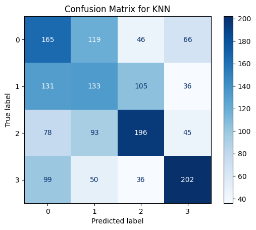
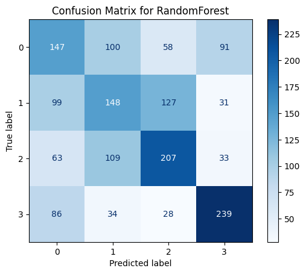
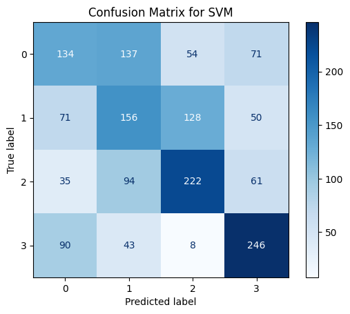
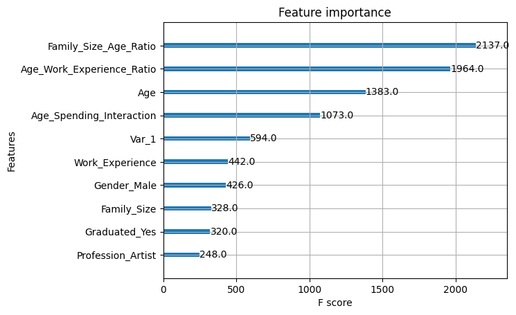
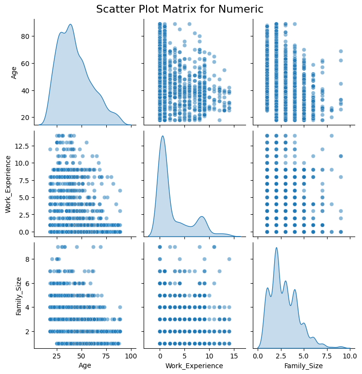

# 🛍️ Customer Segmentation — Supervised Multi-Class Classification
### *Intelligent customer profiling through advanced machine learning techniques*

<div align="center">


</div>

---

## 📖 **Project Description**

This project implements a **supervised learning** approach for **customer segmentation** using multi-class classification techniques. Built as an academic project at Universitas Diponegoro, it leverages the Kaggle dataset `abisheksudarshan/customer-segmentation` to predict customer segments based on demographic and behavioral features.

The solution addresses the critical business challenge of understanding customer behavior patterns, enabling companies to:
- **Optimize marketing strategies** through targeted campaigns
- **Improve customer retention** with personalized experiences  
- **Enhance resource allocation** based on segment characteristics
- **Drive revenue growth** through data-driven decision making

---

## ✨ **Key Features**

<table width="100%">
<tr>
<td width="50%" valign="top">

<h3>🎯 <strong>Machine Learning Models</strong></h3>
<ul>
<li>K-Nearest Neighbors (KNN)</li>
<li>Random Forest Classifier</li>
<li>Support Vector Machine (SVM)</li>
<li>XGBoost Classifier</li>
<li>Logistic Regression</li>
</ul>

</td>
<td width="50%" valign="top">

<h3>🔧 <strong>Advanced Processing</strong></h3>
<ul>
<li>Comprehensive ETL pipeline</li>
<li>Feature engineering & scaling</li>
<li>Hyperparameter optimization</li>
<li>Cross-validation techniques</li>
<li>PCA dimensionality reduction</li>
</ul>

</td>
</tr>
</table>

- **📊 Balanced Dataset Handling**: Stratified sampling with 500 samples per class
- **🎨 Rich Visualizations**: Interactive EDA with confusion matrices and feature importance plots
- **⚡ Pipeline Architecture**: Automated preprocessing with scikit-learn pipelines
- **🔍 Model Interpretability**: Feature importance analysis for business insights
- **📈 Comprehensive Evaluation**: Multi-metric assessment (Accuracy, Precision, Recall, F1-score)

---

## 🛠️ **Technologies & Tools**

<div align="center">

<table width="100%">
<tr align="center">
<td><strong>Category</strong></td>
<td><strong>Technologies</strong></td>
</tr>
<tr align="center">
<td><strong>Programming</strong></td>
<td></td>
</tr>
<tr align="center">
<td><strong>Machine Learning</strong></td>
<td> </td>
</tr>
<tr align="center">
<td><strong>Data Analysis</strong></td>
<td> </td>
</tr>
<tr align="center">
<td><strong>Visualization</strong></td>
<td> </td>
</tr>
<tr align="center">
<td><strong>Development</strong></td>
<td> </td>
</tr>
</table>

</div>

---

## 🚀 **Installation & Quick Start**

### **Prerequisites**
```bash
Python >= 3.8
pip or conda package manager
```

### **Setup Instructions**

1. **Clone the Repository**
   ```bash
   git clone https://github.com/bers31/bernardo.github.io.git
   cd bernardo.github.io
   ```

2. **Create Virtual Environment**
   ```bash
   # Using venv
   python -m venv venv
   
   # Activate (Windows)
   venv\Scripts\activate
   
   # Activate (Linux/Mac)
   source venv/bin/activate
   ```

3. **Install Dependencies**
   ```bash
   pip install -r requirements.txt
   ```

4. **Download Dataset**
   ```bash
   # The dataset will be automatically downloaded via kagglehub in the notebook
   # Or manually place CSV files in data/raw/ directory
   ```

5. **Run the Analysis**
   ```bash
   # Start Jupyter Notebook
   jupyter notebook
   
   # Run notebooks in sequence:
   # 1. KNN, Random_Forest, SVM.ipynb
   # 2. XGBoost, Logistic_Regression.ipynb
   ```

### **Dependencies (requirements.txt)**
```txt
python>=3.8
pandas>=1.3.0
numpy>=1.21.0
scikit-learn>=1.0.0
xgboost>=1.5.0
matplotlib>=3.5.0
seaborn>=0.11.0
kagglehub>=0.1.0
joblib>=1.1.0
nbformat>=5.4.0
```

---

## 🎥 **Demo & Screenshots**

<div align="center">

<h3><strong>Project Architecture</strong></h3>

<pre>
┌─────────────────────────────────────────────────────────┐
│                    DATA PIPELINE                        │
├─────────────────────────────────────────────────────────┤
│  📥 Data Loading    │  🧹 Data Cleaning  │  🔧 Feature │
│  (Kaggle API)       │  (ETL Process)      │  Engineering│
└─────────────────────┴─────────────────────┴─────────────┘
                              │
┌─────────────────────────────────────────────────────────┐
│                 MACHINE LEARNING MODELS                 │
├─────────────────────────────────────────────────────────┤
│  🎯 KNN         │  🌲 Random Forest │  ⚡ XGBoost     │
│  🔍 SVM         │  📈 Logistic Reg  │  🎛️ Tuning      │
└─────────────────┴────────────────────┴─────────────────┘
                              │
┌─────────────────────────────────────────────────────────┐
│                    EVALUATION                           │
├─────────────────────────────────────────────────────────┤
│  📊 Metrics     │  🎨 Visualizations  │  📋 Reports   │
│  📈 Validation  │  🔍 Interpretability│  💾 Artifacts │
└─────────────────┴────────────────────┴─────────────────┘
</pre>

<h3><strong>Sample Visualization</strong></h3>
<p><em>Confusion Matrix and Feature Importance plots are generated automatically</em></p>


<p><strong>🔗 <a href="https://bers31.github.io/bernardo.github.io/Supervised_Learning_Project/">View Live Demo</a></strong></p>

</div>

---

## 📊 **Project Roadmap**

<div align="center">

<table width="100%">
<tr align="center">
<td><strong>Milestone</strong></td>
<td><strong>Target Date</strong></td>
<td><strong>Status</strong></td>
<td><strong>Description</strong></td>
</tr>
<tr align="center">
<td>🔍 <strong>Data Exploration</strong></td>
<td>2024</td>
<td>✅ Complete</td>
<td>Initial EDA and data understanding</td>
</tr>
<tr align="center">
<td>🧹 <strong>Data Preprocessing</strong></td>
<td>2024</td>
<td>✅ Complete</td>
<td>ETL pipeline and feature engineering</td>
</tr>
<tr align="center">
<td>🤖 <strong>Model Development</strong></td>
<td>2024</td>
<td>✅ Complete</td>
<td>Implementation of 5 ML algorithms</td>
</tr>
<tr align="center">
<td>⚙️ <strong>Hyperparameter Tuning</strong></td>
<td>2024</td>
<td>✅ Complete</td>
<td>Grid search optimization</td>
</tr>
<tr align="center">
<td>📈 <strong>Model Evaluation</strong></td>
<td>2024</td>
<td>✅ Complete</td>
<td>Comprehensive performance analysis</td>
</tr>
<tr align="center">
<td>📝 <strong>Documentation</strong></td>
<td>2024</td>
<td>✅ Complete</td>
<td>README and code documentation</td>
</tr>
</table>

</div>

---

## 🤝 **Contributing**

We welcome contributions from the community! Here's how you can help:

### **Ways to Contribute**
- 🐛 **Bug Reports**: Found an issue? Create a detailed bug report
- ✨ **Feature Requests**: Suggest new features or improvements  
- 📖 **Documentation**: Help improve our documentation
- 🧪 **Testing**: Add test cases or improve existing ones
- 🎨 **Visualizations**: Enhance charts and plots

### **Contribution Guidelines**
1. Fork the repository
2. Create a feature branch (`git checkout -b feature/AmazingFeature`)
3. Commit your changes (`git commit -m 'Add some AmazingFeature'`)
4. Push to the branch (`git push origin feature/AmazingFeature`)
5. Open a Pull Request

### **Development Setup**
```bash
# Clone your fork
git clone https://github.com/your-username/bernardo.github.io.git

# Add upstream remote
git remote add upstream https://github.com/bers31/bernardo.github.io.git

# Create development environment
python -m venv dev-env
source dev-env/bin/activate  # or dev-env\Scripts\activate on Windows
pip install -r requirements-dev.txt
```

---

## 📄 **License**

This project is licensed under the **MIT License** - see the [LICENSE](LICENSE) file for details.

```
MIT License

Copyright (c) 2024 Bernardo - Universitas Diponegoro

Permission is hereby granted, free of charge, to any person obtaining a copy
of this software and associated documentation files (the "Software"), to deal
in the Software without restriction, including without limitation the rights
to use, copy, modify, merge, publish, distribute, sublicense, and/or sell
copies of the Software, subject to the following conditions:

The above copyright notice and this permission notice shall be included in all
copies or substantial portions of the Software.
```

## 📫 Contact & Connect

<p align="center">
<strong>👨‍💻 Bernardo - Computer Science Student</strong><br/>
Universitas Diponegoro 🎓
</p>

<p align="center">
<a href="https://linkedin.com/in/bernardo-sunia/">

</a>
<a href="https://mail.google.com/mail/?view=cm&fs=1&to=suniabernardo@gmail.com">

</a>
<a href="https://github.com/bers31">

</a>
<a href="https://bit.ly/bernardo-my_portfolio">

</a>
</p>

<p align="center">
⭐ <strong>If you found this project helpful, please give it a star!</strong> ⭐
</p>

<p align="center">
<em>Made with ❤️ by <a href="https://github.com/bers31">Bernardo</a> at Universitas Diponegoro</em><br/>

</p>

---

### Screenshots







### Conclusion
This project highlights the application of advanced supervised learning techniques for effective customer segmentation. By leveraging algorithms such as k-NN, Random Forest, SVM, XGBoost, and Logistic Regression, we have successfully demonstrated how machine learning can provide actionable insights into customer behavior. The results from this project can help businesses design more targeted marketing strategies, enhance customer engagement, and optimize resource allocation. Furthermore, the outlined future work presents opportunities for improving the system with cutting-edge technologies and real-time capabilities, ensuring scalability and adaptability in dynamic business environments.
