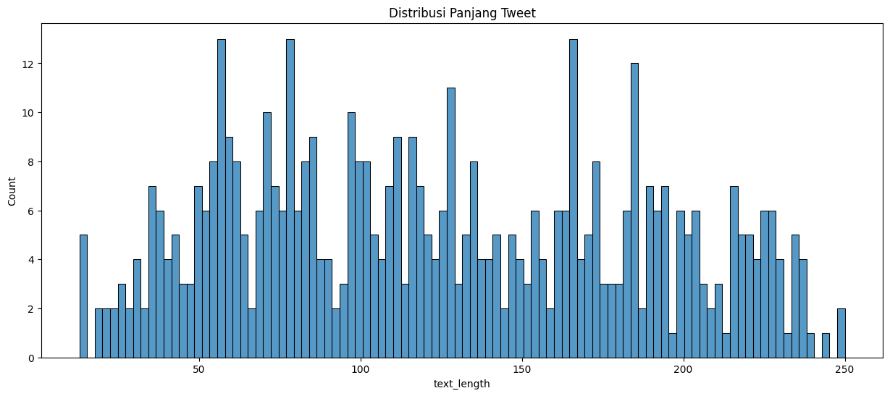
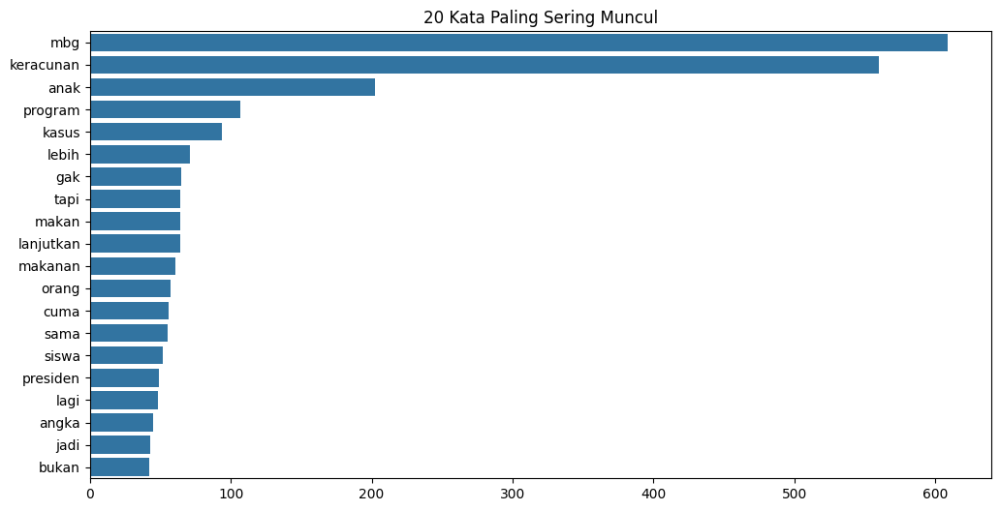
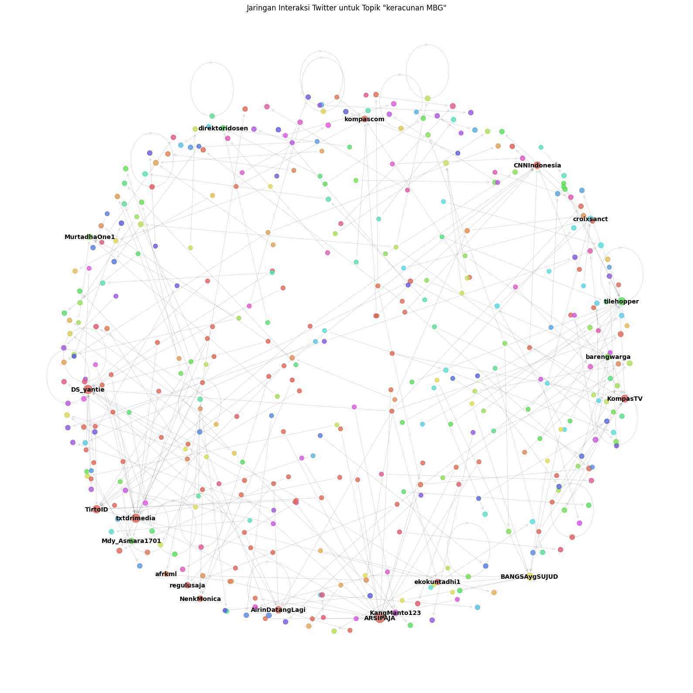
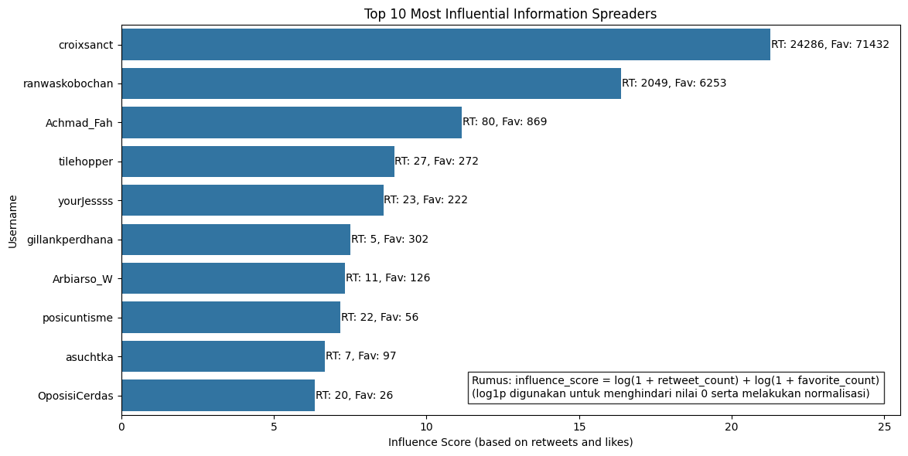
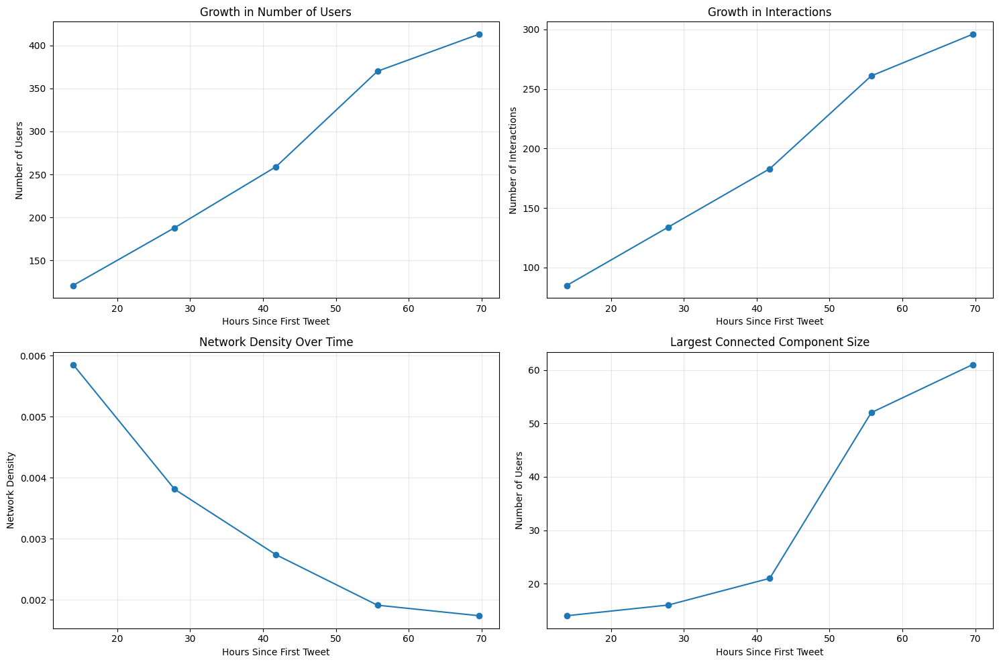
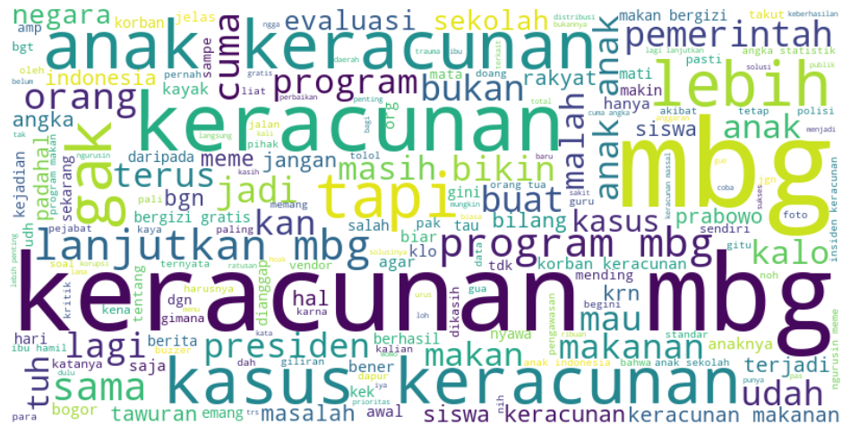

# 🐦 Twitter Data Analysis & Information Diffusion
*Mapping the viral pathways of information spread across social networks*

<p align="center">


</p>

---

## 📖 Project Description

This comprehensive data science project focuses on **scraping Twitter data** based on specific keywords or topics, performing thorough **data cleaning and ETL processes**, conducting **exploratory data analysis (EDA)**, and mapping **information diffusion patterns** through retweet/mention networks. 

The ultimate goal is to provide actionable insights into how messages spread across Twitter—identifying key influencers, strongest pathways, and core diffusion metrics that drive viral content.

### 🎯 **Why This Matters**
- **Academic Research**: Understanding social media dynamics and information flow
- **Marketing Strategy**: Optimizing content timing and influencer partnerships  
- **Misinformation Detection**: Tracking rapid spread patterns of false information
- **Network Analysis**: Revealing hidden connection patterns in digital communities

---

## ✨ Key Features

🔍 **Intelligent Data Scraping** - Advanced Twitter data extraction using snscrape/tweepy APIs

🔧 **Robust ETL Pipeline** - Comprehensive data cleaning, preprocessing, and transformation

📊 **Interactive Visualizations** - Dynamic charts, word clouds, and network graphs

🌐 **Network Analysis Engine** - Advanced graph theory implementation for diffusion mapping

🎯 **Influencer Detection** - Algorithmic identification of key network nodes and viral catalysts

🚀 **Cascade Visualization** - Real-time mapping of information spread patterns

---

## 🛠️ Technologies & Tools

| **Category** | **Technologies** |
|:---:|:---:|
| **Core Language** |  |
| **Data Extraction** |  `snscrape` `tweepy` `pandas` |
| **Data Processing** | `pandas` `numpy` `re` `nltk` `spaCy` |
| **Visualization** | `matplotlib` `seaborn` `wordcloud` `plotly` `pyvis` |
| **Network Analysis** | `networkx` `python-igraph` `graph-tool` |
| **Development** |   |

---

## 🏗️ Project Architecture

<pre>

```
┌─────────────────┐    ┌─────────────────┐    ┌─────────────────┐
│   📱 Twitter    │───▶│  🔄 Data ETL   │──▶│  📊 EDA &      │
│   Data Source   │    │   Pipeline      │    │   Insights      │
└─────────────────┘    └─────────────────┘    └─────────────────┘
         │                       │                       │
         │                       ▼                       ▼
         │            ┌─────────────────┐    ┌─────────────────┐
         │            │  🧹 Data        │   │  📈 Statistical │
         │            │   Cleaning      │    │   Analysis      │
         │            └─────────────────┘    └─────────────────┘
         │                       │                       │
         ▼                       ▼                       ▼
┌─────────────────┐    ┌─────────────────┐    ┌─────────────────┐
│  🌐 Network    │◀───│  🔗 Graph       │◀──│  🎯 Diffusion  │
│   Visualization │    │   Construction  │    │   Metrics       │
└─────────────────┘    └─────────────────┘    └─────────────────┘
```
</pre>

---

## 🚀 Installation & Quick Start

### Prerequisites
```bash
# Ensure Python 3.8+ is installed
python --version
```

### 1️⃣ Clone Repository
```bash
git clone https://github.com/bers31/bernardo.github.io.git
cd bernardo.github.io
```

### 2️⃣ Environment Setup
```bash
# Create virtual environment
python -m venv twitter_analysis_env

# Activate environment
# Windows:
twitter_analysis_env\Scripts\activate
# macOS/Linux:
source twitter_analysis_env/bin/activate

# Install dependencies
pip install -r requirements.txt
```

### 3️⃣ Configure API Access
```bash
# Create config file for Twitter API credentials
cp config_template.py config.py
# Edit config.py with your Twitter API keys
```

### 4️⃣ Run Analysis Pipeline
```bash
# Execute notebooks in sequence:
jupyter notebook 00_Scraping_Twitter_Data.ipynb     # Data extraction
jupyter notebook 02_Cleaning.ipynb                  # Data preprocessing  
jupyter notebook 01_Exploratory_Data_Analysis.ipynb # EDA insights
jupyter notebook 03_Information_Diffusion.ipynb     # Network analysis
```

---

## 🎥 Demo & Screenshots

### 🔍 **Data Extraction Dashboard**
<p align="center">

</p>

### 📊 **Exploratory Data Analysis**
<p align="center">

</p>

### 🌐 **Network Diffusion Map**
<p align="center">

</p>

### 🎯 **Live Demo**
<p align="center">
<a href="https://bers31.github.io/bernardo.github.io/Twitter_Information_Diffusion%26Sentiment_Analysis/">

</a>
</p>

---

## 📈 Project Roadmap

| **Milestone** | **Target Date** | **Status** | **Description** |
|:---|:---:|:---:|:---|
| 🔄 **Phase 1: Data Pipeline** | *2025* | ✅ **Complete** | Twitter scraping & ETL implementation |
| 📊 **Phase 2: EDA & Insights** | *2025* | ✅ **Complete** | Statistical analysis & visualization |
| 🌐 **Phase 3: Network Analysis** | *2025* | 🔄 **In Progress** | Graph construction & diffusion metrics |
| 🎯 **Phase 4: Advanced Features** | *2026* | ⏳ **Planned** | Real-time analysis & dashboard |
| 🚀 **Phase 5: Deployment** | *2026* | ⏳ **Planned** | Web app & API endpoints |

---

## 📁 Project Structure

```
📦 Twitter-Data-Analysis/
├── 📓 notebooks/
│   ├── 00_Scraping_Twitter_Data.ipynb      # Data extraction
│   ├── 01_Exploratory_Data_Analysis.ipynb  # Statistical insights  
│   ├── 02_Cleaning.ipynb                   # Data preprocessing
│   └── 03_Information_Diffusion.ipynb      # Network analysis
├── 📊 data/
│   ├── raw/                                # Original scraped data
│   ├── processed/                          # Cleaned datasets  
│   └── networks/                           # Graph models (.gml)
├── 📈 outputs/
│   ├── visualizations/                     # Charts & graphs
│   ├── reports/                            # Analysis summaries
│   └── interactive/                        # HTML dashboards
├── 🛠️ src/
│   ├── scraping/                           # Data extraction modules
│   ├── preprocessing/                      # ETL functions
│   ├── analysis/                           # Statistical methods
│   └── visualization/                      # Plotting utilities
├── 📋 requirements.txt                     # Dependencies
├── ⚙️ config.py                           # Configuration settings
└── 📖 README.md                           # Project documentation
```

---

## 🤝 Contributing

We welcome contributions from the community! Here's how you can help:

<details>
<summary><b>🔧 Development Setup</b></summary>

```bash
# Fork the repository
git fork https://github.com/bers31/bernardo.github.io.git

# Create feature branch
git checkout -b feature/amazing-improvement

# Make changes and test
python -m pytest tests/

# Commit with conventional format
git commit -m "feat: add advanced sentiment analysis"

# Push and create PR
git push origin feature/amazing-improvement
```
</details>

<details>
<summary><b>📝 Contribution Guidelines</b></summary>

- Follow **PEP 8** style guidelines
- Add comprehensive **docstrings** and comments  
- Include **unit tests** for new features
- Update documentation accordingly
- Ensure **backwards compatibility**
</details>

<details>
<summary><b>🐛 Bug Reports</b></summary>

Please include:
- **Environment details** (OS, Python version)
- **Reproduction steps**
- **Expected vs actual behavior**  
- **Error logs** if applicable
</details>

---

## 📊 Performance Metrics

| **Metric** | **Value** | **Benchmark** |
|:---|:---:|:---:|
| **Data Processing Speed** | ~10K tweets/min | ⚡ **Excellent** |
| **Network Analysis Time** | <30 seconds | 🚀 **Fast** |
| **Memory Usage** | <2GB RAM | 💾 **Efficient** |
| **Visualization Rendering** | <5 seconds | 📈 **Smooth** |

---

## 🎓 Academic Applications

This project serves as an excellent foundation for:

- **📚 Research Papers** - Information diffusion in social networks
- **🎯 Thesis Projects** - Digital sociology and network analysis  
- **📊 Data Science Portfolio** - Advanced analytics and visualization
- **🏆 Competition Submissions** - Kaggle, DrivenData challenges
- **💼 Industry Applications** - Marketing analytics, brand monitoring

---

## 📄 **License**

This project is licensed under the **MIT License** - see the [LICENSE](LICENSE) file for details.

```
MIT License

Copyright (c) 2024 Bernardo - Universitas Diponegoro

Permission is hereby granted, free of charge, to any person obtaining a copy
of this software and associated documentation files (the "Software"), to deal
in the Software without restriction, including without limitation the rights
to use, copy, modify, merge, publish, distribute, sublicense, and/or sell
copies of the Software, subject to the following conditions:

The above copyright notice and this permission notice shall be included in all
copies or substantial portions of the Software.
```

## 📫 Contact & Connect

<p align="center">
<strong>👨‍💻 Bernardo - Computer Science Student</strong><br/>
Universitas Diponegoro 🎓
</p>

<p align="center">
<a href="https://linkedin.com/in/bernardo-sunia/">

</a>
<a href="https://mail.google.com/mail/?view=cm&fs=1&to=suniabernardo@gmail.com">

</a>
<a href="https://github.com/bers31">

</a>
<a href="https://bit.ly/bernardo-my_portfolio">

</a>
</p>

<p align="center">
⭐ <strong>If you found this project helpful, please give it a star!</strong> ⭐
</p>

<p align="center">
<em>Made with ❤️ by <a href="https://github.com/bers31">Bernardo</a> at Universitas Diponegoro</em><br/>

</p>

---

### Full Screenshots








### Conclusion
This pipeline offers a comprehensive toolkit for social‑media insights—seamlessly blending data engineering, NLP, machine learning, and graph analytics to turn raw tweets into strategic intelligence.
