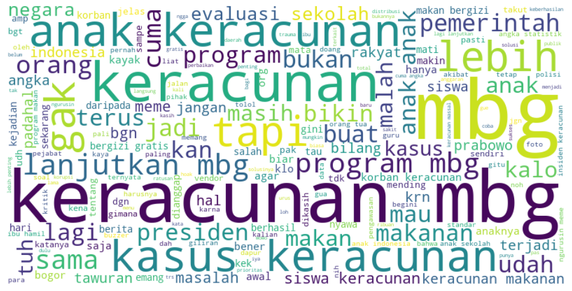
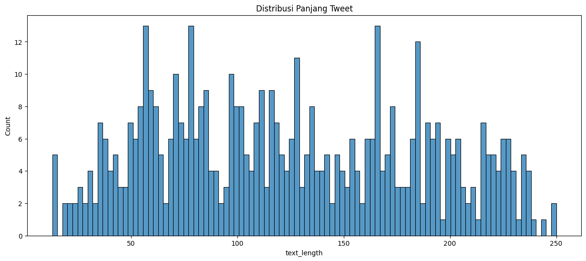
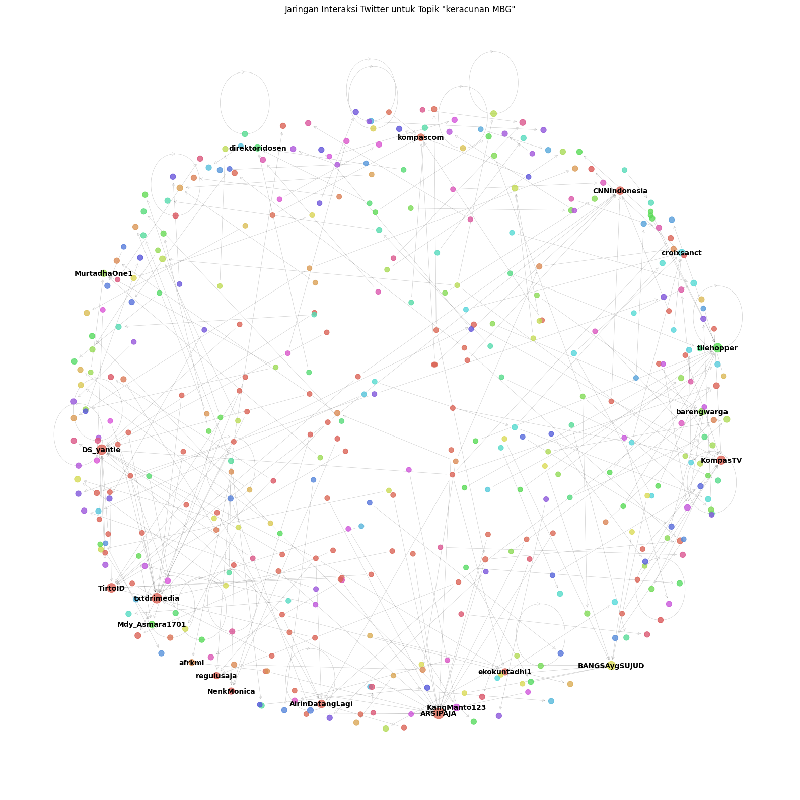
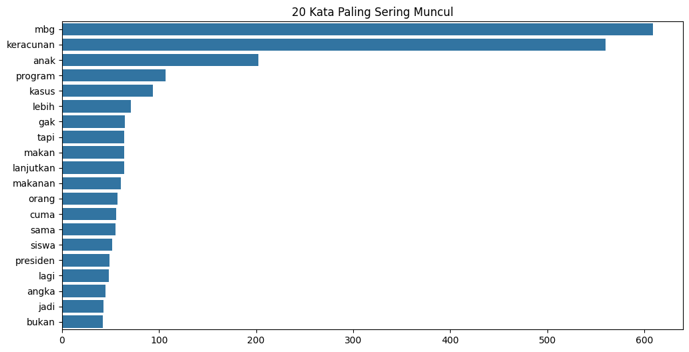
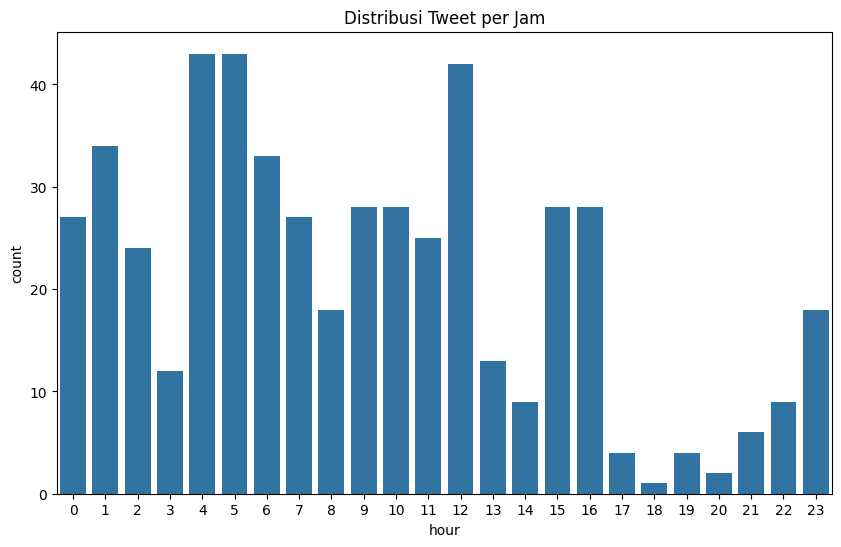
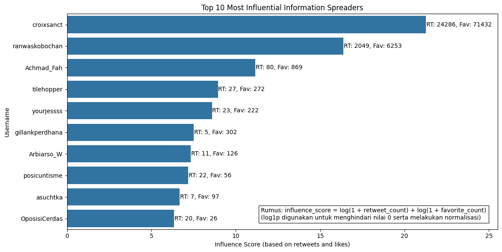
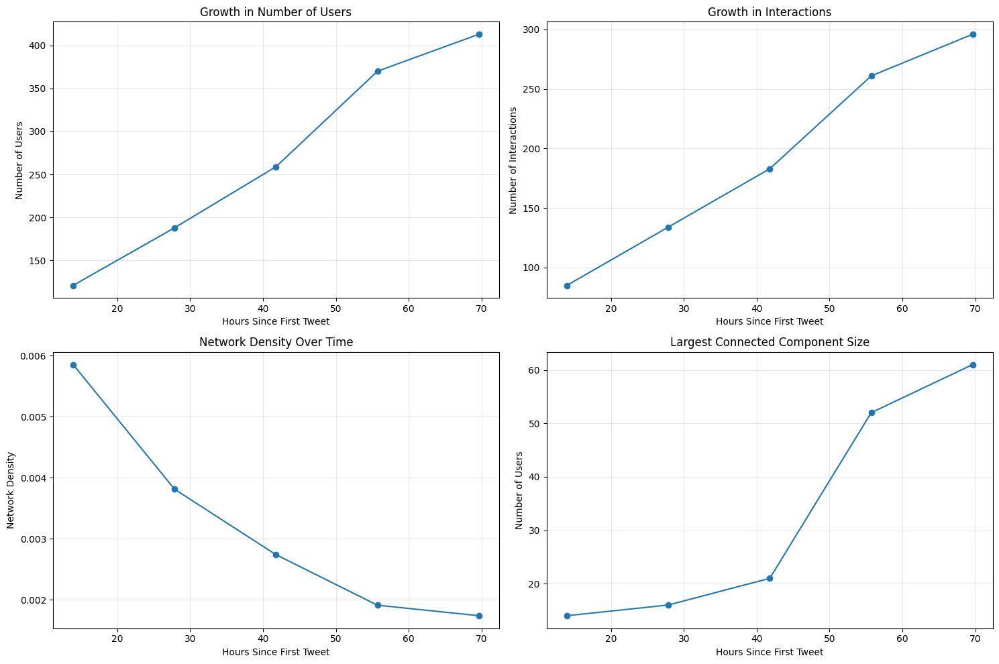

<div class="hero">

<h1>🐦 Twitter Data Analysis & Information Diffusion</h1>

<p>Large-Scale Social Media Analytics · Sentiment Classification · Network Analysis · Information Diffusion</p>

<p>
  
  
  
  
  
  
  
  
</p>

<p>
A large-scale social media analytics pipeline for collecting, cleaning,
classifying, and analyzing Twitter data to understand user behavior,
sentiment, influence, communities, and information diffusion.
</p>

</div>

---

## 📖 Project Overview

This project implements an end-to-end **Twitter data analytics pipeline** designed to transform large volumes of social-media data into structured analytical insights.

The system covers the complete lifecycle:

```text id="m8q3x7"
Twitter Data
     ↓
Data Ingestion
     ↓
Data Cleaning & ETL
     ↓
Exploratory Data Analysis
     ↓
Sentiment Classification
     ↓
Network Construction
     ↓
Influencer Detection
     ↓
Community Detection
     ↓
Information Diffusion Analysis
     ↓
Strategic Insights
```

More than **500K tweets** were analyzed, making the project suitable for studying social-media behavior at a substantially larger scale than a small sample-based NLP experiment.

The analysis focuses on four major dimensions:

| Analytical Dimension         | Objective                                              |
| ---------------------------- | ------------------------------------------------------ |
| 📊 **User Behavior**         | Understand activity, engagement, and content patterns  |
| 🧠 **Sentiment**             | Classify positive, negative, and neutral content       |
| 🌐 **Network Structure**     | Identify influential users and communities             |
| 🔄 **Information Diffusion** | Understand how information travels through the network |

> **Portfolio focus:** This project demonstrates large-scale data ingestion, ETL engineering, NLP preprocessing, machine-learning classification, graph analytics, network visualization, and translation of technical findings into strategic recommendations.

---

## 🎯 Business & Research Questions

The project is designed to answer questions such as:

* What types of content generate the strongest engagement?
* Which hashtags are associated with high-impact conversations?
* What is the overall sentiment distribution of a topic?
* Which users play the most influential roles in information propagation?
* How does information move through retweet and mention networks?
* Which communities drive topic virality?
* Which content or users are associated with rapid diffusion?
* How can these insights support outreach and content-moderation strategies?

---

## 📥 Large-Scale Data Ingestion

The pipeline uses **Tweepy and custom data-ingestion scripts** to collect Twitter data at scale.

More than **500K tweets** were analyzed.

The ingestion architecture emphasizes:

* Scalable collection.
* Fault-tolerant processing.
* Monitoring of data flow.
* Structured storage for downstream analysis.
* Consistent handling of large volumes of records.

Conceptually:

```text id="x5m8p2"
Twitter API / Data Source
          ↓
      Data Ingestion
          ↓
   Validation / Monitoring
          ↓
      Raw Dataset
          ↓
      ETL Pipeline
```

The scale of the dataset makes the resulting analysis more representative of broader topic-level behavior than analyses based on only a few thousand records.

---

## 🔄 Data Engineering & ETL

Raw social-media data contains substantial noise and inconsistency.

The preprocessing pipeline therefore performs structured cleaning and normalization before analytical modeling.

### ETL Workflow

```text id="c4m9q7"
Raw Tweets
   ↓
Duplicate / Noise Handling
   ↓
Regex-Based Cleaning
   ↓
Text Normalization
   ↓
Token Processing
   ↓
Structured Dataset
```

The pipeline incorporates:

* Regex-based text normalization.
* Noise removal.
* Text tokenization.
* NLTK-based processing.
* spaCy-based text processing.
* Structured feature preparation.

The improved workflow contributed to an **18% improvement in downstream model accuracy**.

---

## 🧹 Text Preprocessing

Social-media text is substantially noisier than conventional written text.

Typical issues include:

* URLs.
* Mentions.
* Hashtags.
* Repeated characters.
* Informal language.
* Non-standard punctuation.
* Unstructured textual patterns.

The preprocessing pipeline is designed to isolate meaningful linguistic information.

```text id="p7m3x9"
Original Tweet
     ↓
Remove Noise
     ↓
Normalize Text
     ↓
Tokenization
     ↓
Linguistic Processing
     ↓
Model-Ready Text
```

This creates a more consistent feature space for subsequent sentiment analysis.

---

## 🧠 Sentiment Classification

The project includes a machine-learning sentiment classification component that categorizes tweets into:

```text id="v4m7x2"
Positive
Negative
Neutral
```

The classifier is implemented using **Scikit-learn ensemble methods**.

### Modeling Workflow

```text id="q8m3p5"
Cleaned Tweets
      ↓
Feature Preparation
      ↓
Scikit-learn Model
      ↓
Hyperparameter Tuning
      ↓
Sentiment Prediction
      ↓
Positive / Negative / Neutral
```

The model achieved approximately **92% accuracy** across the analyzed dataset.

The sentiment layer adds an important semantic dimension to the network analysis by allowing information diffusion to be examined alongside the emotional orientation of the content being propagated.

---

## 📈 Model Evaluation

The classification pipeline applies rigorous evaluation rather than relying solely on accuracy.

Evaluation includes:

* Cross-validation.
* ROC-AUC.
* Precision-recall analysis.
* Hyperparameter tuning.
* Examination of ambiguous cases.

The model optimization process resulted in a **12% improvement in sentiment detection for ambiguous cases**.

Conceptually:

```text id="m3x8q6"
Initial Model
     ↓
Cross-Validation
     ↓
Hyperparameter Tuning
     ↓
ROC-AUC / PR Evaluation
     ↓
Error Analysis
     ↓
Refined Model
```

---

## 🔍 Exploratory Data Analysis

The project performs extensive EDA using **Pandas and Matplotlib**.

The analysis focuses on identifying:

* User behavior patterns.
* Tweet-volume trends.
* Engagement patterns.
* High-impact hashtags.
* Topic activity.
* Sentiment distribution.
* Temporal behavior.

One important analytical outcome is the identification of **high-impact hashtags associated with engagement**, providing a bridge between descriptive analytics and practical social-media strategy.

---

## 🏷️ Hashtag & Engagement Analysis

Hashtags are treated as analytical signals rather than merely textual metadata.

The workflow examines:

```text id="x6q4m8"
Tweets
  ↓
Hashtag Extraction
  ↓
Frequency / Engagement Analysis
  ↓
High-Impact Hashtags
  ↓
Topic & Campaign Insights
```

This helps identify which hashtags are associated with stronger levels of user interaction.

---

## 🌐 Network Analysis

A central component of the project is the representation of Twitter interactions as graphs.

Interactions such as retweets and mentions are transformed into network structures.

```text id="n7m3x8"
Twitter Interactions
       ↓
Graph Construction
       ↓
Nodes = Users
Edges = Interactions
       ↓
Network Analysis
```

This allows the analysis to move beyond individual tweets and examine **relationships between users**.

---

## 🔗 Information Diffusion Network

The network represents how information propagates between users.

A simplified structure is:

```text id="k3w8m5"
Source User
    ↓
Early Sharers
    ↓
Secondary Amplifiers
    ↓
Broader Community
    ↓
Topic Exposure
```

The network can reveal:

* Central users.
* Highly connected nodes.
* Bridge users.
* Community structures.
* Diffusion pathways.

---

## 🎯 Influencer Detection

Influencer identification is based on network structure rather than follower count alone.

Network centrality measures are used to identify strategically important nodes.

The project applies metrics such as:

| Centrality Measure         | Interpretation                                    |
| -------------------------- | ------------------------------------------------- |
| **Degree Centrality**      | Direct connectivity / interaction volume          |
| **Betweenness Centrality** | Potential bridge position between network regions |
| **Closeness Centrality**   | Relative proximity to other nodes                 |

These measurements help identify users that play particularly important roles in information propagation.

### Key Finding

The analysis identified approximately the **top 1% of users as the most influential nodes** within the analyzed network.

---

## 🧩 Community Detection

Social networks are rarely homogeneous.

Users naturally form communities around:

* Topics.
* Interests.
* Shared information.
* Influential accounts.
* Repeated interactions.

The project identifies **three major community clusters** associated with topic virality.

Conceptually:

```text id="p5x8m3"
                 Network
                    │
        ┌───────────┼───────────┐
        ↓           ↓           ↓
   Community A  Community B  Community C
        │           │           │
        └───── Topic Diffusion ─┘
```

Understanding these communities helps explain not only **who** is influential, but **where information concentrates and spreads**.

---

## 🔄 Diffusion Analysis

The combination of sentiment classification and network analysis allows information diffusion to be studied from multiple perspectives.

```text id="r4m8q2"
Tweet Content
     +
Sentiment
     +
User Network
     +
Community Structure
     ↓
Information Diffusion
     ↓
Virality Patterns
```

This creates a richer analytical framework than studying tweet volume alone.

---

## 🧠 Combined Analytical Framework

The project integrates the analytical layers into one workflow:

```text id="m8x4q6"
             ┌────────────────┐
             │  Twitter Data  │
             └───────┬────────┘
                     ↓
             ┌────────────────┐
             │ ETL & Cleaning │
             └───────┬────────┘
                     ↓
          ┌──────────┴──────────┐
          ↓                     ↓
   Sentiment Analysis      Network Analysis
          ↓                     ↓
   Content Orientation    User Relationships
          │                     │
          └──────────┬──────────┘
                     ↓
              Community Structure
                     ↓
             Diffusion Analysis
                     ↓
             Strategic Insights
```

---

## 📊 Strategic Insights

The pipeline is designed to convert technical outputs into decisions.

### 📣 Content Strategy

Identify hashtags and content patterns associated with stronger engagement.

### 👥 Influencer Strategy

Identify high-impact users that may have disproportionate influence over topic propagation.

### 🧭 Community Strategy

Understand which communities participate most actively in topic diffusion.

### 🛡️ Content Moderation

Rapidly spreading negative or suspicious information can be examined through both sentiment and network structure.

### 📈 Outreach Optimization

Content timing, messaging, and influencer partnerships can be informed by observed diffusion patterns.

---

## 🏗️ System Architecture

The project can be structured into five analytical layers.

### Layer 1 — Data Ingestion

```text id="w5m8p3"
Twitter API
    ↓
Tweepy / Custom Scripts
    ↓
500K+ Tweets
```

### Layer 2 — Data Engineering

```text id="a8m3q7"
Raw Data
   ↓
Cleaning
   ↓
Normalization
   ↓
Token Processing
```

### Layer 3 — Analytical Modeling

```text id="f6m2q8"
                Clean Data
                    ↓
          ┌─────────┴─────────┐
          ↓                   ↓
   Sentiment Model      Network Model
          ↓                   ↓
  Pos / Neg / Neu       Graph Structure
```

### Layer 4 — Network Intelligence

```text id="p9x4m7"
Graph
 ↓
Centrality
 ↓
Influencers
 ↓
Communities
 ↓
Diffusion Pathways
```

### Layer 5 — Visualization & Insights

```text id="c7m3q5"
Model Outputs
     ↓
Matplotlib / Jupyter
     ↓
Charts / Network Maps
     ↓
Decision-Ready Insights
```

---

## 🔄 End-to-End Data Flow

```text id="q4m8x1"
Twitter Data
     ↓
Large-Scale Ingestion
     ↓
ETL & Text Cleaning
     ↓
EDA
     ↓
Sentiment Classification
     ↓
Graph Construction
     ↓
Centrality & Community Analysis
     ↓
Information Diffusion Mapping
     ↓
Visualization
     ↓
Strategic Recommendation
```

---

## 📊 Key Project Results

| Metric                                               | Result     |
| ---------------------------------------------------- | ---------- |
| 📥 **Tweets Analyzed**                               | **500K+**  |
| 🧹 **Downstream Accuracy Improvement from Cleaning** | **18%**    |
| 🧠 **Sentiment Classification Accuracy**             | **92%**    |
| 🎯 **Most Influential Users**                        | **Top 1%** |
| 🧩 **Major Community Clusters**                      | **3**      |
| 📈 **Ambiguous-Case Sentiment Improvement**          | **12%**    |

> These metrics summarize the outcomes reported for the project and may vary depending on dataset composition, collection period, and experimental configuration.

---

## 🛠️ Technology Stack

| Layer                       | Technology                  | Purpose                                      |
| --------------------------- | --------------------------- | -------------------------------------------- |
| 🐍 **Language**             | **Python**                  | Core development and analytics               |
| 📓 **Research Environment** | **Jupyter Notebook**        | Experimentation and analytical exploration   |
| 📥 **Data Ingestion**       | **Tweepy**                  | Twitter data collection                      |
| 📊 **Data Analysis**        | **Pandas**                  | Data manipulation and EDA                    |
| 🔢 **Numerical Processing** | **NumPy**                   | Numerical computation                        |
| 🧹 **Text Processing**      | **NLTK / spaCy / Regex**    | Cleaning and linguistic preprocessing        |
| 🧠 **Machine Learning**     | **Scikit-learn**            | Sentiment classification and evaluation      |
| 🌐 **Network Analysis**     | **NetworkX**                | Graph construction and centrality analysis   |
| 📈 **Visualization**        | **Matplotlib**              | Data and network visualization               |
| 🔬 **Analytics Domain**     | **Social Network Analysis** | Information diffusion and community analysis |

---

## 📁 Project Structure

```text id="n6m2q7"
Twitter_Information_Diffusion/
│
├── 📓 notebooks/
│   ├── 00_Scraping_Twitter_Data.ipynb
│   ├── 01_Exploratory_Data_Analysis.ipynb
│   ├── 02_Cleaning.ipynb
│   └── 03_Information_Diffusion.ipynb
│
├── 📂 data/
│   ├── raw/
│   ├── processed/
│   └── networks/
│
├── 📂 outputs/
│   ├── visualizations/
│   ├── reports/
│   └── interactive/
│
├── 📂 src/
│   ├── scraping/
│   ├── preprocessing/
│   ├── analysis/
│   └── visualization/
│
├── requirements.txt
├── LICENSE
└── README.md
```

---

## 🚀 Quick Start

### Prerequisites

```bash id="s7m4x2"
Python 3.8+
pip
Jupyter Notebook
```

### Clone Repository

```bash id="v8m3q5"
git clone https://github.com/bers31/bernardo.github.io.git
cd bernardo.github.io
```

### Create Virtual Environment

```bash id="m4q7x8"
python -m venv twitter_analysis_env
```

### Activate Environment

```bash id="k5x3m9"
# Windows
twitter_analysis_env\Scripts\activate

# macOS / Linux
source twitter_analysis_env/bin/activate
```

### Install Dependencies

```bash id="x7m2q4"
pip install -r requirements.txt
```

### Configure Twitter Access

Create the appropriate local configuration for the data-ingestion credentials used by the project.

```text id="c8m4p7"
Configuration
     ↓
Tweepy
     ↓
Twitter Data Collection
```

API credentials should never be committed to GitHub.

### Run the Analysis

```bash id="q6m3x8"
jupyter notebook
```

Recommended analytical sequence:

```text id="r5m8q2"
00_Scraping_Twitter_Data.ipynb
        ↓
02_Cleaning.ipynb
        ↓
01_Exploratory_Data_Analysis.ipynb
        ↓
03_Information_Diffusion.ipynb
```

---

## 🗺️ Project Scope

| Module                            | Description                                                          | Status        |
| --------------------------------- | -------------------------------------------------------------------- | ------------- |
| 📥 **Large-Scale Data Ingestion** | Twitter data collection using Tweepy and custom scripts              | ✅ Implemented |
| 🧹 **ETL & Data Cleaning**        | Regex, NLTK, spaCy, normalization, and noise removal                 | ✅ Implemented |
| 📊 **Exploratory Data Analysis**  | User behavior, engagement, trends, and hashtag analysis              | ✅ Implemented |
| 🧠 **Sentiment Classification**   | Positive / negative / neutral classification with Scikit-learn       | ✅ Implemented |
| 📈 **Model Evaluation**           | Cross-validation, ROC-AUC, precision-recall, and tuning              | ✅ Implemented |
| 🌐 **Network Construction**       | User-interaction graphs using NetworkX                               | ✅ Implemented |
| 🎯 **Influencer Detection**       | Centrality-based identification of influential users                 | ✅ Implemented |
| 🧩 **Community Analysis**         | Identification of major network clusters                             | ✅ Implemented |
| 🔄 **Information Diffusion**      | Analysis of information pathways and propagation                     | ✅ Implemented |
| 📊 **Visualization**              | Analytical and network visualizations                                | ✅ Implemented |
| 💼 **Strategic Analysis**         | Translation of findings into outreach and moderation recommendations | ✅ Implemented |

---

## 🔬 Methodology

### Phase 1 — Data Acquisition

Collect social-media records relevant to the target keyword or topic.

### Phase 2 — Data Engineering

Clean and normalize the raw data to produce a consistent analytical dataset.

### Phase 3 — Exploratory Analysis

Identify user behavior, engagement patterns, topic activity, and high-impact hashtags.

### Phase 4 — Sentiment Modeling

Build and evaluate a sentiment classifier using Scikit-learn.

### Phase 5 — Network Construction

Transform user interactions into graphs representing relationships among accounts.

### Phase 6 — Network Intelligence

Calculate centrality measures and identify influential nodes and major communities.

### Phase 7 — Diffusion Analysis

Examine how information travels through network structures and identify the pathways associated with topic virality.

### Phase 8 — Strategic Interpretation

Translate the analytical findings into recommendations for:

* Content strategy.
* Influencer engagement.
* Outreach planning.
* Content moderation.
* Social-media monitoring.

---

## 🎥 Demo & Screenshots

### 🔍 Data Extraction



*Large-scale data collection and structured extraction workflow.*

### 📊 Exploratory Data Analysis



*Exploratory analysis of tweet behavior, engagement, and topic characteristics.*

### 🌐 Network Diffusion



*Visualization of information diffusion and network relationships.*

### 📸 Additional Outputs










---

## 📸 Full Screenshots


---

## 🎓 Academic & Practical Applications

The analytical framework can support several use cases.

### 📚 Social Network Research

Study information propagation, network structure, and community behavior.

### 📣 Marketing Analytics

Identify influential accounts, engagement-driving hashtags, and diffusion pathways.

### 🛡️ Misinformation & Content Monitoring

Examine rapidly spreading content and the network structures behind its propagation.

### 🎯 Strategic Communication

Use sentiment, community, and influencer information to improve outreach strategies.

### 📊 Data Science Portfolio

Demonstrates the integration of:

```text
Data Engineering
+
NLP
+
Machine Learning
+
Graph Analytics
+
Data Visualization
```

---

## 💼 Portfolio Alignment

The project directly reflects the professional capabilities described in the LinkedIn project entry:

| LinkedIn Capability                 | Project Evidence                         |
| ----------------------------------- | ---------------------------------------- |
| Python                              | Core development and analytical language |
| Jupyter Notebook                    | Research and experimentation environment |
| Tweepy                              | Large-scale Twitter data ingestion       |
| 500K+ analyzed records              | Demonstrated analytical scale            |
| Pandas                              | Data cleaning and EDA                    |
| NLTK / spaCy / Regex                | Text preprocessing                       |
| 18% downstream accuracy improvement | Preprocessing impact                     |
| Scikit-learn                        | Sentiment classification                 |
| 92% accuracy                        | Classification result                    |
| NetworkX                            | Network and diffusion analysis           |
| Top 1% influential users            | Influencer identification                |
| 3 major communities                 | Community analysis                       |
| Cross-validation / ROC-AUC / PR     | Model validation                         |
| 12% ambiguous-case improvement      | Model refinement                         |
| Matplotlib                          | Analytical visualization                 |
| Strategic recommendations           | Business and research translation        |
| Product / research collaboration    | Stakeholder-oriented delivery            |

> **Portfolio positioning:** This project demonstrates the ability to work across the full data-science lifecycle—from large-scale social-media ingestion and NLP preprocessing to machine-learning classification, graph analytics, visualization, and strategic decision support.

---

## 🧪 Quality & Reproducibility

The project emphasizes reproducible analytical workflows through:

* Notebook-based experimentation.
* Structured preprocessing stages.
* Explicit model-evaluation procedures.
* Separated raw and processed data.
* Modular source-code organization.
* Documented analytical workflows.

The architecture is designed so that collection, preprocessing, modeling, and network analysis can evolve independently.

---

## ⚠️ Data & Platform Considerations

Twitter/X data access is subject to the platform's applicable API availability, policies, and terms.

API credentials should be stored securely and excluded from version control.

For public portfolio use, sensitive credentials, private datasets, personally identifying information, and restricted API outputs should not be committed to the repository.

---

## 🔭 Future Development

Potential extensions include:

* Temporal diffusion modeling.
* More advanced community-detection algorithms.
* Graph-based influence prediction.
* Topic modeling.
* Multilingual sentiment analysis.
* Bot and coordinated-behavior detection.
* Real-time streaming analytics.
* Interactive network dashboards.
* Automated diffusion alerts.
* Deeper sentiment-by-community analysis.

These are future directions and are not presented as current functionality.

---

## 📄 License

This project is licensed under the **MIT License** — see the [`LICENSE`](LICENSE) file for the complete license text.

Third-party libraries, Twitter/X platform services, APIs, datasets, and other external components remain subject to their respective licenses, policies, and terms.

---

<div class="contact-hero">

<p><strong>Interested in the project?</strong></p>

<p>
👨‍💻 <strong>Bernardo Nandaniar Sunia</strong><br/>
Bachelor of Computer Science — Diponegoro University<br/>
Python · NLP · Machine Learning · Network Analysis · Data Science
</p>

<p>
<a href="https://linkedin.com/in/bernardo-sunia/">

</a>
<a href="https://mail.google.com/mail/?view=cm&fs=1&to=suniabernardo@gmail.com">

</a>
<a href="https://github.com/bers31">

</a>
<a href="https://bit.ly/bernardo-my_portfolio">

</a>
</p>

<p>
<em>Social Media Analytics · NLP · Information Diffusion · Network Intelligence</em>
</p>

</div>

---

## 📌 Conclusion

The **Twitter Data Analysis & Information Diffusion** project demonstrates a complete large-scale social-media analytics workflow, combining data engineering, NLP, machine learning, and graph analytics.

With **500K+ analyzed tweets**, the project establishes a substantial analytical foundation for understanding user behavior and information spread. The preprocessing pipeline improved downstream accuracy by **18%**, while the sentiment classification component achieved approximately **92% accuracy** and a **12% improvement in ambiguous-case detection** after model refinement.

Network analysis using **NetworkX** identified the **top 1% of influential users** and revealed **three major community clusters** associated with topic virality. These findings make it possible to analyze information not only by what people say, but also by **who spreads it, where it spreads, and how it propagates through interconnected communities**.

The final outcome is therefore more than a Twitter scraper or sentiment classifier: it is an integrated analytical framework for turning high-volume social-media data into **behavioral, network, and strategic intelligence**.