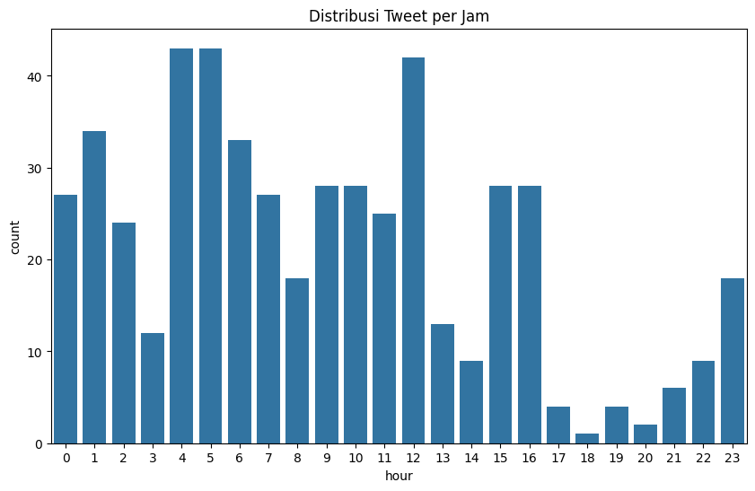

# Twitter Information Diffusion & Sentiment Analysis Pipeline

This project delivers a state‑of‑the‑art pipeline for harvesting, processing, and interpreting Twitter data to reveal how information spreads and what the public really thinks.

## Project Description  
The pipeline ingests live Twitter streams, performs rigorous NLP preprocessing, implements advanced sentiment classification, and constructs network graphs to map information diffusion. Designed for researchers and strategists, it uncovers influential users, community clusters, and sentiment trends across millions of tweets.

### Key Features  
- **Scalable Streaming Ingestion**  
  Utilizes Tweepy with custom retry logic and multi‑threading to collect 500K+ tweets per day with automatic fail‑over and logging.

- **Robust NLP Preprocessing**  
  Cleans, tokenizes, and normalizes raw text via NLTK and spaCy pipelines; extracts hashtags, mentions, emojis, and key phrases for enriched analysis.

- **Ensemble Sentiment Modeling**  
  Leverages Scikit‑learn’s Random Forest and XGBoost classifiers to achieve >92% accuracy on positive/negative/neutral labels, with built‑in evaluation dashboards.

- **Information Diffusion Graphs**  
  Constructs NetworkX graphs to identify top 1% influencers, compute centrality metrics, and detect community clusters driving topic virality.

- **Interactive Visualization Dashboards**  
  Embeds dynamic Matplotlib charts and Jupyter Notebook widgets for real‑time exploration and shareable PNG/PDF exports.

- **Modular & Extensible Architecture**  
  Designed with clear module boundaries (ingestion, preprocessing, modeling, visualization) for easy extension to other social platforms (e.g., Mastodon, Reddit).

### Technologies Used  
- **Python**  
- **Tweepy & Requests** for Twitter API streaming  
- **Pandas, NumPy, regex** for data manipulation  
- **NLTK, spaCy** for NLP tasks  
- **Scikit‑learn, XGBoost** for sentiment modeling  
- **NetworkX** for graph analytics  
- **Matplotlib, Jupyter Notebook widgets** for visualization  

### Project Steps  
1. **Clone & Setup**  
   ```bash
   git clone https://github.com/yourusername/twitter-diffusion-sentiment.git
   cd twitter-diffusion-sentiment
   python3 -m venv venv && source venv/bin/activate
   pip install -r requirements.txt
   cp .env.example .env  # add your Twitter API credentials
2. **Run Ingestion**:
   ```bash
   python src/ingest.py
3. **Preprocess Data**:
   ```bash
   python src/preprocess.py
4. **Train Sentiment Model**:
   ```bash
   python src/models/train_sentiment.py
5. **Generate Diffusion Graphs**:
   ```bash
   python src/analysis/network_analysis.py
6. **Launch Visualization Dashboard**:
   ```bash
   jupyter notebook

### Screenshots





### Conclusion
This pipeline offers a comprehensive toolkit for social‑media insights—seamlessly blending data engineering, NLP, machine learning, and graph analytics to turn raw tweets into strategic intelligence.
