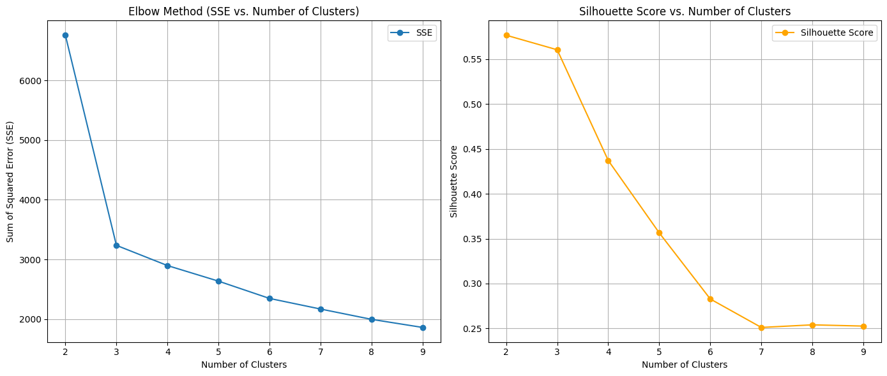
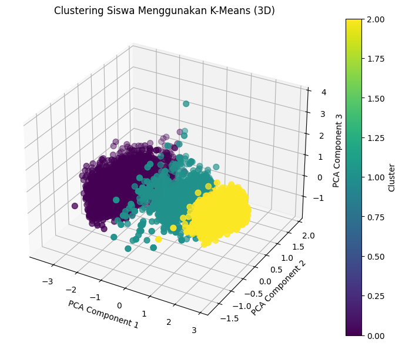
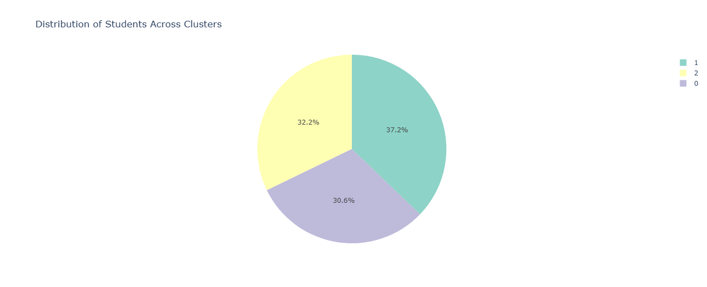
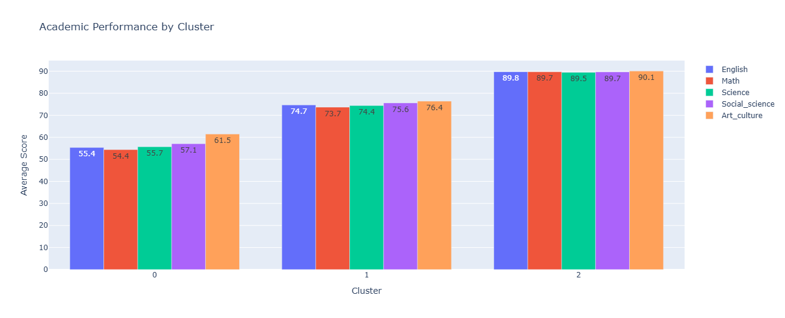
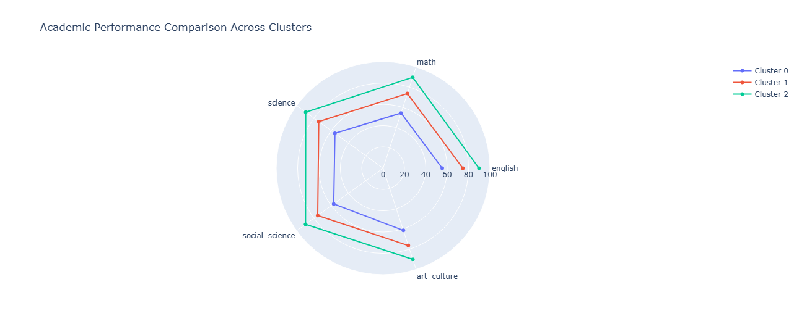

# Student Performance Clustering — K-Means Analysis
### *Unlocking Educational Insights Through Intelligent Student Segmentation*

<div align="center">


</div>

---

## 📖 **Project Overview**

In the evolving landscape of education, understanding student performance patterns is crucial for creating targeted interventions and personalized learning strategies. This project leverages **machine learning clustering techniques** to analyze student performance datasets, identifying distinct groups of students based on their academic performance, demographic attributes, and behavioral patterns.

**Why This Matters:** By segmenting students into homogeneous clusters, educators can develop data-driven strategies to improve learning outcomes, identify at-risk students early, and optimize resource allocation for maximum educational impact.

---

## ✨ **Key Features**

• **🎯 Intelligent Student Segmentation** — Groups students into meaningful clusters using K-Means algorithm<br>
• **📊 Optimal Cluster Detection** — Employs Elbow Method and Silhouette Analysis for determining ideal cluster count<br>
• **🔍 Comprehensive Data Preprocessing** — Advanced ETL pipeline with feature engineering and scaling<br>
• **📈 Interactive Dashboard** — Real-time Streamlit web application for dynamic data exploration<br>
• **📊 Rich Visualizations** — Interactive plots, PCA scatter plots, and cluster characteristic heatmaps<br>
• **🧠 Actionable Insights** — Detailed cluster interpretation with educational intervention recommendations<br>
• **📋 Export-Ready Results** — Clustered datasets and comprehensive analysis reports

---

## 🛠️ **Technology Stack & Tools**

<table align="center">
<tr>
<td align="center"><strong>Core Language</strong></td>
<td align="center"><strong>Data Processing</strong></td>
<td align="center"><strong>Machine Learning</strong></td>
<td align="center"><strong>Visualization & Dashboard</strong></td>
</tr>
<tr>
<td align="center">

</td>
<td align="center">
<br>

</td>
<td align="center">

</td>
<td align="center">
<br>
<br>
<br>

</td>
</tr>
</table>

**Dependencies:**
```
pandas>=1.3.0, numpy>=1.21.0, scikit-learn>=1.0.0, matplotlib>=3.4.0, seaborn>=0.11.0, plotly>=5.0.0, streamlit>=1.28.0
```

---

## 🚀 **Quick Start Guide**

### **Installation & Setup**
```bash
# Clone the repository
git clone https://github.com/bers31/bernardo.github.io.git
cd bernardo.github.io/Unsupervised_Learning_Project

# Install required dependencies
pip install -r requirements.txt

# Alternative: Install individual packages
pip install pandas numpy scikit-learn matplotlib seaborn plotly streamlit umap-learn
```

### **Running the Analysis**
```bash
# Ensure your dataset is in the correct location
# Place student_performance.csv in data/raw/ directory

# Option 1: Launch Jupyter Notebook
jupyter notebook student_performance_clustering_K-Means.ipynb

# Option 2: Run the Streamlit Dashboard
streamlit run app.py

# Option 3: Run the Python script directly
python src/clustering_analysis.py
```

### **Project Structure**
```
Unsupervised_Learning_Project/
├── data/
│   ├── raw/
│   │   └── student_performance.csv
│   └── processed/
│       └── clustered_students.csv
├── notebooks/
│   └── student_performance_clustering_K-Means.ipynb
├── src/
│   └── clustering_analysis.py
├── app.py                 # Streamlit Dashboard
├── outputs/
│   ├── visualizations/
│   └── reports/
└── README.md
```

---

## 🎥 **Demo & Results**

### **Sample Visualizations**

<div align="center">


<p><strong>🚀 Live Demo</strong> <a href="https://bers31.github.io/bernardo.github.io/Unsupervised_Learning_Project/" target="_blank">Launch Interactive Analysis</a></p>

<table>
<tr>
<td align="center" width="50%">

<br><em>Optimal Cluster Selection</em>
</td>
<td align="center" width="50%">

<br><em>Student Performance Clusters</em>
</td>
</tr>
</table>

</div>

### **Expected Cluster Insights**
- **🟢 High Performers:** Students with excellent grades, high attendance, optimal study time
- **🟡 Moderate Achievers:** Average performance, room for targeted improvement  
- **🔴 At-Risk Students:** Low grades, high absenteeism, requiring immediate intervention

### **🎛️ Streamlit Dashboard Features**
- **📊 Real-time Data Upload:** Drag-and-drop CSV file functionality
- **⚙️ Interactive Parameter Tuning:** Adjust clustering parameters dynamically
- **📈 Live Visualizations:** Real-time plot updates and cluster analysis
- **📋 Downloadable Reports:** Export clustered data and insights instantly

---

## 📊 **Project Roadmap**

<table>
<thead>
<tr>
<th align="left">Milestone</th>
<th align="center">Status</th>
<th align="center">Target Date</th>
<th align="left">Description</th>
</tr>
</thead>
<tbody>
<tr>
<td>Data Collection & Cleaning</td>
<td align="center">✅</td>
<td align="center">2024</td>
<td>Dataset acquisition, preprocessing, and feature engineering</td>
</tr>
<tr>
<td>Exploratory Data Analysis</td>
<td align="center">✅</td>
<td align="center">2024</td>
<td>Statistical analysis and data visualization</td>
</tr>
<tr>
<td>Clustering Implementation</td>
<td align="center">✅</td>
<td align="center">2024</td>
<td>K-Means algorithm with optimal cluster selection</td>
</tr>
<tr>
<td>Results Interpretation</td>
<td align="center">✅</td>
<td align="center">2024</td>
<td>Cluster analysis and educational insights</td>
</tr>
<tr>
<td>Advanced Visualizations</td>
<td align="center">✅</td>
<td align="center">2024</td>
<td>Streamlit dashboard and comprehensive reports</td>
</tr>
<tr>
<td>Documentation & Deployment</td>
<td align="center">✅</td>
<td align="center">2024</td>
<td>Final documentation and GitHub Pages deployment</td>
</tr>
</tbody>
</table>

---

## 🧪 **Methodology Deep Dive**

### **1. Data Preprocessing Pipeline**
- **Data Loading:** Robust CSV parsing with error handling
- **Quality Assessment:** Missing value detection and statistical summaries
- **Feature Engineering:** Grade aggregation and categorical encoding
- **Standardization:** StandardScaler for optimal clustering performance

### **2. Optimal Cluster Selection**
- **Elbow Method:** SSE minimization analysis
- **Silhouette Analysis:** Cluster quality evaluation
- **Gap Statistic:** Additional validation metric

### **3. Clustering & Evaluation**
- **K-Means Algorithm:** Euclidean distance-based clustering
- **Performance Metrics:** Silhouette score, Davies-Bouldin index
- **Validation:** Cross-validation and stability analysis

---

## 🤝 **Contributing**

We welcome contributions from the community! Here's how you can get involved:

### **How to Contribute**
1. **🍴 Fork** the repository
2. **🌿 Create** your feature branch (`git checkout -b feature/AmazingFeature`)
3. **💾 Commit** your changes (`git commit -m 'Add AmazingFeature'`)
4. **📤 Push** to the branch (`git push origin feature/AmazingFeature`)
5. **🔄 Open** a Pull Request

### **Contribution Areas**
- 🐛 Bug fixes and optimization<br>
- 📊 New visualization techniques<br>
- 🧠 Alternative clustering algorithms<br>
- 🎛️ Streamlit dashboard enhancements<br>
- 📚 Documentation improvements<br>
- 🧪 Unit tests and validation

---

## 📄 **License**

This project is licensed under the **MIT License** - see the [LICENSE](LICENSE) file for details.

```
MIT License

Copyright (c) 2024 Bernardo - Universitas Diponegoro

Permission is hereby granted, free of charge, to any person obtaining a copy
of this software and associated documentation files (the "Software"), to deal
in the Software without restriction, including without limitation the rights
to use, copy, modify, merge, publish, distribute, sublicense, and/or sell
copies of the Software, subject to the following conditions:

The above copyright notice and this permission notice shall be included in all
copies or substantial portions of the Software.
```

## 📫 Contact & Connect

<p align="center">
<strong>👨‍💻 Bernardo - Computer Science Student</strong><br/>
Universitas Diponegoro 🎓
</p>

<p align="center">
<a href="https://linkedin.com/in/bernardo-sunia/">

</a>
<a href="https://mail.google.com/mail/?view=cm&fs=1&to=suniabernardo@gmail.com">

</a>
<a href="https://github.com/bers31">

</a>
<a href="https://bit.ly/bernardo-my_portfolio">

</a>
</p>

<p align="center">
⭐ <strong>If you found this project helpful, please give it a star!</strong> ⭐
</p>

<p align="center">
<em>Made with ❤️ by <a href="https://github.com/bers31">Bernardo</a> at Universitas Diponegoro</em><br/>

</p>

---

### Full Screenshots







### Conclusion
This project demonstrates the application of K-Means clustering to uncover actionable insights from student performance data. By providing an interactive interface through Streamlit, the system enables educators and stakeholders to explore and interpret clustering results effectively. The findings can guide tailored educational strategies, foster student success, and support data-driven decision-making. Future enhancements could include integrating advanced clustering algorithms, adding real-time data processing capabilities, and expanding the visualization suite for deeper analysis. Contributions and feedback are warmly welcomed to elevate this project further
