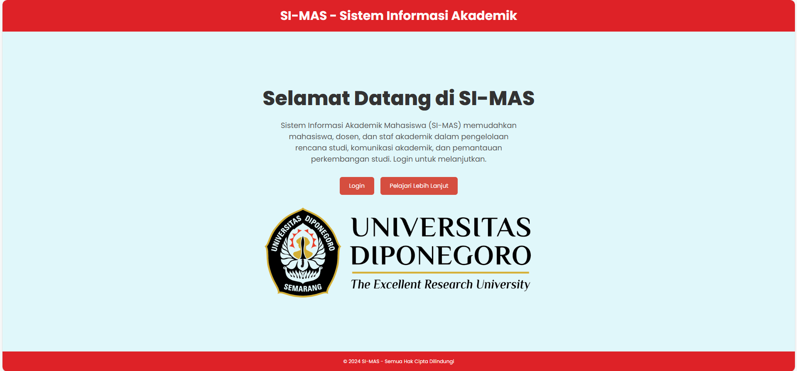
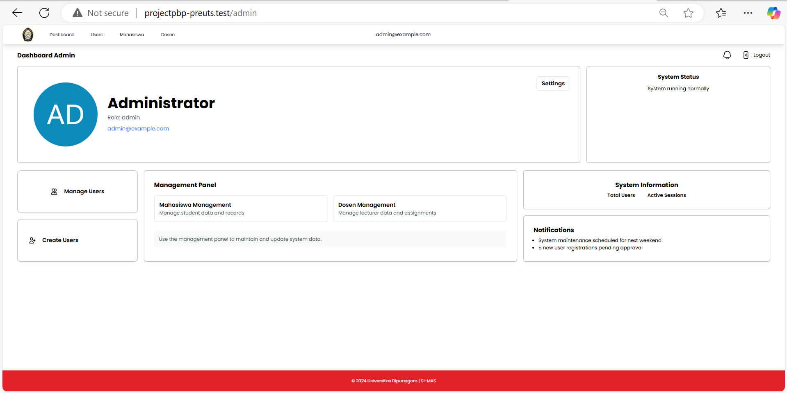
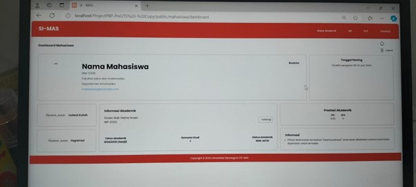
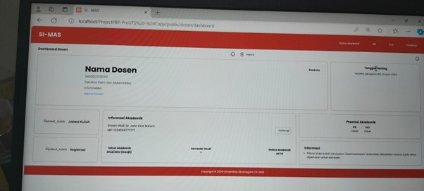
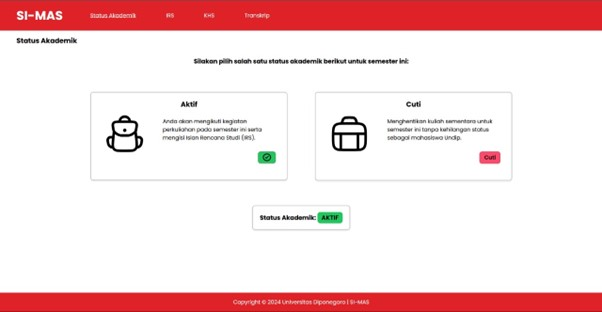

# Sistem Informasi Akademik Mahasiswa (SI-MAS)

SI-MAS adalah sistem informasi akademik yang dirancang untuk membantu mahasiswa dalam mengisi IRS (Isian Rencana Studi) setiap semester, dengan validasi otomatis dari dosen pembimbing.

## Deskripsi Proyek
Proyek ini memudahkan pengelolaan data akademik bagi lebih dari 1.000 mahasiswa dan 100 dosen pembimbing, dengan fitur pengisian IRS yang efisien dan validasi data otomatis.

### Fitur Utama
- **Pengisian IRS**: Mahasiswa dapat memilih dan mengisi mata kuliah tiap semester.
- **Validasi Dosen Otomatis**: Mengurangi kesalahan input dan mempercepat waktu validasi IRS.
- **Pengaturan Jadwal Kuliah dan Tampilan KHS**: Mahasiswa dapat mengakses jadwal kuliah dan riwayat KHS dengan mudah.

### Teknologi yang Digunakan
- **Laravel**: Framework untuk mengelola CRUD data dan proses backend.
- **MySQL**: Basis data untuk menyimpan lebih dari 10.000 data akademik.
- **JavaScript**: Untuk interaksi front-end yang dinamis.

### Cara Menjalankan Proyek
1. **Clone Repository**: `git clone <repo-url>`
2. **Instalasi Dependencies**: `composer install`
3. **Setup Database**: Konfigurasi file `.env` untuk MySQL.
4. **Jalankan Server Lokal**: `php artisan serve`

### Tangkapan Layar

