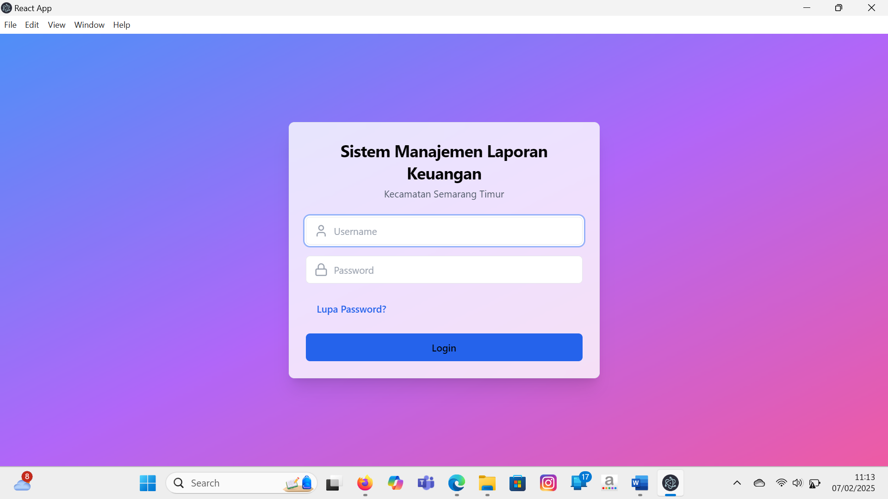
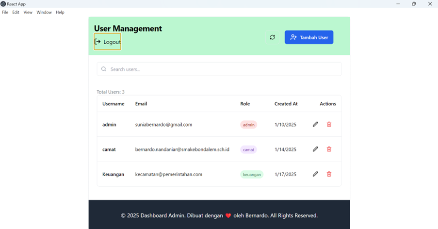
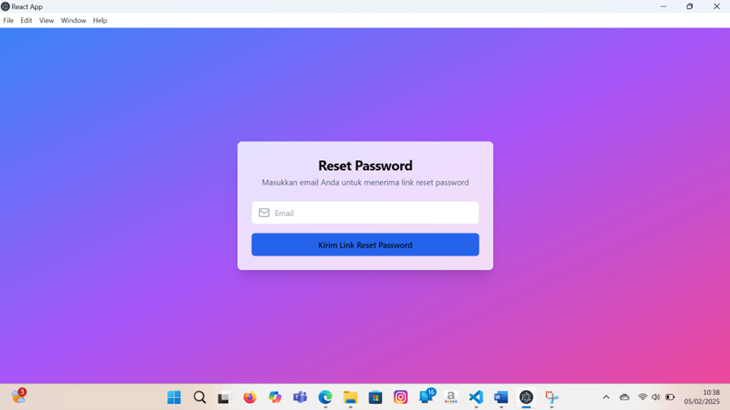
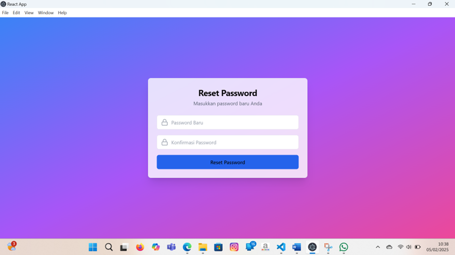
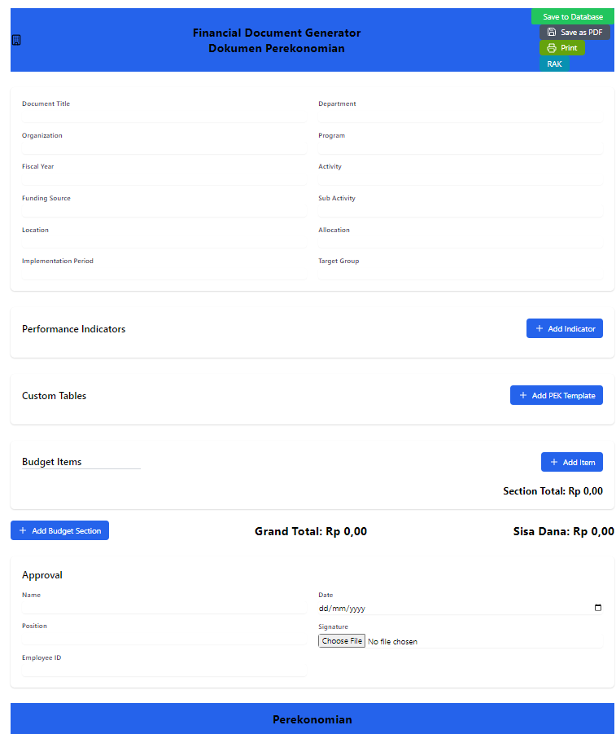

# Financial Reporting Application

Financial Reporting Application is designed to provide seamless and efficient financial data management, offering powerful insights and robust reporting capabilities.

## Project Overview
Built with **React.js** and **Prisma with MySQL**, this application ensures a highly responsive, user-friendly, and dynamic interface for financial reporting and data visualization. It empowers users with real-time data processing, customizable reports, and a scalable architecture.

### Key Features
- **Intuitive Dashboard**: A sleek and interactive UI designed for optimal user experience.
- **Real-Time Data Processing**: Efficient handling of financial data using MySQL with Prisma ORM.
- **Customizable Reports**: Generate tailored financial reports based on user preferences.
- **Secure Authentication**: Implements authentication and role-based access control.
- **Data Visualization**: Utilizes charts and graphs for insightful financial analysis.
- **Scalable Architecture**: Designed for extensibility and seamless integration with other financial tools.

### Technologies Used
- **React.js**: For an interactive and responsive front-end experience.
- **Prisma ORM**: For efficient and type-safe database access.
- **MySQL**: For structured and efficient financial data management.
- **Express.js & Node.js**: For robust backend operations.
- **Chart.js & D3.js**: For advanced data visualization.
- **JWT Authentication**: For secure access control.

### How to Run the Project
1. **Clone the Repository**:  
   ```sh
   git clone <repo-url>
2. **Install Dependencies**:  
   ```sh
   npm install
3. **Set Up Database**:
   - Configure MySQL.
   - Set up Prisma:  
     ```sh
     npx prisma migrate dev --name init
   - Generate Prisma Client:
     ```sh
     npx prisma generate
4. **Start the Server**:  
   ```sh
   npm start

### Screenshots







## Conclusion
This project demonstrates the creation of an engaging 3D game using C++ and OpenGL, showcasing advanced graphics techniques and interactive gameplay elements.
