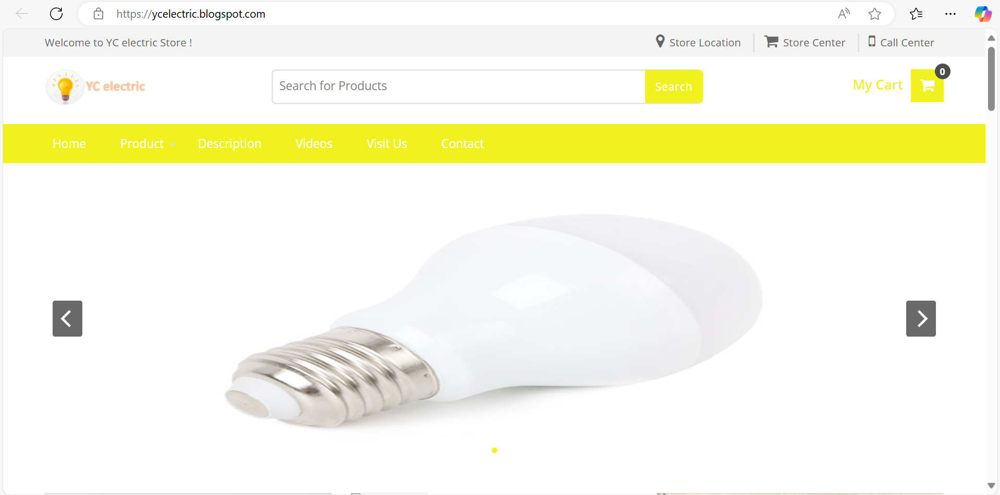

# YC Electric – E-Commerce Website

YC Electric is an e-commerce website developed using the Blogger platform, featuring essential e-commerce functionalities such as user login, product search, and shopping cart. The site supports over 100 products and handles an average of 50 transactions per day.

## Project Description
YC Electric is designed to provide a simple e-commerce solution for small business owners by leveraging Blogger as the platform, with custom HTML, CSS, and JavaScript features added.

### Key Features
- **User Login**: Authentication feature for secure user access.
- **Product Search**: Allows easy navigation through over 100 products.
- **Shopping Cart**: Users can add and manage products they wish to purchase.
- **SEO Optimization**: Boosts organic traffic by 30% through keyword optimization and website structure improvements.

### Technologies Used
- **HTML, CSS, JavaScript**: For developing the user interface and interactions.
- **MySQL**: External database for storing product information and user transactions.
- **Platform**: Blogger as the CMS to facilitate content management.

### How to Run the Project
1. **Create a Blogger Account** and set up the HTML template.
2. **Upload HTML, CSS, and JavaScript Code** from this repository to Blogger.
3. **Connect MySQL** to store product and transaction data.

### Screenshots

### Website Link
Visit [YC Electric](https://ycelectric.blogspot.com/) to see the live version of this project.

## Conclusion
This project demonstrates the development of a functional e-commerce website using Blogger, HTML, CSS, JavaScript, and MySQL, providing a practical solution for small businesses to manage their online sales efficiently.
