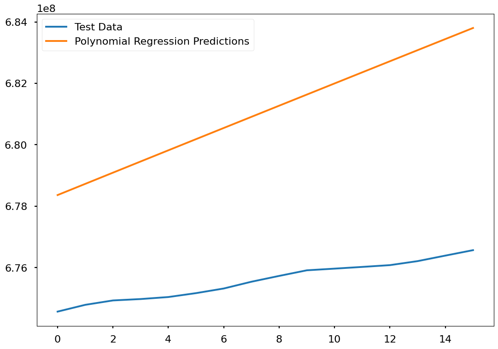
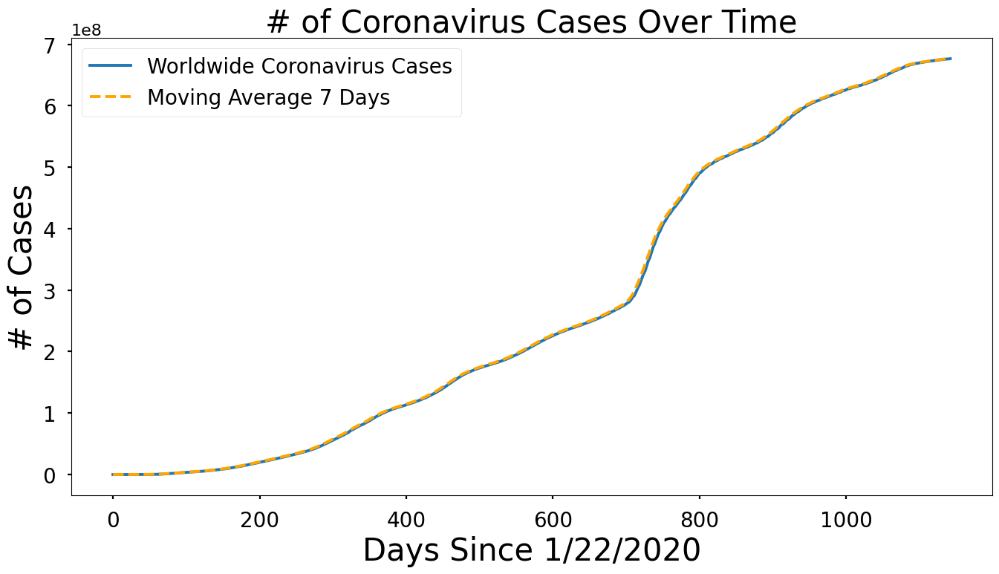
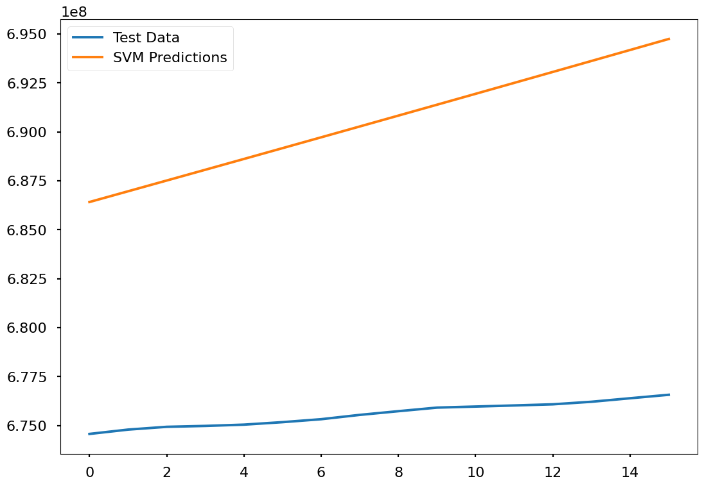
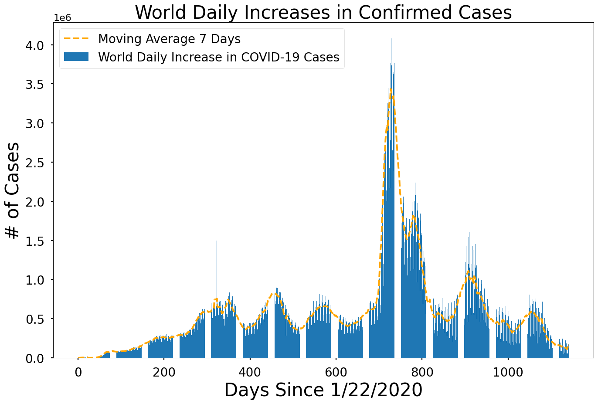
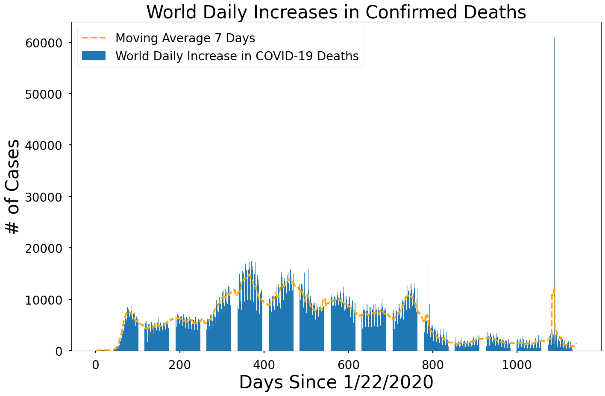
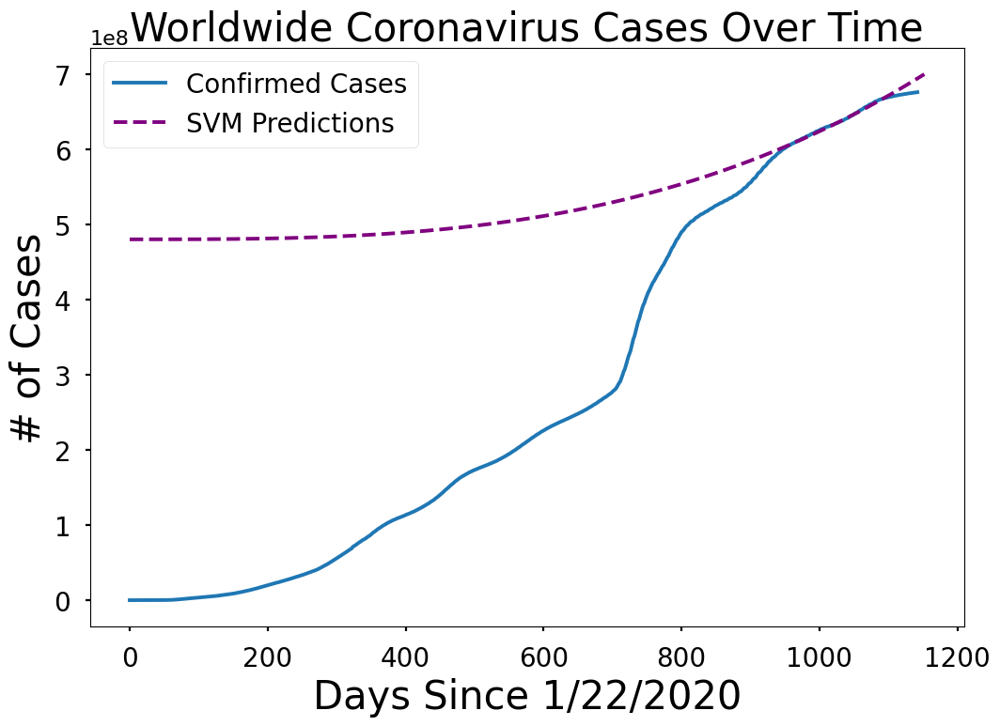

# COVID-19 Case Prediction and Analysis for the Next Year

This project utilizes machine learning algorithms to predict COVID-19 cases for the upcoming year. The analysis provides insights into the spread patterns and factors influencing changes in COVID-19 case numbers.

## Project Description
The goal of this project is to develop a predictive model to forecast future COVID-19 case numbers. This project is designed to assist policymakers and health organizations in planning effective mitigation strategies.

### Key Features
- **Data Cleaning and Management**: Utilized Python for data cleaning to ensure the quality of data used in the predictive model.
- **Trend Analysis and Visualization**: Employed Python and R for data analysis and visualization of trends, including graphs of virus spread patterns.
- **Predictive Modeling**: Implemented ARIMA and regression models to generate accurate COVID-19 case predictions for the next year.

### Technologies Used
- **Python**: For data management, cleaning, and basic analysis.
- **R**: For ARIMA modeling and data visualization.
- **Libraries**: Pandas, Scikit-Learn, Statsmodels (Python), and ggplot2 (R) for processing and visualization.

### How to Run the Project
1. **Clone Repository**: `git clone <repo-url>`
2. **Install Python and R Libraries**: Ensure required libraries are installed by running `pip install -r requirements.txt` (for Python).
3. **Run Notebooks or Scripts**:
   - Open and run the Python notebook for data cleaning.
   - Execute the R script for predictions using the ARIMA model.

### Impact
- **Predicting COVID-19 Case Trends**: Helps identify virus spread patterns for effective mitigation measures.
- **Providing Insights for Policymakers**: Supports data-driven decisions to control the spread of COVID-19.

### Screenshots

## Conclusion
This project demonstrates the development of a predictive model for COVID-19 case numbers using Python and R, providing valuable insights for health organizations and policymakers.
