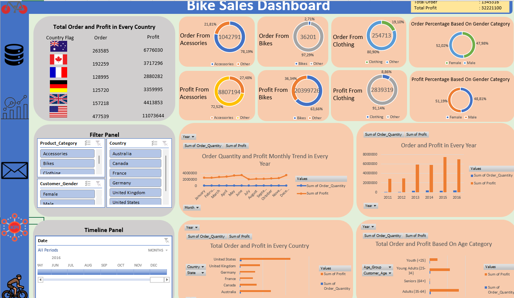
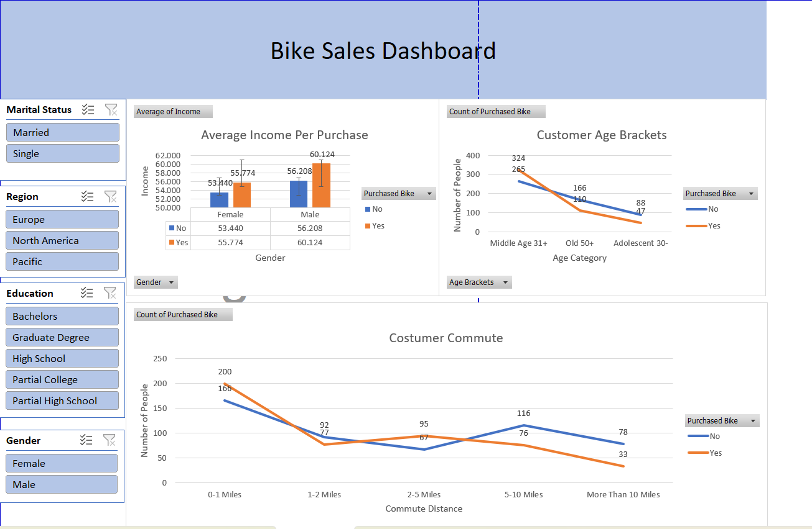
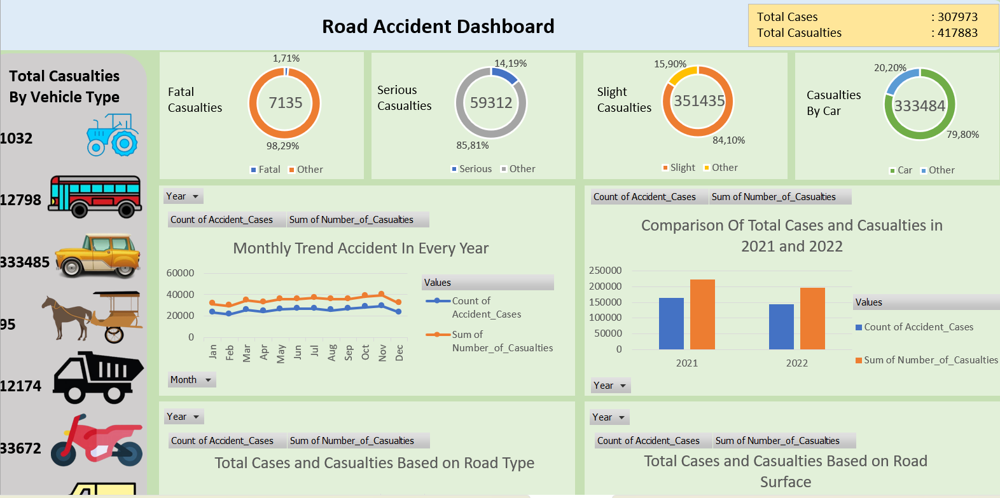
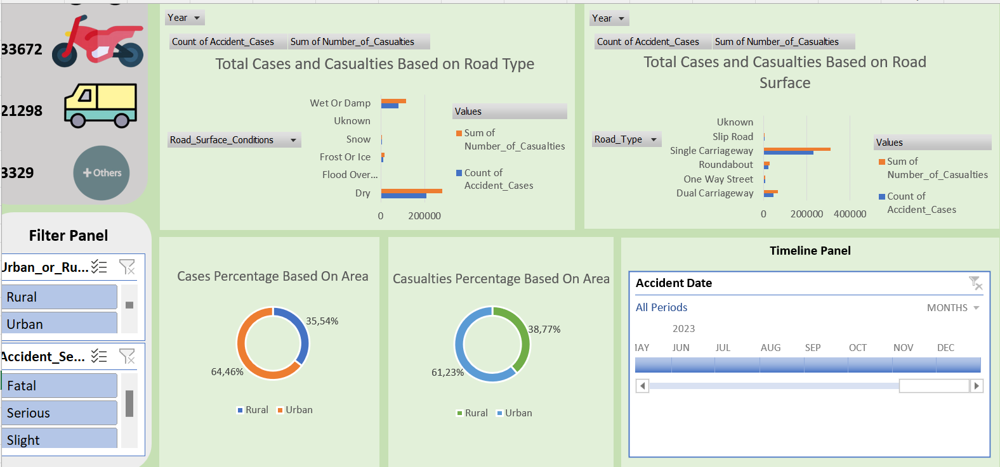

# Excel Data Analysis Dashboard

This project involves creating a **data analysis dashboard** using **Microsoft Excel** to present key information from an existing dataset. The dashboard is designed to provide easily understandable insights through interactive visualizations, such as charts, pivot tables, and statistical summaries.

## Project Description
The goal of this project is to leverage existing data and present it in an **informative** and **user-friendly** dashboard. This dashboard helps users quickly identify trends, patterns, and important insights, facilitating data-driven decision-making.

### Key Features
- **Dynamic Charts**: Display data visualizations in the form of line, bar, and pie charts to provide a better view of data trends.
- **Interactive Pivot Tables**: Allow users to filter and view data in detail according to selected categories or dimensions.
- **KPI Summary**: Show key performance indicators (KPIs) in easily readable cards or text, such as total sales, averages, annual growth, or performance comparisons.
- **Interactive Filters**: Use slicers to easily filter data based on specific categories, such as year, location, or product category.

### Technologies Used
- **Microsoft Excel**: Used as the primary tool for data analysis and visualization.
- **Excel Features**:
  - Pivot Tables for data grouping and summarization.
  - Slicers to facilitate data filtering on charts and tables.
  - Conditional Formatting to visually highlight important data.
  - Formulas like VLOOKUP, SUMIFS, and others for automatic calculations.

### How to Open and Use the Dashboard
1. **Download the Excel File**: Download the Excel file from this repository.
2. **Open the File in Excel**: Use Microsoft Excel version 2016 or later to open the file and ensure full compatibility.
3. **Interact with the Dashboard**:
   - Use **slicers** to filter data as needed, such as by year or category.
   - Click on pivot tables or charts to view more specific data.
   - Check the key metrics at the top of the dashboard for summary information.

### Dataset Used
The dataset used in this dashboard includes information such as:
- [List the types of data in the dataset, e.g., monthly sales, customer data, product categories, etc.]

This dataset enables comprehensive analysis of trends, performance comparisons, and useful insights for decision-making.

### Screenshots

### Impact and Results
- **Simplification of Complex Data**: By using effective visualizations, this dashboard simplifies complex data into easily understandable information.
- **Faster Decision-Making**: The dashboard helps users quickly identify relevant patterns and trends, supporting more informed decision-making.

### Additional Notes
This dashboard is designed for use by [specify who will use the dashboard, e.g., sales teams or financial managers]. Ensure the latest data is updated to keep the dashboard relevant.
