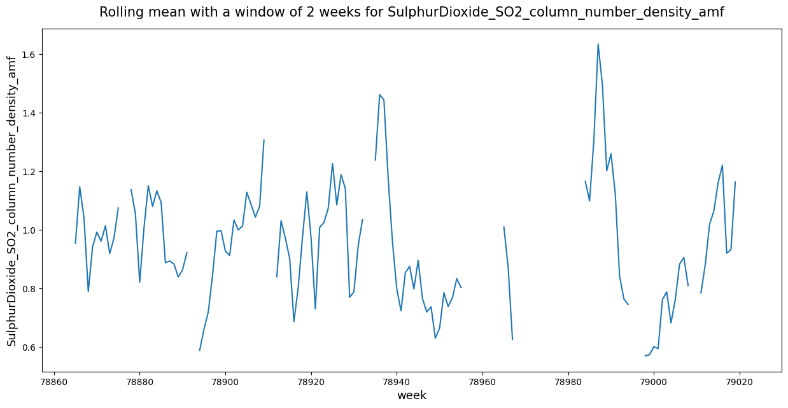
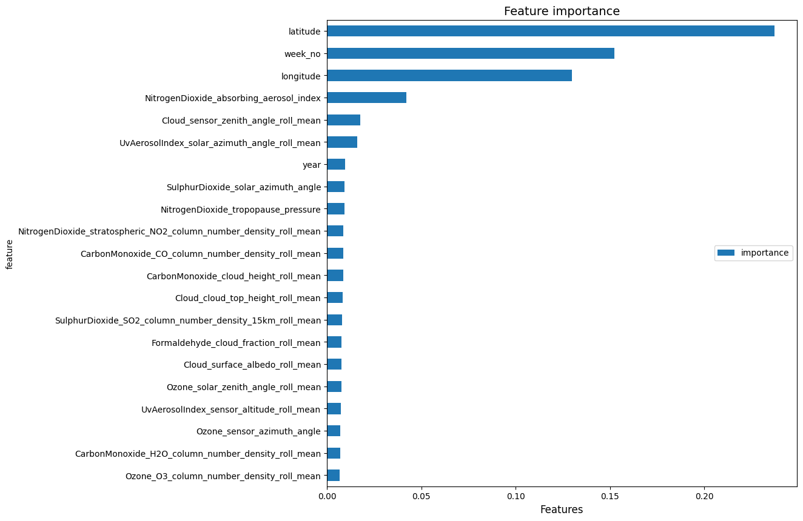
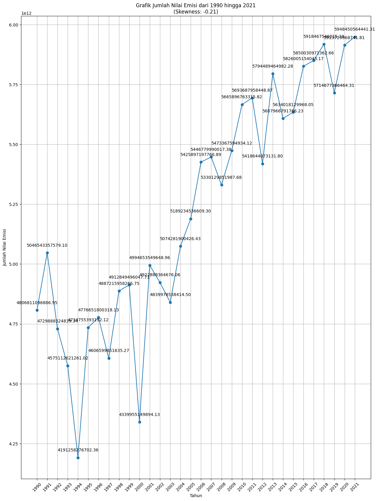
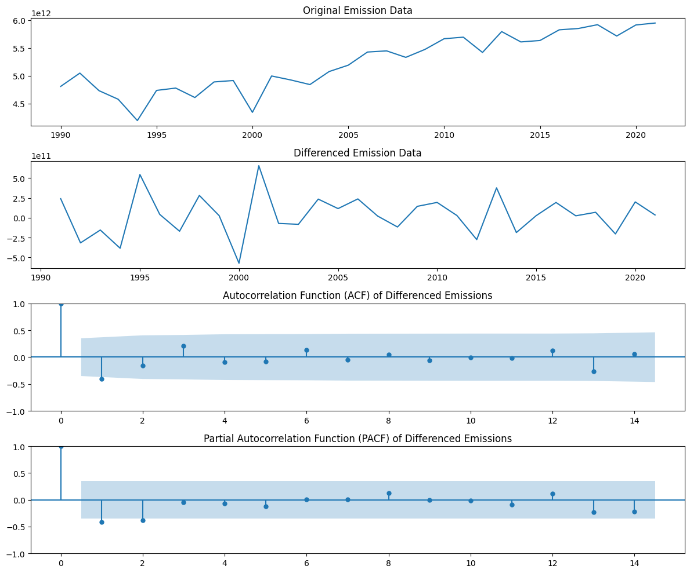
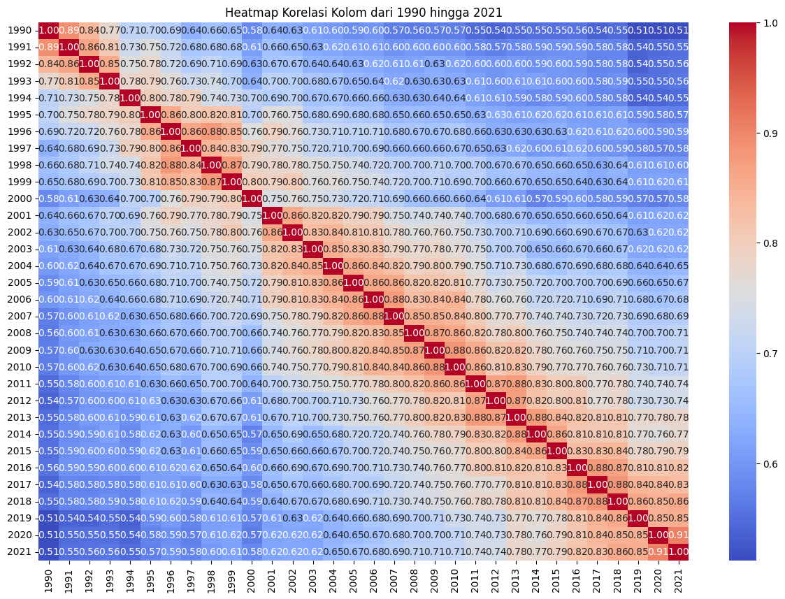

# Greenhouse Gas Emissions Prediction and Analysis for the Next 10 Years

This project aims to project greenhouse gas emission levels over the next 10 years using predictive methods and trend analysis. By combining Python, Excel, and R, this project provides data-driven insights to support environmental policies in efforts to reduce emissions and achieve **Net Zero Emission** targets.

## Project Description
This project focuses on:
1. **Emission Trend Analysis**: Understanding the patterns of greenhouse gas emissions over the past few years.
2. **Long-Term Prediction**: Using statistical models to project emissions over the next decade.
3. **Policy Impact**: Providing relevant data for policymakers and industries to plan emission reduction strategies.

The interactive dashboard and visualizations in this project offer a summary of emission trends and key factors influencing emission levels.

### Key Features
- **Data Cleaning and Management**: Using Excel for data management and cleaning before analysis.
- **Data Analysis and Visualization**: Python and R are used to visualize historical data patterns in the form of charts and heatmaps.
- **ARIMA Prediction Model**: Implementing the Autoregressive Integrated Moving Average (ARIMA) model in R to make long-term emission projections.
- **Data Summary**: Insight reports and emission trend charts accessible to policymakers and industries.

### Technologies Used
- **Python**: For basic data analysis and visualization, including data processing and chart creation.
- **Excel**: For initial data management, including cleaning, structuring, and normalizing data.
- **R**: For predictive modeling using the ARIMA method and visualizing prediction results.
- **Libraries**:
  - *Python*: Pandas, Matplotlib, Seaborn for data processing and visualization.
  - *R*: forecast, ggplot2 for ARIMA modeling and visualization.

### How to Run the Project
1. **Clone the Repository**: `git clone <repo-url>`
2. **Install Libraries**: Install the required libraries in Python and R.
3. **Run the Analysis**: Execute the Python notebook or R script.

### Screenshots

### Conclusion
This project provides a comprehensive approach to understanding and predicting greenhouse gas emissions over the next decade. By leveraging advanced statistical models and interactive visualizations, it offers valuable insights for policymakers and industries aiming to reduce emissions and achieve sustainability goals. The integration of Python, Excel, and R ensures robust data analysis and accurate predictions, making this project a crucial tool in the fight against climate change.
